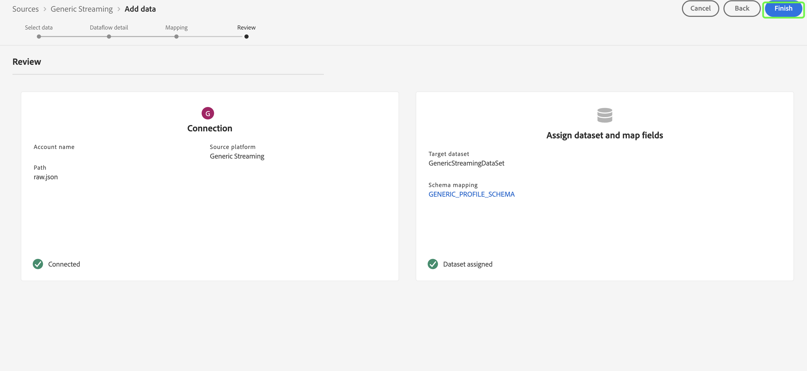

# Testare e inviare l’origine

I passaggi finali per integrare la nuova origine in Adobe Experience Platform utilizzando Self-Serve Sources (Streaming SDK) consistono nel testare e inviare la nuova origine. Dopo aver completato la specifica di connessione e aggiornato la specifica del flusso di streaming, puoi iniziare a testare la funzionalità della sorgente tramite l’API o l’interfaccia utente. In caso di esito positivo, puoi inviare la nuova sorgente contattando il rappresentante dell’Adobe.

Il documento seguente illustra i passaggi per testare ed eseguire il debug dell’origine utilizzando [[!DNL Flow Service] API](https://www.adobe.io/experience-platform-apis/references/flow-service/).

## Introduzione

* Per informazioni su come effettuare correttamente chiamate alle API di Platform, consulta la guida su [introduzione alle API di Platform](../../../landing/api-guide.md).
* Per informazioni su come generare le credenziali per le API di Platform, consulta l’esercitazione su [autenticazione e accesso alle API Experience Platform](../../../landing/api-authentication.md).
* Per informazioni su come impostare [!DNL Postman] per le API di Platform, consulta l’esercitazione su [configurazione della console per sviluppatori e [!DNL Postman]](../../../landing/postman.md).
* Per facilitare il processo di test e debug, scarica il file [Raccolta e ambiente di verifica delle origini self-service qui](../assets/sdk-verification.zip) e segui i passaggi descritti di seguito.

## Verifica l’origine utilizzando l’API

Per testare l’origine utilizzando l’API, è necessario eseguire la [Raccolta e ambiente di verifica delle origini self-service](../assets/sdk-verification.zip) il [!DNL Postman] fornendo al tempo stesso le variabili di ambiente appropriate relative alla tua origine.

Per avviare il test, devi prima impostare la raccolta e l’ambiente su [!DNL Postman]. Specificare quindi l&#39;ID della specifica di connessione che si desidera verificare.

>[!NOTE]
>
>Tutte le variabili di esempio riportate di seguito sono valori segnaposto da aggiornare, ad eccezione di `flowSpecificationId` e `targetConnectionSpecId`, che sono valori fissi.

| Parametro | Descrizione | Esempio |
| --- | --- | --- |
| `x-api-key` | Identificatore univoco utilizzato per autenticare le chiamate alle API Experience Platform. Guarda il tutorial su [autenticazione e accesso alle API Experience Platform](../../../landing/api-authentication.md) per informazioni su come recuperare `x-api-key`. | `c8d9a2f5c1e03789bd22e8efdd1bdc1b` |
| `x-gw-ims-org-id` | Entità aziendale che può possedere o concedere in licenza prodotti e servizi e consentire l&#39;accesso ai propri membri. Guarda il tutorial su [configurazione della console per sviluppatori e [!DNL Postman]](../../../landing/postman.md) per istruzioni su come recuperare `x-gw-ims-org-id` informazioni. | `ABCEH0D9KX6A7WA7ATQE0TE@adobeOrg` |
| `authorizationToken` | Il token di autorizzazione necessario per completare le chiamate alle API Experience Platform. Guarda il tutorial su [autenticazione e accesso alle API Experience Platform](../../../landing/api-authentication.md) per informazioni su come recuperare `authorizationToken`. | `Bearer authorizationToken` |
| `schemaId` | Per utilizzare i dati sorgente in Platform, è necessario creare uno schema di destinazione che strutturi i dati sorgente in base alle tue esigenze. Per i passaggi dettagliati su come creare uno schema XDM di destinazione, consulta l’esercitazione su [creazione di uno schema tramite l’API](../../../xdm/api/schemas.md). | `https://ns.adobe.com/{TENANT_ID}.schemas.0ef4ce0d390f0809fad490802f53d30b` |
| `schemaVersion` | Versione univoca corrispondente allo schema. | `application/vnd.adobe.xed-full-notext+json; version=1` |
| `schemaAltId` | Il `meta:altId` che viene restituito insieme al  `schemaId` durante la creazione di un nuovo schema. | `_{TENANT_ID}.schemas.0ef4ce0d390f0809fad490802f53d30b` |
| `dataSetId` | Per i passaggi dettagliati su come creare un set di dati di destinazione, consulta l’esercitazione su [creazione di un set di dati tramite l’API](../../../catalog/api/create-dataset.md). | `5f3c3cedb2805c194ff0b69a` |
| `mappings` | I set di mappatura possono essere utilizzati per definire il modo in cui i dati in uno schema di origine vengono mappati a quelli di uno schema di destinazione. Per i passaggi dettagliati su come creare una mappatura, consulta l’esercitazione su [creazione di un set di mappatura tramite l’API](../../../data-prep/api/mapping-set.md). | `[{"destinationXdmPath":"person.name.firstName","sourceAttribute":"email.email_id","identity":false,"version":0},{"destinationXdmPath":"person.name.lastName","sourceAttribute":"email.activity.action","identity":false,"version":0}]` |
| `mappingId` | L’ID univoco che corrisponde al set di mappatura. | `bf5286a9c1ad4266baca76ba3adc9366` |
| `connectionSpecId` | ID della specifica di connessione corrispondente alla sorgente. Questo è l’ID che hai generato dopo [creazione di una nuova specifica di connessione](./create.md). | `2e8580db-6489-4726-96de-e33f5f60295f` |
| `flowSpecificationId` | ID della specifica di flusso di `GenericStreamingAEP`. **Valore fisso**. | `e77fde5a-22a8-11ed-861d-0242ac120002` |
| `targetConnectionSpecId` | ID della connessione di destinazione del data lake in cui arrivano i dati acquisiti. **Valore fisso**. | `c604ff05-7f1a-43c0-8e18-33bf874cb11c` |
| `verifyWatTimeInSecond` | L’intervallo di tempo designato da seguire durante il controllo del completamento di un’esecuzione del flusso. | `40` |
| `startTime` | Ora di inizio designata per il flusso di dati. L&#39;ora di inizio deve essere formattata come ora unix. | `1597784298` |

Dopo aver fornito tutte le variabili di ambiente, puoi iniziare a eseguire la raccolta utilizzando [!DNL Postman] di rete. In [!DNL Postman] , selezionare i puntini di sospensione (**...**) accanto a [!DNL Sources SSSs Verification Collection] e quindi seleziona **Esegui raccolta**.

Il [!DNL Runner] viene visualizzata l’interfaccia, che consente di configurare l’ordine di esecuzione del flusso di dati. Seleziona **Esegui raccolta di verifica SSS** per eseguire la raccolta.

>[!NOTE]
>
>Puoi disattivare **Elimina flusso** dall’elenco di controllo dell’ordine di esecuzione, se preferisci utilizzare il dashboard di monitoraggio delle origini nell’interfaccia utente di Platform. Tuttavia, una volta terminato il test, devi assicurarti che i flussi di test vengano eliminati.

## Verifica l’origine tramite l’interfaccia utente

Per testare l’origine nell’interfaccia utente, vai al catalogo delle origini della sandbox della tua organizzazione nell’interfaccia utente di Platform. Da qui, dovresti vedere la tua nuova sorgente apparire sotto al *Streaming* categoria.

Con la nuova origine ora disponibile nella sandbox, devi seguire il flusso di lavoro delle sorgenti per testare le funzionalità. Per iniziare, seleziona **[!UICONTROL Configurazione]**.

Il [!UICONTROL Aggiungi dati] viene visualizzato il passaggio. Per verificare che l’origine possa eseguire lo streaming dei dati, utilizza il lato sinistro dell’interfaccia per caricare [un esempio di dati JSON](../assets/testing/raw.json.zip). Una volta caricati i dati, il lato destro dell’interfaccia si aggiorna in un’anteprima della gerarchia dei file dei dati. Seleziona **[!UICONTROL Successivo]** per procedere.

Il [!UICONTROL Dettagli del flusso di dati] consente di scegliere se utilizzare un set di dati esistente o nuovo. Durante questo processo, puoi anche configurare i dati da acquisire nel profilo e abilitare impostazioni come [!UICONTROL Diagnostica degli errori] e [!UICONTROL Acquisizione parziale].

Per il test, seleziona **[!UICONTROL Nuovo set di dati]** e fornisci un nome per il set di dati di output. Durante questo passaggio, puoi anche fornire una descrizione facoltativa per aggiungere ulteriori informazioni al set di dati. Quindi, seleziona uno schema a cui mappare utilizzando [!UICONTROL Ricerca avanzata] oppure scorrendo l’elenco degli schemi esistenti nel menu a discesa. Dopo aver selezionato uno schema, fornisci un nome e una descrizione per il flusso di dati.

Al termine, seleziona **[!UICONTROL Successivo]**.

Il [!UICONTROL Mappatura] viene visualizzato un passaggio che fornisce un’interfaccia per mappare i campi sorgente dallo schema sorgente ai campi XDM di destinazione appropriati nello schema di destinazione.

Platform fornisce consigli intelligenti per campi mappati automaticamente in base allo schema o al set di dati di destinazione selezionato. Puoi regolare manualmente le regole di mappatura in base ai tuoi casi d’uso. In base alle tue esigenze, puoi scegliere di mappare i campi direttamente o utilizzare le funzioni di preparazione dati per trasformare i dati sorgente in modo da derivare valori calcolati o calcolati. Per i passaggi completi sull’utilizzo dell’interfaccia mapper e dei campi calcolati, vedi la [Guida dell’interfaccia utente per la preparazione dati](../../../data-prep/ui/mapping.md)

Una volta mappati correttamente i dati di origine, seleziona **[!UICONTROL Successivo]**.

Il **[!UICONTROL Revisione]** viene visualizzato un passaggio che consente di rivedere il nuovo flusso di dati prima di crearlo. I dettagli sono raggruppati nelle seguenti categorie:

* **[!UICONTROL Connessione]**: visualizza il nome dell’account, il tipo di origine e altre informazioni specifiche dell’origine di archiviazione cloud in streaming che si sta utilizzando.
* **[!UICONTROL Assegnare set di dati e mappare i campi]**: visualizza il set di dati e lo schema di destinazione utilizzati per il flusso di dati.

Dopo aver rivisto il flusso di dati, seleziona **[!UICONTROL Fine]** e lascia un po’ di tempo per creare il flusso di dati.

Infine, devi recuperare l’endpoint di streaming del flusso di dati. Questo endpoint verrà utilizzato per abbonarsi al webhook, consentendo alla tua origine di streaming di comunicare con Experience Platform. Per recuperare l’endpoint di streaming, vai al [!UICONTROL Attività flusso di dati] pagina del flusso di dati appena creato e copia l’endpoint dalla parte inferiore della sezione [!UICONTROL Proprietà] pannello.

## Invia l&#39;origine

Una volta che la tua sorgente è in grado di completare l’intero flusso di lavoro, puoi procedere a contattare il rappresentante dell’Adobe e inviare la sorgente per l’integrazione in altre organizzazioni Experienci Platform.
