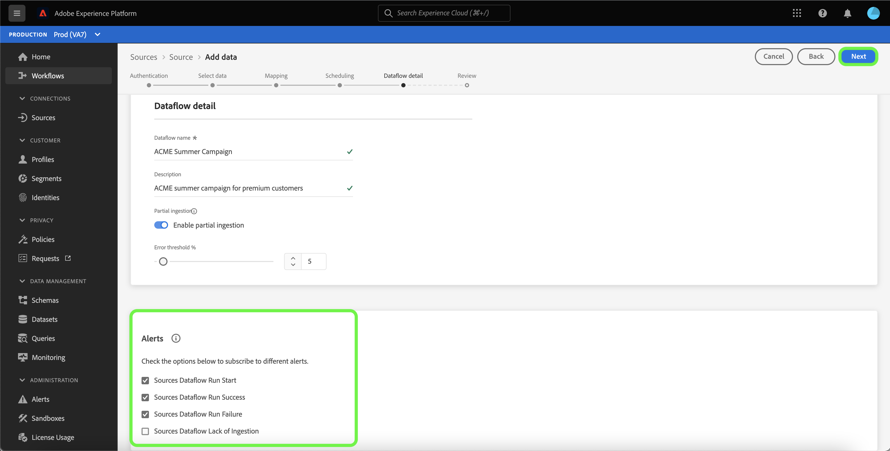
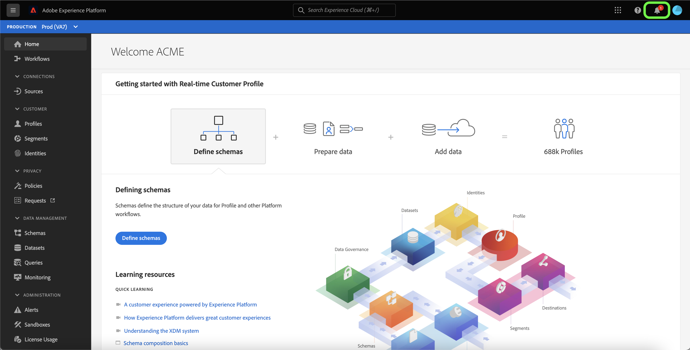

# Iscriviti agli avvisi per i flussi di dati sorgente nell’interfaccia utente

>[!NOTE]
>
>Gli avvisi non sono supportati nelle sandbox non di produzione. Per abbonarti agli avvisi, assicurati di utilizzare una sandbox di produzione.

Adobe Experience Platform ti consente di abbonarti a avvisi basati su eventi relativi alle attività Adobe Experience Platform. Gli avvisi riducono o eliminano la necessità di eseguire il polling [[!DNL Observability Insights] API](../../../observability/api/overview.md) per verificare se un processo è stato completato, se è stata raggiunta una determinata fase cardine all’interno di un flusso di lavoro o se si sono verificati errori.

Puoi abbonarti agli avvisi durante la creazione di un flusso di dati per ricevere messaggi di avviso relativi allo stato, al successo o all’errore dell’esecuzione del flusso.

Questo documento fornisce passaggi su come sottoscrivere messaggi di avviso per i flussi di dati di origine.

## Introduzione

Questo documento richiede una buona comprensione dei seguenti componenti di Adobe Experience Platform:

* [Origini](../../home.md): [!DNL Experience Platform] consente l’acquisizione di dati da varie sorgenti, fornendo al contempo la possibilità di strutturare, etichettare e migliorare i dati in arrivo utilizzando [!DNL Platform] servizi.
* [Osservabilità](../../../observability/home.md): [!DNL Observability Insights] consente di monitorare le attività di Platform mediante l’utilizzo di metriche statistiche e notifiche di eventi.
   * [Avvisi](../../../observability/alerts/overview.md): Quando viene raggiunto un certo set di condizioni nelle operazioni di Platform (ad esempio un potenziale problema in caso di superamento di una soglia), Platform può inviare messaggi di avviso a tutti gli utenti dell’organizzazione che si sono abbonati.

## Iscriviti agli avvisi nell’interfaccia utente {#subscribe-sources-alerts}

>[!CONTEXTUALHELP]
>id="platform_sources_alerts_subscribe"
>title="Iscriversi agli avvisi delle origini"
>abstract="Gli avvisi consentono di ricevere notifiche in base allo stato dei flussi di dati delle origini. Puoi impostare le notifiche di avviso per ottenere aggiornamenti se il flusso di dati è stato avviato, ha avuto esito positivo o negativo o non ha acquisito dati."
>text="Learn more in documentation"

>[!IMPORTANT]
>
>Devi abilitare le notifiche istantanee delle e-mail per il tuo account Platform per ricevere notifiche di avviso basate su e-mail per i tuoi flussi di dati.

Puoi abilitare gli avvisi per i flussi di dati durante la [!UICONTROL Dettaglio flusso di dati] passaggio del flusso di lavoro origini nell’area di lavoro origini.

Gli avvisi disponibili per i flussi di dati di origine sono:

| Avvisi | Descrizione |
| --- | --- |
| Avvio esecuzione flusso di dati di Origini | Questo avviso invia un messaggio all’avvio del flusso di dati sorgente. |
| Esecuzione del flusso di dati di Origini completata | Questo avviso invia un messaggio quando i dati provenienti dall’origine vengono correttamente acquisiti in Platform. |
| Errore di esecuzione del flusso di dati di origine | Questo avviso invia un messaggio se si verifica un errore nel flusso di dati. |
| ~~Fonti Dataflow mancanza di acquisizione~~ | ~~Questo avviso invia un messaggio se l’acquisizione viene ritardata di più di sette ore e non vengono acquisiti dati in Platform.~~  **Nota:** Non riceverai più avvisi perché questo avviso è stato dichiarato obsoleto. |

Seleziona gli avvisi a cui desideri abbonarti e quindi seleziona **[!UICONTROL Successivo]** per rivedere e completare il flusso di dati.

Consulta le seguenti guide per i passaggi dettagliati sulla creazione di un flusso di dati di origini nell’interfaccia utente:

* [Advertising](./dataflow/advertising.md)
* [archiviazione cloud](./dataflow/batch/cloud-storage.md)
* [CRM](./dataflow/crm.md)
* [Database](./dataflow/databases.md)
* [E-commerce](./dataflow/ecommerce.md)
* [File locali](./create/local-system/local-file-upload.md)
* [Automazione del marketing](./dataflow/marketing-automation.md)
* [Pagamenti](./dataflow/payments.md)
* [Protocolli](./dataflow/protocols.md)

## Ricevere avvisi

Una volta eseguito il flusso di dati, puoi ricevere avvisi tramite l’interfaccia utente o tramite e-mail.

### Nell’interfaccia utente

Gli avvisi sono rappresentati nell’interfaccia utente da un’icona di notifica nell’intestazione superiore dell’interfaccia utente di Platform. Seleziona l’icona di notifica per visualizzare messaggi di avviso specifici relativi ai flussi di dati.

Viene visualizzato il pannello Notifiche, che presenta un elenco degli aggiornamenti di stato nel flusso di dati creato.

Puoi passare il puntatore del mouse su un messaggio di avviso per contrassegnarlo come letto oppure puoi selezionare l&#39;icona dell&#39;orologio per impostare promemoria futuri sullo stato del flusso di dati.

Seleziona il messaggio di avviso per visualizzare informazioni specifiche sul flusso di dati.

La [!UICONTROL Panoramica dell&#39;esecuzione del dataflow] viene visualizzata la pagina . Nella parte superiore della schermata viene visualizzata una panoramica sul flusso di dati, con informazioni sugli attributi, l’ID di esecuzione del flusso di dati corrispondente e un riepilogo degli errori di alto livello.

Nella metà inferiore della pagina vengono visualizzate tutte le [!UICONTROL Errori di esecuzione del flusso di dati] che si è verificato durante la fase di esecuzione del flusso di dati. Da qui puoi visualizzare in anteprima la diagnostica degli errori o utilizzare la [[!DNL Data Access] API](https://www.adobe.io/experience-platform-apis/references/data-access/) per scaricare la diagnostica degli errori o il manifesto del file corrispondente al flusso di dati.

Per ulteriori informazioni sulla gestione degli errori del flusso di dati, consulta la guida su [monitoraggio dei flussi di dati di origini nell’interfaccia utente](../../../dataflows/ui/monitor-sources.md).

### Per e-mail

Gli avvisi relativi ai flussi di dati vengono inoltre inviati tramite e-mail. Seleziona il nome del flusso di dati nel corpo dell’e-mail per visualizzare ulteriori informazioni sul flusso di dati.

Simile all’avviso dell’interfaccia utente, il [!UICONTROL Panoramica dell&#39;esecuzione del dataflow] viene visualizzata una pagina che fornisce un’interfaccia per indagare eventuali errori associati al flusso di dati.

## Iscriviti e annulla l’abbonamento agli avvisi

Puoi abbonarti a più avvisi o cancellarti dagli avvisi stabiliti per un flusso di dati esistente in [!UICONTROL Flussi di dati] pagina. Individua il flusso di dati creato dall’elenco e seleziona i puntini di sospensione (`...`) per visualizzare un menu a discesa delle opzioni. Quindi, seleziona **[!UICONTROL Avvisi di sottoscrizione]** per modificare le impostazioni di avviso del flusso di dati.

Viene visualizzata una finestra a comparsa che fornisce un elenco di avvisi di origine. Seleziona gli avvisi a cui vuoi abbonarti o deseleziona gli avvisi a cui vuoi annullare l’iscrizione. Al termine, seleziona **[!UICONTROL Salva]**.

## Passaggi successivi

Questo documento fornisce una guida dettagliata su come abbonarsi agli avvisi contestuali per i flussi di dati sorgente. Per ulteriori informazioni, consulta la sezione [guida all’interfaccia utente per avvisi](../../../observability/alerts/ui.md).