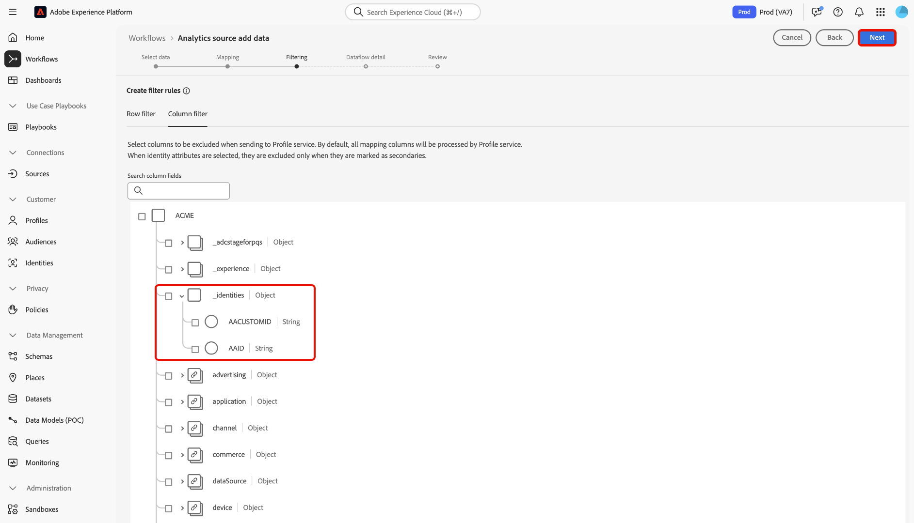

# Creare una connessione sorgente Adobe Analytics nell’interfaccia utente

Questo tutorial descrive i passaggi necessari per creare una connessione di origine Adobe Analytics nell’interfaccia utente per inserire i dati della suite di rapporti Adobe Analytics in Adobe Experience Platform.

## Introduzione

Questo tutorial richiede una buona conoscenza dei seguenti componenti di Experience Platform:

* [Experience Data Model (XDM) System](../../../../../xdm/home.md): framework standardizzato in base al quale Experience Platform organizza i dati sull&#39;esperienza del cliente.
* [Profilo cliente in tempo reale](../../../../../profile/home.md): fornisce un profilo consumatore unificato in tempo reale basato su dati aggregati provenienti da più origini.
* [Sandbox](../../../../../sandboxes/home.md): Experience Platform fornisce sandbox virtuali che suddividono una singola istanza Platform in ambienti virtuali separati, utili per le attività di sviluppo e aggiornamento delle applicazioni di esperienza digitale.

### Terminologia chiave

È importante comprendere i seguenti termini chiave utilizzati nel presente documento:

* **Attributo standard**: gli attributi standard sono attributi predefiniti da Adobe. Contengono lo stesso significato per tutti i clienti e sono disponibili nei gruppi di campi dello schema [!DNL Analytics] e dei dati di origine [!DNL Analytics].
* **Attributo personalizzato**: gli attributi personalizzati sono qualsiasi attributo nella gerarchia delle variabili personalizzate in [!DNL Analytics]. Gli attributi personalizzati vengono utilizzati all’interno di un’implementazione di Adobe Analytics per acquisire informazioni specifiche in una suite di rapporti e possono differire nel loro utilizzo da una suite di rapporti all’altra. Gli attributi personalizzati includono eVar, prop ed elenchi. Per ulteriori informazioni sulle eVar, consulta la [[!DNL Analytics] documentazione sulle variabili di conversione](https://experienceleague.adobe.com/docs/analytics/admin/admin-tools/conversion-variables/conversion-var-admin.html).
* **Qualsiasi attributo nei gruppi di campi personalizzati**: gli attributi che provengono dai gruppi di campi creati dai clienti sono tutti definiti dall&#39;utente e non sono considerati né attributi standard né personalizzati.
* **Nomi descrittivi**: i nomi descrittivi sono etichette fornite dall&#39;uomo per le variabili personalizzate in un&#39;implementazione [!DNL Analytics]. Per ulteriori informazioni sui nomi descrittivi, consulta la [[!DNL Analytics] documentazione sulle variabili di conversione](https://experienceleague.adobe.com/docs/analytics/admin/admin-tools/conversion-variables/conversion-var-admin.html).

## Creare una connessione sorgente con Adobe Analytics

>[!NOTE]
>
>Quando crei un flusso di dati di origine Analytics in una sandbox di produzione, vengono creati due flussi di dati:
>
>* Un flusso di dati che esegue una retrocompilazione di 13 mesi dei dati storici della suite di rapporti nel data lake. Questo flusso di dati termina quando la retrocompilazione è completa.
>* Flusso di dati che invia dati live al data lake e a [!DNL Real-Time Customer Profile]. Questo flusso di dati viene eseguito in modo continuo.

Nell&#39;interfaccia utente di Platform, seleziona **[!UICONTROL Origini]** dal menu di navigazione a sinistra per accedere all&#39;area di lavoro [!UICONTROL Origini]. Nella schermata [!UICONTROL Catalogo] sono visualizzate diverse origini con cui è possibile creare un account.

Puoi selezionare la categoria appropriata dal catalogo sul lato sinistro dello schermo. È inoltre possibile utilizzare la barra di ricerca per limitare le origini visualizzate.

Nella categoria **[!UICONTROL Adobe applications]**, seleziona **[!UICONTROL Adobe Analytics]**, quindi seleziona **[!UICONTROL Aggiungi dati]**.

### Selezionare i dati

>[!IMPORTANT]
>
>Le suite di rapporti elencate sullo schermo possono provenire da varie aree geografiche. L’utente è responsabile della comprensione delle limitazioni e degli obblighi relativi ai suoi dati e di come utilizza tali dati in Adobe Experience Platform in aree geografiche diverse. Assicurati che ciò sia consentito dalla tua azienda.

Il passaggio **[!UICONTROL Dati aggiunta origine di Analytics]** fornisce un elenco di [!DNL Analytics] dati della suite di rapporti con cui creare una connessione di origine.

Una suite di rapporti è un contenitore di dati che costituisce la base del reporting [!DNL Analytics]. Un’organizzazione può avere molte suite di rapporti, ciascuna contenente set di dati diversi.

Puoi acquisire suite di rapporti da qualsiasi area geografica (Stati Uniti, Regno Unito o Singapore) purché siano mappate sulla stessa organizzazione dell’istanza sandbox Experience Platform in cui viene creata la connessione di origine. Una suite di rapporti può essere acquisita utilizzando un solo flusso di dati attivo. Una suite di rapporti non selezionabile è già stata acquisita nella sandbox in uso o in un’altra sandbox.

È possibile effettuare più connessioni in-bound per portare più suite di rapporti nella stessa sandbox. Se le suite di rapporti hanno schemi diversi per le variabili (ad esempio eVar o eventi), è necessario mapparle su campi specifici nei gruppi di campi personalizzati ed evitare conflitti di dati utilizzando [Preparazione dati](../../../../../data-prep/ui/mapping.md). Le suite di rapporti possono essere aggiunte solo a una singola sandbox.

>[!NOTE]
>
>I dati provenienti da più suite di rapporti possono essere abilitati per Real-Time Customer Profile solo se non sono presenti conflitti di dati, ad esempio due proprietà personalizzate (eVar, elenchi e proprietà) con un significato diverso.

Per creare una connessione di origine [!DNL Analytics], seleziona una suite di rapporti, quindi seleziona **[!UICONTROL Avanti]** per continuare.

&lt;!- Le suite di rapporti di Analytics possono essere configurate per una sandbox alla volta. Per importare la stessa suite di rapporti in una sandbox diversa, è necessario eliminare il flusso del set di dati e crearne di nuovo un’istanza tramite la configurazione per una sandbox diversa.—>

### Mappatura

>[!IMPORTANT]
>
>Le trasformazioni della preparazione dati possono aggiungere latenza al flusso di dati complessivo. La latenza aggiuntiva aggiunta varia in base alla complessità della logica di trasformazione.

Prima di poter mappare i dati [!DNL Analytics] allo schema XDM di destinazione, è necessario selezionare se si utilizza uno schema predefinito o uno schema personalizzato.

Uno schema predefinito crea un nuovo schema per tuo conto, contenente il gruppo di campi [!DNL Adobe Analytics ExperienceEvent Template]. Per utilizzare uno schema predefinito, selezionare **[!UICONTROL Schema predefinito]**.

Con uno schema personalizzato, è possibile scegliere qualsiasi schema disponibile per i dati [!DNL Analytics], purché tale schema abbia il gruppo di campi [!DNL Adobe Analytics ExperienceEvent Template]. Per utilizzare uno schema personalizzato, selezionare **[!UICONTROL Schema personalizzato]**.

La pagina [!UICONTROL Mapping] fornisce un&#39;interfaccia per mappare i campi di origine ai campi dello schema di destinazione appropriati. Da qui, puoi mappare le variabili personalizzate ai nuovi gruppi di campi dello schema e applicare i calcoli come supportato dalla preparazione dati. Seleziona uno schema di destinazione per avviare il processo di mappatura.

>[!TIP]
>
>Nel menu di selezione dello schema vengono visualizzati solo gli schemi con il gruppo di campi [!DNL Adobe Analytics ExperienceEvent Template]. Gli altri schemi vengono omessi. Se non sono disponibili schemi appropriati per i dati della suite di rapporti, devi creare un nuovo schema. Per i passaggi dettagliati sulla creazione di schemi, consulta la guida su [creazione e modifica di schemi nell&#39;interfaccia utente](../../../../../xdm/ui/resources/schemas.md).

Nella sezione [!UICONTROL Mapping di campi standard] sono visualizzati i pannelli per [!UICONTROL Mapping standard applicati], [!UICONTROL Mapping standard non corrispondenti] e [!UICONTROL Mapping personalizzati]. Per informazioni specifiche su ciascuna categoria, vedere la tabella seguente:

| Mappa campi standard | Descrizione |
| --- | --- |
| [!UICONTROL Mappature standard applicate] | Il pannello [!UICONTROL Mappature standard applicate] visualizza il numero totale di attributi mappati. Le mappature standard fanno riferimento ai set di mappatura tra tutti gli attributi nei dati di origine [!DNL Analytics] e gli attributi corrispondenti nel gruppo di campi [!DNL Analytics]. Questi sono premappati e non possono essere modificati. |
| [!UICONTROL Mappature standard non corrispondenti] | Il pannello [!UICONTROL Mappature standard non corrispondenti] fa riferimento al numero di attributi mappati che contengono conflitti di nomi descrittivi. Questi conflitti vengono visualizzati quando si riutilizza uno schema che dispone già di un set popolato di descrittori di campo da una suite di rapporti diversa. Puoi procedere con il flusso di dati [!DNL Analytics] anche con conflitti di nomi descrittivi. |
| [!UICONTROL Mappature personalizzate] | Il pannello [!UICONTROL Mappature personalizzate] visualizza il numero di attributi personalizzati mappati, inclusi eVar, prop ed elenchi. I mapping personalizzati si riferiscono ai set di mapping tra gli attributi personalizzati nei dati di origine [!DNL Analytics] e gli attributi nei gruppi di campi personalizzati inclusi nello schema selezionato. |

Per visualizzare in anteprima il gruppo di campi dello schema del modello ExperienceEvent [!DNL Analytics], seleziona **[!UICONTROL Visualizza]** nel pannello [!UICONTROL Mappature standard applicate].

La pagina [!UICONTROL Gruppo di campi dello schema del modello Adobe Analytics ExperienceEvent] offre un&#39;interfaccia da utilizzare per controllare la struttura dello schema. Al termine, selezionare **[!UICONTROL Chiudi]**.

Platform rileva automaticamente i set di mappatura per eventuali conflitti di nomi descrittivi. Se non ci sono conflitti con i set di mappatura, seleziona **[!UICONTROL Avanti]** per continuare.

>[!TIP]
>
>Se ci sono conflitti di nomi descrittivi tra la suite di rapporti di origine e lo schema selezionato, puoi comunque continuare con il flusso di dati [!DNL Analytics], riconoscendo che i descrittori dei campi non verranno modificati. In alternativa, puoi scegliere di creare un nuovo schema con un set vuoto di descrittori.

#### Mappature personalizzate

È possibile utilizzare le funzioni di preparazione dati per aggiungere nuove mappature personalizzate o campi calcolati per gli attributi personalizzati. Per aggiungere mappature personalizzate, selezionare **[!UICONTROL Personalizzato]**.

A seconda delle tue esigenze, puoi selezionare **[!UICONTROL Aggiungi nuova mappatura]** o **[!UICONTROL Aggiungi campo calcolato]** e procedere alla creazione di mappature personalizzate per gli attributi personalizzati. Per i passaggi completi su come utilizzare le funzioni di preparazione dati, consulta la [Guida dell&#39;interfaccia utente di preparazione dati](../../../../../data-prep/ui/mapping.md).

La documentazione seguente fornisce ulteriori risorse sulla preparazione dati, sui campi calcolati e sulle funzioni di mappatura:

* [Panoramica sulla preparazione dati](../../../../../data-prep/home.md)
* [Funzioni di mappatura della preparazione dati](../../../../../data-prep/functions.md)
* [Aggiungere campi calcolati](../../../../../data-prep/ui/mapping.md#calculated-fields)

<!-- 
To use Data Prep functions and add new mapping or calculated fields for custom attributes, select **[!UICONTROL View custom mappings]**.

Next, select **[!UICONTROL Add new mapping]**.

Depending on your needs, you can select either **[!UICONTROL Add new mapping]** or **[!UICONTROL Add calculated field]** from the options that appear. 

An empty mapping set appears. Select the mapping icon to add a source field.

You can use the interface to navigate through the source schema structure and identify the new source field that you want to use. Once you have selected the source field that you want to map, select **[!UICONTROL Select]**.

Next, select the mapping icon under [!UICONTROL Target Field] to map your selected source field to its appropriate target field.

Similar to the source schema, you can use the interface to navigate through the target schema structure and select the target field you want to map to. Once you have selected the appropriate target field, select **[!UICONTROL Select]**.

With your custom mapping set completed, select **[!UICONTROL Next]** to proceed.

 -->

## Filtraggio in base a profilo cliente in tempo reale {#filtering-for-profile}

>[!CONTEXTUALHELP]
>id="platform_data_prep_analytics_filtering"
>title="Creare regole di filtro"
>abstract="Quando invii dati al profilo cliente in tempo reale, puoi definire regole di filtro a livello di riga e colonna. Utilizza il filtro a livello di riga per applicare condizioni e stabilire quali dati **includere nell’acquisizione per il profilo**. Utilizza il filtro a livello di colonna per selezionare le colonne di dati da **escludere dall’acquisizione per il profilo**. Le regole di filtro non si applicano ai dati inviati al Data Lake."

Dopo aver completato le mappature per i dati della suite di rapporti [!DNL Analytics], puoi applicare regole e condizioni di filtro per includere o escludere selettivamente i dati dall&#39;acquisizione nel Profilo cliente in tempo reale. Il supporto per il filtro è disponibile solo per i dati di [!DNL Analytics] e i dati vengono filtrati solo prima dell&#39;immissione di [!DNL Profile.]. Tutti i dati vengono acquisiti nel data lake.

>[!BEGINSHADEBOX]

**Ulteriori informazioni sulla preparazione dei dati e sul filtraggio dei dati di Analytics per Real-Time Customer Profile**

* Puoi utilizzare la funzionalità di filtro per i dati che vanno nel profilo, ma non per i dati che vanno nel data lake.
* Puoi utilizzare il filtro per i dati live, ma non puoi filtrare i dati di retrocompilazione.
   * L&#39;origine [!DNL Analytics] non esegue il backfill dei dati nel profilo.
* Se si utilizzano le configurazioni della preparazione dati durante la configurazione iniziale di un flusso [!DNL Analytics], tali modifiche vengono applicate anche alla retrocompilazione automatica di 13 mesi.
   * Tuttavia, questo non avviene per il filtro, perché il filtro è riservato solo ai dati live.
* La preparazione dati viene applicata ai percorsi di acquisizione in streaming e in batch. Se modifichi una configurazione di Preparazione dati esistente, tali modifiche vengono quindi applicate ai nuovi dati in arrivo attraverso i percorsi di acquisizione in streaming e in batch.
   * Tuttavia, eventuali configurazioni della preparazione dati non si applicano ai dati che sono già stati acquisiti in Experience Platform, indipendentemente dal fatto che si tratti di dati in streaming o batch.
* Gli attributi standard di Analytics vengono sempre mappati automaticamente. Pertanto, non è possibile applicare trasformazioni agli attributi standard.
   * Tuttavia, puoi filtrare gli attributi standard purché non siano richiesti in Identity Service o Profile.
* Non è possibile utilizzare il filtro a livello di colonna per filtrare i campi obbligatori e i campi di identità.
* Anche se è possibile filtrare le identità secondarie, in particolare AAID e AACustomID, non è possibile filtrare ECID.
* Quando si verifica un errore di trasformazione, la colonna corrispondente restituisce NULL.

>[!ENDSHADEBOX]

### Filtro a livello di riga

>[!IMPORTANT]
>
>Utilizza il filtro a livello di riga per applicare condizioni e stabilire quali dati **includere nell’acquisizione per il profilo**. Utilizza il filtro a livello di colonna per selezionare le colonne di dati da **escludere per l&#39;acquisizione del profilo**.

È possibile filtrare i dati per l&#39;acquisizione di [!DNL Profile] a livello di riga e di colonna. Il filtro a livello di riga consente di definire criteri quali stringa contiene, è uguale a, inizia o termina con. È inoltre possibile utilizzare il filtro a livello di riga per unire le condizioni utilizzando `AND` e `OR` e negare le condizioni utilizzando `NOT`.

Per filtrare i dati di [!DNL Analytics] a livello di riga, selezionare **[!UICONTROL Filtro righe]**.

Utilizza la barra a sinistra per spostarti nella gerarchia dello schema e selezionare l’attributo dello schema desiderato per approfondire ulteriormente uno schema specifico.

Dopo aver identificato l’attributo da configurare, selezionalo e trascinalo dalla barra a sinistra al pannello di filtro.

Per configurare condizioni diverse, selezionare **[!UICONTROL è uguale a]**, quindi selezionare una condizione dalla finestra a discesa visualizzata.

L’elenco delle condizioni configurabili include:

* [!UICONTROL è uguale a]
* [!UICONTROL è diverso da]
* [!UICONTROL inizia con]
* [!UICONTROL termina con]
* [!UICONTROL non termina con]
* [!UICONTROL contiene]
* [!UICONTROL non contiene]
* [!UICONTROL esiste]
* [!UICONTROL non esiste]

Immettere quindi i valori che si desidera includere in base all&#39;attributo selezionato. Nell&#39;esempio seguente, [!DNL Apple] e [!DNL Google] sono selezionati per l&#39;acquisizione come parte dell&#39;attributo **[!UICONTROL Manufacturer]**.

Per specificare ulteriormente le condizioni di filtro, aggiungi un altro attributo dallo schema, quindi aggiungi i valori basati su tale attributo. Nell&#39;esempio seguente viene aggiunto l&#39;attributo **[!UICONTROL Model]** e i modelli come [!DNL iPhone 13] e [!DNL Google Pixel 6] vengono filtrati per l&#39;acquisizione.

Per aggiungere un nuovo contenitore, selezionare i puntini di sospensione (`...`) in alto a destra nell&#39;interfaccia di filtro, quindi selezionare **[!UICONTROL Aggiungi contenitore]**.

Dopo aver aggiunto un nuovo contenitore, seleziona **[!UICONTROL Includi]**, quindi seleziona **[!UICONTROL Escludi]** dalla finestra a discesa visualizzata.

Quindi, completa lo stesso processo trascinando gli attributi dello schema e aggiungendo i relativi valori corrispondenti che desideri escludere dal filtro. Nell&#39;esempio seguente, [!DNL iPhone 12], [!DNL iPhone 12 mini] e [!DNL Google Pixel 5] sono tutti filtrati dall&#39;esclusione dall&#39;attributo **[!UICONTROL Model]**, l&#39;orientamento orizzontale è escluso dall&#39;**[!UICONTROL Screen orientation]** e il numero di modello [!DNL A1633] è escluso dal **[!UICONTROL Model number]**.

Al termine, selezionare **[!UICONTROL Avanti]**.

### Filtraggio a livello di colonna

Seleziona **[!UICONTROL Filtro colonna]** dall&#39;intestazione per applicare il filtro a livello di colonna.

La pagina si aggiorna in una struttura di schema interattiva, che mostra gli attributi dello schema a livello di colonna. Da qui puoi selezionare le colonne di dati da escludere dall&#39;acquisizione di [!DNL Profile]. In alternativa, è possibile espandere una colonna e selezionare attributi specifici per l&#39;esclusione.

Per impostazione predefinita, tutti i [!DNL Analytics] passano a [!DNL Profile] e questo processo consente di escludere rami di dati XDM dall&#39;acquisizione di [!DNL Profile].

Al termine, selezionare **[!UICONTROL Avanti]**.

### Filtra identità secondarie

Utilizza un filtro a colonne per escludere le identità secondarie dall’acquisizione del profilo. Per filtrare le identità secondarie, selezionare **[!UICONTROL Filtro colonna]**, quindi selezionare **[!UICONTROL _identità]**.

Il filtro si applica solo quando un’identità è contrassegnata come secondaria. Se sono selezionate identità ma arriva un evento con una delle identità contrassegnate come primarie, queste non vengono filtrate.

### Fornisci i dettagli del flusso di dati

Viene visualizzato il passaggio **[!UICONTROL Dettagli flusso di dati]**, in cui è necessario fornire un nome e una descrizione facoltativa per il flusso di dati. Al termine, seleziona **[!UICONTROL Avanti]**.

### Controlla

Viene visualizzato il passaggio [!UICONTROL Rivedi], che consente di rivedere il nuovo flusso di dati di Analytics prima che venga creato. I dettagli della connessione sono raggruppati per categorie, tra cui:

* [!UICONTROL Connessione]: visualizza la piattaforma di origine della connessione.
* [!UICONTROL Tipo di dati]: visualizza la suite di rapporti selezionata e il relativo ID suite di rapporti.

## Monitorare il flusso di dati {#monitor-your-dataflow}

Una volta completato il flusso di dati, seleziona **[!UICONTROL Flussi di dati]** nel catalogo delle origini per monitorare l&#39;attività e lo stato dei dati.

Viene visualizzato un elenco dei flussi di dati di Analytics esistenti nell’organizzazione. Da qui, seleziona un set di dati di destinazione per visualizzare la rispettiva attività di acquisizione.

La pagina [!UICONTROL Attività set di dati] fornisce informazioni sull&#39;avanzamento dei dati inviati da Analytics a Experience Platform. L’interfaccia visualizza metriche quali il numero di record acquisiti, il numero di batch acquisiti e il numero di batch non riusciti.

L’origine crea un’istanza di due flussi di set di dati. Un flusso rappresenta i dati di backfill e l’altro è per i dati live. I dati di backfill non sono configurati per l’acquisizione in Real-Time Customer Profile, ma vengono inviati al data lake per casi d’uso analitici e di data science.

Per ulteriori informazioni sulla retrocompilazione, sui dati live e sulle rispettive latenze, consulta la [Panoramica sull&#39;origine di Analytics](../../../../connectors/adobe-applications/analytics.md).

+++Visualizzare singoli batch utilizzando l&#39;interfaccia di monitoraggio legacy

La pagina dell’attività del set di dati non visualizza un elenco di singoli batch. Per visualizzare un elenco di singoli batch, seleziona un grafico nell’interfaccia dell’attività del set di dati.

Viene visualizzata la dashboard Monitoraggio. Quindi, seleziona **[!UICONTROL SOLO ERRORI DI ACQUISIZIONE: SÌ]** per cancellare il filtro e visualizzare un elenco di singoli batch.

L’interfaccia viene aggiornata a un elenco di singoli batch, incluse informazioni sulle rispettive metriche.

| Metriche | Descrizione |
| --- | --- |
| ID batch | L’ID di un determinato batch. Questo valore viene generato internamente. |
| Nome del set di dati | Nome di un dato set di dati utilizzato per i dati di Analytics. |
| Origine | L’origine dei dati acquisiti. |
| Aggiornata | Data dell&#39;iterazione dell&#39;esecuzione del flusso più recente. |
| Record nel set di dati | Numero totale di record nel set di dati. **Nota**: questo parametro talvolta visualizza lo stato `in-progress`. Questo stato indica che il processo di acquisizione dei record non è ancora stato completato. |
| Nuovi frammenti di profilo | Numero totale di nuovi frammenti di profilo acquisiti. |
| Frammenti di profilo esistenti | Numero totale di frammenti di profilo esistenti. |
| Record di identità uniti | Numero totale di record di identità uniti dopo l’acquisizione. |
| Record nel profilo | Numero totale di record acquisiti in Real-Time Customer Profile. |

{style="table-layout:auto"}

+++

## Passaggi successivi e risorse aggiuntive

Una volta creata la connessione, il flusso di dati viene creato automaticamente per contenere i dati in arrivo e popolare un set di dati con lo schema selezionato. Inoltre, avviene il recupero dei dati e acquisisce fino a 13 mesi di dati storici. Al termine dell&#39;acquisizione iniziale, [!DNL Analytics] dati e saranno utilizzati dai servizi Platform a valle come [!DNL Real-Time Customer Profile] e Segmentation Service. Per ulteriori informazioni, consulta i seguenti documenti:

* [Panoramica di [!DNL Real-Time Customer Profile]](../../../../../profile/home.md)
* [Panoramica di [!DNL Segmentation Service]](../../../../../segmentation/home.md)
* [Panoramica di [!DNL Data Science Workspace]](../../../../../data-science-workspace/home.md)
* [Panoramica di [!DNL Query Service]](../../../../../query-service/home.md)

Il seguente video ha lo scopo di chiarire come acquisire dati utilizzando il connettore Source di Adobe Analytics:

>[!WARNING]
>
> L&#39;interfaccia utente [!DNL Platform] mostrata nel video seguente non è aggiornata. Per le schermate e le funzionalità più recenti dell’interfaccia utente, consulta la documentazione precedente.

>[!VIDEO](https://video.tv.adobe.com/v/29687?quality=12&learn=on)
