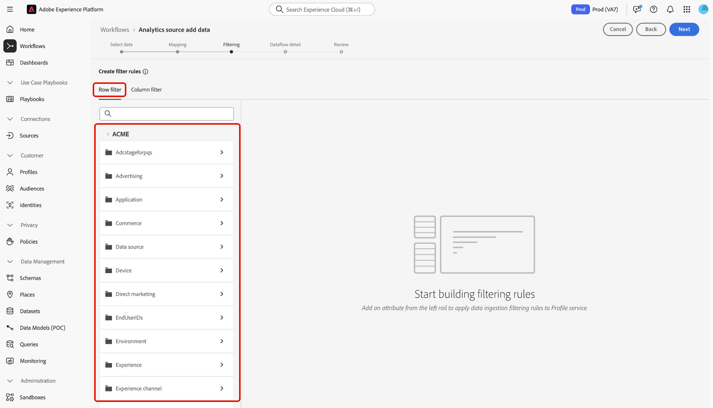

# Creare una connessione sorgente Adobe Analytics nell’interfaccia utente

Questa esercitazione fornisce passaggi per creare una connessione sorgente Adobe Analytics nell’interfaccia utente per inserire i dati della suite di rapporti Adobe Analytics in Adobe Experience Platform.

## Introduzione

Questa esercitazione richiede una comprensione approfondita dei seguenti componenti dell&#39;Experience Platform:

* [Sistema Experience Data Model (XDM)](../../../../../xdm/home.md): Il framework standardizzato in base al quale l’Experience Platform organizza i dati sulla customer experience.
* [Profilo cliente in tempo reale](../../../../../profile/home.md): Fornisce un profilo di consumatore unificato e in tempo reale basato su dati aggregati provenienti da più origini.
* [Sandbox](../../../../../sandboxes/home.md): Experience Platform fornisce sandbox virtuali che suddividono una singola istanza di Platform in ambienti virtuali separati per sviluppare e sviluppare applicazioni di esperienza digitale.

### Terminologia chiave

È importante comprendere i seguenti termini chiave utilizzati in questo documento:

* **Attributo standard**: Gli attributi standard sono tutti gli attributi predefiniti di Adobe. Contengono lo stesso significato per tutti i clienti e sono disponibili nel [!DNL Analytics] dati di origine e [!DNL Analytics] gruppi di campi dello schema.
* **Attributo personalizzato**: Gli attributi personalizzati sono qualsiasi attributo nella gerarchia delle variabili personalizzate in [!DNL Analytics]. Gli attributi personalizzati vengono utilizzati all’interno di un’implementazione di Adobe Analytics per acquisire informazioni specifiche in una suite di rapporti e possono differire per quanto riguarda l’utilizzo da suite di rapporti a suite di rapporti. Gli attributi personalizzati includono eVar, prop ed elenchi. Vedi quanto segue [[!DNL Analytics] documentazione sulle variabili di conversione](https://experienceleague.adobe.com/docs/analytics/admin/admin-tools/conversion-variables/conversion-var-admin.html?lang=en) per ulteriori informazioni sulle eVar.
* **Qualsiasi attributo nei gruppi di campi personalizzati**: Gli attributi che provengono da gruppi di campi creati dai clienti sono tutti definiti dall’utente e non sono considerati attributi standard o personalizzati.
* **Nomi descrittivi**: I nomi descrittivi sono etichette fornite dall&#39;utente per variabili personalizzate in un [!DNL Analytics] implementazione. Vedi quanto segue [[!DNL Analytics] documentazione sulle variabili di conversione](https://experienceleague.adobe.com/docs/analytics/admin/admin-tools/conversion-variables/conversion-var-admin.html?lang=en) per ulteriori informazioni sui nomi descrittivi.

## Creare una connessione sorgente con Adobe Analytics

Nell’interfaccia utente di Platform, seleziona **[!UICONTROL Origini]** dalla navigazione a sinistra per accedere al [!UICONTROL Origini] workspace. La [!UICONTROL Catalogo] in questa schermata vengono visualizzate diverse sorgenti con cui è possibile creare un account.

Puoi selezionare la categoria appropriata dal catalogo sul lato sinistro dello schermo. Puoi anche usare la barra di ricerca per limitare le sorgenti visualizzate.

Sotto la **[!UICONTROL Applicazioni di Adobe]** categoria, seleziona **[!UICONTROL Adobe Analytics]** quindi seleziona **[!UICONTROL Aggiungi dati]**.

### Selezionare i dati

>[!IMPORTANT]
>
>Le suite di rapporti elencate sullo schermo possono provenire da varie aree geografiche. Sei responsabile di comprendere i limiti e gli obblighi dei tuoi dati e il modo in cui li utilizzi nelle diverse aree geografiche di Adobe Experience Platform. Assicurati che ciò sia consentito dalla tua azienda.

La **[!UICONTROL Aggiungere dati alla sorgente di Analytics]** fornisce un elenco di [!DNL Analytics] i dati della suite di rapporti con cui creare una connessione sorgente.

Una suite di rapporti è un contenitore di dati che costituisce la base di [!DNL Analytics] rapporti. Un&#39;organizzazione può avere molte suite di rapporti, ciascuna contenente set di dati diversi.

È possibile acquisire suite di rapporti da qualsiasi regione (Stati Uniti, Regno Unito o Singapore) purché siano mappate nella stessa organizzazione dell’istanza sandbox di Experience Platform in cui viene creata la connessione sorgente. È possibile acquisire una suite di rapporti utilizzando un solo flusso di dati attivo. Una suite di rapporti non selezionabile è già stata assimilata, nella sandbox che stai utilizzando o in un’altra sandbox.

È possibile creare più connessioni in-bound per inserire più suite di rapporti nella stessa sandbox. Se le suite di rapporti hanno schemi diversi per le variabili (ad esempio eVar o eventi), devono essere mappate a campi specifici nei gruppi di campi personalizzati ed evitare conflitti di dati utilizzando [Preparazione dei dati](../../../../../data-prep/ui/mapping.md). Le suite di rapporti possono essere aggiunte a un solo sandbox.

>[!NOTE]
>
>I dati provenienti da più suite di rapporti possono essere abilitati per Profilo cliente in tempo reale solo se non sono presenti conflitti di dati, ad esempio due proprietà personalizzate (eVar, elenchi e proprietà) che hanno un significato diverso.

Per creare un [!DNL Analytics] connessione sorgente, seleziona una suite di rapporti e seleziona **[!UICONTROL Successivo]** per procedere.

&lt;!: le suite di rapporti di Analytics possono essere configurate per una sandbox alla volta. Per importare la stessa suite di rapporti in un’altra sandbox, il flusso di set di dati dovrà essere eliminato e creato di nuovo un’istanza tramite la configurazione di un’altra sandbox.—>

### Mappatura

>[!IMPORTANT]
>
>Le trasformazioni di Data Prep possono aggiungere latenza al flusso di dati complessivo. La latenza aggiuntiva aggiunta varia in base alla complessità della logica di trasformazione.

Prima di poter mappare il tuo [!DNL Analytics] per eseguire il targeting di uno schema XDM, è innanzitutto necessario selezionare se si utilizza uno schema predefinito o uno schema personalizzato.

Uno schema predefinito crea un nuovo schema per conto dell&#39;utente, contenente [!DNL Adobe Analytics ExperienceEvent Template] gruppo di campi. Per utilizzare uno schema predefinito, selezionare **[!UICONTROL Schema predefinito]**.

Con uno schema personalizzato è possibile scegliere qualsiasi schema disponibile per il [!DNL Analytics] purché tale schema abbia [!DNL Adobe Analytics ExperienceEvent Template] gruppo di campi. Per utilizzare uno schema personalizzato, selezionare **[!UICONTROL Schema personalizzato]**.

La [!UICONTROL Mappatura] La pagina fornisce un’interfaccia per mappare i campi di origine ai campi dello schema di destinazione appropriati. Da qui puoi mappare variabili personalizzate a nuovi gruppi di campi dello schema e applicare calcoli supportati da Data Prep. Seleziona uno schema di destinazione per avviare il processo di mappatura.

>[!TIP]
>
>Solo gli schemi che hanno [!DNL Adobe Analytics ExperienceEvent Template] il gruppo di campi viene visualizzato nel menu di selezione dello schema. Gli altri schemi vengono omessi. Se non sono disponibili schemi appropriati per i dati della suite di rapporti, devi creare un nuovo schema. Per i passaggi dettagliati sulla creazione degli schemi, consulta la guida in [creazione e modifica di schemi nell’interfaccia utente](../../../../../xdm/ui/resources/schemas.md).

La [!UICONTROL Mappa campi standard] vengono visualizzati pannelli per [!UICONTROL Mappature standard applicate], [!UICONTROL Mappature standard non corrispondenti] e [!UICONTROL Mappature personalizzate]. Per informazioni specifiche relative a ciascuna categoria, consultare la tabella seguente:

| Mappa campi standard | Descrizione |
| --- | --- |
| [!UICONTROL Mappature standard applicate] | La [!UICONTROL Mappature standard applicate] visualizza il numero totale di attributi mappati. Le mappature standard si riferiscono ai set di mappatura tra tutti gli attributi nell’origine [!DNL Analytics] dati e attributi corrispondenti in [!DNL Analytics] gruppo di campi. Questi sono pre-mappati e non possono essere modificati. |
| [!UICONTROL Mappature standard non corrispondenti] | La [!UICONTROL Mappature standard non corrispondenti] Il pannello fa riferimento al numero di attributi mappati che contengono conflitti di nomi descrittivi. Questi conflitti vengono visualizzati quando si riutilizza uno schema che dispone già di un set popolato di descrittori di campo di una suite di rapporti diversa. Puoi procedere con il tuo [!DNL Analytics] flusso di dati anche con conflitti di nomi descrittivi. |
| [!UICONTROL Mappature personalizzate] | La [!UICONTROL Mappature personalizzate] visualizza il numero di attributi personalizzati mappati, inclusi eVar, prop ed elenchi. Le mappature personalizzate fanno riferimento ai set di mappature tra attributi personalizzati nella sorgente [!DNL Analytics] dati e attributi nei gruppi di campi personalizzati inclusi nello schema selezionato. |

Per visualizzare in anteprima [!DNL Analytics] Gruppo di campi dello schema del modello ExperienceEvent, seleziona **[!UICONTROL Visualizza]** in [!UICONTROL Mappature standard applicate] pannello.

La [!UICONTROL Gruppo di campi schema modello di Adobe Analytics ExperienceEvent] La pagina fornisce un’interfaccia da utilizzare per analizzare la struttura dello schema. Al termine, seleziona **[!UICONTROL Chiudi]**.

Platform rileva automaticamente i set di mappatura per eventuali conflitti di nomi descrittivi. Se non ci sono conflitti con i set di mappatura, seleziona **[!UICONTROL Successivo]** per procedere.

Se esistono conflitti di nomi descrittivi tra la suite di rapporti di origine e lo schema selezionato, è comunque possibile continuare con [!DNL Analytics] flusso di dati, riconoscendo che i descrittori del campo non verranno modificati. In alternativa, puoi scegliere di creare un nuovo schema con un set vuoto di descrittori.

Seleziona **[!UICONTROL Successivo]** per procedere.

#### Mappature personalizzate

Per utilizzare le funzioni di preparazione dei dati e aggiungere nuovi campi di mappatura o calcolati per gli attributi personalizzati, seleziona **[!UICONTROL Visualizza mappature personalizzate]**.

Quindi, seleziona **[!UICONTROL Aggiungi nuova mappatura]**.

A seconda delle tue esigenze, puoi selezionare **[!UICONTROL Aggiungi nuova mappatura]** o **[!UICONTROL Aggiungi campo calcolato]** dalle opzioni visualizzate.

Viene visualizzato un set di mappature vuoto. Seleziona l’icona di mappatura per aggiungere un campo sorgente.

È possibile utilizzare l&#39;interfaccia per navigare nella struttura dello schema di origine e identificare il nuovo campo di origine che si desidera utilizzare. Dopo aver selezionato il campo di origine da mappare, seleziona **[!UICONTROL Seleziona]**.

Quindi, seleziona l’icona di mappatura in [!UICONTROL Campo di destinazione] per eseguire il mapping del campo di origine selezionato al relativo campo di destinazione appropriato.

Analogamente allo schema di origine, è possibile utilizzare l’interfaccia per navigare nella struttura dello schema di destinazione e selezionare il campo di destinazione a cui si desidera eseguire la mappatura. Dopo aver selezionato il campo di destinazione appropriato, seleziona **[!UICONTROL Seleziona]**.

Completata la mappatura personalizzata, seleziona **[!UICONTROL Successivo]** per procedere.

La seguente documentazione fornisce ulteriori risorse sulla preparazione dei dati, sui campi calcolati e sulle funzioni di mappatura:

* [Panoramica sulla preparazione dei dati](../../../../../data-prep/home.md)
* [Funzioni di mappatura della preparazione dei dati](../../../../../data-prep/functions.md)
* [Aggiungi campi calcolati](../../../../../data-prep/ui/mapping.md#calculated-fields)

### Filtraggio del profilo cliente in tempo reale {#filtering-for-profile}

>[!CONTEXTUALHELP]
>id="platform_data_prep_analytics_filtering"
>title="Creare regole di filtro"
>abstract="Definisci regole di filtro a livello di riga e colonna quando invii dati a Profilo cliente in tempo reale. Utilizza il filtro a livello di riga per applicare condizioni e dettare a quali dati **include per l’acquisizione di profili**. Utilizza il filtro a livello di colonna per selezionare le colonne di dati che desideri **escludi per l’acquisizione di profili**. Le regole di filtro non si applicano ai dati inviati a data lake."

Una volta completate le mappature per [!DNL Analytics] dati della suite di rapporti, puoi applicare regole e condizioni di filtro per includere o escludere in modo selettivo i dati dall’acquisizione al Profilo del cliente in tempo reale. Il supporto per il filtro è disponibile solo per [!DNL Analytics] i dati e i dati vengono filtrati solo prima dell&#39;immissione [!DNL Profile.] Tutti i dati vengono acquisiti nel lago dati.

#### Filtro a livello di riga

>[!IMPORTANT]
>
>Utilizza il filtro a livello di riga per applicare condizioni e dettare a quali dati **include per l’acquisizione di profili**. Utilizza il filtro a livello di colonna per selezionare le colonne di dati che desideri **escludi per l’acquisizione di profili**.

Puoi filtrare i dati per [!DNL Profile] inserimento a livello di riga e di colonna. Il filtro a livello di riga consente di definire criteri quali la stringa contiene, è uguale a, inizia o termina con. Puoi anche utilizzare il filtro a livello di riga per unire le condizioni utilizzando `AND` nonché `OR`e nega le condizioni utilizzando `NOT`.

Per filtrare il [!DNL Analytics] a livello di riga, seleziona **[!UICONTROL Filtro a righe]**.

Utilizza la barra a sinistra per navigare nella gerarchia dello schema e seleziona l’attributo dello schema desiderato per approfondire la ricerca di uno schema specifico.

Una volta identificato l’attributo da configurare, seleziona e trascina l’attributo dalla barra a sinistra al pannello di filtraggio.

Per configurare condizioni diverse, seleziona **[!UICONTROL è]** quindi selezionare una condizione dalla finestra a discesa visualizzata.

L’elenco delle condizioni configurabili include:

* [!UICONTROL è uguale a]
* [!UICONTROL non è uguale a]
* [!UICONTROL inizia con]
* [!UICONTROL termina con]
* [!UICONTROL non termina con]
* [!UICONTROL contiene]
* [!UICONTROL non contiene]
* [!UICONTROL esiste]
* [!UICONTROL non esiste]

Quindi, immetti i valori da includere in base all&#39;attributo selezionato. Nell’esempio seguente: [!DNL Apple] e [!DNL Google] sono selezionati per l’acquisizione come parte del **[!UICONTROL Produttore]** attributo.

Per specificare ulteriormente le condizioni di filtro, aggiungi un altro attributo dallo schema e quindi aggiungi valori basati su tale attributo. Nell’esempio seguente, la **[!UICONTROL Modello]** viene aggiunto l’attributo e modelli come [!DNL iPhone 13] e [!DNL Google Pixel 6] vengono filtrati per l’acquisizione.

Per aggiungere un nuovo contenitore, seleziona i puntini di sospensione (`...`) in alto a destra nell’interfaccia di filtraggio e seleziona **[!UICONTROL Aggiungi contenitore]**.

Una volta aggiunto un nuovo contenitore, seleziona **[!UICONTROL Includi]** quindi seleziona **[!UICONTROL Escludi]** dalla finestra a discesa visualizzata.

Quindi, completa lo stesso processo trascinando gli attributi dello schema e aggiungendo i relativi valori corrispondenti da escludere dal filtro. Nell’esempio seguente, la [!DNL iPhone 12], [!DNL iPhone 12 mini]e [!DNL Google Pixel 5] vengono tutti filtrati dall&#39;esclusione dal **[!UICONTROL Modello]** attributo , paesaggio è escluso **[!UICONTROL Orientamento dello schermo]** e numero del modello [!DNL A1633] è escluso da **[!UICONTROL Numero del modello]**.

Al termine, seleziona **[!UICONTROL Successivo]**.

#### Filtro a livello di colonna

Seleziona **[!UICONTROL Filtro a colonne]** dall’intestazione per applicare il filtro a livello di colonna.

La pagina viene aggiornata in una struttura dello schema interattiva, con gli attributi dello schema a livello di colonna. Da qui puoi selezionare le colonne di dati da cui desideri escludere [!DNL Profile] ingestione. In alternativa, puoi espandere una colonna e selezionare attributi specifici da escludere.

Per impostazione predefinita, tutti [!DNL Analytics] vai a [!DNL Profile] e questo processo consente di escludere rami di dati XDM da [!DNL Profile] ingestione.

Al termine, seleziona **[!UICONTROL Successivo]**.

### Fornire i dettagli del flusso di dati

La **[!UICONTROL Dettaglio flusso di dati]** viene visualizzato un passaggio in cui è necessario specificare un nome e una descrizione facoltativa per il flusso di dati. Seleziona **[!UICONTROL Successivo]** una volta finito.

### Revisione

La [!UICONTROL Revisione] viene visualizzato un passaggio che consente di rivedere il nuovo flusso di dati di Analytics prima della creazione. I dettagli della connessione sono raggruppati per categorie, tra cui:

* [!UICONTROL Connessione]: Visualizza la piattaforma sorgente della connessione.
* [!UICONTROL Tipo di dati]: Visualizza la suite di rapporti selezionata e il relativo ID suite di rapporti.

### Monitorare il flusso di dati

Una volta creato il flusso di dati, puoi monitorare i dati che vengono acquisiti tramite di esso. Da [!UICONTROL Catalogo] schermata, seleziona **[!UICONTROL Flussi di dati]** per visualizzare un elenco dei flussi stabiliti associati al tuo account Analytics.

La **Flussi di dati** viene visualizzata la schermata . In questa pagina è presente una coppia di flussi di set di dati, che include informazioni su nome, dati di origine, tempo di creazione e stato.

Il connettore crea un&#39;istanza di due flussi di set di dati. Un flusso rappresenta i dati di backfill e l’altro è per i dati live. I dati di backfill non sono configurati per il profilo, ma vengono inviati al data lake per casi d’uso analitici e per la scienza dei dati.

Per ulteriori informazioni su backfill, dati live e le rispettive latenze, consulta la sezione [Panoramica del connettore dati di Analytics](../../../../connectors/adobe-applications/analytics.md).

Seleziona il flusso di set di dati da visualizzare dall’elenco.

La **[!UICONTROL Attività set di dati]** viene visualizzata la pagina . In questa pagina viene visualizzata la frequenza dei messaggi visualizzati sotto forma di grafico. Seleziona **[!UICONTROL Governance dei dati]** dall’intestazione superiore per accedere ai campi di etichettatura.

Puoi visualizzare le etichette ereditate di un flusso di dati dalla [!UICONTROL Governance dei dati] schermo. Per ulteriori informazioni su come etichettare i dati provenienti da Analytics, visita il [guida alle etichette per l’utilizzo dei dati](../../../../../data-governance/labels/user-guide.md).

Per eliminare un flusso di dati, testa alla [!UICONTROL Flussi di dati] quindi seleziona i puntini di sospensione (`...`) accanto al nome del flusso di dati, quindi seleziona [!UICONTROL Elimina].

## Passaggi successivi e risorse aggiuntive

Una volta creata la connessione, il flusso di dati viene creato automaticamente per contenere i dati in arrivo e compilare un set di dati con lo schema selezionato. Inoltre, avviene il recupero dei dati e vengono acquisiti fino a 13 mesi di dati storici. Al termine dell’acquisizione iniziale, [!DNL Analytics] dati e utilizzati dai servizi della piattaforma a valle, quali [!DNL Real-Time Customer Profile] e il servizio di segmentazione. Per ulteriori informazioni, consulta i seguenti documenti:

* [Panoramica di [!DNL Real-Time Customer Profile]](../../../../../profile/home.md)
* [Panoramica di [!DNL Segmentation Service]](../../../../../segmentation/home.md)
* [Panoramica di [!DNL Data Science Workspace]](../../../../../data-science-workspace/home.md)
* [Panoramica di [!DNL Query Service]](../../../../../query-service/home.md)

Il seguente video è pensato per comprendere come acquisire i dati utilizzando il connettore Adobe Analytics Source:

>[!WARNING]
>
> La [!DNL Platform] L’interfaccia utente mostrata nel video seguente è obsoleta. Fai riferimento alla documentazione precedente per le ultime schermate e funzionalità dell’interfaccia utente.

>[!VIDEO](https://video.tv.adobe.com/v/29687?quality=12&learn=on)
