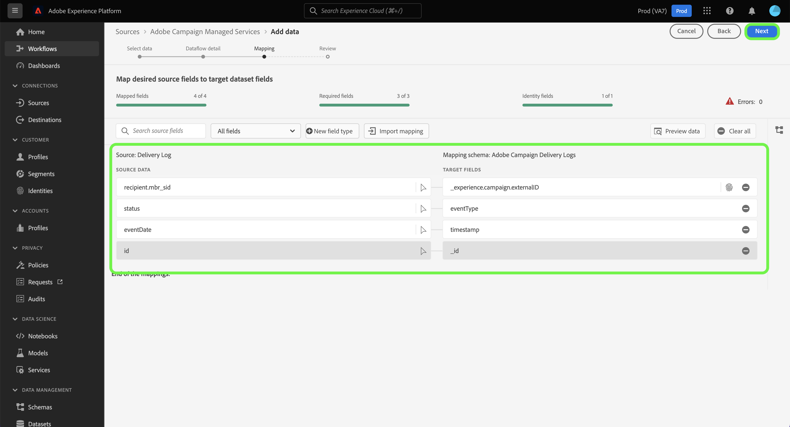

# Creare una connessione sorgente Adobe Campaign Managed Cloud Services tramite l’interfaccia utente di Platform

Questa esercitazione descrive i passaggi necessari per creare una connessione sorgente per trasferire i dati Adobe Campaign Managed Cloud Services a Adobe Experience Platform.

## Introduzione

Questa guida richiede una buona comprensione dei seguenti componenti dell’Experience Platform:

* [Origini](../../../../home.md): Platform consente di acquisire dati da varie sorgenti e allo stesso tempo di strutturare, etichettare e migliorare i dati in arrivo tramite i servizi di Platform.
* [[!DNL Experience Data Model (XDM)] Sistema](../../../../../xdm/home.md): Il framework standardizzato in base al quale l’Experience Platform organizza i dati sulla customer experience.
   * [Nozioni di base sulla composizione dello schema](../../../../../xdm/schema/composition.md): Scopri i blocchi di base degli schemi XDM, inclusi i principi chiave e le best practice nella composizione dello schema.
   * [Esercitazione sull’Editor di schema](../../../../../xdm/tutorials/create-schema-ui.md): Scopri come creare schemi personalizzati utilizzando l’interfaccia utente dell’Editor di schema.
* [Sandbox](../../../../../sandboxes/home.md): Platform fornisce sandbox virtuali che suddividono una singola istanza di Platform in ambienti virtuali separati per sviluppare e sviluppare applicazioni di esperienza digitale.

## Collegare Adobe Campaign Managed Cloud Services a Platform

Nell’interfaccia utente di Platform, seleziona **[!UICONTROL Origini]** dalla navigazione a sinistra per accedere al [!UICONTROL Origini] workspace. La [!UICONTROL Catalogo] in questa schermata vengono visualizzate diverse sorgenti con cui è possibile creare un account.

Puoi selezionare la categoria appropriata dal catalogo sul lato sinistro dello schermo. Puoi anche usare la barra di ricerca per limitare le sorgenti visualizzate.

Sotto la **[!UICONTROL Applicazioni di Adobe]** categoria, seleziona **[!UICONTROL Adobe Campaign Managed Cloud Services]** quindi seleziona **[!UICONTROL Aggiungi dati]**.

### Selezionare i dati {#select-data}

>[!CONTEXTUALHELP]
>id="platform_sources_campaign_instance"
>title="Istanza dell’ambiente Adobe Campaign"
>abstract="Nome dell’ambiente Adobe Campaign che desideri utilizzare."
>text="Learn more in documentation"

>[!CONTEXTUALHELP]
>id="platform_sources_campaign_mapping"
>title="Mappatura target"
>abstract="Le mappature target sono oggetti tecnici utilizzati da Campaign per consegnare i messaggi e contengono tutte le impostazioni tecniche necessarie per l’invio (indirizzi, numeri di telefono, indicatori di consenso, identificatori aggiuntivi e così via)."
>text="Learn more in documentation"

>[!CONTEXTUALHELP]
>id="platform_sources_campaign_schema"
>title="Nome dello schema"
>abstract="Nome dell’entità definita nel database di Adobe Campaign."
>text="Learn more in documentation"

La [!UICONTROL Seleziona dati] viene visualizzato un passaggio che fornisce un’interfaccia per configurare il [!UICONTROL Istanza Adobe Campaign], [!UICONTROL Mappatura del target]e [!UICONTROL Nome dello schema].

| Proprietà | Descrizione |
| --- | --- |
| Istanza Adobe Campaign | Nome dell’istanza dell’ambiente Adobe Campaign in uso. |
| Mappatura target | Gli oggetti tecnici utilizzati da Campaign per inviare i messaggi e contengono tutte le impostazioni tecniche necessarie per l’invio delle consegne. |
| Nome dello schema | Nome dell’entità schema che stai portando in Platform. Le opzioni includono Log di consegna e Registro di tracciamento. |

Dopo aver fornito i valori per l’istanza Campaign, la mappatura della destinazione e il nome dello schema, la schermata si aggiorna per visualizzare un’anteprima dello schema e un set di dati di esempio. Al termine, seleziona **[!UICONTROL Successivo]**.

### Utilizzare un set di dati esistente

La [!UICONTROL Dettaglio flusso di dati] consente di selezionare se si desidera utilizzare un set di dati esistente o configurarne uno nuovo per il flusso di dati.

Per utilizzare un set di dati esistente, seleziona **[!UICONTROL Set di dati esistente]**. Puoi recuperare un set di dati esistente utilizzando [!UICONTROL Ricerca avanzata] o scorrendo l’elenco dei set di dati esistenti nel menu a discesa.

Con un set di dati selezionato, fornisci un nome per il flusso di dati e una descrizione facoltativa.

### Utilizzare un nuovo set di dati

Per utilizzare un nuovo set di dati, seleziona **[!UICONTROL Nuovo set di dati]** e quindi fornisci il nome di un set di dati di output e una descrizione facoltativa. Quindi, seleziona uno schema a cui eseguire il mapping utilizzando [!UICONTROL Ricerca avanzata] oppure scorrendo l’elenco degli schemi esistenti nel menu a discesa. Al termine, seleziona **[!UICONTROL Successivo]**.

### Abilitare gli avvisi

Puoi abilitare gli avvisi per ricevere notifiche sullo stato del flusso di dati. Seleziona un avviso dall’elenco per iscriverti e ricevere notifiche sullo stato del flusso di dati. Per ulteriori informazioni sugli avvisi, consulta la guida su [iscrizione agli avvisi sorgente tramite l’interfaccia utente](../../alerts.md).

Al termine della fornitura dei dettagli al flusso di dati, seleziona **[!UICONTROL Successivo]**.

### Mappatura di campi dati su uno schema XDM

La [!UICONTROL Mappatura] viene visualizzato un passaggio che fornisce un&#39;interfaccia per mappare i campi di origine dallo schema di origine ai campi XDM di destinazione appropriati nello schema di destinazione.

Platform fornisce consigli intelligenti per i campi mappati automaticamente in base allo schema o al set di dati di destinazione selezionato. Puoi regolare manualmente le regole di mappatura in base ai tuoi casi d’uso. In base alle tue esigenze, puoi scegliere di mappare direttamente i campi oppure utilizzare le funzioni di preparazione dei dati per trasformare i dati di origine in valori calcolati o calcolati. Per i passaggi completi sull’utilizzo dell’interfaccia di mappatura e dei campi calcolati, consulta la sezione [Guida all’interfaccia utente della preparazione dei dati](../../../../../data-prep/ui/mapping.md).

>[!IMPORTANT]
>
>Quando mappi i campi di origine ai campi XDM di destinazione, assicurati di mappare il campo di identità principale designato al relativo campo XDM di destinazione appropriato.

Una volta mappati correttamente i dati di origine, seleziona **[!UICONTROL Successivo]**.

### Controlla il tuo flusso di dati

La **[!UICONTROL Revisione]** viene visualizzato un passaggio che consente di rivedere il nuovo flusso di dati prima della creazione. I dettagli sono raggruppati nelle seguenti categorie:

* **[!UICONTROL Connessione]**: Mostra il tipo di origine, il percorso pertinente del file di origine scelto e la quantità di colonne all&#39;interno del file di origine.
* **[!UICONTROL Assegna set di dati e campi mappa]**: Mostra il set di dati in cui vengono acquisiti i dati di origine, incluso lo schema a cui il set di dati aderisce.

Dopo aver esaminato il flusso di dati, seleziona **[!UICONTROL Fine]** e lascia un certo tempo per la creazione del flusso di dati.

### Monitorare l’attività del set di dati

Una volta creato il flusso di dati, puoi monitorare i dati che vengono acquisiti tramite di esso per visualizzare informazioni sulle percentuali di acquisizione e sui batch di successo e di errore.

Per iniziare a visualizzare l’attività del set di dati, seleziona **[!UICONTROL Flussi di dati]** nel catalogo origini.

Quindi, seleziona il set di dati di destinazione dall’elenco dei flussi di dati visualizzati.

Viene visualizzata la pagina dell’attività del set di dati. Da qui puoi vedere le informazioni sulle prestazioni del flusso di dati, tra cui il tasso di acquisizione, i batch di successo e i batch di errori.

Questa pagina fornisce anche un’interfaccia per aggiornare la descrizione dei metadati del flusso di dati, abilitare l’acquisizione parziale e la diagnostica degli errori e aggiungere nuovi dati al set di dati.

## Passaggi successivi

Seguendo questa esercitazione, hai creato correttamente un flusso di dati per portare i tuoi registri di consegna Campaign v8 e i dati dei registri di tracciamento in Platform. I dati in arrivo possono ora essere utilizzati dai servizi della piattaforma a valle, come [!DNL Real-Time Customer Profile] e [!DNL Data Science Workspace]. Per ulteriori informazioni, consulta i seguenti documenti:

* [Panoramica di [!DNL Real-Time Customer Profile]](../../../../../profile/home.md)
* [Panoramica di [!DNL Data Science Workspace]](../../../../../data-science-workspace/home.md)
