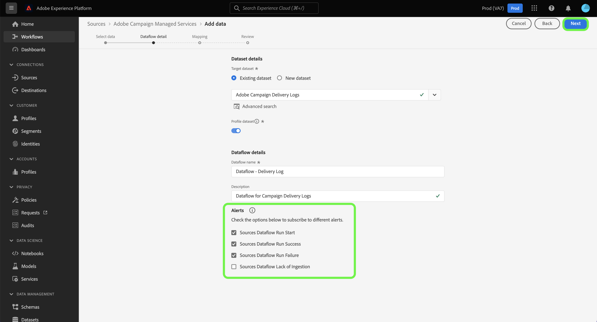

# Creare una connessione sorgente Adobe Campaign Managed Cloud Services tramite l’interfaccia utente di Platform

Questo tutorial illustra i passaggi necessari per creare una connessione di origine e trasferire i dati Adobe Campaign Managed Cloud Services in Adobe Experience Platform.

## Introduzione

Questa guida richiede una buona conoscenza dei seguenti componenti di Experience Platform:

* [Origini](../../../../home.md): Platform consente di acquisire dati da varie origini e allo stesso tempo di strutturare, etichettare e migliorare i dati in arrivo tramite i servizi Platform.
* [[!DNL Experience Data Model (XDM)] Sistema](../../../../../xdm/home.md): framework standardizzato in base al quale Experience Platform organizza i dati sull&#39;esperienza del cliente.
   * [Nozioni di base sulla composizione dello schema](../../../../../xdm/schema/composition.md): scopri i blocchi predefiniti di base degli schemi XDM, inclusi i principi chiave e le best practice nella composizione dello schema.
   * [Esercitazione sull&#39;editor di schemi](../../../../../xdm/tutorials/create-schema-ui.md): scopri come creare schemi personalizzati utilizzando l&#39;interfaccia utente dell&#39;editor di schemi.
* [Sandbox](../../../../../sandboxes/home.md): Platform fornisce sandbox virtuali che suddividono una singola istanza Platform in ambienti virtuali separati, utili per le attività di sviluppo e aggiornamento delle applicazioni di esperienza digitale.

## Connettere Adobe Campaign Managed Cloud Services a Platform

Nell&#39;interfaccia utente di Platform, seleziona **[!UICONTROL Origini]** dal menu di navigazione a sinistra per accedere all&#39;area di lavoro [!UICONTROL Origini]. Nella schermata [!UICONTROL Catalogo] sono visualizzate diverse origini con cui è possibile creare un account.

Puoi selezionare la categoria appropriata dal catalogo sul lato sinistro dello schermo. È inoltre possibile utilizzare la barra di ricerca per limitare le origini visualizzate.

Nella categoria **[!UICONTROL Adobe applications]**, selezionare **[!UICONTROL Adobe Campaign Managed Cloud Services]**, quindi **[!UICONTROL Aggiungi dati]**.

### Selezionare i dati {#select-data}

>[!CONTEXTUALHELP]
>id="platform_sources_campaign_instance"
>title="Istanza dell’ambiente Adobe Campaign"
>abstract="Nome dell’ambiente Adobe Campaign che desideri utilizzare."
>text="Learn more in documentation"

>[!CONTEXTUALHELP]
>id="platform_sources_campaign_mapping"
>title="Mappatura target"
>abstract="Le mappature target sono oggetti tecnici utilizzati da Campaign per consegnare i messaggi e contengono tutte le impostazioni tecniche necessarie per l’invio (indirizzi, numeri di telefono, indicatori di consenso, identificatori aggiuntivi e così via)."
>text="Learn more in documentation"

>[!CONTEXTUALHELP]
>id="platform_sources_campaign_schema"
>title="Nome dello schema"
>abstract="Nome dell’entità definita nel database di Adobe Campaign."
>text="Learn more in documentation"

Viene visualizzato il passaggio [!UICONTROL Seleziona dati] che fornisce un&#39;interfaccia per configurare la [!UICONTROL istanza Adobe Campaign], la [!UICONTROL mappatura Target] e il [!UICONTROL nome schema].

| Proprietà | Descrizione |
| --- | --- |
| istanza Adobe Campaign | Nome dell’istanza dell’ambiente Adobe Campaign in uso. |
| Mappatura target | Gli oggetti tecnici utilizzati da Campaign per consegnare i messaggi e contengono tutte le impostazioni tecniche necessarie per inviare le consegne. |
| Nome dello schema | Nome dell’entità schema che stai portando in Platform. Le opzioni includono registro di consegna e registro di tracciamento. |

Dopo aver fornito i valori per l’istanza Campaign, la mappatura del target e il nome dello schema, lo schermo si aggiorna per visualizzare un’anteprima dello schema e un set di dati di esempio. Al termine, selezionare **[!UICONTROL Avanti]**.

### Usa un set di dati esistente

La pagina [!UICONTROL Dettagli flusso di dati] consente di scegliere se utilizzare un set di dati esistente o configurarne uno nuovo per il flusso di dati.

Per utilizzare un set di dati esistente, selezionare **[!UICONTROL Set di dati esistente]**. Puoi recuperare un set di dati esistente utilizzando l&#39;opzione [!UICONTROL Ricerca avanzata] oppure scorrendo l&#39;elenco dei set di dati esistenti nel menu a discesa.

Con un set di dati selezionato, fornisci un nome per il flusso di dati e una descrizione facoltativa.

### Utilizza un nuovo set di dati

Per utilizzare un nuovo set di dati, selezionare **[!UICONTROL Nuovo set di dati]**, quindi specificare un nome per il set di dati di output e una descrizione facoltativa. Quindi, seleziona uno schema a cui mappare utilizzando l&#39;opzione [!UICONTROL Ricerca avanzata] o scorrendo l&#39;elenco degli schemi esistenti nel menu a discesa. Al termine, selezionare **[!UICONTROL Avanti]**.

### Abilita avvisi

Puoi abilitare gli avvisi per ricevere notifiche sullo stato del flusso di dati. Seleziona un avviso dall’elenco per iscriverti e ricevere notifiche sullo stato del flusso di dati. Per ulteriori informazioni sugli avvisi, consulta la guida su [abbonamento agli avvisi di origini tramite l&#39;interfaccia utente](../../alerts.md).

Dopo aver fornito i dettagli al flusso di dati, seleziona **[!UICONTROL Avanti]**.

### Mappare i campi dati su uno schema XDM

Viene visualizzato il passaggio [!UICONTROL Mappatura] che fornisce un&#39;interfaccia per mappare i campi sorgente dallo schema sorgente ai campi XDM di destinazione appropriati nello schema di destinazione.

Platform fornisce consigli intelligenti per campi mappati automaticamente in base allo schema o al set di dati di destinazione selezionato. Puoi regolare manualmente le regole di mappatura in base ai tuoi casi d’uso. In base alle tue esigenze, puoi scegliere di mappare i campi direttamente o utilizzare le funzioni di preparazione dati per trasformare i dati sorgente in modo da derivare valori calcolati o calcolati. Per i passaggi completi sull&#39;utilizzo dell&#39;interfaccia mapper e dei campi calcolati, consulta la [guida dell&#39;interfaccia utente della preparazione dati](../../../../../data-prep/ui/mapping.md).

>[!IMPORTANT]
>
>Quando mappi i campi sorgente ai campi XDM di destinazione, assicurati di mappare il campo identità principale designato al relativo campo XDM di destinazione appropriato.

Una volta mappati correttamente i dati di origine, seleziona **[!UICONTROL Avanti]**.

### Verifica il flusso di dati

Viene visualizzato il passaggio **[!UICONTROL Rivedi]**, che consente di rivedere il nuovo flusso di dati prima che venga creato. I dettagli sono raggruppati nelle seguenti categorie:

* **[!UICONTROL Connessione]**: mostra il tipo di origine, il percorso pertinente del file di origine scelto e la quantità di colonne all&#39;interno di tale file di origine.
* **[!UICONTROL Assegna set di dati e mappa i campi]**: mostra in quale set di dati vengono acquisiti i dati di origine, incluso lo schema a cui il set di dati aderisce.

Dopo aver rivisto il flusso di dati, seleziona **[!UICONTROL Fine]** e attendi che venga creato un po&#39; di tempo.

### Monitorare l’attività del set di dati

Una volta creato il flusso di dati, puoi monitorare i dati che vengono acquisiti tramite di esso per visualizzare informazioni sui tassi di acquisizione e sui batch riusciti e non riusciti.

Per iniziare a visualizzare l&#39;attività del set di dati, seleziona **[!UICONTROL Flussi di dati]** nel catalogo delle origini.

Quindi, seleziona il set di dati di destinazione dall’elenco dei flussi di dati visualizzati.

Viene visualizzata la pagina dell’attività del set di dati. Da qui puoi visualizzare informazioni sulle prestazioni del flusso di dati, tra cui il tasso di acquisizione, i batch riusciti e i batch non riusciti.

Questa pagina offre anche un’interfaccia per aggiornare la descrizione dei metadati del flusso di dati, abilitare l’acquisizione parziale e la diagnostica degli errori, nonché aggiungere nuovi dati al set di dati.

## Passaggi successivi

Seguendo questa esercitazione, hai creato correttamente un flusso di dati per portare i dati dei registri di consegna e di tracciamento di Campaign v8 su Platform. I dati in arrivo possono ora essere utilizzati dai servizi Platform a valle come [!DNL Real-Time Customer Profile] e [!DNL Data Science Workspace]. Per ulteriori informazioni, consulta i seguenti documenti:

* [Panoramica di [!DNL Real-Time Customer Profile]](../../../../../profile/home.md)
* [Panoramica di [!DNL Data Science Workspace]](../../../../../data-science-workspace/home.md)
