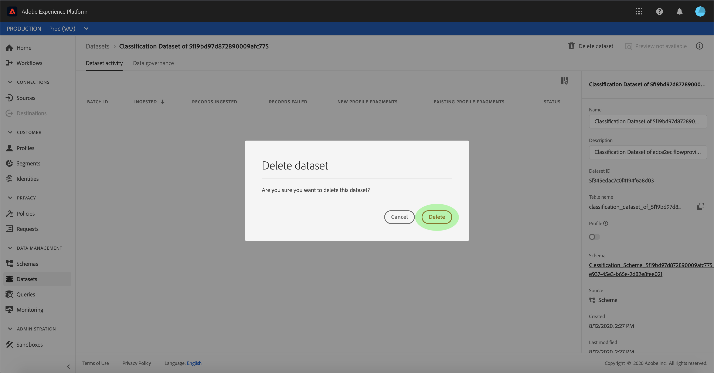

# Creare un connettore dati di classificazione Adobe Analytics  nell&#39;interfaccia utente

Questa esercitazione fornisce i passaggi per creare un connettore dati di classificazione Adobe Analytics  nell&#39;interfaccia utente per trasferire i dati di classificazione in Adobe Experience Platform.

## Introduzione

Questa esercitazione richiede una buona conoscenza dei seguenti componenti di Adobe Experience Platform:

* [[!DNL Experience Data Model (XDM) System]](../../../../../xdm/home.md): Il framework standard con cui  Experience Platform organizza i dati sull&#39;esperienza dei clienti.
* [[!DNL Profilo cliente in tempo reale]](../../../../../profile/home.md): Fornisce un profilo di consumo unificato e in tempo reale basato su dati aggregati provenienti da più origini.
* [[!DNL Sandbox]](../../../../../sandboxes/home.md):  Experience Platform fornisce sandbox virtuali che dividono una singola istanza della piattaforma in ambienti virtuali separati per sviluppare e sviluppare applicazioni per esperienze digitali.

## Seleziona le classificazioni

Accedete ad [Adobe Experience Platform](https://platform.adobe.com) , quindi selezionate **[!UICONTROL Sources]** dalla barra di navigazione a sinistra per accedere all&#39;area di lavoro delle origini. Nella **[!UICONTROL Catalog]** schermata sono visualizzate le sorgenti disponibili con cui creare connessioni in ingresso. Ogni scheda di origine mostra un&#39;opzione per configurare un nuovo account o aggiungere dati a un account esistente.

Potete selezionare la categoria appropriata dal catalogo sul lato sinistro dello schermo. In alternativa, è possibile trovare l&#39;origine specifica con cui si desidera lavorare utilizzando l&#39;opzione di ricerca.

Sotto la **[!UICONTROL Adobe applications]** categoria, selezionate la **[!UICONTROL Adobe Analytics]** scheda, quindi selezionate **[!UICONTROL Add data]** per iniziare a utilizzare i dati di classificazione di Analytics.

Viene **[!UICONTROL Analytics source add data]** visualizzato il passaggio. Selezionate **[!UICONTROL Classifications]** dall&#39;intestazione superiore per visualizzare un elenco dei [!DNL Classifications] set di dati, con informazioni sui **[!UICONTROL Dimension ID]**, **[!UICONTROL Report Suite name]** e **[!UICONTROL Report Suite ID]**.

Ogni pagina mostra fino a dieci [!DNL Classifications] set di dati diversi tra cui è possibile scegliere. Selezionate **[!UICONTROL Next]** nella parte inferiore della pagina per cercare ulteriori opzioni. Il pannello a destra mostra il numero totale di [!DNL Classifications] set di dati selezionati e i relativi nomi. Questo pannello consente inoltre di rimuovere eventuali [!DNL Classifications] set di dati selezionati per errore o di cancellare tutte le selezioni con una sola azione.

È possibile selezionare fino a 30 [!DNL Classifications] set di dati diversi da includere [!DNL Platform].

Dopo aver selezionato i [!DNL Classifications] set di dati, selezionarli **[!UICONTROL Next]** in alto a destra nella pagina.

## Verifica le classificazioni

Viene visualizzato il **[!UICONTROL Review]** passaggio che consente di rivedere i [!DNL Classifications] set di dati selezionati prima della creazione. I dettagli sono raggruppati nelle seguenti categorie:

* **[!UICONTROL Connection]**: Mostra la piattaforma di origine e lo stato della connessione.
* **[!UICONTROL Data type]**: Mostra il numero di persone selezionate [!DNL Classifications].
* **[!UICONTROL Scheduling]**: Mostra la frequenza della sincronizzazione per [!DNL Classifications] i dati.

Dopo aver rivisto il flusso di dati, fai clic su **[!UICONTROL Finish]** e consenti la creazione del flusso di dati.

## Monitorare ed eliminare il flusso di dati delle classificazioni

Una volta creato il flusso di dati, potete monitorare i dati che vengono acquisiti tramite di esso. Dalla **[!UICONTROL Catalog]** schermata, selezionate **[!UICONTROL Dataflows]** per visualizzare un elenco dei flussi definiti associati al vostro [!DNL Classifications] account.

Viene **[!UICONTROL Dataflows]** visualizzata la schermata. In questa pagina è presente un elenco di flussi di dati, con informazioni sul nome, i dati di origine e lo stato di esecuzione del flusso di dati. Sulla destra, è presente il **[!UICONTROL Properties]** pannello che contiene i metadati relativi al flusso di [!DNL Classifications] dati.

Selezionare l&#39; **[!UICONTROL Target dataset]** utente a cui accedere.

Nella **[!UICONTROL Dataset activity]** pagina sono visualizzate informazioni sul set di dati di destinazione selezionato, con dettagli sullo stato del batch, l’ID del set di dati e lo schema. Selezionare **[!UICONTROL Delete dataset]** per eliminare.

Viene visualizzata una finestra di dialogo per confermare l’eliminazione. Selezionare **[!UICONTROL Delete]** per completare.

## Passaggi successivi

Seguendo questa esercitazione, hai creato un connettore dati di classificazione di Analytics che inserisce [!DNL Classifications] i dati in [!DNL Platform]. Per ulteriori informazioni su [!DNL Analytics] e [!DNL Classifications] dati, consulta i documenti seguenti:

* [Panoramica del connettore dati di Analytics](../../../../connectors/adobe-applications/analytics.md)
* [Creare un connettore dati di Analytics nell&#39;interfaccia utente](./analytics.md)
* [Informazioni sulle classificazioni](https://docs.adobe.com/content/help/en/analytics/components/classifications/c-classifications.html#)