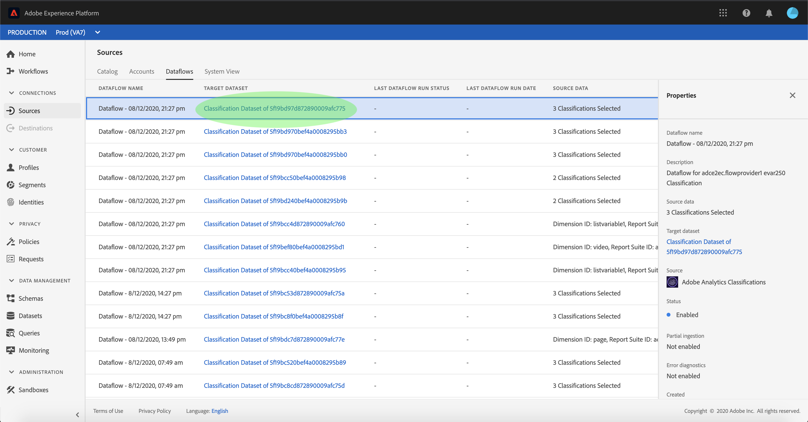

# Creare una connessione sorgente Adobe Analytics per i dati di classificazione nell’interfaccia utente

Questa esercitazione fornisce passaggi per creare una connessione all’origine dati Adobe Analytics Classifications nell’interfaccia utente per inserire i dati delle classificazioni in Adobe Experience Platform.

## Introduzione

Questa esercitazione richiede una buona comprensione dei seguenti componenti di Adobe Experience Platform:

* [[!DNL Experience Data Model (XDM)] Sistema](../../../../../xdm/home.md): Il framework standardizzato in base al quale l’Experience Platform organizza i dati sulla customer experience.
* [[!DNL Real-Time Customer Profile]](../../../../../profile/home.md): Fornisce un profilo di consumatore unificato e in tempo reale basato su dati aggregati provenienti da più origini.
* [[!DNL Sandboxes]](../../../../../sandboxes/home.md): Experience Platform fornisce sandbox virtuali che suddividono una singola istanza di Platform in ambienti virtuali separati per sviluppare e sviluppare applicazioni di esperienza digitale.

Il connettore dati per le classificazioni di Analytics richiede la migrazione dei dati al nuovo [!DNL Classifications] infrastruttura di Adobe Analytics prima dell’utilizzo. Per confermare lo stato di migrazione dei dati, contatta il team dell’account di Adobe.

## Seleziona le classificazioni

Accedi a [Adobe Experience Platform](https://platform.adobe.com) quindi seleziona **[!UICONTROL Origini]** dalla barra di navigazione a sinistra per accedere all’area di lavoro origini. La **[!UICONTROL Catalogo]** vengono visualizzate le sorgenti disponibili con cui creare connessioni in entrata. Ogni scheda sorgente mostra un&#39;opzione per configurare un nuovo account o aggiungere dati a un account esistente.

Puoi selezionare la categoria appropriata dal catalogo sul lato sinistro dello schermo. In alternativa, è possibile trovare la sorgente specifica con cui si desidera lavorare utilizzando l’opzione di ricerca.

Sotto la **[!UICONTROL Applicazioni di Adobe]** seleziona la categoria **[!UICONTROL Adobe Analytics]** scheda e quindi seleziona **[!UICONTROL Aggiungi dati]** per iniziare a lavorare con i dati delle classificazioni di Analytics.

La **[!UICONTROL Aggiungere dati alla sorgente di Analytics]** viene visualizzato il passaggio . Seleziona **[!UICONTROL Classificazioni]** dall’intestazione superiore per visualizzare un elenco di [!DNL Classifications] set di dati, comprese informazioni sull’ID dimensione, il nome della suite di rapporti e l’ID della suite di rapporti.

Ogni pagina viene visualizzata fino a dieci diverse [!DNL Classifications] set di dati tra cui è possibile scegliere. Seleziona **[!UICONTROL Successivo]** nella parte inferiore della pagina per ulteriori opzioni. Il pannello a destra mostra il numero totale di [!DNL Classifications] set di dati selezionati e relativi nomi. Questo pannello consente inoltre di rimuovere [!DNL Classifications] set di dati selezionati per errore o cancellare tutte le selezioni con un’unica azione.

Puoi selezionare fino a 30 diversi [!DNL Classifications] set di dati da inserire in [!DNL Platform].

Una volta selezionato il [!DNL Classifications] set di dati, seleziona **[!UICONTROL Successivo]** in alto a destra nella pagina.

## Esamina le classificazioni

La **[!UICONTROL Revisione]** viene visualizzato un passaggio che consente di rivedere il [!DNL Classifications] set di dati prima della creazione. I dettagli sono raggruppati nelle seguenti categorie:

* **[!UICONTROL Connessione]**: Mostra la piattaforma di origine e lo stato della connessione.
* **[!UICONTROL Tipo di dati]**: Mostra il numero di selezionati [!DNL Classifications].
* **[!UICONTROL Pianificazione]**: Mostra la frequenza di sincronizzazione per [!DNL Classifications] dati.

Dopo aver esaminato il flusso di dati, fai clic su **[!UICONTROL Fine]** e lascia un certo tempo per la creazione del flusso di dati.

## Monitora il flusso di dati delle classificazioni

Una volta creato il flusso di dati, puoi monitorare i dati che vengono acquisiti tramite di esso. Da **[!UICONTROL Catalogo]** schermata, seleziona **[!UICONTROL Flussi di dati]** per visualizzare un elenco dei flussi stabiliti associati al [!DNL Classifications] conto.

La **[!UICONTROL Flussi di dati]** viene visualizzata la schermata . In questa pagina è riportato un elenco di flussi di dati, con informazioni sul nome, i dati di origine e lo stato di esecuzione del flusso di dati. Sulla destra, è la **[!UICONTROL Proprietà]** pannello che contiene i metadati relativi al [!DNL Classifications] flusso di dati.

Seleziona la **[!UICONTROL Set di dati di Target]** desidera accedere.

La **[!UICONTROL Attività set di dati]** in questa pagina sono visualizzate informazioni sul set di dati di destinazione selezionato, compresi dettagli sullo stato batch, l’ID del set di dati e lo schema.

>[!IMPORTANT]
>
>L’eliminazione dei set di dati è possibile per altri connettori di origine, tuttavia al momento non è supportato per il connettore dati per le classificazioni di Analytics. Se elimini un set di dati per errore, contatta l’Assistenza clienti Adobe.

## Passaggi successivi

Seguendo questa esercitazione, hai creato un connettore dati delle classificazioni di Analytics che porta [!DNL Classifications] dati [!DNL Platform]. Per ulteriori informazioni, consulta i seguenti documenti [!DNL Analytics] e [!DNL Classifications] dati:

* [Panoramica del connettore dati di Analytics](../../../../connectors/adobe-applications/analytics.md)
* [Creare una connessione dati di Analytics nell’interfaccia utente](./analytics.md)
* [Informazioni sulle classificazioni](https://experienceleague.adobe.com/docs/analytics/components/classifications/c-classifications.html?lang=it)
