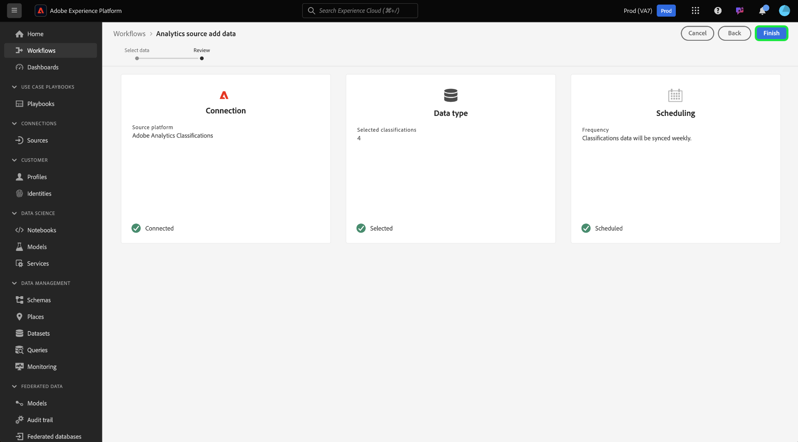

# Creare una connessione di origine di Adobe Analytics per i dati di classificazione nell’interfaccia utente

Questo tutorial descrive i passaggi necessari per creare una connessione a un’origine dati per le classificazioni di Adobe Analytics nell’interfaccia utente per inserire i dati delle classificazioni in Adobe Experience Platform.

## Introduzione

Questo tutorial richiede una buona conoscenza dei seguenti componenti di Adobe Experience Platform:

* [[!DNL Experience Data Model (XDM)] Sistema](../../../../../xdm/home.md): framework standardizzato in base al quale Experience Platform organizza i dati sull&#39;esperienza del cliente.
* [[!DNL Real-Time Customer Profile]](../../../../../profile/home.md): fornisce un profilo consumer unificato e in tempo reale basato su dati aggregati provenienti da più origini.
* [[!DNL Sandboxes]](../../../../../sandboxes/home.md): Experience Platform fornisce sandbox virtuali che permettono di suddividere una singola istanza Platform in ambienti virtuali separati, utili per le attività di sviluppo e aggiornamento delle applicazioni di esperienza digitale.

Il Connettore dati classificazioni di Analytics richiede la migrazione dei dati nella nuova infrastruttura [!DNL Classifications] di Adobe Analytics prima dell&#39;utilizzo. Per confermare lo stato di migrazione dei tuoi dati, contatta il team del tuo account di Adobe.

## Seleziona le classificazioni

Accedi a [Adobe Experience Platform](https://platform.adobe.com), quindi seleziona **[!UICONTROL Origini]** dalla barra di navigazione a sinistra per accedere all&#39;area di lavoro origini. Nella schermata **[!UICONTROL Catalogo]** sono visualizzate le origini disponibili per la creazione di connessioni in entrata con. Ogni scheda sorgente mostra un’opzione per configurare un nuovo account o aggiungere dati a un account esistente.

Puoi selezionare la categoria appropriata dal catalogo sul lato sinistro dello schermo. In alternativa, è possibile trovare l’origine specifica con cui si desidera lavorare utilizzando l’opzione di ricerca.

Nella categoria **[!UICONTROL Adobe applications]**, seleziona la scheda **[!UICONTROL Adobe Analytics]**, quindi seleziona **[!UICONTROL Aggiungi dati]** per iniziare a utilizzare i dati delle classificazioni di Analytics.

Viene visualizzato il passaggio **[!UICONTROL Aggiungi dati origine Analytics]**. Seleziona **[!UICONTROL Classificazioni]** dall&#39;intestazione superiore per visualizzare un elenco di [!DNL Classifications] set di dati, incluse informazioni sull&#39;ID dimensione, il nome suite di rapporti e l&#39;ID suite di rapporti.

Ogni pagina mostra fino a dieci diversi [!DNL Classifications] set di dati tra cui è possibile scegliere. Seleziona **[!UICONTROL Avanti]** nella parte inferiore della pagina per cercare altre opzioni. Il pannello a destra mostra il numero totale di [!DNL Classifications] set di dati selezionati e i relativi nomi. Questo pannello consente inoltre di rimuovere [!DNL Classifications] set di dati selezionati per errore o di cancellare tutte le selezioni con una sola azione.

È possibile selezionare fino a 30 set di dati [!DNL Classifications] diversi da portare in [!DNL Platform].

Dopo aver selezionato i [!DNL Classifications] set di dati, seleziona **[!UICONTROL Successivo]** in alto a destra della pagina.

## Rivedere le classificazioni

Viene visualizzato il passaggio **[!UICONTROL Rivedi]**, che consente di rivedere i [!DNL Classifications] set di dati selezionati prima che vengano creati. I dettagli sono raggruppati nelle seguenti categorie:

* **[!UICONTROL Connessione]**: mostra la piattaforma di origine e lo stato della connessione.
* **[!UICONTROL Tipo di dati]**: mostra il numero di [!DNL Classifications] selezionati.
* **[!UICONTROL Pianificazione]**: mostra la frequenza di sincronizzazione per i dati [!DNL Classifications].

Dopo aver rivisto il flusso di dati, fai clic su **[!UICONTROL Fine]** e attendi un po&#39; di tempo per la creazione del flusso di dati.

## Monitorare il flusso di dati delle classificazioni

Una volta creato il flusso di dati, puoi monitorare i dati che vengono acquisiti tramite di esso. Dalla schermata **[!UICONTROL Catalogo]**, seleziona **[!UICONTROL Flussi dati]** per visualizzare un elenco dei flussi stabiliti associati al tuo account [!DNL Classifications].

Viene visualizzata la schermata **[!UICONTROL Flussi dati]**. In questa pagina è riportato un elenco di flussi di dati, con informazioni sul nome, i dati di origine e lo stato di esecuzione del flusso di dati. A destra è il pannello **[!UICONTROL Proprietà]** che contiene i metadati relativi al flusso di dati [!DNL Classifications].

Seleziona il **[!UICONTROL set di dati di destinazione]** a cui desideri accedere.

Nella pagina **[!UICONTROL Attività set di dati]** sono visualizzate informazioni sul set di dati di destinazione selezionato, inclusi dettagli sullo stato del batch, sull&#39;ID del set di dati e sullo schema.

## Passaggi successivi

Seguendo questa esercitazione, hai creato un connettore dati per le classificazioni di Analytics che porta [!DNL Classifications] dati in [!DNL Platform]. Per ulteriori informazioni sui dati di [!DNL Analytics] e [!DNL Classifications], vedere i seguenti documenti:

* [Panoramica del connettore dati di Analytics](../../../../connectors/adobe-applications/analytics.md)
* [Creare una connessione dati di Analytics nell’interfaccia utente](./analytics.md)
* [Informazioni sulle classificazioni](https://experienceleague.adobe.com/docs/analytics/components/classifications/c-classifications.html)
