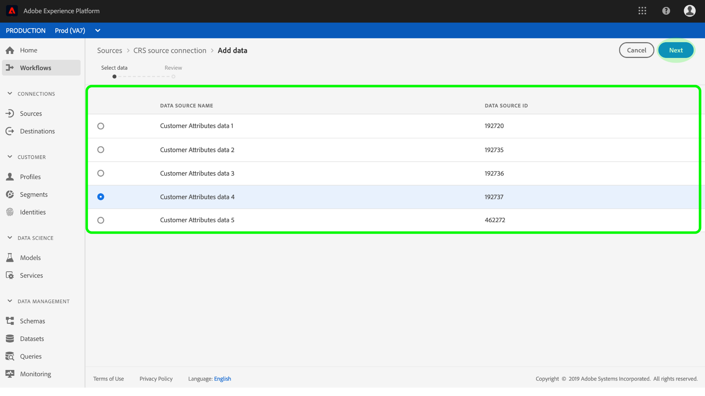

# Creare un connettore di origine attributi cliente nell&#39;interfaccia utente

Questa esercitazione fornisce i passaggi per la creazione di un connettore di origine nell&#39;interfaccia utente per la raccolta dei dati di profilo degli attributi del cliente in Adobe Experience Platform. Per ulteriori informazioni sugli attributi del cliente, consultate il documento della panoramica.

## Creazione di una connessione di origine

Accedete ad [Adobe Experience Platform](https://platform.adobe.com) , quindi selezionate **[!UICONTROL Sources]** dalla barra di navigazione a sinistra per accedere all&#39;area di lavoro delle origini. Nella **[!UICONTROL Catalog]** schermata sono visualizzate le origini disponibili con cui creare connessioni in ingresso e ogni origine mostra il numero di connessioni esistenti ad esse associate. Selezionare l&#39;opzione per **[!UICONTROL Customer Attributes]** e quindi **[!UICONTROL Add data]**. Se la connessione viene stabilita, l&#39;utente verrà reindirizzato se la connessione viene stabilita correttamente.

>[!NOTE]
>
>Se hai già stabilito un connettore di origine per i dati di profilo degli attributi del cliente, l&#39;opzione per connettersi all&#39;origine verrà disabilitata.

Nella schermata Attività *di* origine sono elencate tutte le connessioni precedentemente stabilite per i dati di profilo degli attributi cliente. È possibile creare una nuova connessione facendo clic su **Seleziona dati**.

>[!NOTE]
>
>È possibile creare più connessioni in entrata a un&#39;origine per inserire dati diversi.

Dall&#39;elenco dei set di dati di profilo di attributi cliente disponibili, selezionate quello in cui desiderate inserire [!DNL Platform] e fate clic su **Avanti**.

>[!NOTE]
>
>È possibile selezionare un solo set di dati per connessione di origine attributi cliente.

Viene visualizzato il passaggio *Revisione* , che consente di controllare la nuova connessione in ingresso prima della creazione. I dettagli della connessione sono raggruppati per categorie, tra cui:

* *Dettagli* origine: Mostra il tipo di connessione di origine e i dati di origine selezionati.
* *Dettagli* di destinazione: Quando si creano altri connettori di origine, questo contenitore mostra in quale set di dati di origine vengono acquisiti i dati, incluso lo schema a cui il dataset aderisce. I dati del profilo degli attributi del cliente vengono mappati automaticamente e assimilati in profili cliente in tempo reale.

## Passaggi successivi

Una volta creata la connessione, vengono automaticamente creati uno schema di destinazione e un set di dati per contenere i dati in arrivo. Al termine dell&#39;assimilazione iniziale, i dati del profilo degli attributi del cliente possono essere utilizzati dai [!DNL Platform] servizi a valle quali [!DNL Real-time Customer Profile] e [!DNL Segmentation Service]. Per ulteriori informazioni, consulta i documenti seguenti:

* [[!DNL Real-time Customer Profile] panoramica](../../../../../profile/home.md)
* [[!DNL Segmentation Service] panoramica](../../../../../segmentation/home.md)
