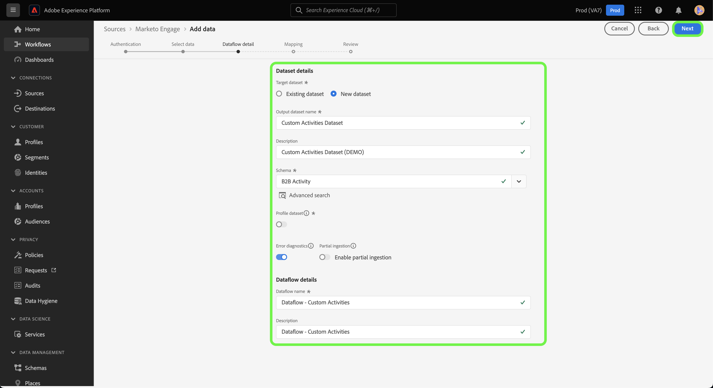

# Crea un [!DNL Marketo Engage] connessione di origine e flusso di dati per i dati di attività personalizzati nell’interfaccia utente

>[!NOTE]
>
>Questa esercitazione fornisce passaggi specifici su come impostare e visualizzare **attività personalizzata** dati da [!DNL Marketo] all&#39;Experience Platform. Per i passaggi su come portare **attività standard** dati, leggi [[!DNL Marketo] Guida all’interfaccia utente](./marketo.md).

Oltre a [attività standard](../../../../connectors/adobe-applications/mapping/marketo.md#activities), puoi inoltre utilizzare la funzione [!DNL Marketo] origine per importare dati di attività personalizzate in Adobe Experience Platform. Questo documento fornisce passaggi su come creare una connessione di origine e un flusso di dati per i dati di attività personalizzati utilizzando [!DNL Marketo] nell’interfaccia utente di .

## Introduzione

Questa esercitazione richiede una buona comprensione dei seguenti componenti di Adobe Experience Platform:

* [Utility di generazione automatica di spazi dei nomi B2B e schemi](../../../../connectors/adobe-applications/marketo/marketo-namespaces.md): L&#39;utility di generazione automatica dei namespace B2B e dello schema consente di utilizzare [!DNL Postman] generare automaticamente valori per i namespace e gli schemi B2B. Devi prima completare i namespace e gli schemi B2B prima di creare un [!DNL Marketo] connessione di origine e flusso di dati.
* [Origini](../../../../home.md): L’Experience Platform consente di acquisire dati da varie sorgenti e allo stesso tempo di strutturare, etichettare e migliorare i dati in arrivo tramite i servizi Platform.
* [Experience Data Model (XDM)](../../../../../xdm/home.md): Il framework standardizzato in base al quale l’Experience Platform organizza i dati sulla customer experience.
   * [Creare e modificare schemi nell’interfaccia utente](../../../../../xdm/ui/resources/schemas.md): Scopri come creare e modificare schemi nell’interfaccia utente di .
* [Namespace Identity](../../../../../identity-service/namespaces.md): Gli spazi dei nomi di identità sono un componente di [!DNL Identity Service] che fungono da indicatori del contesto a cui si riferisce un&#39;identità. Un&#39;identità completa include un valore ID e uno spazio dei nomi.
* [[!DNL Real-Time Customer Profile]](/help/profile/home.md): Fornisce un profilo di consumatore unificato e in tempo reale basato su dati aggregati provenienti da più origini.
* [Sandbox](../../../../../sandboxes/home.md): Experience Platform fornisce sandbox virtuali che suddividono una singola istanza di Platform in ambienti virtuali separati per sviluppare e sviluppare applicazioni di esperienza digitale.

## Recupera i dettagli dell’attività personalizzata

Il primo passaggio per l’inserimento di dati di attività personalizzati da [!DNL Marketo] ad Experience Platform, recupera il nome API e il nome visualizzato dell’attività personalizzata.

Accedi al tuo account utilizzando [[!DNL Marketo]](https://app-sjint.marketo.com/#MM0A1) interfaccia. Nella navigazione a sinistra, sotto [!DNL Database Management], seleziona **Attività personalizzate Marketo**.

L’interfaccia si aggiorna e visualizza le attività personalizzate, con informazioni sui rispettivi nomi visualizzati e nomi API. Puoi anche utilizzare la barra a destra per selezionare e visualizzare altre attività personalizzate dal tuo account.

Seleziona **Campi** dall’intestazione superiore per visualizzare i campi associati all’attività personalizzata. In questa pagina puoi visualizzare i nomi, i nomi API, le descrizioni e i tipi di dati dei campi nell’attività personalizzata. I dettagli relativi ai singoli campi verranno utilizzati in un passaggio successivo, durante la creazione di uno schema.

## Configurazione di gruppi di campi per attività personalizzate nello schema delle attività B2B

In *[!UICONTROL Schemi]* dashboard dell’interfaccia utente di Experience Platform, seleziona **[!UICONTROL Sfoglia]** quindi seleziona **[!UICONTROL Attività B2B]** dall’elenco degli schemi.

>[!TIP]
>
>Utilizza la barra di ricerca per velocizzare la navigazione attraverso l’elenco degli schemi.

### Crea un nuovo gruppo di campi per l’attività personalizzata

Quindi, aggiungi un nuovo gruppo di campi al [!DNL B2B Activity] schema. Questo gruppo di campi deve corrispondere all’attività personalizzata da acquisire e deve utilizzare il nome visualizzato dell’attività personalizzata recuperato in precedenza.

Per aggiungere un nuovo gruppo di campi, selezionare **[!UICONTROL + Aggiungi]** accanto al *[!UICONTROL Gruppi di campi]* pannello sotto *[!UICONTROL Composizione]*.

La *[!UICONTROL Aggiungi gruppi di campi]* viene visualizzata la finestra . Seleziona **[!UICONTROL Crea nuovo gruppo di campi]** quindi fornisci lo stesso nome visualizzato per l’attività personalizzata recuperata in un passaggio precedente e una descrizione facoltativa per il nuovo gruppo di campi. Al termine, seleziona **[!UICONTROL Aggiungi gruppi di campi]**.

Una volta creato, il nuovo gruppo di campi per l’attività personalizzata viene visualizzato in [!UICONTROL Gruppi di campi] catalogo.

### Aggiungere un nuovo campo alla struttura dello schema

Quindi, aggiungi un nuovo campo allo schema. Questo nuovo campo deve essere impostato su `type: object` e conterrà i singoli campi dell’attività personalizzata.

Per aggiungere un nuovo campo, seleziona il segno più (`+`) accanto al nome dello schema. Una voce per *[!UICONTROL Campo senza titolo | Tipo]* appare. Quindi, configura le proprietà del campo utilizzando *[!UICONTROL Proprietà campo]* pannello. Imposta il nome del campo come nome dell’API dell’attività personalizzata e imposta il nome visualizzato come nome visualizzato dell’attività personalizzata. Quindi, imposta il tipo come `object` e assegna il gruppo di campi al gruppo di campi di attività personalizzati creato nel passaggio precedente. Al termine, seleziona **[!UICONTROL Applica]**.

Il nuovo campo viene visualizzato nello schema.

### Aggiungere campi secondari al campo oggetto {#add-sub-fields-to-the-object-field}

L’ultimo passaggio nella preparazione dello schema consiste nell’aggiungere all’interno del campo i singoli campi creati nel passaggio precedente.

## Creare un flusso di dati

Al termine della configurazione dello schema, ora puoi procedere alla creazione di un flusso di dati per i dati dell’attività personalizzata.

Nell’interfaccia utente di Platform, seleziona **[!UICONTROL Origini]** dalla barra di navigazione a sinistra per accedere al [!UICONTROL Origini] workspace. La [!UICONTROL Catalogo] in viene visualizzata una varietà di sorgenti con cui è possibile creare un account.

Puoi selezionare la categoria appropriata dal catalogo sul lato sinistro dello schermo. In alternativa, è possibile trovare la sorgente specifica con cui si desidera lavorare utilizzando la barra di ricerca.

Sotto la [!UICONTROL Applicazioni di Adobe] categoria, seleziona **[!UICONTROL Marketo Engage]**. Quindi, seleziona **[!UICONTROL Aggiungi dati]** per creare una nuova [!DNL Marketo] flusso di dati.

### Selezionare i dati

Seleziona **[!UICONTROL Attività]** dall&#39;elenco di [!DNL Marketo] set di dati e seleziona **[!UICONTROL Successivo]**.

### Dettaglio del flusso di dati

Successivamente, [fornire informazioni per il flusso di dati](./marketo.md#provide-dataflow-details), inclusi nomi e descrizioni per il set di dati e il flusso di dati, lo schema da utilizzare e le configurazioni per [!DNL Profile] acquisizione, diagnostica degli errori e acquisizione parziale.

### Mappatura

Le mappature per i campi di attività standard vengono compilate automaticamente, ma i campi di attività personalizzati devono essere mappati manualmente sui corrispondenti campi di destinazione.

Per iniziare a mappare i campi di attività personalizzati, seleziona **[!UICONTROL Nuovo tipo di campo]** quindi seleziona **[!UICONTROL Aggiungi nuovo campo]**.

Passa alla struttura dati di origine e trova il campo attività personalizzato che desideri acquisire. Al termine, seleziona **[!UICONTROL Seleziona]**.

>[!TIP]
>
>Per evitare confusione e gestire nomi di campo duplicati, i campi di attività personalizzati hanno il prefisso del nome API.

Per aggiungere un campo di destinazione, seleziona l’icona dello schema  quindi seleziona i campi di attività personalizzati dallo schema di destinazione.

Ripeti i passaggi per aggiungere il resto dei campi di mappatura attività personalizzati. Al termine, seleziona **[!UICONTROL Successivo]**.

### Revisione

La *[!UICONTROL Revisione]* viene visualizzato un passaggio che consente di rivedere il nuovo flusso di dati prima della creazione. I dettagli sono raggruppati nelle seguenti categorie:

* **[!UICONTROL Connessione]**: Mostra il tipo di origine, il percorso pertinente dell&#39;entità di origine selezionata e la quantità di colonne all&#39;interno dell&#39;entità di origine.
* **[!UICONTROL Assegna set di dati e campi mappa]**: Mostra il set di dati in cui vengono acquisiti i dati di origine, incluso lo schema a cui il set di dati aderisce.

Dopo aver esaminato il flusso di dati, seleziona **[!UICONTROL Salva e acquisisci]** e lascia un certo tempo per la creazione del flusso di dati.

>[!NOTE]
>
>Una volta completata l’acquisizione, il set di dati acquisito conterrà tutte le attività, incluse quelle standard e personalizzate dal tuo [!DNL Marketo] istanza. Per selezionare i record di attività personalizzati in Platform, devi utilizzare [Servizio query](../../../../../query-service/home.md) e fornire i predicati appropriati.

## Passaggi successivi

Seguendo questa esercitazione, hai impostato uno schema Platform per [!DNL Marketo] i dati personalizzati dell’attività e creato un flusso di dati per portarli in Platform. Per informazioni generali sul [!DNL Marketo] sorgente, leggi [[!DNL Marketo] panoramica di origine](../../../../connectors/adobe-applications/marketo/marketo.md).