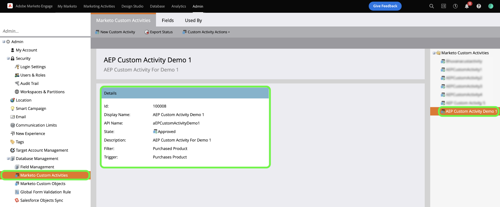
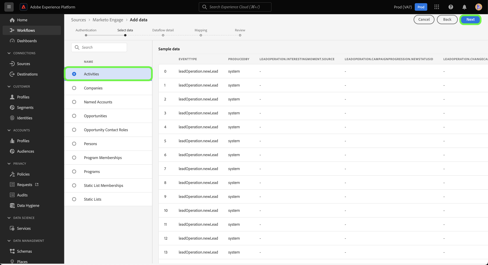
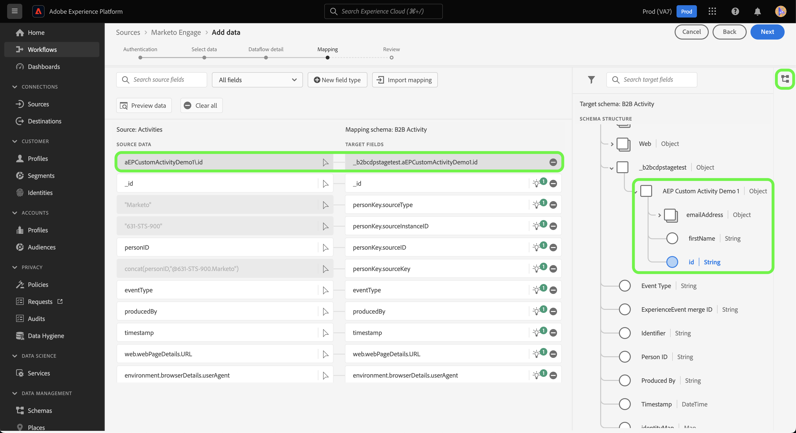

# Crea una connessione di origine [!DNL Marketo Engage] e un flusso di dati per i dati di attività personalizzati nell&#39;interfaccia utente

>[!NOTE]
>
>Questa esercitazione fornisce passaggi specifici su come impostare e portare all&#39;Experience Platform **dati attività personalizzati** da [!DNL Marketo]. Per i passaggi su come portare i dati di **attività standard**, consulta la [[!DNL Marketo] guida dell&#39;interfaccia utente](./marketo.md).

Oltre alle [attività standard](../../../../connectors/adobe-applications/mapping/marketo.md#activities), puoi anche utilizzare l&#39;origine [!DNL Marketo] per inserire dati di attività personalizzati in Adobe Experience Platform. In questo documento vengono descritti i passaggi necessari per creare una connessione di origine e un flusso di dati per i dati delle attività personalizzate utilizzando l&#39;origine [!DNL Marketo] nell&#39;interfaccia utente.

## Introduzione

Questo tutorial richiede una buona conoscenza dei seguenti componenti di Adobe Experience Platform:

* [Spazi dei nomi B2B e utilità di generazione automatica dello schema](../../../../connectors/adobe-applications/marketo/marketo-namespaces.md): gli spazi dei nomi B2B e l&#39;utilità di generazione automatica dello schema consentono di utilizzare [!DNL Postman] per generare automaticamente i valori per gli spazi dei nomi B2B e gli schemi. Prima di creare una connessione di origine e un flusso di dati [!DNL Marketo], è necessario completare gli spazi dei nomi e gli schemi B2B.
* [Origini](../../../../home.md): Experience Platform consente di acquisire dati da varie origini e allo stesso tempo di strutturare, etichettare e migliorare i dati in arrivo tramite i servizi di Platform.
* [Experience Data Model (XDM)](../../../../../xdm/home.md): framework standardizzato in base al quale Experience Platform organizza i dati sull&#39;esperienza del cliente.
   * [Creare e modificare gli schemi nell&#39;interfaccia utente](../../../../../xdm/ui/resources/schemas.md): scopri come creare e modificare gli schemi nell&#39;interfaccia utente.
* [Spazi dei nomi di identità](../../../../../identity-service/features/namespaces.md): gli spazi dei nomi di identità sono un componente di [!DNL Identity Service] che fungono da indicatori del contesto a cui si riferisce un&#39;identità. Un’identità completa include un valore ID e uno spazio dei nomi.
* [[!DNL Real-Time Customer Profile]](/help/profile/home.md): fornisce un profilo consumer unificato e in tempo reale basato su dati aggregati provenienti da più origini.
* [Sandbox](../../../../../sandboxes/home.md): Experience Platform fornisce sandbox virtuali che suddividono una singola istanza Platform in ambienti virtuali separati, utili per le attività di sviluppo e aggiornamento delle applicazioni di esperienza digitale.

## Recuperare i dettagli dell’attività personalizzata

Il primo passaggio per portare i dati delle attività personalizzate da [!DNL Marketo] a Experience Platform consiste nel recuperare il nome API e il nome visualizzato dell&#39;attività personalizzata.

Accedi al tuo account utilizzando l&#39;interfaccia [[!DNL Marketo]](https://app-sjint.marketo.com/#MM0A1). Nel menu di navigazione a sinistra, in [!DNL Database Management], seleziona **Attività personalizzate Marketo**.

L’interfaccia viene aggiornata con una visualizzazione delle attività personalizzate, che include informazioni sui rispettivi nomi visualizzati e nomi API. Puoi anche utilizzare la barra a destra per selezionare e visualizzare altre attività personalizzate dal tuo account.



Seleziona **Campi** dall&#39;intestazione superiore per visualizzare i campi associati all&#39;attività personalizzata. In questa pagina puoi visualizzare i nomi, i nomi API, le descrizioni e i tipi di dati dei campi nell’attività personalizzata. I dettagli relativi ai singoli campi verranno utilizzati in un passaggio successivo, durante la creazione di uno schema.


## Impostare gruppi di campi per attività personalizzate nello schema delle attività B2B

Nel dashboard *[!UICONTROL Schemi]* dell&#39;interfaccia utente di Experience Platform, seleziona **[!UICONTROL Sfoglia]**, quindi seleziona **[!UICONTROL Attività B2B]** dall&#39;elenco degli schemi.

>[!TIP]
>
>Utilizza la barra di ricerca per accelerare la navigazione nell’elenco degli schemi.


### Crea un nuovo gruppo di campi per l’attività personalizzata

Aggiungere quindi un nuovo gruppo di campi allo schema [!DNL B2B Activity]. Questo gruppo di campi deve corrispondere all’attività personalizzata che desideri acquisire e deve utilizzare il nome visualizzato dell’attività personalizzata recuperato in precedenza.

Per aggiungere un nuovo gruppo di campi, selezionare **[!UICONTROL + Aggiungi]** accanto al pannello *[!UICONTROL Gruppi di campi]* in *[!UICONTROL Composizione]*.


Viene visualizzata la finestra *[!UICONTROL Aggiungi gruppi di campi]*. Selezionare **[!UICONTROL Crea nuovo gruppo di campi]**, quindi fornire lo stesso nome visualizzato per l&#39;attività personalizzata recuperata in un passaggio precedente e fornire una descrizione facoltativa per il nuovo gruppo di campi. Al termine, selezionare **[!UICONTROL Aggiungi gruppi di campi]**.


Una volta creato, il nuovo gruppo di campi per l&#39;attività personalizzata viene visualizzato nel catalogo [!UICONTROL Gruppi di campi].


### Aggiungere un nuovo campo alla struttura dello schema

Quindi, aggiungi un nuovo campo allo schema. Questo nuovo campo deve essere impostato su `type: object` e conterrà i singoli campi dell&#39;attività personalizzata.

Per aggiungere un nuovo campo, selezionare il segno più (`+`) accanto al nome dello schema. Voce per *[!UICONTROL Campo senza titolo | Viene visualizzato il tipo]*. Quindi, configura le proprietà del campo utilizzando il pannello *[!UICONTROL Proprietà campo]*. Imposta il nome del campo come nome API dell&#39;attività personalizzata e imposta il nome visualizzato come nome visualizzato dell&#39;attività personalizzata. Quindi, imposta il tipo come `object` e assegna il gruppo di campi al gruppo di campi attività personalizzato creato nel passaggio precedente. Al termine, selezionare **[!UICONTROL Applica]**.


Il nuovo campo viene visualizzato nello schema.


### Aggiungi campi secondari al campo oggetto {#add-sub-fields-to-the-object-field}

L’ultimo passaggio nella preparazione dello schema consiste nell’aggiungere singoli campi all’interno del campo creato nel passaggio precedente.


## Creare un flusso di dati

Al termine dell’impostazione dello schema, ora puoi procedere con la creazione di un flusso di dati per i dati delle attività personalizzate.

Nell&#39;interfaccia utente di Platform, seleziona **[!UICONTROL Origini]** dalla barra di navigazione a sinistra per accedere all&#39;area di lavoro [!UICONTROL Origini]. Nella schermata [!UICONTROL Catalogo] sono visualizzate diverse origini con cui è possibile creare un account.

Puoi selezionare la categoria appropriata dal catalogo sul lato sinistro dello schermo. In alternativa, è possibile trovare la fonte specifica che si desidera utilizzare utilizzando la barra di ricerca.

Nella categoria [!UICONTROL applicazioni di Adobe], selezionare **[!UICONTROL Marketo Engage]**. Quindi, seleziona **[!UICONTROL Aggiungi dati]** per creare un nuovo flusso di dati [!DNL Marketo].


### Selezionare i dati

Seleziona **[!UICONTROL Attività]** dall&#39;elenco di [!DNL Marketo] set di dati, quindi seleziona **[!UICONTROL Successivo]**.



### Dettaglio del flusso di dati

Quindi, [fornisci informazioni per il flusso di dati](./marketo.md#provide-dataflow-details), inclusi nomi e descrizioni per il set di dati e il flusso di dati, lo schema che utilizzerai e le configurazioni per l&#39;acquisizione di [!DNL Profile], la diagnostica degli errori e l&#39;acquisizione parziale.


### Mappatura

Le mappature per i campi attività standard vengono compilate automaticamente, ma i campi attività personalizzati devono essere mappati manualmente sui campi di destinazione corrispondenti.

Per iniziare a mappare i campi attività personalizzati, seleziona **[!UICONTROL Nuovo tipo di campo]**, quindi seleziona **[!UICONTROL Aggiungi nuovo campo]**.


Passa alla struttura dei dati di origine e trova il campo attività personalizzato da acquisire. Al termine, selezionare **[!UICONTROL Seleziona]**.

>[!TIP]
>
>Per evitare confusione e gestire nomi di campo duplicati, i campi di attività personalizzati hanno il prefisso nome API.


Per aggiungere un campo di destinazione, seleziona l&#39;icona schema , quindi seleziona i campi di attività personalizzati dallo schema di destinazione.



Ripeti i passaggi per aggiungere gli altri campi personalizzati di mappatura attività. Al termine, selezionare **[!UICONTROL Avanti]**.


### Controlla

Viene visualizzato il passaggio *[!UICONTROL Rivedi]*, che consente di rivedere il nuovo flusso di dati prima che venga creato. I dettagli sono raggruppati nelle seguenti categorie:

* **[!UICONTROL Connessione]**: mostra il tipo di origine, il percorso pertinente dell&#39;entità di origine selezionata e la quantità di colonne all&#39;interno di tale entità di origine.
* **[!UICONTROL Assegna set di dati e mappa i campi]**: mostra in quale set di dati vengono acquisiti i dati di origine, incluso lo schema a cui il set di dati aderisce.

Dopo aver rivisto il flusso di dati, seleziona **[!UICONTROL Salva e acquisisci]** e lascia un po&#39; di tempo per la creazione del flusso di dati.


### Aggiungere attività personalizzate a un flusso di dati di attività esistente {#add-to-existing-dataflows}

Per aggiungere dati di attività personalizzati a un flusso di dati esistente, modifica le mappature di un flusso di dati di attività esistente con i dati di attività personalizzati che desideri acquisire. Questo consente di acquisire l’attività personalizzata nello stesso set di dati delle attività esistenti. Per ulteriori informazioni su come aggiornare le mappature di un flusso di dati esistente, consulta la guida sull&#39;[aggiornamento dei flussi di dati nell&#39;interfaccia utente](../../update-dataflows.md).

### Utilizza [!DNL Query Service] per filtrare le attività per le attività personalizzate {#query-service-filter}

Una volta completato il flusso di dati, puoi utilizzare [Query Service](../../../../../query-service/home.md) per filtrare le attività in base ai dati delle attività personalizzate.

Quando le attività personalizzate vengono acquisite in Platform, il nome API dell&#39;attività personalizzata diventa automaticamente il relativo `eventType`. Utilizza `eventType={API_NAME}` per filtrare i dati attività personalizzati.

```sql
SELECT * FROM with_custom_activities_ds_today WHERE eventType='aepCustomActivityDemo1' 
```

Utilizzare la clausola `IN` per filtrare più attività personalizzate:

```sql
SELECT * FROM $datasetName WHERE eventType='{API_NAME}'
SELECT * FROM $datasetName WHERE eventType IN ('aepCustomActivityDemo1', 'aepCustomActivityDemo2')
```

Nell&#39;immagine seguente viene mostrata un&#39;istruzione SQL di esempio nell&#39;[Editor query](../../../../../query-service/ui/user-guide.md) che filtra i dati delle attività personalizzate.


## Passaggi successivi

Seguendo questa esercitazione, hai impostato uno schema Platform per [!DNL Marketo] dati di attività personalizzati e hai creato un flusso di dati per portare tali dati in Platform. Per informazioni generali sull&#39;origine [!DNL Marketo], leggere la [[!DNL Marketo] panoramica origine](../../../../connectors/adobe-applications/marketo/marketo.md).
