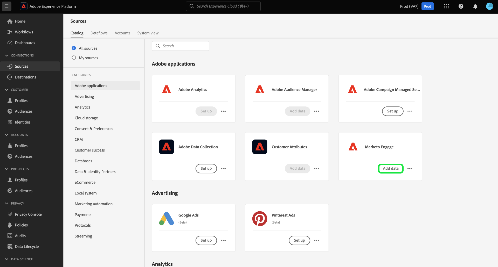

# Creare un [!DNL Marketo Engage] connessione sorgente e flusso di dati nell’interfaccia utente

>[!IMPORTANT]
>
>Prima di creare un [!DNL Marketo Engage] connessione di origine e un flusso di dati, devi prima verificare di avere [ha mappato il tuo ID organizzazione Adobe](https://experienceleague.adobe.com/docs/marketo/using/product-docs/core-marketo-concepts/miscellaneous/set-up-adobe-organization-mapping.html?lang=en) in [!DNL Marketo]. Inoltre, devi anche assicurarti di aver completato [popolamento automatico [!DNL Marketo] Spazi dei nomi e schemi B2B](../../../../connectors/adobe-applications/marketo/marketo-namespaces.md) prima di creare una connessione sorgente e un flusso di dati.

Questo tutorial descrive i passaggi necessari per creare [!DNL Marketo Engage] (in seguito denominati &quot;[!DNL Marketo]&quot;) nell’interfaccia utente per inserire dati B2B in Adobe Experience Platform.

## Introduzione

Questo tutorial richiede una buona conoscenza dei seguenti componenti di Adobe Experience Platform:

* [Spazi dei nomi B2B e utilità di generazione automatica dello schema](../../../../connectors/adobe-applications/marketo/marketo-namespaces.md): l’utility di generazione automatica degli spazi dei nomi B2B e dello schema consente di utilizzare [!DNL Postman] per generare automaticamente i valori per gli spazi dei nomi e gli schemi B2B. Prima di creare uno schema e uno spazio dei nomi B2B, devi completare [!DNL Marketo] connessione sorgente e flusso di dati.
* [Sorgenti](../../../../home.md): un Experience Platform consente di acquisire dati da varie origini, consentendoti allo stesso tempo di strutturare, etichettare e migliorare i dati in arrivo tramite i servizi di Platform.
* [Experience Data Model (XDM)](../../../../../xdm/home.md): framework standardizzato tramite il quale Experience Platform organizza i dati sull’esperienza del cliente.
   * [Creare e modificare gli schemi nell’interfaccia utente](../../../../../xdm/ui/resources/schemas.md): scopri come creare e modificare gli schemi nell’interfaccia utente di.
* [Spazi dei nomi delle identità](../../../../../identity-service/namespaces.md): gli spazi dei nomi di identità sono un componente di [!DNL Identity Service] che fungono da indicatori del contesto a cui si riferisce un’identità. Un’identità completa include un valore ID e uno spazio dei nomi.
* [[!DNL Real-Time Customer Profile]](/help/profile/home.md): fornisce un profilo consumer unificato e in tempo reale basato su dati aggregati provenienti da più origini.
* [Sandbox](../../../../../sandboxes/home.md): Experience Platform fornisce sandbox virtuali che permettono di suddividere una singola istanza Platform in ambienti virtuali separati, utili per le attività di sviluppo e aggiornamento delle applicazioni di esperienza digitale.

### Raccogli le credenziali richieste

Per accedere al tuo [!DNL Marketo] su Platform, è necessario fornire i seguenti valori:

| Credenziali | Descrizione |
| ---------- | ----------- |
| `munchkinId` | L&#39;ID Munchkin è l&#39;identificatore univoco di un [!DNL Marketo] dell&#39;istanza. |
| `clientId` | L’ID client univoco del tuo [!DNL Marketo] dell&#39;istanza. |
| `clientSecret` | Il segreto client univoco del tuo [!DNL Marketo] dell&#39;istanza. |

Per ulteriori informazioni sull’acquisizione di questi valori, consulta [[!DNL Marketo] guida all’autenticazione](../../../../connectors/adobe-applications/marketo/marketo-auth.md).

Dopo aver raccolto le credenziali richieste, puoi seguire i passaggi descritti nella sezione successiva.

## Connetti [!DNL Marketo] account

Nell’interfaccia utente di Platform, seleziona **[!UICONTROL Sorgenti]** dalla barra di navigazione a sinistra per accedere al [!UICONTROL Sorgenti] Workspace. Il [!UICONTROL Catalogo] Nella schermata vengono visualizzate diverse origini con cui è possibile creare un account.

Puoi selezionare la categoria appropriata dal catalogo sul lato sinistro dello schermo. In alternativa, è possibile trovare la fonte specifica che si desidera utilizzare utilizzando la barra di ricerca.

Sotto [!UICONTROL applicazioni Adobe] categoria, seleziona **[!UICONTROL Marketo Engage]**. Quindi, seleziona **[!UICONTROL Aggiungi dati]** per creare un nuovo [!DNL Marketo] flusso di dati.

Il **[!UICONTROL Connetti account di Marketo Engage]** viene visualizzata. In questa pagina è possibile utilizzare un nuovo account o accedere a un account esistente.

### Account esistente

Per creare un flusso di dati con un account esistente, seleziona **[!UICONTROL Account esistente]** e quindi selezionare [!DNL Marketo] account che desideri utilizzare. Seleziona **[!UICONTROL Successivo]** per procedere.

### Nuovo account

Se stai creando un nuovo account, seleziona **[!UICONTROL Nuovo account]**. Nel modulo di input visualizzato, fornisci il nome di un account, una descrizione facoltativa e [!DNL Marketo] credenziali di autenticazione. Al termine, seleziona **[!UICONTROL Connetti all&#39;origine]** e quindi lascia un po’ di tempo per stabilire la nuova connessione.

## Selezionare un set di dati

Dopo aver creato [!DNL Marketo] , il passaggio successivo fornisce un&#39;interfaccia da esplorare [!DNL Marketo] set di dati.

La metà sinistra dell’interfaccia è un browser di directory, che visualizza il file 10 [!DNL Marketo] set di dati. Un sistema [!DNL Marketo] la connessione sorgente richiede l’acquisizione di nove diversi set di dati. Se utilizzi anche il [!DNL Marketo] con la funzione di marketing basato sull’account (ABM), devi anche creare un decimo flusso di dati per acquisire [!UICONTROL Account denominati] set di dati.

>[!NOTE]
>
>Per brevità, nell’esercitazione seguente vengono utilizzati [!UICONTROL Opportunità] ad esempio, ma i passaggi descritti di seguito si applicano a uno qualsiasi dei 10 [!DNL Marketo] set di dati.

Seleziona il set di dati da acquisire per primo, quindi seleziona **[!UICONTROL Successivo]**.

## Fornisci i dettagli del flusso di dati {#provide-dataflow-details}

Il [!UICONTROL Dettagli del flusso di dati] consente di scegliere se utilizzare un set di dati esistente o nuovo. Durante questo processo, puoi anche configurare le impostazioni per [!UICONTROL Set di dati profilo], [!UICONTROL Diagnostica degli errori], [!UICONTROL Acquisizione parziale], e [!UICONTROL Avvisi].

>[!BEGINTABS]

>[!TAB Usa un set di dati esistente]

Per acquisire dati in un set di dati esistente, seleziona **[!UICONTROL Set di dati esistente]**. Puoi recuperare un set di dati esistente utilizzando [!UICONTROL Ricerca avanzata] oppure scorrendo l’elenco dei set di dati esistenti nel menu a discesa. Dopo aver selezionato un set di dati, fornisci un nome e una descrizione per il flusso di dati.

>[!TAB Utilizza un nuovo set di dati]

Per acquisire in un nuovo set di dati, seleziona **[!UICONTROL Nuovo set di dati]** quindi fornisci un nome per il set di dati di output e una descrizione facoltativa. Quindi, seleziona uno schema a cui mappare utilizzando [!UICONTROL Ricerca avanzata] oppure scorrendo l’elenco degli schemi esistenti nel menu a discesa. Dopo aver selezionato uno schema, fornisci un nome e una descrizione per il flusso di dati.

>[!ENDTABS]

### Abilita [!DNL Profile] e diagnostica degli errori

Quindi, seleziona la **[!UICONTROL Set di dati profilo]** attiva per abilitare il set di dati per [!DNL Profile]. Questo consente di creare una vista olistica degli attributi e dei comportamenti di un’entità. Dati da tutti [!DNL Profile]I set di dati abilitati per verranno inclusi in [!DNL Profile] e le modifiche vengono applicate quando salvi il flusso di dati.

[!UICONTROL Diagnostica degli errori] consente la generazione di messaggi di errore dettagliati per eventuali record errati che si verificano nel flusso di dati, mentre [!UICONTROL Acquisizione parziale] consente di acquisire dati contenenti errori, fino a una determinata soglia definita manualmente. Consulta la [panoramica dell’acquisizione in blocco parziale](../../../../../ingestion/batch-ingestion/partial.md) per ulteriori informazioni.

>[!IMPORTANT]
>
>Il [!DNL Marketo] l’origine utilizza l’acquisizione in batch per acquisire tutti i record storici e l’acquisizione in streaming per gli aggiornamenti in tempo reale. Questo consente all’origine di continuare lo streaming durante l’acquisizione di eventuali record errati. Abilita **[!UICONTROL Acquisizione parziale]** e quindi impostare [!UICONTROL Soglia di errore %] al massimo per evitare errori nel flusso di dati.

### Abilita avvisi

Puoi abilitare gli avvisi per ricevere notifiche sullo stato del flusso di dati. Seleziona un avviso dall’elenco per abbonarti e ricevere notifiche sullo stato del flusso di dati. Per ulteriori informazioni sugli avvisi, consulta la guida su [abbonamento agli avvisi sulle origini tramite l’interfaccia utente](../../alerts.md).

Una volta completati i dettagli del flusso di dati, seleziona **[!UICONTROL Successivo]**.

### Ignora account non rivendicati durante l’acquisizione dei dati delle società

Durante la creazione di un flusso di dati per acquisire dati dal set di dati aziendali, puoi configurare [!UICONTROL Escludi account non rivendicati] per escludere o includere dall’acquisizione account non rivendicati.

Quando i singoli utenti compilano un modulo, [!DNL Marketo] crea un record account fantasma in base al Nome società che non contiene altri dati. Per i nuovi flussi di dati, l’opzione per escludere gli account non rivendicati è abilitata per impostazione predefinita. Per i flussi di dati esistenti, puoi abilitare o disabilitare la funzione, con le modifiche che si applicano ai dati appena acquisiti e non ai dati esistenti.

## Mappa il tuo [!DNL Marketo] campi di origine del set di dati per eseguire il targeting dei campi XDM

Il [!UICONTROL Mappatura] viene visualizzato un passaggio che fornisce un’interfaccia per mappare i campi sorgente dallo schema sorgente ai campi XDM di destinazione appropriati nello schema di destinazione.

Ogni [!DNL Marketo] il set di dati ha le proprie regole di mappatura specifiche da seguire. Per ulteriori informazioni su come eseguire la mappatura, consulta [!DNL Marketo] Set di dati per XDM:

* [Attività](../../../../connectors/adobe-applications/mapping/marketo.md#activities)
* [Programmi](../../../../connectors/adobe-applications/mapping/marketo.md#programs)
* [Iscrizioni al programma](../../../../connectors/adobe-applications/mapping/marketo.md#program-memberships)
* [Aziende](../../../../connectors/adobe-applications/mapping/marketo.md#companies)
* [Elenchi statici](../../../../connectors/adobe-applications/mapping/marketo.md#static-lists)
* [Appartenenze a elenchi statici](../../../../connectors/adobe-applications/mapping/marketo.md#static-list-memberships)
* [Account denominati](../../../../connectors/adobe-applications/mapping/marketo.md#named-accounts)
* [Opportunità](../../../../connectors/adobe-applications/mapping/marketo.md#opportunities)
* [Ruoli di contatto opportunità](../../../../connectors/adobe-applications/mapping/marketo.md#opportunity-contact-roles)
* [Persone](../../../../connectors/adobe-applications/mapping/marketo.md#persons)

In base alle tue esigenze, puoi scegliere di mappare i campi direttamente o utilizzare le funzioni di preparazione dati per trasformare i dati sorgente in modo da derivare valori calcolati o calcolati. Per i passaggi completi sull’utilizzo dell’interfaccia di mappatura, vedi [Guida dell’interfaccia utente per la preparazione dati](../../../../../data-prep/ui/mapping.md).

Una volta pronti i set di mappatura, seleziona **[!UICONTROL Successivo]** e attendi alcuni istanti per la creazione del nuovo flusso di dati.

## Verifica il flusso di dati

Il **[!UICONTROL Revisione]** viene visualizzato un passaggio che consente di rivedere il nuovo flusso di dati prima di crearlo. I dettagli sono raggruppati nelle seguenti categorie:

* **[!UICONTROL Connessione]**: mostra il tipo di origine, il percorso pertinente dell’entità di origine scelta e l’importo delle colonne all’interno di tale entità di origine.
* **[!UICONTROL Assegna set di dati e mappa campi]**: mostra in quale set di dati vengono acquisiti i dati di origine, incluso lo schema a cui aderisce il set di dati.

Dopo aver rivisto il flusso di dati, seleziona **[!UICONTROL Salva e acquisisci]** e lascia un po’ di tempo per creare il flusso di dati.

## Monitorare il flusso di dati

Una volta creato il flusso di dati, puoi monitorare i dati che vengono acquisiti tramite di esso per visualizzare informazioni su tassi di acquisizione, successo ed errori. Per ulteriori informazioni su come monitorare i flussi di dati, consulta l’esercitazione su [monitoraggio dei flussi di dati nell’interfaccia utente](../../../../../dataflows/ui/monitor-sources.md).

## Eliminare gli attributi

Gli attributi personalizzati nei set di dati non possono essere nascosti o rimossi retroattivamente. Se desideri nascondere o rimuovere un attributo personalizzato da un set di dati esistente, devi creare un nuovo set di dati senza questo attributo personalizzato, un nuovo schema XDM e configurare un nuovo flusso di dati per il nuovo set di dati creato. È inoltre necessario disabilitare o eliminare il flusso di dati originale costituito dal set di dati con l’attributo personalizzato che si desidera nascondere o rimuovere.

## Eliminare il flusso di dati

Puoi eliminare i flussi di dati non più necessari o creati in modo errato utilizzando **[!UICONTROL Elimina]** funzione disponibile nella [!UICONTROL Flussi dati] Workspace. Per ulteriori informazioni su come eliminare i flussi di dati, consulta l’esercitazione su [eliminazione di flussi di dati nell’interfaccia utente](../../delete.md).

## Passaggi successivi

Seguendo questa esercitazione, hai creato un flusso di dati per inserire [!DNL Marketo] dati. I dati in arrivo possono ora essere utilizzati da servizi Platform a valle come [!DNL Real-Time Customer Profile] e [!DNL Data Science Workspace]. Per ulteriori informazioni, consulta i seguenti documenti:

* [Panoramica di [!DNL Real-Time Customer Profile]](/help/profile/home.md)
* [Panoramica di [!DNL Data Science Workspace]](/help/data-science-workspace/home.md)
