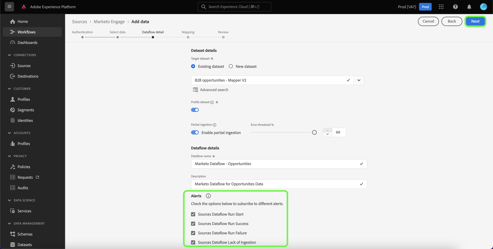

# Crea un [!DNL Marketo Engage] connettore sorgente nell’interfaccia utente

>[!IMPORTANT]
>
>Prima di creare un [!DNL Marketo Engage] connessione di origine e un flusso di dati, è innanzitutto necessario assicurarsi di disporre di [mappatura dell’ID organizzazione Adobe IMS](https://experienceleague.adobe.com/docs/marketo/using/product-docs/core-marketo-concepts/miscellaneous/set-up-adobe-organization-mapping.html?lang=en) in [!DNL Marketo]. Inoltre, devi anche assicurarti di aver completato [popolamento automatico [!DNL Marketo] namespace e schemi B2B](../../../../connectors/adobe-applications/marketo/marketo-namespaces.md) prima di creare una connessione sorgente e un flusso di dati.

Questa esercitazione fornisce i passaggi per la creazione di un [!DNL Marketo Engage] (in appresso denominato &quot;[!DNL Marketo]&quot;) connettore di origine nell&#39;interfaccia utente per inserire dati B2B in Adobe Experience Platform.

## Introduzione

Questa esercitazione richiede una buona comprensione dei seguenti componenti di Adobe Experience Platform:

* [Origini](../../../../home.md): L’Experience Platform consente di acquisire dati da varie sorgenti e allo stesso tempo di strutturare, etichettare e migliorare i dati in arrivo tramite i servizi Platform.
* [Experience Data Model (XDM)](../../../../../xdm/home.md): Il framework standardizzato in base al quale l’Experience Platform organizza i dati sulla customer experience.
   * [Creare e modificare schemi nell’interfaccia utente](../../../../../xdm/ui/resources/schemas.md): Scopri come creare e modificare schemi nell’interfaccia utente di .
* [Namespace Identity](../../../../../identity-service/namespaces.md): Gli spazi dei nomi di identità sono un componente di [!DNL Identity Service] che fungono da indicatori del contesto a cui si riferisce un&#39;identità. Un&#39;identità completa include un valore ID e uno spazio dei nomi.
* [[!DNL Real-time Customer Profile]](/help/profile/home.md): Fornisce un profilo di consumatore unificato e in tempo reale basato su dati aggregati provenienti da più origini.
* [Sandbox](../../../../../sandboxes/home.md): Experience Platform fornisce sandbox virtuali che suddividono una singola istanza di Platform in ambienti virtuali separati per sviluppare e sviluppare applicazioni di esperienza digitale.

### Raccogli credenziali richieste

Per accedere al tuo [!DNL Marketo] su Platform, devi fornire i seguenti valori:

| Credenziali | Descrizione |
| ---------- | ----------- |
| `munchkinId` | L&#39;ID Munchkin è l&#39;identificatore univoco per uno specifico [!DNL Marketo] istanza. |
| `clientId` | L&#39;ID client univoco del tuo [!DNL Marketo] istanza. |
| `clientSecret` | Il segreto client univoco del tuo [!DNL Marketo] istanza. |

Per ulteriori informazioni sull&#39;acquisizione di questi valori, consulta la sezione [[!DNL Marketo] guida all’autenticazione](../../../../connectors/adobe-applications/marketo/marketo-auth.md).

Dopo aver raccolto le credenziali richieste, puoi seguire i passaggi descritti nella sezione successiva.

## Collega il tuo [!DNL Marketo] account

Nell’interfaccia utente di Platform, seleziona **[!UICONTROL Origini]** dalla barra di navigazione a sinistra per accedere al [!UICONTROL Origini] workspace. La [!UICONTROL Catalogo] in questa schermata vengono visualizzate diverse sorgenti per le quali è possibile creare un account.

Puoi selezionare la categoria appropriata dal catalogo sul lato sinistro dello schermo. In alternativa, è possibile trovare la sorgente specifica con cui si desidera lavorare utilizzando la barra di ricerca.

Sotto la [!UICONTROL Applicazioni di Adobe] categoria, seleziona **[!UICONTROL Marketo Engage]**. Quindi, seleziona **[!UICONTROL Aggiungi dati]** per creare una nuova [!DNL Marketo] flusso di dati.

La **[!UICONTROL Collega account di Marketo Engage]** viene visualizzata la pagina . In questa pagina puoi utilizzare un nuovo account o accedere a un account esistente.

### Account esistente

Per creare un flusso di dati con un account esistente, seleziona **[!UICONTROL Account esistente]** quindi seleziona la [!DNL Marketo] account che desideri utilizzare. Seleziona **[!UICONTROL Successivo]** per procedere.

### Nuovo account

Se stai creando un nuovo account, seleziona **[!UICONTROL Nuovo account]**. Nel modulo di input visualizzato, fornisci un nome account, una descrizione facoltativa e il tuo [!DNL Marketo] credenziali di autenticazione. Al termine, seleziona **[!UICONTROL Connetti alla sorgente]** e quindi lasciare un po&#39; di tempo per stabilire la nuova connessione.

## Selezionare un set di dati

Dopo aver creato il [!DNL Marketo] il passaggio successivo fornisce un’interfaccia da esplorare [!DNL Marketo] set di dati.

La metà sinistra dell&#39;interfaccia è un browser di directory, che visualizza il 10 [!DNL Marketo] set di dati. Un funzionamento completo [!DNL Marketo] la connessione di origine richiede l’acquisizione dei nove set di dati diversi. Se utilizzi anche il [!DNL Marketo] funzionalità di marketing basato sull’account (ABM), quindi devi anche creare un decimo flusso di dati per acquisire il [!UICONTROL Account denominati] set di dati.

>[!NOTE]
>
>Per motivi di brevità, l’esercitazione seguente utilizza [!UICONTROL Opportunità] ad esempio, ma i passaggi descritti di seguito si applicano a uno qualsiasi dei 10 [!DNL Marketo] set di dati.

Seleziona il set di dati da acquisire prima, quindi seleziona **[!UICONTROL Successivo]**.

## Fornire i dettagli del flusso di dati

La [!UICONTROL Dettaglio flusso di dati] consente di selezionare se si desidera utilizzare un set di dati esistente o un nuovo set di dati. Durante questo processo, puoi anche configurare le impostazioni per [!UICONTROL Set di dati del profilo], [!UICONTROL Diagnostica degli errori], [!UICONTROL Acquisizione parziale]e [!UICONTROL Avvisi].

### Utilizzare un set di dati esistente

Per acquisire dati in un set di dati esistente, seleziona **[!UICONTROL Set di dati esistente]**. Puoi recuperare un set di dati esistente utilizzando [!UICONTROL Ricerca avanzata] o scorrendo l’elenco dei set di dati esistenti nel menu a discesa. Dopo aver selezionato un set di dati, fornisci un nome e una descrizione per il flusso di dati.

### Utilizzare un nuovo set di dati

Per acquisire in un nuovo set di dati, seleziona **[!UICONTROL Nuovo set di dati]** e quindi fornisci il nome di un set di dati di output e una descrizione facoltativa. Quindi, seleziona uno schema a cui eseguire il mapping utilizzando [!UICONTROL Ricerca avanzata] oppure scorrendo l’elenco degli schemi esistenti nel menu a discesa. Dopo aver selezionato uno schema, fornisci un nome e una descrizione per il flusso di dati.

### Abilita [!DNL Profile] e diagnostica degli errori

Quindi, seleziona la **[!UICONTROL Set di dati del profilo]** attiva/disattiva il set di dati per [!DNL Profile]. Ciò ti consente di creare una visualizzazione olistica degli attributi e dei comportamenti di un’entità. Dati da tutti [!DNL Profile]I set di dati abilitati verranno inclusi in [!DNL Profile] e le modifiche vengono applicate al salvataggio del flusso di dati.

[!UICONTROL Diagnostica degli errori] consente la generazione dettagliata dei messaggi di errore per tutti i record errati che si verificano nel flusso di dati, mentre [!UICONTROL Acquisizione parziale] consente di acquisire dati contenenti errori, fino a una determinata soglia definita manualmente. Consulta la sezione [panoramica dell’acquisizione parziale in batch](../../../../../ingestion/batch-ingestion/partial.md) per ulteriori informazioni.

>[!IMPORTANT]
>
>La [!DNL Marketo] connettore utilizza l’acquisizione batch per acquisire tutti i record storici e utilizza l’acquisizione in streaming per aggiornamenti in tempo reale. Questo consente al connettore di continuare lo streaming durante l’acquisizione di eventuali record errati. Abilita la **[!UICONTROL Acquisizione parziale]** attivare/disattivare e quindi impostare la [!UICONTROL Soglia errore %] per evitare errori nel flusso di dati.

### Abilitare gli avvisi

Puoi abilitare gli avvisi per ricevere notifiche sullo stato del flusso di dati. Seleziona un avviso dall’elenco per abbonarti e ricevere le notifiche sullo stato del flusso di dati. Per ulteriori informazioni sugli avvisi, consulta la guida su [iscrizione agli avvisi sorgente tramite l’interfaccia utente](../../alerts.md).

Al termine della fornitura dei dettagli al flusso di dati, seleziona **[!UICONTROL Successivo]**.

## Mappa il tuo [!DNL Marketo] campi di origine del set di dati per eseguire il targeting dei campi XDM

La [!UICONTROL Mappatura] viene visualizzato un passaggio che fornisce un&#39;interfaccia per mappare i campi di origine dallo schema di origine ai campi XDM di destinazione appropriati nello schema di destinazione.

Ogni [!DNL Marketo] Il set di dati ha le proprie regole di mappatura specifiche da seguire. Per ulteriori informazioni su come eseguire la mappatura, consulta quanto segue [!DNL Marketo] set di dati in XDM:

* [Attività](../../../../connectors/adobe-applications/mapping/marketo.md#activities)
* [Programmi](../../../../connectors/adobe-applications/mapping/marketo.md#programs)
* [Partecipazioni al programma](../../../../connectors/adobe-applications/mapping/marketo.md#program-memberships)
* [Aziende](../../../../connectors/adobe-applications/mapping/marketo.md#companies)
* [Elenchi statici](../../../../connectors/adobe-applications/mapping/marketo.md#static-lists)
* [appartenenze a elenchi statici](../../../../connectors/adobe-applications/mapping/marketo.md#static-list-memberships)
* [Account denominati](../../../../connectors/adobe-applications/mapping/marketo.md#named-accounts)
* [Opportunità](../../../../connectors/adobe-applications/mapping/marketo.md#opportunities)
* [Ruoli di contatto opportunità](../../../../connectors/adobe-applications/mapping/marketo.md#opportunity-contact-roles)
* [Persone](../../../../connectors/adobe-applications/mapping/marketo.md#persons)

In base alle tue esigenze, puoi scegliere di mappare direttamente i campi oppure utilizzare le funzioni di preparazione dei dati per trasformare i dati di origine in valori calcolati o calcolati. Per i passaggi completi sull&#39;utilizzo dell&#39;interfaccia di mappatura, vedi [Guida all’interfaccia utente della preparazione dei dati](../../../../../data-prep/ui/mapping.md).

Una volta pronti i set di mappatura, seleziona **[!UICONTROL Successivo]** e consente di creare alcuni momenti per il nuovo flusso di dati.

## Controlla il tuo flusso di dati

La **[!UICONTROL Revisione]** viene visualizzato un passaggio che consente di rivedere il nuovo flusso di dati prima della creazione. I dettagli sono raggruppati nelle seguenti categorie:

* **[!UICONTROL Connessione]**: Mostra il tipo di origine, il percorso pertinente dell&#39;entità di origine selezionata e la quantità di colonne all&#39;interno dell&#39;entità di origine.
* **[!UICONTROL Assegna set di dati e campi mappa]**: Mostra il set di dati in cui vengono acquisiti i dati di origine, incluso lo schema a cui il set di dati aderisce.

Dopo aver esaminato il flusso di dati, seleziona **[!UICONTROL Salva e acquisisci]** e lascia un certo tempo per la creazione del flusso di dati.

## Monitorare il flusso di dati

Una volta creato il flusso di dati, puoi monitorare i dati che vengono acquisiti tramite di esso per visualizzare informazioni sui tassi di acquisizione, sul successo e sugli errori. Per ulteriori informazioni su come monitorare i flussi di dati, consulta l’esercitazione su [monitoraggio dei flussi di dati nell’interfaccia utente](../../../../../dataflows/ui/monitor-sources.md).

## Eliminare gli attributi

Gli attributi personalizzati nei set di dati non possono essere nascosti o rimossi retroattivamente. Se desideri nascondere o rimuovere un attributo personalizzato da un set di dati esistente, devi creare un nuovo set di dati senza questo attributo personalizzato, un nuovo schema XDM e configurare un nuovo flusso di dati per il nuovo set di dati creato. È inoltre necessario disattivare o eliminare il flusso di dati originale costituito dal set di dati con l’attributo personalizzato che si desidera nascondere o rimuovere.

## Elimina il flusso di dati

È possibile eliminare i flussi di dati che non sono più necessari o che sono stati creati in modo errato utilizzando **[!UICONTROL Elimina]** funzione disponibile nella [!UICONTROL Flussi di dati] workspace. Per ulteriori informazioni su come eliminare i flussi di dati, consulta l’esercitazione su [eliminazione dei flussi di dati nell’interfaccia utente](../../delete.md).

## Passaggi successivi

Seguendo questa esercitazione, hai creato correttamente un flusso di dati da importare [!DNL Marketo] dati. I dati in arrivo possono ora essere utilizzati dai servizi della piattaforma a valle, come [!DNL Real-time Customer Profile] e [!DNL Data Science Workspace]. Per ulteriori informazioni, consulta i seguenti documenti:

* [[!DNL Real-time Customer Profile] panoramica](/help/profile/home.md)
* [[!DNL Data Science Workspace] panoramica](/help/data-science-workspace/home.md)
