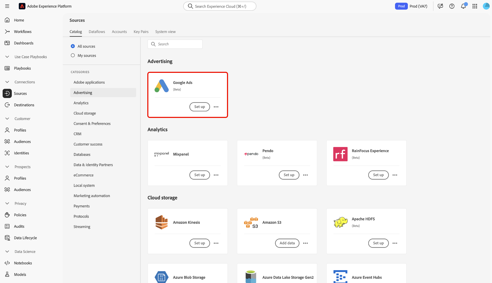

# Creare una connessione sorgente Google Ads nell’interfaccia utente

>[!NOTE]
>
>Il codice sorgente di Google Ads è in versione beta. Consulta la [Panoramica sulle origini](../../../../home.md#terms-and-conditions) per ulteriori informazioni sull’utilizzo di fonti etichettate beta.

Questo tutorial descrive i passaggi necessari per creare una connessione sorgente di Google Ads tramite l’interfaccia utente di Adobe Experience Platform.

## Introduzione

Questo tutorial richiede una buona conoscenza dei seguenti componenti di Experience Platform:

* [[!DNL Experience Data Model (XDM)] Sistema](../../../../../xdm/home.md): framework standardizzato tramite il quale Experience Platform organizza i dati sull’esperienza del cliente.
   * [Nozioni di base sulla composizione dello schema](../../../../../xdm/schema/composition.md): scopri gli elementi di base degli schemi XDM, compresi i principi chiave e le best practice nella composizione dello schema.
   * [Esercitazione sull’editor di schemi](../../../../../xdm/tutorials/create-schema-ui.md): scopri come creare schemi personalizzati utilizzando l’interfaccia utente dell’Editor di schema.
* [[!DNL Real-Time Customer Profile]](../../../../../profile/home.md): fornisce un profilo consumer unificato e in tempo reale basato su dati aggregati provenienti da più origini.

Se disponi già di una connessione Google Ads valida, puoi saltare il resto del documento e passare all’esercitazione su [configurazione di un flusso di dati](../../dataflow/advertising.md)

### Raccogli le credenziali richieste

Per accedere alla piattaforma del tuo account Google Ads, devi fornire i seguenti valori:

| Credenziali | Descrizione |
| ---------- | ----------- |
| ID cliente client | L’ID cliente client è il numero di account che corrisponde all’account client di Google Ads che desideri gestire con l’API di Google Ads. Questo ID segue il modello di `123-456-7890`. |
| ID cliente accesso | L’ID cliente di accesso è il numero di account che corrisponde all’account di Google Ads Manager e viene utilizzato per recuperare i dati del rapporto da un cliente operativo specifico. Per ulteriori informazioni sull’ID cliente di accesso, leggi [Documentazione API di Google Ads](https://developers.google.com/google-ads/api/docs/migration/login-customer-id). |
| Token sviluppatore | Il token sviluppatore ti consente di accedere all’API di Google Ads. Puoi utilizzare lo stesso token sviluppatore per effettuare richieste su tutti gli account Google Ads. Recupera il token di sviluppo tramite [accesso al tuo account manager](https://ads.google.com/home/tools/manager-accounts/) e quindi alla pagina API Center. |
| Aggiorna token | Il token di aggiornamento fa parte di [!DNL OAuth2] autenticazione. Questo token ti consente di rigenerare i token di accesso dopo la scadenza. |
| ID client | L’ID client viene utilizzato insieme al segreto client come parte di [!DNL OAuth2] autenticazione. Insieme, l’ID client e il segreto client consentono all’applicazione di funzionare per conto dell’account identificando l’applicazione in Google. |
| Segreto client | Il segreto client viene utilizzato insieme all&#39;ID client come parte [!DNL OAuth2] autenticazione. Insieme, l’ID client e il segreto client consentono all’applicazione di funzionare per conto dell’account identificando l’applicazione in Google. |

Leggi il documento di panoramica API per [ulteriori informazioni su come iniziare a utilizzare Google Ads](https://developers.google.com/google-ads/api/docs/first-call/overview).

## Connetti il tuo account Google Ads

Nell’interfaccia utente di Platform, seleziona **[!UICONTROL Sorgenti]** dalla barra di navigazione a sinistra per accedere al [!UICONTROL Sorgenti] Workspace. Il [!UICONTROL Catalogo] Nella schermata vengono visualizzate diverse origini con cui è possibile creare un account.

Puoi selezionare la categoria appropriata dal catalogo sul lato sinistro dello schermo. In alternativa, è possibile trovare l’origine specifica che si desidera utilizzare utilizzando l’opzione di ricerca.

Sotto **[!UICONTROL Pubblicità]** categoria, seleziona **[!UICONTROL Google Ads]**, quindi selezionare **[!UICONTROL Aggiungi dati]**.

.

Il **[!UICONTROL Connetti a Google Ads]** viene visualizzata. In questa pagina è possibile utilizzare nuove credenziali o credenziali esistenti.

### Account esistente

Per connettere un account esistente, seleziona l’account Google Ads con cui desideri connetterti, quindi fai clic su **[!UICONTROL Successivo]** per procedere.

.

### Nuovo account

Se si utilizzano nuove credenziali, selezionare **[!UICONTROL Nuovo account]**. Nel modulo di input visualizzato, fornisci un nome, una descrizione facoltativa e le credenziali di Google Ads. Al termine, seleziona **[!UICONTROL Connetti all&#39;origine]** e quindi lascia un po’ di tempo per stabilire la nuova connessione.

.

## Passaggi successivi

Seguendo questa esercitazione, hai stabilito una connessione al tuo account Google Ads. Ora puoi continuare con l’esercitazione successiva e [configurare un flusso di dati per inserire dati pubblicitari in Platform](../../dataflow/advertising.md).
