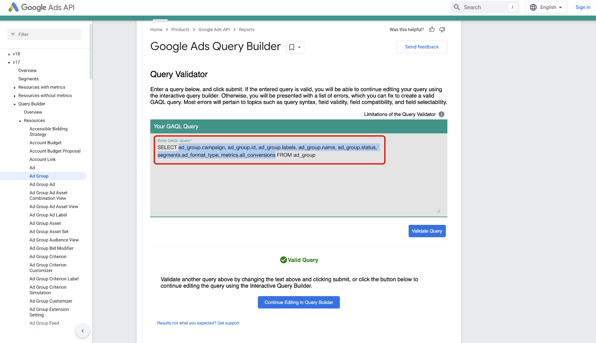

# Connetti [!DNL Google Ads] ad Experience Platform tramite l&#39;interfaccia utente

>[!NOTE]
>
>L&#39;origine [!DNL Google Ads] è in versione beta. Per ulteriori informazioni sull&#39;utilizzo di origini con etichetta beta, vedere [Panoramica origini](../../../../home.md#terms-and-conditions).

Leggi questa guida per scoprire come collegare l&#39;account [!DNL Google Ads] a Adobe Experience Platform utilizzando l&#39;area di lavoro origini nell&#39;interfaccia utente di Experience Platform.

## Introduzione

Questo tutorial richiede una buona conoscenza dei seguenti componenti di Experience Platform:

* [[!DNL Experience Data Model (XDM)] Sistema](../../../../../xdm/home.md): framework standardizzato tramite il quale Experience Platform organizza i dati sull&#39;esperienza del cliente.
   * [Nozioni di base sulla composizione dello schema](../../../../../xdm/schema/composition.md): scopri i blocchi predefiniti di base degli schemi XDM, inclusi i principi chiave e le best practice nella composizione dello schema.
   * [Esercitazione sull&#39;editor di schemi](../../../../../xdm/tutorials/create-schema-ui.md): scopri come creare schemi personalizzati utilizzando l&#39;interfaccia utente dell&#39;editor di schemi.
* [[!DNL Real-Time Customer Profile]](../../../../../profile/home.md): fornisce un profilo consumer unificato e in tempo reale basato su dati aggregati provenienti da più origini.

Se disponi già di una connessione [!DNL Google Ads] valida, puoi saltare il resto del documento e passare all&#39;esercitazione [configurazione di un flusso di dati](../../dataflow/advertising.md)

### Raccogli le credenziali richieste

Per informazioni sull&#39;autenticazione, leggere la [[!DNL Google Ads] panoramica origine](../../../../connectors/advertising/ads.md).

## Connetti il tuo account Google Ads

Nell&#39;interfaccia utente di Experience Platform, seleziona **[!UICONTROL Origini]** dal menu di navigazione a sinistra per accedere all&#39;area di lavoro *[!UICONTROL Origini]*. Puoi selezionare la categoria appropriata nel pannello *[!UICONTROL Categorie]*. In alternativa, è possibile utilizzare la barra di ricerca per passare all&#39;origine specifica che si desidera utilizzare.

Per utilizzare [!DNL Google Ads], seleziona la scheda di origine **[!UICONTROL Google Ads]** in *[!UICONTROL Advertising]*, quindi seleziona **[!UICONTROL Aggiungi dati]**.

.

### Account esistente

Per utilizzare un account esistente, selezionare **[!UICONTROL Account esistente]**, quindi selezionare l&#39;account che si desidera utilizzare dall&#39;elenco di account nell&#39;interfaccia.

Dopo aver selezionato l&#39;account, seleziona **[!UICONTROL Avanti]** per procedere al passaggio successivo.

.

### Nuovo account

Se non disponi di un account esistente, devi crearne uno nuovo fornendo le credenziali di autenticazione necessarie che corrispondono all’origine.

Per creare un nuovo account, selezionare **[!UICONTROL Nuovo account]**, quindi specificare il nome dell&#39;account e, facoltativamente, una descrizione per i dettagli dell&#39;account. Quindi, fornisci i valori di autenticazione appropriati per autenticare l’origine su Experience Platform:

* **ID cliente client**: l&#39;ID cliente client è il numero di account corrispondente all&#39;account client [!DNL Google Ads] che si desidera gestire con l&#39;API [!DNL Google Ads]. Questo ID segue il modello di `123-456-7890`.
* **ID cliente di accesso**: l&#39;ID cliente di accesso è il numero di account che corrisponde all&#39;account manager [!DNL Google Ads] e viene utilizzato per recuperare i dati del report da un cliente operativo specifico. Per ulteriori informazioni sull&#39;ID cliente di accesso, leggere la [[!DNL Google Ads] documentazione API](https://developers.google.com/search-ads/reporting/concepts/login-customer-id).
* **Token sviluppatore**: il token sviluppatore ti consente di accedere all&#39;API [!DNL Google Ads]. Puoi utilizzare lo stesso token sviluppatore per effettuare richieste su tutti gli account [!DNL Google Ads]. Recupera il token di sviluppo [accedendo al tuo account manager](https://ads.google.com/home/tools/manager-accounts/) e quindi accedendo alla pagina del Centro API.
* **Aggiorna token**: il token di aggiornamento fa parte dell&#39;autenticazione [!DNL OAuth2]. Questo token ti consente di rigenerare i token di accesso dopo la scadenza.
* **ID client**: l&#39;ID client viene utilizzato insieme al segreto client nell&#39;ambito dell&#39;autenticazione [!DNL OAuth2]. Insieme, l&#39;ID client e il segreto client consentono all&#39;applicazione di funzionare per conto dell&#39;account identificando l&#39;applicazione in [!DNL Google].
* **Segreto client**: il segreto client viene utilizzato insieme all&#39;ID client nell&#39;ambito dell&#39;autenticazione [!DNL OAuth2]. Insieme, l&#39;ID client e il segreto client consentono all&#39;applicazione di funzionare per conto dell&#39;account identificando l&#39;applicazione in [!DNL Google].
* Versione API **[!DNL Google Ads]**: versione API corrente supportata da [!DNL Google Ads]. Mentre la versione più recente è `v18`, la versione più recente supportata su Experience Platform è `v17`.

Dopo aver immesso le credenziali, selezionare **[!UICONTROL Connetti all&#39;origine]** e attendere alcuni istanti per l&#39;elaborazione della connessione. Al termine, selezionare **[!UICONTROL Avanti]**.

.

## Selezionare i dati {#select-data}

Con [!DNL Google Ads], devi fornire l&#39;elenco di attributi per l&#39;acquisizione durante la fase di selezione dei dati del flusso di lavoro. Per recuperare questi attributi, è necessario utilizzare [[!DNL Google Ads Query Builder]](https://developers.google.com/google-ads/api/fields/v17/overview_query_builder).

In [!DNL Google Ads Query Builder], passare al tipo di risorsa che si desidera utilizzare e quindi utilizzare il selettore degli attributi per selezionare gli attributi, i segmenti e le metriche.

Gli attributi selezionati popolano il pannello [!DNL Google Ads Query Language]. Assicurarsi di utilizzare la modalità [!DNL Standard] e quindi selezionare **[!DNL Enter or edit a query]**.

Selezionare **[!DNL Validate Query]** per convalidare la query [!DNL Google Ads].

In caso di esito positivo, [!DNL Google Ads Query Builder] restituisce un messaggio che indica che la query è valida. Quindi, copia **solo gli attributi** dall&#39;interno della query.

Torna alla fase di selezione dei dati del flusso di lavoro sorgenti nell&#39;interfaccia utente di Experience Platform, quindi incolla gli attributi nel pannello *[!UICONTROL Elenca attributi]*.

Seleziona **[!UICONTROL Anteprima]** per visualizzare in anteprima i dati, quindi seleziona **[!UICONTROL Successivo]** per continuare.

## Creare un flusso di dati per acquisire i dati pubblicitari

Seguendo questa esercitazione, hai stabilito una connessione al tuo account Google Ads. Ora puoi continuare con l&#39;esercitazione successiva e [configurare un flusso di dati per inserire dati pubblicitari in Experience Platform](../../dataflow/advertising.md).
