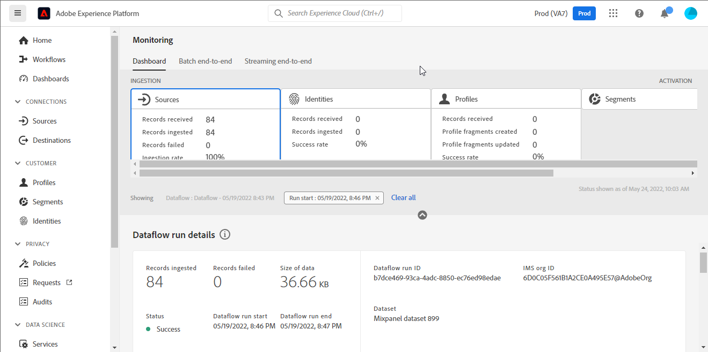

# (Beta) Crea un [!DNL Mixpanel] connessione sorgente nell’interfaccia utente

>[!NOTE]
>
>La [!DNL Mixpanel] la sorgente è in versione beta. Consulta la sezione [panoramica di origini](../../../../home.md#terms-and-conditions) per ulteriori informazioni sull’utilizzo di origini con etichetta beta.

Questa esercitazione fornisce i passaggi per la creazione di un [!DNL Mixpanel] connessione sorgente tramite l’interfaccia utente di Adobe Experience Platform Platform.

## Introduzione

Questa esercitazione richiede una comprensione approfondita dei seguenti componenti dell&#39;Experience Platform:

* [[!DNL Experience Data Model (XDM)] Sistema](../../../../../xdm/home.md): Il quadro standardizzato [!DNL Experience Platform] organizza i dati sulla customer experience.
   * [Nozioni di base sulla composizione dello schema](../../../../../xdm/schema/composition.md): Scopri i blocchi di base degli schemi XDM, inclusi i principi chiave e le best practice nella composizione dello schema.
   * [Esercitazione sull’Editor di schema](../../../../../xdm/tutorials/create-schema-ui.md): Scopri come creare schemi personalizzati utilizzando l’interfaccia utente dell’Editor di schema.
* [[!DNL Real-time Customer Profile]](../../../../../profile/home.md): Fornisce un profilo di consumatore unificato e in tempo reale basato su dati aggregati provenienti da più origini.

### Raccogli credenziali richieste

Per connettersi [!DNL Mixpanel] in Platform, devi fornire valori per le seguenti proprietà di connessione:

| Credenziali | Descrizione | Esempio |
| --- | --- | --- |
| Nome utente | Il nome utente dell&#39;account del servizio che corrisponde al tuo [!DNL Mixpanel] conto. Consulta la sezione [[!DNL Mixpanel] documentazione degli account di servizio](https://developer.mixpanel.com/reference/service-accounts#authenticating-with-a-service-account) per ulteriori informazioni. | `Test8.6d4ee7.mp-service-account` |
| Password | La password dell&#39;account di servizio che corrisponde alla tua [!DNL Mixpanel] conto. | `dLlidiKHpCZtJhQDyN2RECKudMeTItX1` |
| ID progetto | Le [!DNL Mixpanel] ID progetto. Questo ID è necessario per creare una connessione sorgente. Consulta la sezione [[!DNL Mixpanel] documentazione sulle impostazioni del progetto](https://help.mixpanel.com/hc/en-us/articles/115004490503-Project-Settings) e [[!DNL Mixpanel] guida alla creazione e alla gestione dei progetti](https://help.mixpanel.com/hc/en-us/articles/115004505106-Create-and-Manage-Projects) per ulteriori informazioni. | `2384945` |
| Fuso orario | Il fuso orario corrispondente al tuo [!DNL Mixpanel] progetto. Il fuso orario è necessario per creare una connessione sorgente. Consulta la sezione [Documentazione sulle impostazioni del progetto per pannelli misti](https://help.mixpanel.com/hc/en-us/articles/115004490503-Project-Settings) per ulteriori informazioni. | `Pacific Standard Time` |

Per ulteriori informazioni sull&#39;autenticazione della [!DNL Mixpanel] sorgente, vedi [[!DNL Mixpanel] panoramica di origine](../../../../connectors/analytics/mixpanel.md).

## Collega il tuo [!DNL Mixpanel] account

Nell’interfaccia utente di Platform, seleziona **[!UICONTROL Origini]** dalla barra di navigazione a sinistra per accedere al [!UICONTROL Origini] workspace. La [!UICONTROL Catalogo] in viene visualizzata una varietà di sorgenti con cui è possibile creare un account.

Puoi selezionare la categoria appropriata dal catalogo sul lato sinistro dello schermo. In alternativa, è possibile trovare la sorgente specifica con cui si desidera lavorare utilizzando l’opzione di ricerca.

Sotto la *Analytics* categoria, seleziona [!DNL Mixpanel], quindi seleziona **[!UICONTROL Aggiungi dati]**.

La **[!UICONTROL Collega account Mixpanel]** viene visualizzata la pagina . In questa pagina è possibile utilizzare le nuove credenziali o le credenziali esistenti.

### Account esistente

Per utilizzare un account esistente, seleziona la [!DNL Mixpanel] account con cui si desidera creare un nuovo flusso di dati, quindi selezionare **[!UICONTROL Successivo]** per procedere.

### Nuovo account

Se stai creando un nuovo account, seleziona **[!UICONTROL Nuovo account]**, quindi fornisci un nome, una descrizione facoltativa e le tue credenziali. Al termine, seleziona **[!UICONTROL Connetti alla sorgente]** e quindi lasciare un po&#39; di tempo per stabilire la nuova connessione.

## Seleziona l’ID e il fuso orario del progetto {#project-id-and-timezone}

>[!CONTEXTUALHELP]
>id="platform_sources_mixpanel_timezone"
>title="Imposta un fuso orario per l’acquisizione da pannello multiplo"
>abstract="Il fuso orario deve essere lo stesso dell’impostazione del fuso orario del profilo Mixpanel, perché Platform utilizza il fuso orario del progetto designato per acquisire i dati rilevanti da Mixpanel. Il pannello misto regolerà il relativo fuso orario in modo da coordinarsi con il fuso orario del progetto prima di registrare l’evento in un archivio dati Mixpanel."
>additional-url="https://experienceleague.adobe.com/docs/experience-platform/sources/ui-tutorials/create/analytics/mixpanel.html?lang=en#project-id-and-timezone" text="Ulteriori informazioni nella documentazione"

Dopo l’autenticazione della sorgente, specifica l’ID e il fuso orario del progetto, quindi seleziona **[!UICONTROL Seleziona]**.

Il fuso orario designato prima di acquisire il [!DNL Mixpanel] i dati in Platform devono essere gli stessi del tuo [!DNL Mixpanel] impostazione del fuso orario del profilo. Eventuali modifiche al fuso orario dei dati verranno applicate solo ai nuovi eventi e i vecchi eventi rimarranno nel fuso orario precedentemente designato. [!DNL Mixpanel] gestisce l’ora legale e regolerà il timestamp di acquisizione in modo appropriato. Per ulteriori informazioni sull’effetto dei blocchi temporali sui dati, consulta la sezione [!DNL Mixpanel] guida [gestione dei timestamp per i progetti](https://help.mixpanel.com/hc/en-us/articles/115004547203-Manage-Timezones-for-Projects-in-Mixpanel).

Dopo alcuni istanti, l’interfaccia corretta si aggiorna a un pannello di anteprima, consentendoti di controllare lo schema prima di creare un flusso di dati. Al termine, seleziona **[!UICONTROL Successivo]**.

## Passaggi successivi

Seguendo questa esercitazione, hai stabilito una connessione al tuo [!DNL Mixpanel] conto. Ora puoi passare all’esercitazione successiva e [configurare un flusso di dati per inserire i dati di analisi in Platform](../../dataflow/analytics.md).

## Risorse aggiuntive {#additional-resources}

Le sezioni seguenti forniscono risorse aggiuntive a cui puoi fare riferimento quando utilizzi il [!DNL Mixpanel] sorgente.

### Convalida {#validation}

Di seguito sono descritti i passaggi che puoi eseguire per verificare di aver connesso correttamente il tuo [!DNL Mixpanel] la fonte e [!DNL Mixpanel] gli eventi vengono acquisiti in Platform.

Nell’interfaccia utente di Platform, seleziona **[!UICONTROL Set di dati]** dalla barra di navigazione a sinistra per accedere al [!UICONTROL Set di dati] workspace. La [!UICONTROL Attività set di dati] visualizza i dettagli delle esecuzioni.

Quindi, seleziona l’ID di esecuzione del flusso di dati che desideri visualizzare per visualizzare dettagli specifici sull’esecuzione del flusso di dati.

Infine, seleziona **[!UICONTROL Anteprima set di dati]** per visualizzare i dati acquisiti.

Puoi verificare questi dati rispetto ai dati nella [!DNL Mixpanel] > [!DNL Events] pagina. Consulta la sezione [[!DNL Mixpanel] documento sugli eventi](https://help.mixpanel.com/hc/en-us/articles/4402837164948-Events-formerly-Live-View-) per ulteriori informazioni.

### Schema del pannello multiplo

Nella tabella seguente sono elencate le mappature supportate da impostare per [!DNL Mixpanel].

>[!TIP]
>
>Vedi [API di esportazione eventi > Download](https://developer.mixpanel.com/reference/raw-event-export) per ulteriori informazioni sull’API.

| Origine | Tipo |
|---|---|
| `distinct_id` | stringa |
| `event_name` | stringa |
| `import` | booleano |
| `insert_id` | stringa |
| `item_id` | stringa |
| `item_name` | stringa |
| `item_price` | stringa |
| `mp_api_endpoint` | stringa |
| `mp_api_timestamp_ms` | numero intero |
| `mp_processing_time_ms` | numero intero |
| `time` | numero intero |

### Limiti {#limits}

* È disponibile un massimo di 100 query simultanee e 60 query all’ora come indicato in [Esportare i limiti di velocità API](https://help.mixpanel.com/hc/en-us/articles/115004602563-Rate-Limits-for-API-Endpoints).
