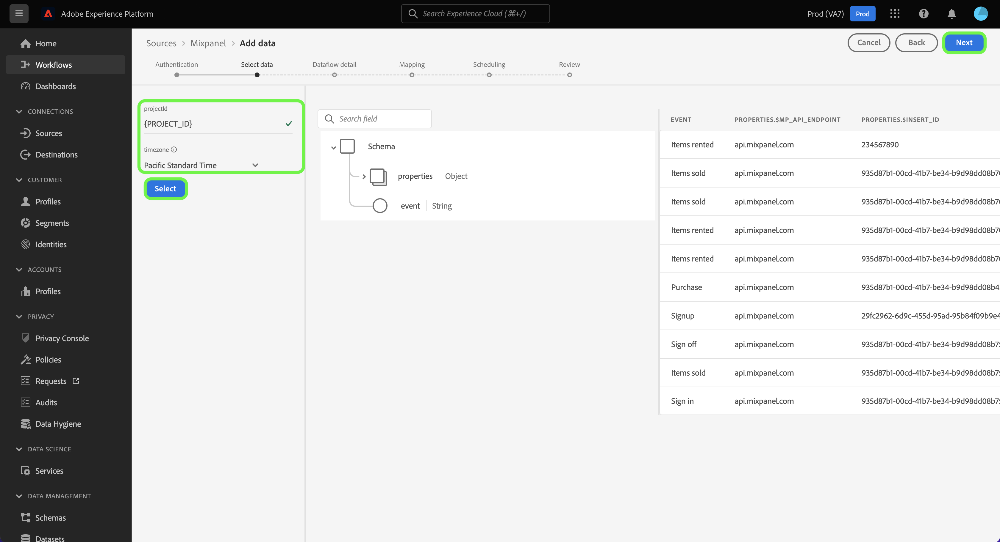

# Crea una connessione sorgente [!DNL Mixpanel] nell&#39;interfaccia utente

Questo tutorial illustra i passaggi per la creazione di una connessione di origine [!DNL Mixpanel] tramite l&#39;interfaccia utente di Adobe Experience Platform Experience Platform.

## Introduzione

Questo tutorial richiede una buona conoscenza dei seguenti componenti di Experience Platform:

* [[!DNL Experience Data Model (XDM)] Sistema](../../../../../xdm/home.md): framework standardizzato tramite il quale [!DNL Experience Platform] organizza i dati sull&#39;esperienza del cliente.
   * [Nozioni di base sulla composizione dello schema](../../../../../xdm/schema/composition.md): scopri i blocchi predefiniti di base degli schemi XDM, inclusi i principi chiave e le best practice nella composizione dello schema.
   * [Esercitazione sull&#39;editor di schemi](../../../../../xdm/tutorials/create-schema-ui.md): scopri come creare schemi personalizzati utilizzando l&#39;interfaccia utente dell&#39;editor di schemi.
* [[!DNL Real-Time Customer Profile]](../../../../../profile/home.md): fornisce un profilo consumer unificato e in tempo reale basato su dati aggregati provenienti da più origini.

### Raccogli le credenziali richieste

Per connettere [!DNL Mixpanel] ad Experience Platform, è necessario fornire i valori per le seguenti proprietà di connessione:

| Credenziali | Descrizione | Esempio |
| --- | --- | --- |
| Nome utente | Il servizio account nome utente corrispondente al tuo [!DNL Mixpanel] account. Per ulteriori informazioni, vedere la documentazione](https://developer.mixpanel.com/reference/service-accounts#authenticating-with-a-service-account) relativa agli [[!DNL Mixpanel] account di servizio. | `Test8.6d4ee7.mp-service-account` |
| Password | Il servizio account password che corrisponde alla tua [!DNL Mixpanel] account. | `dLlidiKHpCZtJhQDyN2RECKudMeTItX1` |
| ID progetto | L&#39;ID del progetto [!DNL Mixpanel] . Questo ID è necessario per creare una connessione di origine. Per ulteriori informazioni, consulta la documentazione sulle [[!DNL Mixpanel] impostazioni del progetto e la [[!DNL Mixpanel] guida alla creazione e gestione dei progetti](https://help.mixpanel.com/hc/en-us/articles/115004505106-Create-and-Manage-Projects).](https://help.mixpanel.com/hc/en-us/articles/115004490503-Project-Settings) | `2384945` |
| Fuso orario | Il fuso orario corrispondente al [!DNL Mixpanel] progetto. Per creare una connessione di origine è necessario specificare il fuso orario. Per ulteriori informazioni, consulta la [documentazione sulle impostazioni del progetto Mixpanel](https://help.mixpanel.com/hc/en-us/articles/115004490503-Project-Settings). | `Pacific Standard Time` |

Per ulteriori informazioni sull&#39;autenticazione dell&#39;origine [!DNL Mixpanel], vedere [[!DNL Mixpanel] panoramica origine](../../../../connectors/analytics/mixpanel.md).

## Connetti il tuo account [!DNL Mixpanel]

Nell&#39;interfaccia utente di Experience Platform, seleziona **[!UICONTROL Origini]** dalla barra di navigazione a sinistra per accedere all&#39;area di lavoro [!UICONTROL Origini]. Nella schermata [!UICONTROL Catalogo] sono visualizzate diverse origini con cui è possibile creare un account.

Puoi selezionare la categoria appropriata dal catalogo sul lato sinistro dello schermo. In alternativa, è possibile trovare l’origine specifica che si desidera utilizzare utilizzando l’opzione di ricerca.

Nella categoria *Analytics*, selezionare [!DNL Mixpanel], quindi **[!UICONTROL Aggiungi dati]**.

Viene visualizzata la pagina **[!UICONTROL Connetti account Mixpanel]**. In questa pagina è possibile utilizzare nuove credenziali o credenziali esistenti.

### Account esistente

Per utilizzare un account esistente, seleziona il [!DNL Mixpanel] account con cui desideri creare un nuovo flusso di dati, quindi seleziona **[!UICONTROL Successivo]** per continuare.

### Nuovo account

Se si sta creando una nuova account, selezionare **[!UICONTROL Nuovo account]** e quindi fornire un nome, una descrizione facoltativa e le credenziali. Al termine, selezionare **[!UICONTROL Connetti all&#39;origine]** e attendere un certo tempo per stabilire la nuova connessione.

## Selezionare l’ID del progetto e il fuso orario {#project-id-and-timezone}

>[!CONTEXTUALHELP]
>id="platform_sources_mixpanel_timezone"
>title="Impostare un fuso orario per l’acquisizione da Mixpanel"
>abstract="Il fuso orario deve essere uguale a quello del profilo Mixpanel, in quanto Experience Platform utilizza quello del progetto per acquisire i dati rilevanti da Mixpanel. Prima di registrare l’evento in un suo archivio dati, Mixpanel regolerà il proprio fuso orario in base a quello del tuo progetto."
>additional-url="https://experienceleague.adobe.com/docs/experience-platform/sources/ui-tutorials/create/analytics/mixpanel.html?lang=it#project-id-and-timezone" text="Ulteriori informazioni sono disponibili nella documentazione"

Una volta autenticata l&#39;origine, fornisci l&#39;ID progetto e il fuso orario, quindi seleziona **[!UICONTROL Seleziona]**.

Il fuso orario designato prima dell&#39;acquisizione dei dati [!DNL Mixpanel] in Experience Platform deve essere uguale all&#39;impostazione del fuso orario del profilo [!DNL Mixpanel]. Eventuali modifiche al fuso orario dei dati verranno applicate solo ai nuovi eventi e i vecchi eventi rimarranno nel fuso orario precedentemente designato. [!DNL Mixpanel] è compatibile con l&#39;ora legale e regolerà in modo appropriato il timestamp di acquisizione. Per ulteriori informazioni sull&#39;effetto dei fusi orari sui dati, vedere la guida di [!DNL Mixpanel] alla gestione dei fusi orari per i progetti [.](https://help.mixpanel.com/hc/en-us/articles/115004547203-Manage-Timezones-for-Projects-in-Mixpanel)

Dopo alcuni istanti, l’interfaccia corretta viene aggiornata a un pannello di anteprima, che consente di esaminare lo schema prima di creare un flusso di dati. Al termine, selezionare **[!UICONTROL Avanti]**.

## Passaggi successivi

Seguendo questo esercitazione, hai stabilito una connessione con il tuo [!DNL Mixpanel] account. Ora puoi passare alla esercitazione successiva e [configurare un flusso di dati per trasferire analisi dati in Experience Platform](../../dataflow/analytics.md).

## Risorse aggiuntive {#additional-resources}

Nelle sezioni seguenti vengono fornite risorse aggiuntive a cui è possibile fare riferimento quando si utilizza l&#39;origine [!DNL Mixpanel] .

### Convalida {#validation}

Di seguito vengono descritti i passaggi che è possibile eseguire per verificare di aver connesso correttamente l&#39;origine [!DNL Mixpanel] e che [!DNL Mixpanel] gli eventi vengono acquisiti in Experience Platform.

Nella interfaccia Experience Platform selezionare **[!UICONTROL Dataset dalla barra navigazione]** sinistra per accesso&#39;area [!UICONTROL di lavoro Datadati] . Nella [!UICONTROL schermata Attività] dataset vengono visualizzati i dettagli delle esecuzioni.

Successivo, selezionare l&#39;ID di esecuzione del flusso di dati del flusso di dati che si desidera visualizzare per visualizzare dettagli specifici sull&#39;esecuzione del flusso di dati.

Infine, seleziona **[!UICONTROL Anteprima set di dati]** per visualizzare i dati acquisiti.

È possibile verificare questi dati rispetto ai dati nella pagina [!DNL Mixpanel] > [!DNL Events]. Per ulteriori informazioni, vedere il documento [[!DNL Mixpanel] sugli eventi](https://help.mixpanel.com/hc/en-us/articles/4402837164948-Events-formerly-Live-View-).

### Schema Mixpanel

Nella tabella seguente sono elencati i mapping supportati che devono essere impostati per [!DNL Mixpanel].

>[!TIP]
>
>Per ulteriori informazioni sull&#39;API, vedere [API esportazione eventi > Download](https://developer.mixpanel.com/reference/raw-event-export).

| Origine | Tipo |
|---|---|
| `distinct_id` | stringa |
| `event_name` | stringa |
| `import` | booleano |
| `insert_id` | stringa |
| `item_id` | stringa |
| `item_name` | stringa |
| `item_price` | stringa |
| `mp_api_endpoint` | stringa |
| `mp_api_timestamp_ms` | intero |
| `mp_processing_time_ms` | intero |
| `time` | intero |

### Limiti {#limits}

* Hai un massimo di 100 query simultanee e 60 query all&#39;ora, come indicato in [Esporta limiti di velocità API](https://help.mixpanel.com/hc/en-us/articles/115004602563-Rate-Limits-for-API-Endpoints).
