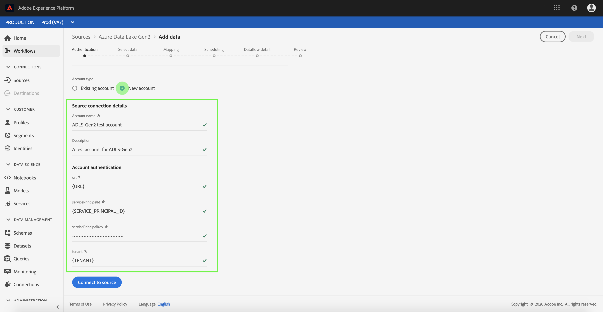

# Creare un connettore di origine Azure Data Lake Storage Gen2 nell&#39;interfaccia utente

I connettori di origine in Adobe Experience Platform consentono di trasferire i dati esternamente su base programmata. Questa esercitazione fornisce passaggi per l&#39;autenticazione di un connettore di origine Azure Data Lake Storage Gen2 (di seguito denominato &quot;ADLS Gen2&quot;) tramite l&#39;interfaccia utente della piattaforma.

## Introduzione

Questa esercitazione richiede una buona conoscenza dei seguenti componenti di Adobe Experience Platform:

- [Sistema](../../../../../xdm/home.md)XDM (Experience Data Model): Il framework standardizzato tramite il quale Experience Platform organizza i dati sull&#39;esperienza dei clienti.
   - [Nozioni di base sulla composizione](../../../../../xdm/schema/composition.md)dello schema: Scoprite i componenti di base degli schemi XDM, inclusi i principi chiave e le procedure ottimali nella composizione dello schema.
   - [Esercitazione](../../../../../xdm/tutorials/create-schema-ui.md)sull&#39;Editor di schema: Scoprite come creare schemi personalizzati utilizzando l&#39;interfaccia utente dell&#39;Editor di schema.
- [Profilo](../../../../../profile/home.md)cliente in tempo reale: Fornisce un profilo di consumo unificato e in tempo reale basato su dati aggregati provenienti da più origini.

Se si dispone già di una connessione di base ADLS Gen2, è possibile ignorare il resto del documento e procedere all&#39;esercitazione sulla [configurazione di un flusso di dati](../../dataflow/cloud-storage.md).

### Raccogli credenziali richieste

Per autenticare il connettore di origine ADLS Gen2, è necessario fornire i valori per le seguenti proprietà di connessione:

| Credenziali | Descrizione |
| ---------- | ----------- |
| `url` | Endpoint per ADLS Gen2. |
| `servicePrincipalId` | L&#39;ID client dell&#39;applicazione. |
| `servicePrincipalKey` | La chiave dell&#39;applicazione. |
| `tenant` | Le informazioni sul tenant che contengono l&#39;applicazione. |

Per ulteriori informazioni su questi valori, consultare [questo documento](https://docs.microsoft.com/en-us/azure/data-factory/connector-azure-data-lake-storage)ADLS Gen2.

## Collegare l&#39;account ADLS Gen2

Dopo aver raccolto le credenziali richieste, è possibile seguire i passaggi descritti di seguito per creare una nuova connessione di base in entrata per collegare l&#39;account ADLS Gen2 a Platform.

Accedi ad <a href="https://platform.adobe.com" target="_blank">Adobe Experience Platform</a> , quindi seleziona **Origini** dalla barra di navigazione a sinistra per accedere all&#39;area di lavoro *Origini* . Nella scheda *Catalogo* sono visualizzate diverse origini per le quali è possibile creare connessioni di base in ingresso. Ogni origine mostra il numero di connessioni di base esistenti ad esse associate.

Nella categoria Archiviazione ** cloud, selezionare **Azure Data Lake Gen2** per esporre una barra delle informazioni sul lato destro dello schermo. La barra delle informazioni fornisce una breve descrizione della sorgente selezionata e le opzioni per collegarsi con la vista sorgente della relativa documentazione. Per creare una nuova connessione di base in entrata, fate clic su **Connetti sorgente**.

Viene visualizzata la finestra di dialogo *Connetti ad Azure Data Lake Gen2* . In questa pagina è possibile utilizzare credenziali nuove o già esistenti.

### Nuovo account

Se state utilizzando nuove credenziali, selezionate **Nuovo account**. Nel modulo di input visualizzato, fornite alla connessione di base un nome, una descrizione facoltativa e le credenziali ADLS Gen2. Al termine, selezionate **Connect** , quindi concedete un po&#39; di tempo per stabilire la nuova connessione di base.

### Account esistente

Per collegare un account esistente, selezionare l&#39;account ADLS Gen2 con cui si desidera connettersi, quindi selezionare **Avanti** per continuare.

## Passaggi successivi

Seguendo questa esercitazione, è stata stabilita una connessione di base all&#39;account ADLS Gen2. Ora puoi continuare con l’esercitazione successiva e [configurare un flusso di dati per trasferire i dati dall’archiviazione cloud alla piattaforma](../../dataflow/cloud-storage.md).