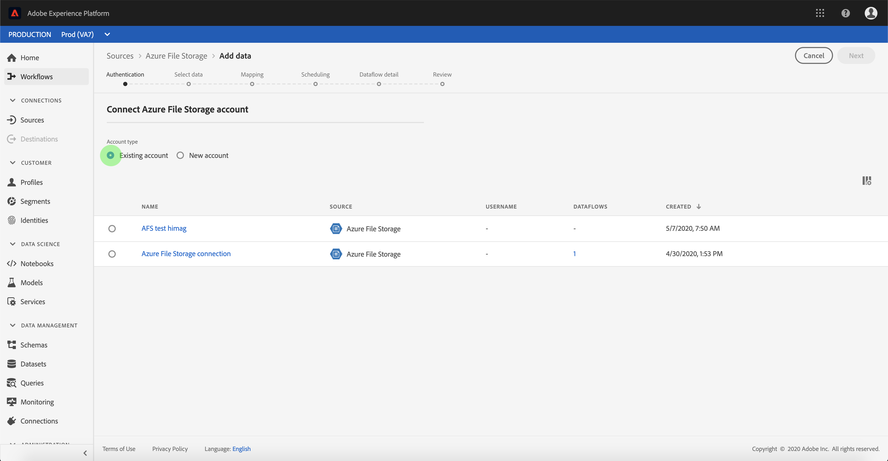

# Crea un [!DNL Azure File Storage] connessione sorgente nell’interfaccia utente

I connettori sorgente in Adobe Experience Platform consentono di acquisire dati provenienti dall’esterno su base pianificata. Questa esercitazione fornisce i passaggi per l&#39;autenticazione di un [!DNL Azure File Storage] connettore di origine con [!DNL Platform] interfaccia utente.

## Introduzione

Questa esercitazione richiede una buona comprensione dei seguenti componenti di Adobe Experience Platform:

- [[!DNL Experience Data Model (XDM)] Sistema](../../../../../xdm/home.md): Il quadro standardizzato [!DNL Experience Platform] organizza i dati sulla customer experience.
   - [Nozioni di base sulla composizione dello schema](../../../../../xdm/schema/composition.md): Scopri i blocchi di base degli schemi XDM, inclusi i principi chiave e le best practice nella composizione dello schema.
   - [Esercitazione sull’Editor di schema](../../../../../xdm/tutorials/create-schema-ui.md): Scopri come creare schemi personalizzati utilizzando l’interfaccia utente dell’Editor di schema.
- [[!DNL Real-Time Customer Profile]](../../../../../profile/home.md): Fornisce un profilo di consumatore unificato e in tempo reale basato su dati aggregati provenienti da più origini.

Se disponi già di una [!DNL Azure File Storage] è possibile ignorare il resto del documento e passare all&#39;esercitazione su [configurazione di un flusso di dati](../../dataflow/batch/cloud-storage.md).

### Raccogli credenziali richieste

Per autenticare il [!DNL Azure File Storage] connettore di origine, è necessario specificare i valori per le seguenti proprietà di connessione:

| Credenziali | Descrizione |
| ---------- | ----------- |
| `host` | Il punto finale del [!DNL Azure File Storage] istanza a cui si accede. |
| `userId` | L&#39;utente con accesso sufficiente al [!DNL Azure File Storage] punto finale. |
| `password` | La [!DNL Azure File Storage] chiave di accesso. |

Per ulteriori informazioni su come iniziare, consulta [questo [!DNL Azure File Storage] documento](https://docs.microsoft.com/en-us/azure/storage/files/storage-how-to-use-files-windows).

## Collega il tuo [!DNL Azure File Storage] account

Una volta raccolte le credenziali richieste, puoi seguire i passaggi seguenti per collegare il tuo [!DNL Azure File Storage] account a [!DNL Platform].

Accedi a [Adobe Experience Platform](https://platform.adobe.com) quindi seleziona **[!UICONTROL Origini]** dalla barra di navigazione a sinistra per accedere al **[!UICONTROL Origini]** workspace. La **[!UICONTROL Catalogo]** in questa schermata vengono visualizzate diverse sorgenti per le quali è possibile creare un account.

Puoi selezionare la categoria appropriata dal catalogo sul lato sinistro dello schermo. In alternativa, è possibile trovare la sorgente specifica con cui si desidera lavorare utilizzando l’opzione di ricerca.

Sotto la **[!UICONTROL Database]** categoria, seleziona **[!UICONTROL Archiviazione file di Azure]**. Se questa è la prima volta che utilizzi questo connettore, seleziona **[!UICONTROL Configura]**. In caso contrario, seleziona **[!UICONTROL Aggiungi dati]** per creare una nuova [!DNL Azure File Storage] connettore.

La **[!UICONTROL Connetti ad Azure File Storage]** viene visualizzata la pagina . In questa pagina è possibile utilizzare le nuove credenziali o le credenziali esistenti.

### Nuovo account

Se si utilizzano nuove credenziali, selezionare **[!UICONTROL Nuovo account]**. Nel modulo di input visualizzato, specificare un nome, una descrizione facoltativa e il [!DNL Azure File Storage] credenziali. Al termine, seleziona **[!UICONTROL Connetti]** e quindi lasciare un po&#39; di tempo per stabilire la nuova connessione.

### Account esistente

Per collegare un account esistente, seleziona la [!DNL Azure File Storage] account con cui desideri connetterti, quindi seleziona **[!UICONTROL Successivo]** per procedere.

## Passaggi successivi

Seguendo questa esercitazione, hai stabilito una connessione al tuo [!DNL Azure File Storage] conto. Ora puoi passare all’esercitazione successiva e [configurare un flusso di dati per inserire i dati dall’archiviazione cloud in [!DNL Platform]](../../dataflow/batch/cloud-storage.md).
