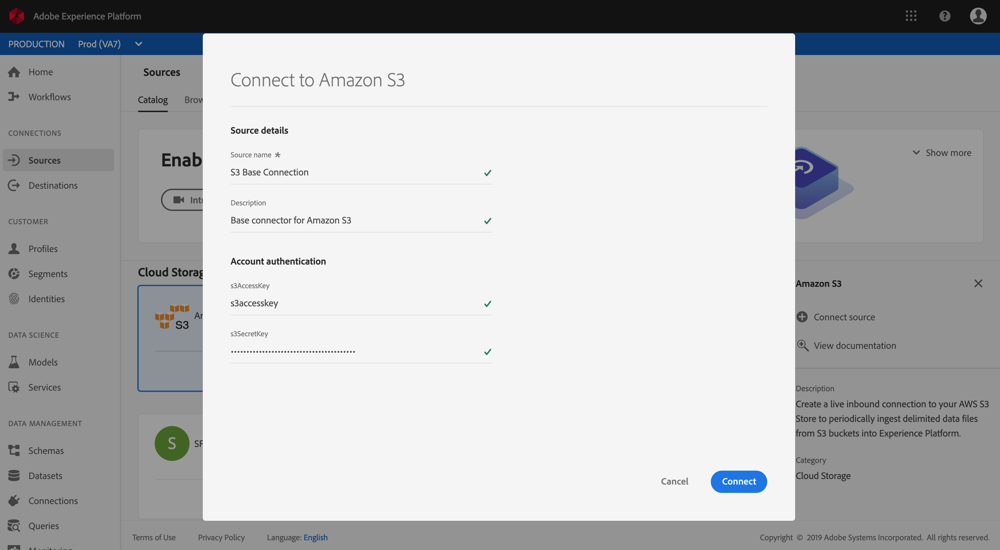

# Creare un connettore di origine Azure Blob o Amazon S3 nell&#39;interfaccia utente

I connettori di origine in Adobe Experience Platform consentono di trasferire i dati esternamente su base programmata. Questa esercitazione fornisce passaggi per la creazione di un connettore di origine Azure Blob (in seguito denominato &quot;Blob&quot;) o Amazon S3 (in seguito denominato &quot;S3&quot;) tramite l&#39;interfaccia utente della piattaforma.

## Introduzione

Questa esercitazione richiede una buona conoscenza dei seguenti componenti di Adobe Experience Platform:

- [Sistema](../../../../../xdm/home.md)XDM (Experience Data Model): Il framework standardizzato tramite il quale Experience Platform organizza i dati sull&#39;esperienza dei clienti.
   - [Nozioni di base sulla composizione](../../../../../xdm/schema/composition.md)dello schema: Scoprite i componenti di base degli schemi XDM, inclusi i principi chiave e le procedure ottimali nella composizione dello schema.
   - [Esercitazione](../../../../../xdm/tutorials/create-schema-ui.md)sull&#39;Editor di schema: Scoprite come creare schemi personalizzati utilizzando l&#39;interfaccia utente dell&#39;Editor di schema.
- [Profilo](../../../../../profile/home.md)cliente in tempo reale: Fornisce un profilo di consumo unificato e in tempo reale basato su dati aggregati provenienti da più origini.

Se si dispone già di una connessione di base Blob o S3, è possibile ignorare il resto del documento e procedere all&#39;esercitazione sulla [configurazione di un flusso di dati](../../dataflow/batch/cloud-storage.md).

### Formati di file supportati

Experience Platform supporta i seguenti formati di file da acquisire da archivi esterni:

- Valori separati da delimitatore (DSV): Il supporto per i file di dati in formato DSV è attualmente limitato ai valori separati da virgole. Il valore delle intestazioni dei campi all&#39;interno dei file formattati DSV deve essere costituito solo da caratteri alfanumerici e caratteri di sottolineatura. In futuro verrà fornito il supporto per i file DSV generali.
- JavaScript Object Notation (JSON): I file di dati formattati JSON devono essere conformi a XDM.
- Parquet Apache: I file di dati in formato parquet devono essere conformi a XDM.

### Raccogli credenziali richieste

Per accedere all&#39;archiviazione Blob sulla piattaforma, è necessario fornire un valore valido per le seguenti credenziali:

| Credenziali | Descrizione |
| ---------- | ----------- |
| `connectionString` | Stringa di connessione necessaria per accedere ai dati nell&#39;archivio Blob. Il pattern della stringa di connessione BLOB è: `DefaultEndpointsProtocol=https;AccountName={ACCOUNT_NAME};AccountKey={ACCOUNT_KEY}`. |

Per ulteriori informazioni su come iniziare, visitare [questo documento](https://docs.microsoft.com/en-us/azure/storage/common/storage-configure-connection-string)BLOB di Azure.

Allo stesso modo, per accedere al bucket S3 sulla piattaforma è necessario fornire i valori validi per le seguenti credenziali:

| Credenziali | Descrizione |
| ---------- | ----------- |
| `s3AccessKey` | ID chiave di accesso per l&#39;archiviazione S3. |
| `s3SecretKey` | ID chiave segreta per l&#39;archiviazione S3. |

Per ulteriori informazioni su come iniziare, consulta [questo documento](https://aws.amazon.com/blogs/security/wheres-my-secret-access-key/)AWS.

## Collegamento dell&#39;account Blob o S3

Con le credenziali dell&#39;archiviazione cloud, puoi seguire i passaggi descritti di seguito per creare una nuova connessione di base in ingresso per collegare il tuo account Blob o S3 a Platform.

Accedi ad <a href="https://platform.adobe.com" target="_blank">Adobe Experience Platform</a> , quindi seleziona **Origini** dalla barra di navigazione a sinistra per accedere all&#39;area di lavoro delle origini. Nella schermata *Catalogo* sono visualizzate diverse sorgenti con cui è possibile creare connessioni di base in entrata e ogni origine mostra il numero di connessioni di base esistenti ad esse associate.

Nella categoria Archiviazione ** cloud, selezionare **Azure Blob Storage** o **Amazon S3** per esporre una barra delle informazioni sul lato destro dello schermo. La barra delle informazioni fornisce una breve descrizione dell’origine selezionata e delle opzioni per visualizzarne la documentazione o per collegarsi all’origine. Per creare una nuova connessione di base in entrata, fate clic su **Connetti sorgente**.

Nel modulo di input, fornire alla connessione di base un nome, una descrizione facoltativa e le credenziali Blob o S3. Infine, fate clic su **Connect** , quindi lasciate che sia possibile stabilire una nuova connessione di base.

## Passaggi successivi

Seguendo questa esercitazione, è stata stabilita una connessione di base all&#39;account Azure Blob o Amazon S3. Ora puoi continuare con l’esercitazione successiva e [configurare un flusso di dati per l’inserimento di dati nella piattaforma](../../dataflow/batch/cloud-storage.md).