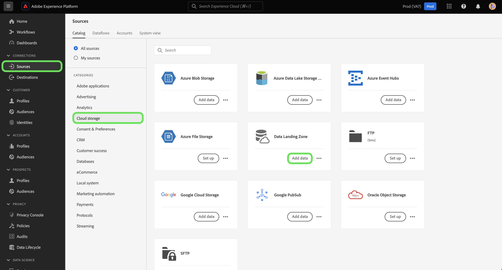

# Connetti [!DNL Data Landing Zone] a Platform tramite l’interfaccia utente

>[!IMPORTANT]
>
>Questa pagina è specifica per [!DNL Data Landing Zone] *sorgente* connettore in Experience Platform. Per informazioni sulla connessione al [!DNL Data Landing Zone] *destinazione* connettore, fare riferimento al [[!DNL Data Landing Zone] pagina della documentazione di destinazione](/help/destinations/catalog/cloud-storage/data-landing-zone.md).

[!DNL Data Landing Zone] è una struttura di archiviazione dei file sicura e basata su cloud per importare i file in Adobe Experience Platform. I dati vengono eliminati automaticamente dal [!DNL Data Landing Zone] dopo sette giorni.

Questo tutorial descrive i passaggi necessari per creare [!DNL Data Landing Zone] tramite l’interfaccia utente di Platform.

## Introduzione

Questo tutorial richiede una buona conoscenza dei seguenti componenti di Adobe Experience Platform:

* [Sorgenti](../../../../home.md): un Experience Platform consente di acquisire dati da varie origini, consentendoti allo stesso tempo di strutturare, etichettare e migliorare i dati in arrivo tramite i servizi di Platform.
* [Sandbox](../../../../../sandboxes/home.md): Experience Platform fornisce sandbox virtuali che permettono di suddividere una singola istanza Platform in ambienti virtuali separati, utili per le attività di sviluppo e aggiornamento delle applicazioni di esperienza digitale.

## Porta i file da [!DNL Data Landing Zone] alla piattaforma

Nell’interfaccia utente di Platform, seleziona **[!UICONTROL Sorgenti]** dalla barra di navigazione a sinistra per accedere al [!UICONTROL Sorgenti] Workspace. Il [!UICONTROL Catalogo] Nella schermata vengono visualizzate diverse origini con cui è possibile creare un account.

Puoi selezionare la categoria appropriata dal catalogo sul lato sinistro dello schermo. In alternativa, è possibile trovare la fonte specifica che si desidera utilizzare utilizzando la barra di ricerca.

Sotto [!UICONTROL archiviazione cloud] categoria, seleziona [!DNL Data Landing Zone] e quindi seleziona **[!UICONTROL Aggiungi dati]**.

Il [!UICONTROL Aggiungi dati] viene visualizzata un’interfaccia per selezionare e visualizzare in anteprima i dati da portare su Platform.

* La parte sinistra dell’interfaccia è un browser di cartelle che ti fornisce un elenco di file dal contenitore da portare su Platform.
* La parte destra dell’interfaccia consente di visualizzare in anteprima fino a 100 righe di dati da un file compatibile.

Seleziona il file da portare su Platform e attendi alcuni istanti prima che l’interfaccia corretta venga aggiornata in una schermata di anteprima.

>[!TIP]
>
>Platform rileva automaticamente le informazioni sulle proprietà del file selezionato, incluse informazioni sul formato dei dati del file, sul delimitatore di colonna designato e sul tipo di compressione.

L’interfaccia di anteprima consente di esaminare il contenuto e la struttura di un file. Per impostazione predefinita, nell&#39;interfaccia di anteprima viene visualizzato il primo file della cartella selezionata.

Per visualizzare in anteprima un file diverso, selezionate l&#39;icona di anteprima accanto al nome del file da esaminare.

Al termine, seleziona **[!UICONTROL Successivo]**.

Per una guida dettagliata su come creare un flusso di dati per un’origine di archiviazione cloud, consulta l’esercitazione su [creazione di un flusso di dati di archiviazione cloud per portare i dati su Platform](../../dataflow/batch/cloud-storage.md).

## Recupera e aggiorna il [!DNL Data Landing Zone] credenziali

[!DNL Data Landing Zone] è un’origine preconfigurata fornita con la licenza Adobe Experience Platform Sources. [!DNL Data Landing Zone] utilizza un URI SAS e l&#39;autenticazione basata su token SAS. Puoi recuperare e aggiornare le credenziali di autenticazione da [!UICONTROL Catalogo origini] pagina.

In [!UICONTROL Catalogo origini], sotto il [!UICONTROL Archiviazione cloud] , seleziona i puntini di sospensione (**...**) dalla **[!UICONTROL Data Landing Zone]** Card. Dal menu a discesa visualizzato, seleziona **[!UICONTROL Visualizza credenziali]**.

Viene visualizzato un popover con il nome del contenitore, il token SAS, il nome dell&#39;account di archiviazione e l&#39;URI SAS.

Seleziona **[!UICONTROL Aggiorna credenziali]** e attendi alcuni secondi per l’elaborazione delle credenziali aggiornate.

>[!TIP]
>
>Il tuo [!DNL Data Landing Zone] le credenziali sono impostate per scadere automaticamente dopo 90 giorni ed è necessario utilizzare le nuove credenziali per riconnettersi a [!DNL Data Landing Zone] dopo la scadenza. I flussi di dati in Platform non sono interessati dalla scadenza delle credenziali ed è comunque possibile continuare a lavorare con flussi di dati nuovi ed esistenti con le nuove credenziali.

## Passaggi successivi

Seguendo questa esercitazione, hai effettuato l’accesso a [!DNL Data Landing Zone] e ha imparato a recuperare e aggiornare le credenziali. Ora puoi passare alla prossima esercitazione su [creazione di un flusso di dati per portare i dati da un’archiviazione cloud a Platform](../../dataflow/batch/cloud-storage.md).
