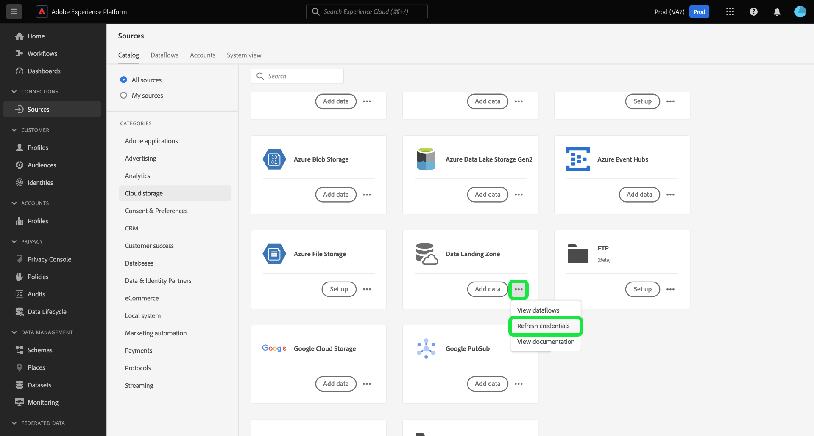

# Connetti [!DNL Data Landing Zone] ad Experience Platform tramite l&#39;interfaccia utente

>[!IMPORTANT]
>
>Questa pagina è specifica per il connettore [!DNL Data Landing Zone] *source* in Experience Platform. Per informazioni sulla connessione al connettore [!DNL Data Landing Zone] *destination*, consulta la [[!DNL Data Landing Zone] pagina della documentazione di destinazione](/help/destinations/catalog/cloud-storage/data-landing-zone.md).

[!DNL Data Landing Zone] è una struttura di archiviazione dei file sicura e basata su cloud per l&#39;inserimento di file in Adobe Experience Platform. I dati vengono eliminati automaticamente da [!DNL Data Landing Zone] dopo sette giorni.

Questo tutorial illustra i passaggi per la creazione di una connessione di origine [!DNL Data Landing Zone] tramite l&#39;interfaccia utente di Experience Platform.

## Introduzione

Questo tutorial richiede una buona conoscenza dei seguenti componenti di Adobe Experience Platform:

* [Origini](../../../../home.md): Experience Platform consente di acquisire dati da varie origini e allo stesso tempo di strutturare, etichettare e migliorare i dati in arrivo tramite i servizi Experience Platform.
* [Sandbox](../../../../../sandboxes/home.md): Experience Platform fornisce sandbox virtuali che suddividono una singola istanza Experience Platform in ambienti virtuali separati, utili per le attività di sviluppo e aggiornamento delle applicazioni di esperienza digitale.

## Porta i tuoi file da [!DNL Data Landing Zone] ad Experience Platform

>[!IMPORTANT]
>
> Per connettersi all&#39;origine, sono necessarie le autorizzazioni di controllo di accesso **[!UICONTROL Visualizza origini]** e **[!UICONTROL Gestisci origini]**. Leggi la [panoramica sul controllo degli accessi](../../../../../access-control/home.md) o contatta l&#39;amministratore del prodotto per ottenere le autorizzazioni necessarie.

Nell&#39;interfaccia utente di Experience Platform, seleziona **[!UICONTROL Origini]** dal menu di navigazione a sinistra per accedere all&#39;area di lavoro [!UICONTROL Origini]. Nella schermata [!UICONTROL Catalogo] sono visualizzate diverse origini con cui è possibile creare un account.

Puoi selezionare la categoria appropriata dal catalogo sul lato sinistro dello schermo. In alternativa, è possibile trovare la fonte specifica che si desidera utilizzare utilizzando la barra di ricerca.

Nella categoria [!UICONTROL archiviazione cloud], selezionare [!DNL Data Landing Zone], quindi **[!UICONTROL Aggiungi dati]**.

Viene visualizzato il passaggio [!UICONTROL Aggiungi dati], che fornisce un&#39;interfaccia per selezionare e visualizzare in anteprima i dati da portare in Experience Platform.

* La parte sinistra dell’interfaccia è un browser cartelle, che fornisce un elenco di file dal contenitore che puoi quindi portare in Experience Platform.
* La parte destra dell’interfaccia consente di visualizzare in anteprima fino a 100 righe di dati da un file compatibile.

Seleziona il file da portare in Experience Platform e attendi alcuni istanti prima che l’interfaccia corretta venga aggiornata in una schermata di anteprima.

>[!TIP]
>
>Experience Platform rileva automaticamente le informazioni sulle proprietà del file selezionato, incluse le informazioni sul formato dei dati del file, sul delimitatore di colonna designato e sul tipo di compressione.

L’interfaccia di anteprima consente di esaminare il contenuto e la struttura di un file. Per impostazione predefinita, nell&#39;interfaccia di anteprima viene visualizzato il primo file della cartella selezionata.

Per visualizzare in anteprima un file diverso, selezionate l&#39;icona di anteprima accanto al nome del file da esaminare.

Al termine, selezionare **[!UICONTROL Avanti]**.

Per una guida dettagliata su come creare un flusso di dati per un&#39;origine di archiviazione cloud, consulta l&#39;esercitazione su [creazione di un flusso di dati di archiviazione cloud per inserire dati in Experience Platform](../../dataflow/batch/cloud-storage.md).

## Recupera le tue credenziali di [!DNL Data Landing Zone]

[!DNL Data Landing Zone] è un&#39;origine inclusa nella licenza di Adobe Experience Platform Sources. [!DNL Data Landing Zone] utilizza un URI SAS e l&#39;autenticazione basata su token SAS. È possibile recuperare le credenziali di autenticazione dalla pagina [!UICONTROL Catalogo origini].

Per recuperare le credenziali, seleziona la scheda **[!UICONTROL Data Landing Zone]**, quindi copia le credenziali dalla barra a destra visualizzata.

Viene visualizzato un popover con il nome del contenitore, il token SAS, il nome dell&#39;account di archiviazione, l&#39;URI SAS e la data di scadenza.

## Aggiorna le credenziali di [!DNL Data Landing Zone]

Le credenziali di [!DNL Data Landing Zone] sono impostate per scadere automaticamente dopo 90 giorni. È necessario utilizzare le nuove credenziali per riconnettersi a [!DNL Data Landing Zone] dopo la scadenza. I flussi di dati in Experience Platform non sono interessati dalla scadenza delle credenziali ed è comunque possibile continuare a lavorare con flussi di dati nuovi ed esistenti con le nuove credenziali.

Esistono due modi per aggiornare le credenziali di [!DNL Data Landing Zone]:

>[!BEGINTABS]

>[!TAB Utilizza la scheda di origine]

Per aggiornare le credenziali dalla pagina del catalogo delle origini, selezionare i puntini di sospensione (**`...`**) nella scheda [!DNL Data Landing Zone], quindi selezionare **[!UICONTROL Aggiorna credenziali]**.

Viene visualizzata una finestra pop-up che richiede la conferma prima di procedere. Al termine, selezionare **[!UICONTROL Aggiorna credenziali]**.

>[!TAB Usa la barra giusta]

Per aggiornare le credenziali utilizzando la barra a destra, seleziona la scheda di origine **[!UICONTROL Data Landing Zone]**, quindi seleziona **[!UICONTROL Altre azioni]**. Quindi, selezionare **[!UICONTROL Aggiorna credenziali]** e confermare utilizzando la finestra popup visualizzata.

>[!ENDTABS]

## Passaggi successivi

Seguendo questa esercitazione, hai effettuato l&#39;accesso al contenitore [!DNL Data Landing Zone] e hai imparato a recuperare e aggiornare le credenziali. Ora puoi passare alla prossima esercitazione su [creazione di un flusso di dati per portare dati da un&#39;archiviazione cloud ad Experience Platform](../../dataflow/batch/cloud-storage.md).
