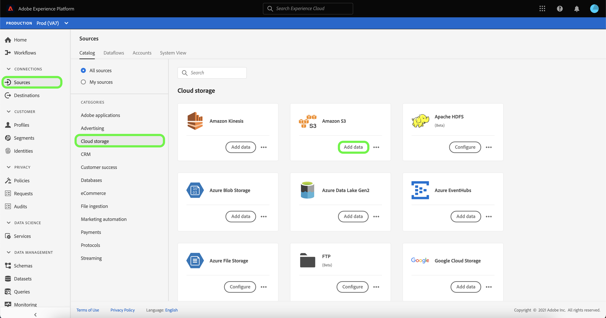

# Crea un [!DNL Amazon S3] connessione sorgente nell’interfaccia utente

I connettori sorgente in Adobe Experience Platform consentono di acquisire dati provenienti dall’esterno su base pianificata. Questa esercitazione descrive i passaggi necessari per creare un [!DNL Amazon S3]  (in appresso denominato &quot;[!DNL S3]&quot;) connettore di origine tramite l’interfaccia utente di Platform.

## Introduzione

Questa esercitazione richiede una buona comprensione dei seguenti componenti di Adobe Experience Platform:

- [[!DNL Experience Data Model (XDM)] Sistema](../../../../../xdm/home.md): Il framework standardizzato in base al quale l’Experience Platform organizza i dati sulla customer experience.
   - [Nozioni di base sulla composizione dello schema](../../../../../xdm/schema/composition.md): Scopri i blocchi di base degli schemi XDM, inclusi i principi chiave e le best practice nella composizione dello schema.
   - [Esercitazione sull’Editor di schema](../../../../../xdm/tutorials/create-schema-ui.md): Scopri come creare schemi personalizzati utilizzando l’interfaccia utente dell’Editor di schema.
- [[!DNL Real-Time Customer Profile]](../../../../../profile/home.md): Fornisce un profilo di consumatore unificato e in tempo reale basato su dati aggregati provenienti da più origini.

Se disponi già di una [!DNL S3] è possibile ignorare il resto del documento e passare all&#39;esercitazione su [configurazione di un flusso di dati](../../dataflow/batch/cloud-storage.md).

### Raccogli credenziali richieste

Per accedere al tuo [!DNL S3] bucket su Platform, devi fornire valori validi per le seguenti credenziali:

| Credenziali | Descrizione |
| ---------- | ----------- |
| `s3AccessKey` | ID chiave di accesso per il tuo [!DNL S3] secchio. |
| `s3SecretKey` | ID chiave segreta per il tuo [!DNL S3] secchio. |
| `serviceUrl` | (Facoltativo) Il [!DNL S3] endpoint a cui connettersi. Questo campo è obbligatorio quando il [!DNL S3] il bucket è specifico per la regione. Il formato per `serviceUrl` è: `https://s3.{REGION}.amazonaws.com/)`. |
| `bucketName` | La [!DNL S3] Il bucket contiene i dati e i metadati descrittivi corrispondenti. Le [!DNL S3] il nome del bucket deve essere compreso tra tre e 63 caratteri e deve iniziare e terminare con una lettera o un numero. Il nome del bucket può contenere solo lettere minuscole, numeri o trattini (`-`) e non può essere formattato come indirizzo IP. |
| `folderPath` | Il percorso della cartella nel [!DNL S3] bucket in cui vengono archiviati i dati. Questa credenziale è necessaria quando l’utente ha accesso limitato. |

Per ulteriori informazioni su come iniziare, visita [questo documento AWS](https://aws.amazon.com/blogs/security/wheres-my-secret-access-key/).

## Collega il tuo [!DNL S3] account

Nell’interfaccia utente di Platform, seleziona **[!UICONTROL Origini]** dalla barra di navigazione a sinistra per accedere al [!UICONTROL Origini] workspace. La [!UICONTROL Catalogo] in questa schermata vengono visualizzate diverse sorgenti per le quali è possibile creare un account.

Puoi selezionare la categoria appropriata dal catalogo sul lato sinistro dello schermo. In alternativa, è possibile trovare la sorgente specifica con cui si desidera lavorare utilizzando l’opzione di ricerca.

Sotto la **[!UICONTROL archiviazione cloud]** categoria, seleziona **[!UICONTROL Amazon S3]** quindi seleziona **[!UICONTROL Aggiungi dati]**.

La **[!UICONTROL Connessione ad Amazon S3]** viene visualizzata la pagina . In questa pagina è possibile utilizzare le nuove credenziali o le credenziali esistenti.

### Nuovo account

Se si utilizzano nuove credenziali, selezionare **[!UICONTROL Nuovo account]**. Nel modulo di input visualizzato, specificare un nome, una descrizione facoltativa e il [!DNL S3] credenziali. Al termine, seleziona **[!UICONTROL Connetti alla sorgente]** e quindi lasciare un po&#39; di tempo per stabilire la nuova connessione.

### Account esistente

Per collegare un account esistente, seleziona la [!DNL S3] account con cui desideri connetterti, quindi seleziona **[!UICONTROL Successivo]** per procedere.

## Passaggi successivi e risorse aggiuntive

Seguendo questa esercitazione, hai stabilito una connessione al tuo [!DNL S3] conto. Ora puoi passare all’esercitazione successiva e [configurare un flusso di dati per l’importazione di dati dall’archiviazione cloud in Platform](../../dataflow/batch/cloud-storage.md).
