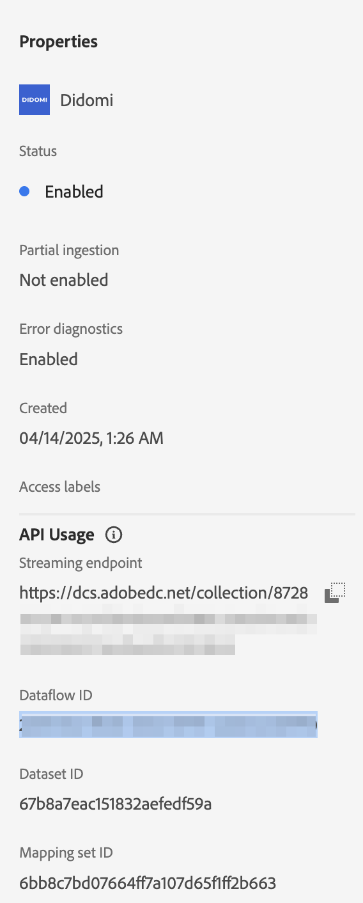

# Connetti [!DNL Didomi] ad Experience Platform

Leggere questa guida per scoprire come collegare l&#39;account [!DNL Didomi] a Adobe Experience Platform utilizzando l&#39;area di lavoro origini nell&#39;interfaccia utente.

>[!IMPORTANT]
>
>* Questa pagina della documentazione è stata creata dal team *Didomi*. Per richieste di informazioni o richieste di aggiornamento, contattale direttamente all&#39;indirizzo *support@didomi.io*.
>* Per istruzioni dettagliate sulla generazione della connessione, consulta la [documentazione del connettore di origine Didomi Adobe](https://developers.didomi.io/integrations/third-party-apps/preference-management-platform-integrations/Adobe-source-connector).

## Introduzione

Questo tutorial richiede una buona conoscenza dei seguenti componenti di Adobe Experience Platform:

* [[!DNL Experience Data Model (XDM)] Sistema](../../../../../xdm/home.md): framework standardizzato tramite il quale Experience Platform organizza i dati sull&#39;esperienza del cliente.
   * [Nozioni di base sulla composizione dello schema](../../../../../xdm/schema/composition.md): scopri i blocchi predefiniti di base degli schemi XDM, inclusi i principi chiave e le best practice nella composizione dello schema.
   * [Esercitazione sull&#39;editor di schemi](../../../../../xdm/tutorials/create-schema-ui.md): scopri come creare schemi personalizzati utilizzando l&#39;interfaccia utente dell&#39;editor di schemi.
* [[!DNL Real-Time Customer Profile]](../../../../../profile/home.md): fornisce un profilo consumer unificato e in tempo reale basato su dati aggregati provenienti da più origini.

### Configura il tuo account [!DNL Didomi]

Prima di procedere, assicurati di aver letto e completato i passaggi preliminari descritti nella [[!DNL Didomi] panoramica](../../../../connectors/consent-and-preferences/didomi.md#prerequisites) per connettere correttamente l&#39;account ad Experience Platform.

## Navigare nel catalogo delle origini

Nell&#39;interfaccia utente di Experience Platform, seleziona **[!UICONTROL Origini]** dal menu di navigazione a sinistra per accedere all&#39;area di lavoro *[!UICONTROL Origini]*. Scegliere una categoria o utilizzare la barra di ricerca per trovare l&#39;origine.

Per connettersi a [!DNL Didomi], passare alla categoria *[!UICONTROL Database]*, selezionare la scheda di origine **[!UICONTROL Didomi]**, quindi selezionare **[!UICONTROL Configurazione]**.

>[!TIP]
>
>Le origini nel catalogo delle origini visualizzano l&#39;opzione **[!UICONTROL Configura]** quando un&#39;origine specificata non dispone ancora di un account autenticato. Una volta creato un account autenticato, questa opzione diventa **[!UICONTROL Aggiungi dati]**.

## Aggiungere lo schema dei dati di origine

Quindi, utilizza l&#39;interfaccia *[!UICONTROL Seleziona dati]* per caricare il file JSON scaricato [nei passaggi preliminari](../../../../connectors/consent-and-preferences/didomi.md#download-the-sample-payload-file).

Puoi utilizzare l’interfaccia di anteprima per visualizzare la struttura del file del payload. Al termine, selezionare **[!UICONTROL Avanti]**.

## Fornisci i dettagli del flusso di dati

Quindi, devi fornire informazioni relative al set di dati e al flusso di dati.

### Dettagli del set di dati

Un set di dati è un costrutto di archiviazione e gestione per una raccolta di dati, in genere una tabella, che contiene uno schema (colonne) e dei campi (righe). I dati acquisiti correttamente in Experience Platform vengono memorizzati nel data lake come set di dati.

Durante questo passaggio, puoi utilizzare un set di dati esistente o crearne uno nuovo.

>[!NOTE]
>
>Indipendentemente dal fatto che si utilizzi un set di dati esistente o si crei un nuovo set di dati, è necessario assicurarsi che il set di dati sia **abilitato per l&#39;acquisizione del profilo**.

+++Seleziona per i passaggi per abilitare l’acquisizione del profilo, la diagnostica degli errori e l’acquisizione parziale.

Se il set di dati è abilitato per Real-Time Customer Profile, durante questo passaggio puoi attivare/disattivare **[!UICONTROL il set di dati profilo]** per abilitare i dati per l&#39;acquisizione del profilo. È inoltre possibile utilizzare questo passaggio per abilitare **[!UICONTROL Diagnostica errori]** e **[!UICONTROL Acquisizione parziale]**.

* **[!UICONTROL Diagnostica errori]**: selezionare **[!UICONTROL Diagnostica errori]** per indicare all&#39;origine di produrre diagnostica errori a cui fare successivamente riferimento durante il monitoraggio dell&#39;attività del set di dati e dello stato del flusso di dati.
* **[!UICONTROL Acquisizione parziale]**: l&#39;acquisizione parziale in batch consente di acquisire dati contenenti errori, fino a una determinata soglia configurabile. Questa funzione consente di acquisire correttamente in Experience Platform tutti i dati accurati, mentre tutti i dati errati vengono raggruppati separatamente con informazioni sul motivo della validità.

+++

### Dettagli del flusso di dati

Una volta configurato il set di dati, devi quindi fornire dettagli sul flusso di dati, tra cui un nome, una descrizione facoltativa e le configurazioni degli avvisi.

| Configurazioni del flusso di dati | Descrizione |
| --- | --- |
| Nome flusso di dati | Nome del flusso di dati.  Per impostazione predefinita, viene utilizzato il nome del file che si sta importando. |
| Descrizione | (Facoltativo) Breve descrizione del flusso di dati. |
| Avvisi | Experience Platform può generare avvisi basati su eventi a cui gli utenti possono abbonarsi; queste opzioni rappresentano un flusso di dati in esecuzione per attivarli.  Per ulteriori informazioni, leggere la [panoramica degli avvisi](../../alerts.md) <ul><li>**Inizio esecuzione flusso di dati origini**: selezionare questo avviso per ricevere una notifica all&#39;inizio dell&#39;esecuzione del flusso di dati.</li><li>**Esecuzione del flusso di dati origini completata**: selezionare questo avviso per ricevere una notifica se il flusso di dati termina senza errori.</li><li>**Errore di esecuzione del flusso di dati di origini**: selezionare questo avviso per ricevere una notifica se l&#39;esecuzione del flusso di dati termina con errori.</li></ul> |

{style="table-layout:auto"}

## Mappatura

Utilizza l’interfaccia di mappatura per mappare i dati di origine sui campi dello schema appropriati prima di acquisire i dati in Experience Platform.  Per ulteriori informazioni, leggere la [guida alla mappatura nell&#39;interfaccia utente](../../../../../data-prep/ui/mapping.md)

La mappatura viene utilizzata in modo specifico per trasferire **dati finalità** da [!DNL Didomi] nel set di dati di Experience Platform. Questi scopi rappresentano le scelte di consenso dell’utente (ad esempio per analisi, personalizzazione, pubblicità, ecc.) e sono gli unici campi di mappatura accettati in questa integrazione.

Utilizza il [payload del webhook di esempio scaricato](../../../../connectors/consent-and-preferences/didomi.md#download-the-sample-payload-file) dalle impostazioni del webhook [!DNL Didomi] per mappare ogni scopo di [!DNL Didomi] ai campi appropriati nel set di dati di Adobe.

Al termine, selezionare **[!UICONTROL Avanti]**.

## Rivedi

Viene visualizzato il passaggio *[!UICONTROL Rivedi]*, che consente di rivedere i dettagli del flusso di dati prima che venga creato. I dettagli sono raggruppati nelle seguenti categorie:

* **[!UICONTROL Connessione]**: mostra il nome dell&#39;account, la piattaforma di origine e il nome dell&#39;origine.
* **[!UICONTROL Assegna set di dati e mappa campi]**: mostra il set di dati di destinazione e lo schema a cui il set di dati è conforme.

Dopo aver confermato che i dettagli sono corretti, selezionare **[!UICONTROL Fine]**.

## Recuperare l’URL dell’endpoint di streaming

Una volta creata la connessione, viene visualizzata la pagina dei dettagli delle origini. Questa pagina mostra i dettagli della connessione appena creata, inclusi i flussi di dati, l’ID e l’URL dell’endpoint di streaming eseguiti in precedenza.

## Terminare la configurazione su Adobe

Una volta creato il flusso di dati, passa al catalogo *[!UICONTROL Sources]* e seleziona **[!UICONTROL Flussi di dati]**. Utilizza la directory dei flussi di dati per individuare il flusso di dati [!DNL Didomi] e accedere all&#39;interfaccia *[!UICONTROL Attività flusso di dati]*. Quindi, utilizza il pannello *[!UICONTROL Proprietà]* nella barra a destra e recupera i valori per:

* [!UICONTROL Endpoint di streaming]
* [!UICONTROL ID flusso di dati]

Nell’interfaccia utente di Experience Platform:

1. Dopo aver completato la configurazione, controlla i parametri di configurazione mancanti dalla configurazione iniziale del webhook.
2. Quando questi valori saranno disponibili, torna a Didomi e aggiorna la configurazione del webhook.

## Aggiornare la configurazione del webhook

Una volta completata la configurazione, torna alla console [!DNL Didomi] e aggiorna la configurazione del webhook con il tuo **URL endpoint di streaming** e il **ID flusso di dati**.

Una volta completato, [!DNL Didomi] inizierà a inviare eventi di gestione del consenso e delle preferenze tramite l&#39;integrazione e i dati verranno memorizzati nel set di dati di Adobe.

## Passaggi successivi

Seguendo questa esercitazione, è stato creato un flusso di dati per portare i dati batch dall&#39;origine [!DNL Didomi] ad Experience Platform. Per ulteriori risorse, consulta la documentazione descritta di seguito.

### Monitorare il flusso di dati

Una volta creato il flusso di dati, puoi monitorare i dati che vengono acquisiti tramite di esso per visualizzare informazioni su tassi di acquisizione, successo ed errori. Per ulteriori informazioni su come monitorare il flusso di dati, visita l&#39;esercitazione su [account di monitoraggio e flussi di dati nell&#39;interfaccia utente](../../../../../dataflows/ui/monitor-sources.md).

### Aggiornare il flusso di dati

Per aggiornare le configurazioni per la pianificazione, la mappatura e le informazioni generali dei flussi di dati, visita il tutorial su [aggiornamento dei flussi di dati di origine nell&#39;interfaccia utente](../../update-dataflows.md).

### Eliminare il flusso di dati

È possibile eliminare i flussi di dati non più necessari o creati in modo errato utilizzando la funzione **[!UICONTROL Elimina]** disponibile nell&#39;area di lavoro **[!UICONTROL Flussi di dati]**. Per ulteriori informazioni su come eliminare i flussi di dati, consulta l&#39;esercitazione su [eliminazione dei flussi di dati nell&#39;interfaccia utente](../../delete.md).
