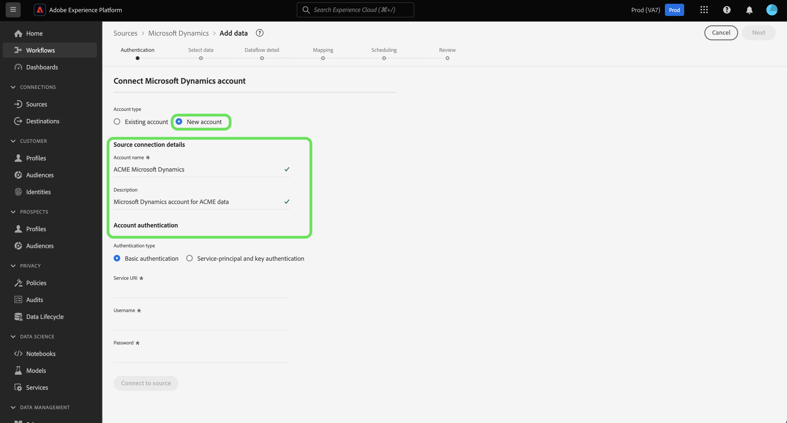

# Creare un connettore di origine Microsoft Dynamics nell&#39;interfaccia utente

I connettori di origine in Adobe Experience Platform consentono di acquisire dati CRM di origine esterna su base programmata. Questa esercitazione fornisce i passaggi per la creazione di un connettore di origine Microsoft Dynamics (in seguito denominato &quot;Dynamics&quot;) tramite l&#39;interfaccia utente della piattaforma.

## Introduzione

Questa esercitazione richiede una buona conoscenza dei seguenti componenti di Adobe Experience Platform:

* [Sistema](../../../../../xdm/home.md)XDM (Experience Data Model): Il framework standardizzato tramite il quale Experience Platform organizza i dati sull&#39;esperienza dei clienti.
   * [Nozioni di base sulla composizione](../../../../../xdm/schema/composition.md)dello schema: Scoprite i componenti di base degli schemi XDM, inclusi i principi chiave e le procedure ottimali nella composizione dello schema.
   * [Esercitazione](../../../../../xdm/tutorials/create-schema-ui.md)sull&#39;Editor di schema: Scoprite come creare schemi personalizzati utilizzando l&#39;interfaccia utente dell&#39;Editor di schema.
* [Profilo](../../../../../profile/home.md)cliente in tempo reale: Fornisce un profilo di consumo unificato e in tempo reale basato su dati aggregati provenienti da più origini.

Se si dispone già di un account Dynamics valido, è possibile ignorare il resto del documento e procedere all&#39;esercitazione sulla [configurazione di un flusso di dati](../../dataflow/crm.md).

### Raccogli credenziali richieste

| Credenziali | Descrizione |
| ---------- | ----------- |
| `serviceUri` | L&#39;URL del servizio dell&#39;istanza di Dynamics. |
| `username` | Nome utente per l’account utente di Dynamics. |
| `password` | La password per il tuo account Dynamics. |

Per ulteriori informazioni su come iniziare, consulta [questo documento](https://docs.microsoft.com/en-us/powerapps/developer/common-data-service/authenticate-oauth)di Dynamics.

## Collegamento dell&#39;account Dynamics

Dopo aver raccolto le credenziali richieste, puoi seguire i passaggi descritti di seguito per creare un nuovo account Dynamics per la connessione alla piattaforma.

Accedete ad [Adobe Experience Platform](https://platform.adobe.com) , quindi selezionate **[!UICONTROL Sources]** dalla barra di navigazione a sinistra per accedere all&#39; *[!UICONTROL Sources]* area di lavoro. Nella *[!UICONTROL Catalog]* schermata sono visualizzate diverse origini con le quali è possibile creare un account in entrata e ogni origine mostra il numero di account e flussi di dati esistenti associati a tali account.

Potete selezionare la categoria appropriata dal catalogo sul lato sinistro dello schermo. In alternativa, è possibile trovare l&#39;origine specifica con cui si desidera lavorare utilizzando l&#39;opzione di ricerca.

Sotto la *[!UICONTROL Databases]* categoria, selezionare **[!UICONTROL Dynamics]** fare clic **sull&#39;icona + (+)** per creare un nuovo connettore Dynamics.

Viene *[!UICONTROL Connect to Dynamics]* visualizzata la pagina. In questa pagina è possibile utilizzare credenziali nuove o già esistenti.

### Nuovo account

Se si utilizzano nuove credenziali, selezionare **[!UICONTROL New account]**. Nel modulo di input visualizzato, specificare un nome, una descrizione facoltativa e le credenziali Dynamics per la connessione. Al termine, selezionate **[!UICONTROL Connect]** e concedete un po&#39; di tempo per l&#39;impostazione del nuovo account.

### Account esistente

Per collegare un account esistente, seleziona l&#39;account Dynamics con cui vuoi connetterti, quindi seleziona **[!UICONTROL Next]** nell&#39;angolo superiore destro per continuare.

## Passaggi successivi

Seguendo questa esercitazione, hai stabilito una connessione al tuo account Dynamics. Ora puoi continuare con l’esercitazione successiva e [configurare un flusso di dati per l’inserimento di dati nella piattaforma](../../dataflow/crm.md).