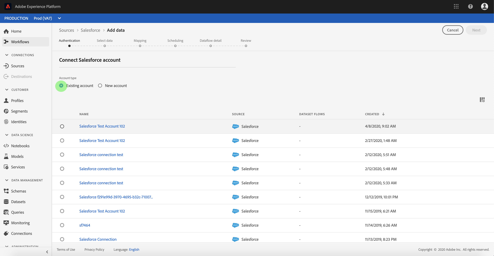

# Connetti il tuo account [!DNL Salesforce] ad Experience Platform tramite l&#39;interfaccia utente

Leggi questa guida per scoprire come collegare il tuo account [!DNL Salesforce] e inserire i tuoi dati di gestione delle relazioni con i clienti in Adobe Experience Platform utilizzando l&#39;interfaccia utente di Experience Platform.

## Introduzione

Questo tutorial richiede una buona conoscenza dei seguenti componenti di Experience Platform:

* [[!DNL Experience Data Model (XDM)] Sistema](../../../../../xdm/home.md): framework standardizzato tramite il quale Experience Platform organizza i dati sull&#39;esperienza del cliente.
   * [Nozioni di base sulla composizione dello schema](../../../../../xdm/schema/composition.md): scopri i blocchi predefiniti di base degli schemi XDM, inclusi i principi chiave e le best practice nella composizione dello schema.
   * [Esercitazione sull&#39;editor di schemi](../../../../../xdm/tutorials/create-schema-ui.md): scopri come creare schemi personalizzati utilizzando l&#39;interfaccia utente dell&#39;editor di schemi.
* [[!DNL Real-Time Customer Profile]](../../../../../profile/home.md): fornisce un profilo consumer unificato e in tempo reale basato su dati aggregati provenienti da più origini.

Se disponi già di un account [!DNL Salesforce] autenticato, puoi saltare il resto di questo documento e passare all&#39;esercitazione su [configurazione di un flusso di dati per i dati CRM](../../dataflow/crm.md).

### Raccogli le credenziali richieste {#gather-required-credentials}

L&#39;origine [!DNL Salesforce] supporta l&#39;autenticazione tramite le credenziali client OAuth2.

| Credenziali | Descrizione |
| --- | --- |
| URL ambiente | URL dell&#39;istanza di origine [!DNL Salesforce]. Il formato dell&#39;URL dell&#39;ambiente è `https://[domain].my.salesforce.com`. |
| ID client | L’ID client viene utilizzato insieme al segreto client come parte dell’autenticazione OAuth2. Insieme, l&#39;ID client e il segreto client consentono all&#39;applicazione di funzionare per conto dell&#39;account identificando l&#39;applicazione in [!DNL Salesforce]. |
| Segreto client | Il segreto client viene utilizzato insieme all’ID client come parte dell’autenticazione OAuth2. Insieme, l&#39;ID client e il segreto client consentono all&#39;applicazione di funzionare per conto dell&#39;account identificando l&#39;applicazione in [!DNL Salesforce]. |
| Versione API | Versione REST API dell&#39;istanza [!DNL Salesforce] in uso. Il valore della versione API deve essere formattato con un decimale. Ad esempio, se utilizzi la versione API `52`, devi immettere il valore come `52.0`. Se questo campo viene lasciato vuoto, Experience Platform utilizzerà automaticamente l’ultima versione disponibile. |
| Includi oggetti eliminati | Valore booleano utilizzato per determinare se includere i record soft eliminati. Se è impostato su true, i record eliminati temporaneamente possono essere inclusi nella query [!DNL Salesforce] e acquisiti dall&#39;account in Experience Platform. Se non si specifica la configurazione, il valore predefinito è `false`. |

Per ulteriori informazioni sull&#39;utilizzo di OAuth per [!DNL Salesforce], leggere la [[!DNL Salesforce] guida sui flussi di autorizzazione OAuth](https://help.salesforce.com/s/articleView?id=sf.remoteaccess_oauth_flows.htm&type=5).

## Connetti il tuo account [!DNL Salesforce]

Nell&#39;interfaccia utente di Experience Platform, passa a **[!UICONTROL Sources]** dal menu a sinistra per aprire l&#39;area di lavoro [!UICONTROL Sources]. Utilizzare il catalogo a sinistra per sfogliare le categorie o la barra di ricerca per trovare rapidamente l&#39;origine che si desidera connettere.

Selezionare **[!DNL Salesforce]** nella categoria *[!UICONTROL CRM]*, quindi selezionare **[!UICONTROL Add data]**.

>[!TIP]
>
>Nel catalogo delle origini, vedrai **[!UICONTROL Set up]** se non è connesso alcun account, oppure **[!UICONTROL Add data]** se un account è già autenticato.

Viene visualizzata la pagina **[!UICONTROL Connect to Salesforce]**. In questa pagina è possibile utilizzare nuove credenziali o credenziali esistenti.

### Usa un account esistente

Per utilizzare un account esistente, selezionare **[!UICONTROL Existing account]**, quindi selezionare l&#39;account che si desidera utilizzare dall&#39;elenco visualizzato. Al termine, selezionare **[!UICONTROL Next]** per continuare.

### Crea un nuovo account

Per creare un nuovo account, selezionare **[!UICONTROL New account]** e fornire un nome e una descrizione per il nuovo account [!DNL Salesforce].

Per le credenziali client OAuth 2, selezionare **[!UICONTROL OAuth2 Client Credential]** e quindi fornire i valori per le credenziali seguenti:

* URL ambiente
* ID client
* Segreto client
* Versione API
* Includi oggetti di eliminazione

Al termine, selezionare **[!UICONTROL Connect to source]**.

### Ignora anteprima dei dati di esempio {#skip-preview-of-sample-data}

Durante il passaggio di selezione dei dati, potrebbe verificarsi un timeout durante l’acquisizione di tabelle o file di dati di grandi dimensioni. Puoi saltare l’anteprima dei dati per evitare il timeout e visualizzare comunque lo schema, anche senza dati di esempio. Per ignorare l&#39;anteprima dei dati, attivare/disattivare **[!UICONTROL Skip previewing sample data]**.

Il resto del flusso di lavoro rimarrà invariato. L’unica avvertenza è che ignorare l’anteprima dei dati potrebbe impedire la convalida automatica dei campi calcolati e obbligatori durante il passaggio di mappatura, per cui dovrai convalidarli manualmente durante la mappatura.

## Passaggi successivi

Seguendo questa esercitazione, hai stabilito una connessione al tuo account [!DNL Salesforce]. Ora puoi continuare con l&#39;esercitazione successiva e [configurare un flusso di dati per inserire dati in [!DNL Experience Platform]](../../dataflow/crm.md).
