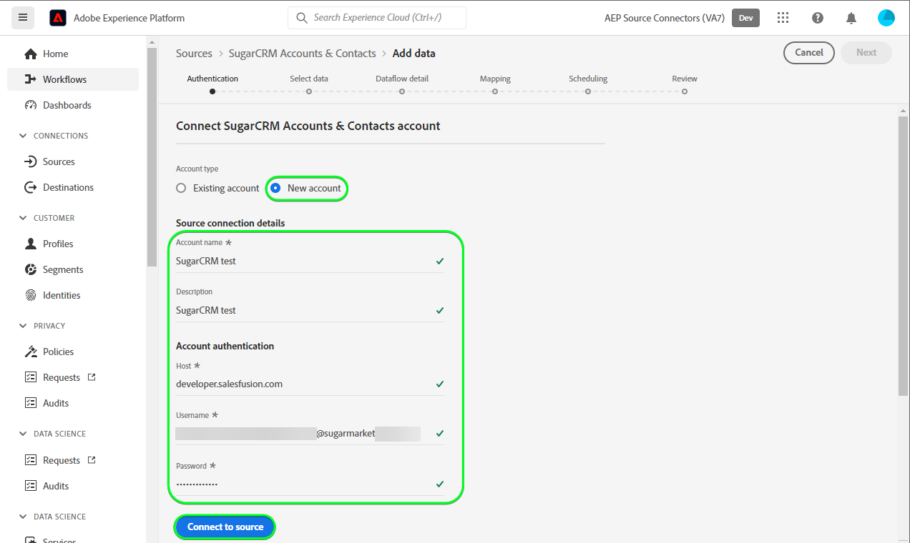

# (Beta) Crea un [!DNL SugarCRM Accounts & Contacts] connessione sorgente nell’interfaccia utente

>[!NOTE]
>
>La [!DNL SugarCRM Accounts & Contacts] la sorgente è in versione beta. Consulta la sezione [panoramica di origini](../../../../home.md#terms-and-conditions) per ulteriori informazioni sull’utilizzo di origini con etichetta beta.

Questa esercitazione fornisce i passaggi per la creazione di un [!DNL SugarCRM Accounts & Contacts] connessione di origine tramite l’interfaccia utente di Adobe Experience Platform.

## Introduzione

Questa esercitazione richiede una comprensione approfondita dei seguenti componenti dell&#39;Experience Platform:

* [[!DNL Experience Data Model (XDM)] Sistema](../../../../../xdm/home.md): Il quadro standardizzato [!DNL Experience Platform] organizza i dati sulla customer experience.
   * [Nozioni di base sulla composizione dello schema](../../../../../xdm/schema/composition.md): Scopri i blocchi di base degli schemi XDM, inclusi i principi chiave e le best practice nella composizione dello schema.
   * [Esercitazione sull’Editor di schema](../../../../../xdm/tutorials/create-schema-ui.md): Scopri come creare schemi personalizzati utilizzando l’interfaccia utente dell’Editor di schema.
* [[!DNL Real-Time Customer Profile]](../../../../../profile/home.md): Fornisce un profilo di consumatore unificato e in tempo reale basato su dati aggregati provenienti da più origini.

Se disponi già di una [!DNL SugarCRM] account, puoi saltare il resto del documento e procedere all&#39;esercitazione su [configurazione di un flusso di dati](../../dataflow/crm.md).

### Raccogli credenziali richieste

Per connettersi [!DNL SugarCRM Accounts & Contacts] in Platform, devi fornire valori per le seguenti proprietà di connessione:

| Credenziali | Descrizione | Esempio |
| --- | --- | --- |
| `Host` | L&#39;endpoint API SugarCRM a cui si connette l&#39;origine. | `developer.salesfusion.com` |
| `Username` | Nome utente dell&#39;account sviluppatore SugarCRM. | `abc.def@example.com@sugarmarketdemo000.com` |
| `Password` | Password del tuo account sviluppatore SugarCRM. | `123456789` |

### Creare uno schema di Platform

Prima di creare un [!DNL SugarCRM] connessione di origine, è inoltre necessario assicurarsi di creare prima uno schema Platform da utilizzare per la propria origine. Guarda l’esercitazione su [creazione di uno schema di Platform](../../../../../xdm/schema/composition.md) per passaggi completi sulla creazione di uno schema.

La [!DNL SugarCRM Accounts & Contacts] supporta più API. Ciò significa che è necessario creare uno schema separato, a seconda del tipo di oggetto che si sta utilizzando. Vedi gli esempi seguenti per gli schemi di account e contatti:

>[!BEGINTABS]

>[!TAB Account]

>[!TAB Contatti]

>[!ENDTABS]

## Collega il tuo [!DNL SugarCRM Accounts & Contacts] account

Nell’interfaccia utente di Platform, seleziona **[!UICONTROL Origini]** dalla barra di navigazione a sinistra per accedere al [!UICONTROL Origini] workspace. La [!UICONTROL Catalogo] in viene visualizzata una varietà di sorgenti con cui è possibile creare un account.

Puoi selezionare la categoria appropriata dal catalogo sul lato sinistro dello schermo. In alternativa, è possibile trovare la sorgente specifica con cui si desidera lavorare utilizzando l’opzione di ricerca.

Sotto la *CRM* categoria, seleziona **[!UICONTROL Account e contatti di SugarCRM]**, quindi seleziona **[!UICONTROL Aggiungi dati]**.

La **[!UICONTROL Connetti account e contatti di SugarCRM]** viene visualizzata la pagina . In questa pagina è possibile utilizzare le nuove credenziali o le credenziali esistenti.

### Account esistente

Per utilizzare un account esistente, seleziona la [!DNL SugarCRM Accounts & Contacts] account con cui si desidera creare un nuovo flusso di dati, quindi selezionare **[!UICONTROL Successivo]** per procedere.

### Nuovo account

Se stai creando un nuovo account, seleziona **[!UICONTROL Nuovo account]**, quindi fornisci un nome, una descrizione facoltativa e le tue credenziali. Al termine, seleziona **[!UICONTROL Connetti alla sorgente]** e quindi lasciare un po&#39; di tempo per stabilire la nuova connessione.

### Seleziona dati

Infine, devi selezionare il tipo di oggetto da inserire in Platform.

| Tipo di oggetto | Descrizione |
| --- | --- |
| `Accounts` | Le aziende con cui la tua organizzazione ha una relazione. |
| `Contacts` | Le singole persone con le quali la tua organizzazione ha una relazione consolidata. |

>[!BEGINTABS]

>[!TAB Account]

>[!TAB Contatti]

>[!ENDTABS]

## Passaggi successivi

Seguendo questa esercitazione, hai stabilito una connessione al tuo [!DNL SugarCRM Accounts & Contacts] conto. Ora puoi passare all’esercitazione successiva e [configurare un flusso di dati per l’importazione di dati in Platform](../../dataflow/crm.md).

## Risorse aggiuntive

Le sezioni seguenti forniscono risorse aggiuntive a cui puoi fare riferimento quando utilizzi il [!DNL SugarCRM] sorgente.

### Guardrail {#guardrails}

La [!DNL SugarCRM] Le tariffe di limitazione API sono 90 chiamate al minuto o 2000 chiamate al giorno, a seconda di quale dei due eventi si verifica per primo. Tuttavia, questa limitazione è stata aggirata aggiungendo un parametro alla specifica di connessione che ritarderà il tempo di richiesta in modo che il limite di tasso non venga mai raggiunto.

### Convalida {#validation}

Per verificare di aver configurato correttamente l&#39;origine e [!DNL SugarCRM Accounts & Contacts] i dati vengono acquisiti, segui i passaggi seguenti:

* Nell’interfaccia utente di Platform, seleziona **[!UICONTROL Visualizza flussi di dati]** accanto al [!DNL SugarCRM Accounts & Contacts] menu scheda nel catalogo origini. Quindi, seleziona **[!UICONTROL Anteprima set di dati]** per verificare i dati acquisiti.

* A seconda del tipo di oggetto con cui stai lavorando, puoi verificare i dati aggregati rispetto ai conteggi visibili nel [!DNL SugarMarket] Pagine degli account o dei contatti seguenti:

>[!BEGINTABS]

>[!TAB Account]

>[!TAB Contatti]

>[!ENDTABS]

>[!NOTE]
>
>La [!DNL SugarMarket] le pagine non includono i conteggi degli oggetti eliminati. Tuttavia, i dati recuperati tramite questa origine includeranno anche il conteggio eliminato, che verrebbe contrassegnato con un flag eliminato.