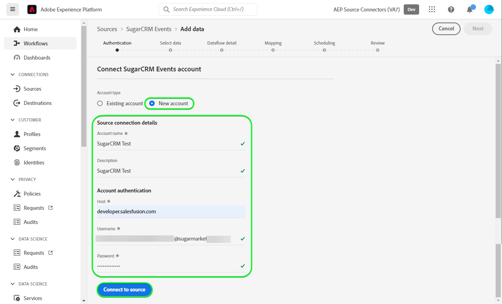

# Creare un [!DNL SugarCRM Events] connessione sorgente nell’interfaccia utente

Questo tutorial descrive i passaggi necessari per creare [!DNL SugarCRM Events] connessione sorgente mediante l’interfaccia utente di Adobe Experience Platform.

## Introduzione

Questo tutorial richiede una buona conoscenza dei seguenti componenti di Experience Platform:

* [[!DNL Experience Data Model (XDM)] Sistema](../../../../../xdm/home.md): il quadro standardizzato mediante il quale [!DNL Experience Platform] organizza i dati sull’esperienza del cliente.
   * [Nozioni di base sulla composizione dello schema](../../../../../xdm/schema/composition.md): scopri gli elementi di base degli schemi XDM, compresi i principi chiave e le best practice nella composizione dello schema.
   * [Esercitazione sull’editor di schemi](../../../../../xdm/tutorials/create-schema-ui.md): scopri come creare schemi personalizzati utilizzando l’interfaccia utente dell’Editor di schema.
* [[!DNL Real-Time Customer Profile]](../../../../../profile/home.md): fornisce un profilo consumer unificato e in tempo reale basato su dati aggregati provenienti da più origini.

Se disponi già di un [!DNL SugarCRM] account, puoi saltare il resto di questo documento e passare all’esercitazione su [configurazione di un flusso di dati](../../dataflow/crm.md).

### Raccogli le credenziali richieste

Per connettersi [!DNL SugarCRM Events] In Platform, è necessario fornire valori per le seguenti proprietà di connessione:

| Credenziali | Descrizione | Esempio |
| --- | --- | --- |
| `Host` | L’endpoint API di SugarCRM a cui l’origine si connette. | `developer.salesfusion.com` |
| `Username` | Nome utente dell’account sviluppatore SugarCRM. | `abc.def@example.com@sugarmarketdemo000.com` |
| `Password` | Password dell’account sviluppatore SugarCRM. | `123456789` |

### Creare uno schema di Platform per [!DNL SugarCRM]

Prima di creare un [!DNL SugarCRM] connessione sorgente, devi anche assicurarti di creare prima uno schema Platform da utilizzare per la sorgente. Guarda il tutorial su [creazione di uno schema di Platform](../../../../../xdm/schema/composition.md) per passaggi completi sulla creazione di uno schema.

>[!WARNING]
>
>Quando esegui la mappatura dello schema, assicurati di mappare anche il `event_id` e `timestamp` campi richiesti da Platform.

## Connetti [!DNL SugarCRM Events] account

Nell’interfaccia utente di Platform, seleziona **[!UICONTROL Sorgenti]** dalla barra di navigazione a sinistra per accedere al [!UICONTROL Sorgenti] Workspace. Il [!UICONTROL Catalogo] Nella schermata vengono visualizzate diverse origini con cui è possibile creare un account.

Puoi selezionare la categoria appropriata dal catalogo sul lato sinistro dello schermo. In alternativa, è possibile trovare l’origine specifica che si desidera utilizzare utilizzando l’opzione di ricerca.

Sotto *CRM* categoria, seleziona **[!UICONTROL Eventi SugarCRM]** e quindi selezionare **[!UICONTROL Aggiungi dati]**.

Il **[!UICONTROL Connetti account eventi SugarCRM]** viene visualizzata. In questa pagina è possibile utilizzare nuove credenziali o credenziali esistenti.

### Account esistente

Per utilizzare un account esistente, seleziona la [!DNL SugarCRM Events] account con cui vuoi creare un nuovo flusso di dati, quindi seleziona **[!UICONTROL Successivo]** per procedere.

### Nuovo account

Se stai creando un nuovo account, seleziona **[!UICONTROL Nuovo account]** e quindi fornisci un nome, una descrizione facoltativa e le tue credenziali. Al termine, seleziona **[!UICONTROL Connetti all&#39;origine]** e quindi lascia un po’ di tempo per stabilire la nuova connessione.

## Passaggi successivi

Seguendo questa esercitazione, hai stabilito una connessione con il tuo [!DNL SugarCRM Events] account. Ora puoi continuare con l’esercitazione successiva e [configurare un flusso di dati per inserire i dati in Platform](../../dataflow/crm.md).

## Risorse aggiuntive

Le sezioni seguenti forniscono ulteriori risorse a cui puoi fare riferimento quando utilizzi il [!DNL SugarCRM] sorgente.

### Guardrail {#guardrails}

Il [!DNL SugarCRM] Le velocità API sono di 90 chiamate al minuto o 2000 chiamate al giorno, a seconda di quale condizione si verifica per prima. Tuttavia, questa restrizione è stata aggirata aggiungendo un parametro alla specifica di connessione che ritarderà il tempo della richiesta in modo che il limite di velocità non venga mai raggiunto.

### Convalida {#validation}

Per verificare di aver impostato correttamente l’origine e [!DNL SugarCRM Events] I dati vengono acquisiti, segui i passaggi seguenti:

* Nell’interfaccia utente di Platform, seleziona **[!UICONTROL Visualizza flussi di dati]** accanto al [!DNL SugarCRM Events] nel catalogo sorgenti. Quindi, seleziona **[!UICONTROL Anteprima set di dati]** per verificare i dati acquisiti.

* A seconda del tipo di oggetto utilizzato, è possibile verificare i dati aggregati in base ai conteggi visibili sul [!DNL SugarMarket] Pagina eventi di seguito:

>[!NOTE]
>
>Il [!DNL SugarMarket] le pagine non includono i conteggi degli oggetti eliminati. Tuttavia, i dati recuperati tramite questa origine includeranno anche il conteggio eliminato, che sarà contrassegnato con un flag eliminato.
