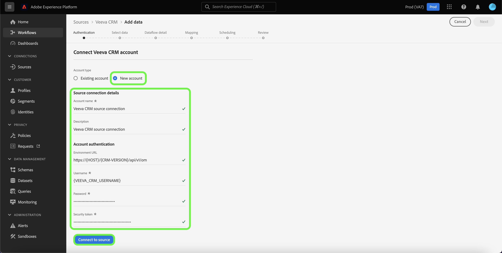

# Creare un [!DNL Veeva CRM] connessione sorgente nell’interfaccia utente

I connettori di origini in Adobe Experience Platform consentono di acquisire dati CRM di origine esterna in base a una pianificazione. Questo tutorial descrive i passaggi necessari per creare [!DNL Veeva CRM] connettore di origine che utilizza [!DNL Platform] dell&#39;utente.

## Introduzione

Questo tutorial richiede una buona conoscenza dei seguenti componenti di Adobe Experience Platform:

* [[!DNL Experience Data Model (XDM)] Sistema](../../../../../xdm/home.md): il quadro standardizzato mediante il quale [!DNL Experience Platform] organizza i dati sull’esperienza del cliente.
   * [Nozioni di base sulla composizione dello schema](../../../../../xdm/schema/composition.md): scopri gli elementi di base degli schemi XDM, compresi i principi chiave e le best practice nella composizione dello schema.
   * [Esercitazione sull’editor di schemi](../../../../../xdm/tutorials/create-schema-ui.md): scopri come creare schemi personalizzati utilizzando l’interfaccia utente dell’Editor di schema.
* [[!DNL Real-Time Customer Profile]](../../../../../profile/home.md): fornisce un profilo consumer unificato e in tempo reale basato su dati aggregati provenienti da più origini.

Se disponi già di un [!DNL Veeva CRM] account, puoi saltare il resto di questo documento e passare all’esercitazione su [configurazione di un flusso di dati](../../dataflow/crm.md).

### Raccogli le credenziali richieste

| Credenziali | Descrizione |
| ---------- | ----------- |
| `environmentUrl` | L’URL del [!DNL Veeva CRM] istanza di origine. |
| `username` | Nome utente per [!DNL Veeva CRM] account utente. |
| `password` | La password per [!DNL Veeva CRM] account utente. |
| `securityToken` | Token di sicurezza per [!DNL Veeva CRM] account utente. |

Per ulteriori informazioni su come iniziare, consulta [[!DNL Veeva CRM] documento](https://developer.veevacrm.com/doc/Content/rest-api.htm).

## Connetti [!DNL Veeva CRM] account

Dopo aver raccolto le credenziali richieste, puoi seguire la procedura riportata di seguito per collegare il tuo [!DNL Veeva CRM] account a [!DNL Platform].

Nell’interfaccia utente di Platform, seleziona **[!UICONTROL Sorgenti]** dalla barra di navigazione a sinistra per accedere al [!UICONTROL Sorgenti] Workspace. Il [!UICONTROL Catalogo] Nella schermata vengono visualizzate diverse origini per le quali è possibile creare un account con.

Puoi selezionare la categoria appropriata dal catalogo sul lato sinistro dello schermo. In alternativa, è possibile trovare l’origine specifica che si desidera utilizzare utilizzando l’opzione di ricerca.

Sotto [!UICONTROL CRM] categoria, seleziona **[!UICONTROL Veeva CRM]**, quindi selezionare **[!UICONTROL Aggiungi dati]**.

Il **[!UICONTROL Connetti account Veeva CRM]** viene visualizzata. In questa pagina è possibile utilizzare nuove credenziali o credenziali esistenti.

### Account esistente

Per utilizzare un account esistente, seleziona la [!DNL Veeva CRM] account con cui vuoi creare un nuovo flusso di dati, quindi seleziona **[!UICONTROL Successivo]** per procedere.

### Nuovo account

Se stai creando un nuovo account, seleziona **[!UICONTROL Nuovo account]**, quindi fornisci un nome, una descrizione facoltativa e il tuo [!DNL Veeva CRM] credenziali. Al termine, seleziona **[!UICONTROL Connetti all&#39;origine]** e quindi lascia un po’ di tempo per stabilire la nuova connessione.

## Passaggi successivi

Seguendo questa esercitazione, hai stabilito una connessione con il tuo [!DNL Veeva CRM] account. Ora puoi continuare con l’esercitazione successiva e [configurare un flusso di dati per inserire i dati in Platform](../../dataflow/crm.md).
