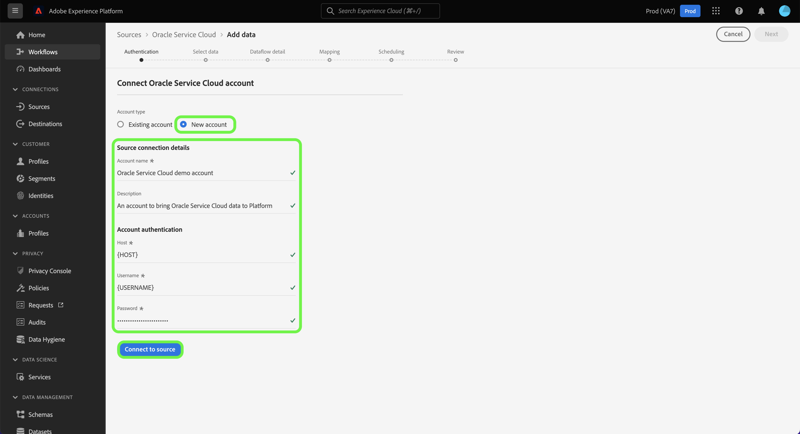

# Creare una connessione sorgente Oracle Service Cloud nell’interfaccia utente

Questa esercitazione descrive i passaggi necessari per creare una connessione sorgente Oracle Service Cloud utilizzando l’interfaccia utente di Adobe Experience Platform.

## Introduzione

Questa esercitazione richiede una comprensione approfondita dei seguenti componenti dell&#39;Experience Platform:

* [[!DNL Experience Data Model (XDM)] Sistema](../../../../../xdm/home.md): Il framework standardizzato in base al quale l’Experience Platform organizza i dati sulla customer experience.
   * [Nozioni di base sulla composizione dello schema](../../../../../xdm/schema/composition.md): Scopri i blocchi di base degli schemi XDM, inclusi i principi chiave e le best practice nella composizione dello schema.
   * [Esercitazione sull’Editor di schema](../../../../../xdm/tutorials/create-schema-ui.md): Scopri come creare schemi personalizzati utilizzando l’interfaccia utente dell’Editor di schema.
* [[!DNL Real-Time Customer Profile]](../../../../../profile/home.md): Fornisce un profilo di consumatore unificato e in tempo reale basato su dati aggregati provenienti da più origini.

Se disponi già di una connessione di origine Oracle Service Cloud valida, puoi saltare il resto del documento e passare all’esercitazione su [configurazione di un flusso di dati](../../dataflow/customer-success.md)

### Raccogli credenziali richieste

Per accedere al tuo account Oracle Service Cloud su [!DNL Platform], è necessario fornire i seguenti valori:

| Credenziali | Descrizione |
| ---------- | ----------- |
| Host | L’URL host dell’istanza di Oracle Service Cloud. |
| Nome utente | Nome utente per l’account utente di Oracle Service Cloud. |
| Password | Password dell’account Oracle Service Cloud. |

Per ulteriori informazioni sull’autenticazione dell’account Oracle Service Cloud, consulta [[!DNL Oracle] guida all’autenticazione](https://docs.oracle.com/en/cloud/saas/b2c-service/20c/cxska/OKCS_Authenticate_and_Authorize.html).

## Collegare l’account Oracle Service Cloud

Nell’interfaccia utente di Platform, seleziona **[!UICONTROL Origini]** dalla navigazione a sinistra per accedere al [!UICONTROL Origini] workspace. La [!UICONTROL Catalogo] visualizza una varietà di sorgenti che possono essere utilizzate per creare un account.

Puoi selezionare la categoria appropriata dal catalogo sul lato sinistro dello schermo. In alternativa, è possibile trovare la sorgente specifica con cui si desidera lavorare utilizzando la barra di ricerca.

Sotto la [!UICONTROL Successo cliente] categoria, seleziona **[!UICONTROL Oracle Service Cloud]** quindi seleziona **[!UICONTROL Aggiungi dati]**.

La **[!UICONTROL Connessione a Oracle Service Cloud]** viene visualizzata la pagina . In questa pagina è possibile utilizzare le nuove credenziali o le credenziali esistenti.

### Account esistente

Per collegare un account esistente, seleziona l’account Oracle Service Cloud con cui desideri connetterti, quindi seleziona **[!UICONTROL Successivo]** per procedere.

### Nuovo account

Se si utilizzano nuove credenziali, selezionare **[!UICONTROL Nuovo account]**. Nel modulo di input visualizzato, fornisci un nome, una descrizione facoltativa e le credenziali di Oracle Service Cloud. Al termine, seleziona **[!UICONTROL Connetti alla sorgente]** e quindi lasciare un po&#39; di tempo per stabilire la nuova connessione.

## Passaggi successivi

Seguendo questa esercitazione, hai stabilito una connessione al tuo account Oracle Service Cloud . Ora puoi passare all’esercitazione successiva e [configurare un flusso di dati per inserire i dati di successo dei clienti in Platform](../../dataflow/crm.md).
