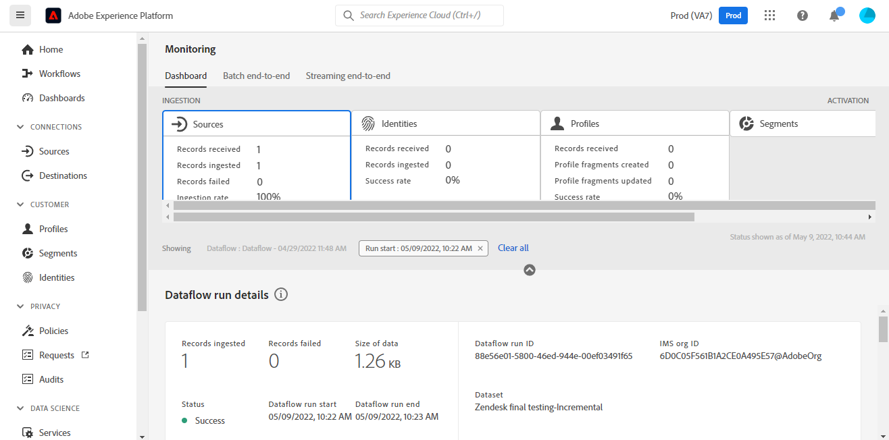

# Crea una connessione sorgente [!DNL Zendesk] nell&#39;interfaccia utente

Questo tutorial illustra i passaggi per la creazione di una connessione di origine [!DNL Zendesk] tramite l&#39;interfaccia utente di Adobe Experience Platform.

## Introduzione

Questo tutorial richiede una buona conoscenza dei seguenti componenti di Adobe Experience Platform:

* [[!DNL Experience Data Model (XDM)] Sistema](../../../../../xdm/home.md): framework standardizzato tramite il quale [!DNL Experience Platform] organizza i dati sull&#39;esperienza del cliente.
   * [Nozioni di base sulla composizione dello schema](../../../../../xdm/schema/composition.md): scopri i blocchi predefiniti di base degli schemi XDM, inclusi i principi chiave e le best practice nella composizione dello schema.
   * [Esercitazione sull&#39;editor di schemi](../../../../../xdm/tutorials/create-schema-ui.md): scopri come creare schemi personalizzati utilizzando l&#39;interfaccia utente dell&#39;editor di schemi.
* [[!DNL Real-Time Customer Profile]](../../../../../profile/home.md): fornisce un profilo consumer unificato e in tempo reale basato su dati aggregati provenienti da più origini.

### Raccogli le credenziali richieste

Per accedere al tuo account [!DNL Zendesk] su Platform, devi fornire i valori per le seguenti credenziali:

| Credenziali | Descrizione | Esempio |
| --- | --- | --- |
| Subdomain | Il dominio univoco specifico per l’account creato durante il processo di registrazione. | `yoursubdomain` |
| Token di accesso | Token API Zendesk. | `0lZnClEvkJSTQ7olGLl7PMhVq99gu26GTbJtf` |

Per ulteriori informazioni sull&#39;autenticazione dell&#39;origine [!DNL Zendesk], vedere [[!DNL Zendesk] panoramica origine](../../../../connectors/customer-success/zendesk.md).

### Crea uno schema di Platform per [!DNL Zendesk]

Prima di creare una connessione di origine [!DNL Zendesk], è inoltre necessario assicurarsi di creare uno schema Platform da utilizzare per l&#39;origine. Consulta il tutorial su [creazione di uno schema di Platform](../../../../../xdm/schema/composition.md) per i passaggi completi sulla creazione di uno schema.

Per ulteriori informazioni sullo schema [!DNL Zendesk] richiesto per [!DNL Zendesk Search API], consulta la sezione [limits](#limits) di seguito.

## Connetti il tuo account [!DNL Zendesk]

Nell&#39;interfaccia utente di Platform, seleziona **[!UICONTROL Origini]** dalla barra di navigazione a sinistra per accedere all&#39;area di lavoro [!UICONTROL Origini]. Nella schermata [!UICONTROL Catalogo] sono visualizzate diverse origini con cui è possibile creare un account.

Puoi selezionare la categoria appropriata dal catalogo sul lato sinistro dello schermo. In alternativa, è possibile trovare l’origine specifica che si desidera utilizzare utilizzando l’opzione di ricerca.

Nella categoria *Customer Success*, selezionare **[!UICONTROL Zendesk]**, quindi **[!UICONTROL Add data]**.

Viene visualizzata la pagina **[!UICONTROL Connetti account Zendesk]**. In questa pagina è possibile utilizzare nuove credenziali o credenziali esistenti.

### Account esistente

Per utilizzare un account esistente, seleziona l&#39;account *Zendesk* con cui vuoi creare un nuovo flusso di dati, quindi seleziona **[!UICONTROL Next]** per continuare.

### Nuovo account

Se stai creando un nuovo account, seleziona **[!UICONTROL Nuovo account]**, quindi fornisci un nome, una descrizione facoltativa e le tue credenziali. Al termine, selezionare **[!UICONTROL Connetti all&#39;origine]** e quindi attendere un po&#39; di tempo per stabilire la nuova connessione.

### Selezionare i dati

Una volta autenticata l’origine, la pagina si aggiorna in una struttura ad albero interattiva dello schema che consente di esplorare e ispezionare la gerarchia dei dati. Seleziona **[!UICONTROL Avanti]** per procedere.

## Passaggi successivi

Seguendo questa esercitazione, hai autenticato e creato una connessione di origine tra l&#39;account [!DNL Zendesk] e Platform. Ora puoi continuare con l&#39;esercitazione successiva e [creare un flusso di dati per portare i dati di successo dei clienti in Platform](../../dataflow/customer-success.md).

## Risorse aggiuntive

Le sezioni seguenti forniscono ulteriori risorse a cui è possibile fare riferimento quando si utilizza l&#39;origine [!DNL Zendesk].

### Convalida {#validation}

Di seguito vengono descritti i passaggi che è possibile eseguire per verificare che la connessione all&#39;origine [!DNL Zendesk] sia stata eseguita correttamente e che i profili [!DNL Zendesk] vengano acquisiti in Platform.

Nell&#39;interfaccia utente di Platform, seleziona **[!UICONTROL Set di dati]** dalla navigazione a sinistra per accedere all&#39;area di lavoro [!UICONTROL Set di dati]. Nella schermata [!UICONTROL Attività set di dati] vengono visualizzati i dettagli delle esecuzioni.

Quindi, seleziona l’ID di esecuzione del flusso di dati che desideri visualizzare per visualizzare dettagli specifici su tale esecuzione.

Infine, seleziona **[!UICONTROL Anteprima set di dati]** per visualizzare i dati acquisiti.

Puoi anche verificare i dati di Platform rispetto ai dati presenti nella pagina [!DNL Zendesk] > [!DNL Customers].

### Schema Zendesk

Nella tabella seguente sono elencate le mappature supportate che devono essere impostate per Zendesk.

>[!TIP]
>
>Per ulteriori informazioni sull&#39;API, vedere [API di ricerca Zendesk > Esporta risultati ricerca](https://developer.zendesk.com/api-reference/ticketing/ticket-management/search/#export-search-results).

| Origine | Tipo |
|---|---|
| `results.active` | Booleano |
| `results.alias` | Stringa |
| `results.created_at` | Stringa |
| `results.custom_role_id` | Intero |
| `results.default_group_id` | Intero |
| `results.details` | Stringa |
| `results.email` | Stringa |
| `results.external_id` | Intero |
| `results.iana_time_zone` | Stringa |
| `results.id` | Intero |
| `results.last_login_at` | Stringa |
| `results.locale` | Stringa |
| `results.locale_id` | Intero |
| `results.moderator` | Booleano |
| `results.name` | Stringa |
| `results.notes` | Stringa |
| `results.only_private_comments` | Booleano |
| `results.organization_id` | Intero |
| `results.phone` | Stringa |
| `results.photo` | Stringa |
| `results.report_csv` | Booleano |
| `results.restricted_agent` | Booleano |
| `results.result_type` | Stringa |
| `results.role` | Stringa |
| `results.role_type` | Intero |
| `results.shared` | Booleano |
| `results.shared_agent` | Booleano |
| `results.shared_phone_number` | Booleano |
| `results.signature` | Stringa |
| `results.suspended` | Booleano |
| `results.ticket_restriction` | Stringa |
| `results.time_zone` | Stringa |
| `results.two_factor_auth_enabled` | Booleano |
| `results.updated_at` | Stringa |
| `results.url` | Stringa |
| `results.verified` | Booleano |

{style="table-layout:auto"}

### Limiti {#limits}

* [API di ricerca Zendesk > Esporta risultati ricerca](https://developer.zendesk.com/api-reference/ticketing/ticket-management/search/#export-search-results) restituisce un massimo di 1000 record per pagina.
   * Il valore per il parametro ``filter[type]`` è impostato su ``user`` e pertanto la connessione Zendesk restituisce solo gli utenti.
   * Numero di risultati per pagina gestito dal parametro ``page[size]``. Valore impostato su ``100``. Questo viene fatto per ridurre l&#39;impatto dei vincoli di riduzione della velocità stabiliti da Zendesk.
   * Vedi [Limiti](https://developer.zendesk.com/api-reference/ticketing/ticket-management/search/#limits) e [Paginazione](https://developer.zendesk.com/api-reference/ticketing/ticket-management/search/#pagination-1).
   * È inoltre possibile fare riferimento a [Paginazione tramite elenchi tramite l&#39;impaginazione del cursore](https://developer.zendesk.com/documentation/developer-tools/pagination/paginating-through-lists-using-cursor-pagination/).
