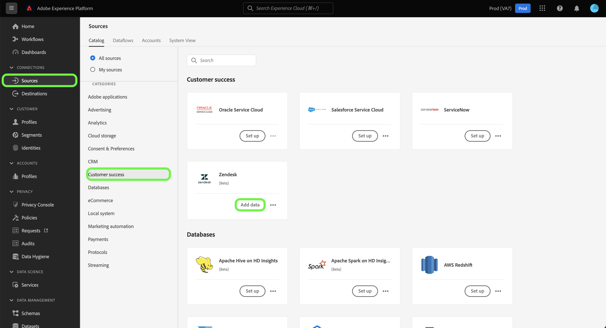

# (Beta) Crea un [!DNL Zendesk] connessione sorgente nell’interfaccia utente

>[!NOTE]
>
>La [!DNL Zendesk] la sorgente è in versione beta. Consulta la sezione [panoramica di origini](../../../../home.md#terms-and-conditions) per ulteriori informazioni sull’utilizzo di origini con etichetta beta.

Questa esercitazione fornisce i passaggi per la creazione di un [!DNL Zendesk] connessione di origine tramite l’interfaccia utente di Adobe Experience Platform.

## Introduzione

Questa esercitazione richiede una buona comprensione dei seguenti componenti di Adobe Experience Platform:

* [[!DNL Experience Data Model (XDM)] Sistema](../../../../../xdm/home.md): Il quadro standardizzato [!DNL Experience Platform] organizza i dati sulla customer experience.
   * [Nozioni di base sulla composizione dello schema](../../../../../xdm/schema/composition.md): Scopri i blocchi di base degli schemi XDM, inclusi i principi chiave e le best practice nella composizione dello schema.
   * [Esercitazione sull’Editor di schema](../../../../../xdm/tutorials/create-schema-ui.md): Scopri come creare schemi personalizzati utilizzando l’interfaccia utente dell’Editor di schema.
* [[!DNL Real-Time Customer Profile]](../../../../../profile/home.md): Fornisce un profilo di consumatore unificato e in tempo reale basato su dati aggregati provenienti da più origini.

### Raccogli credenziali richieste

Per accedere al tuo [!DNL Zendesk] account su Platform, devi fornire i valori per le seguenti credenziali:

| Credenziali | Descrizione | Esempio |
| --- | --- | --- |
| Subdomain | Dominio univoco specifico dell&#39;account creato durante il processo di registrazione. | `yoursubdomain` |
| Token di accesso | Token API Zendesk. | `0lZnClEvkJSTQ7olGLl7PMhVq99gu26GTbJtf` |

Per ulteriori informazioni sull&#39;autenticazione della [!DNL Zendesk] sorgente, vedi [[!DNL Zendesk] panoramica di origine](../../../../connectors/customer-success/zendesk.md).

### Creare uno schema di Platform per [!DNL Zendesk]

Prima di creare un [!DNL Zendesk] connessione di origine, è inoltre necessario assicurarsi di creare prima uno schema Platform da utilizzare per la propria origine. Guarda l’esercitazione su [creazione di uno schema di Platform](../../../../../xdm/schema/composition.md) per passaggi completi sulla creazione di uno schema.

Per ulteriori informazioni sulle [!DNL Zendesk] schema richiesto per [!DNL Zendesk Search API], fare riferimento alla [limiti](#limits) di seguito.

## Collega il tuo [!DNL Zendesk] account

Nell’interfaccia utente di Platform, seleziona **[!UICONTROL Origini]** dalla barra di navigazione a sinistra per accedere al [!UICONTROL Origini] workspace. La [!UICONTROL Catalogo] in viene visualizzata una varietà di sorgenti con cui è possibile creare un account.

Puoi selezionare la categoria appropriata dal catalogo sul lato sinistro dello schermo. In alternativa, è possibile trovare la sorgente specifica con cui si desidera lavorare utilizzando l’opzione di ricerca.

Sotto la *Successo del cliente* categoria, seleziona **[!UICONTROL Zendesk]**, quindi seleziona **[!UICONTROL Aggiungi dati]**.

La **[!UICONTROL Collega account Zendesk]** viene visualizzata la pagina . In questa pagina è possibile utilizzare le nuove credenziali o le credenziali esistenti.

### Account esistente

Per utilizzare un account esistente, seleziona la *Zendesk* account con cui si desidera creare un nuovo flusso di dati, quindi selezionare **[!UICONTROL Successivo]** per procedere.

### Nuovo account

Se stai creando un nuovo account, seleziona **[!UICONTROL Nuovo account]**, quindi fornisci un nome, una descrizione facoltativa e le tue credenziali. Al termine, seleziona **[!UICONTROL Connetti alla sorgente]** e quindi lasciare un po&#39; di tempo per stabilire la nuova connessione.

### Seleziona dati

Una volta autenticata l’origine, la pagina viene aggiornata in una struttura dello schema interattiva che consente di esplorare e ispezionare la gerarchia dei dati. Seleziona **[!UICONTROL Successivo]** per procedere.

## Passaggi successivi

Seguendo questa esercitazione, hai autenticato e creato una connessione sorgente tra [!DNL Zendesk] account e piattaforma. Ora puoi passare all’esercitazione successiva e [creare un flusso di dati per inserire i dati di successo dei clienti in Platform](../../dataflow/customer-success.md).

## Risorse aggiuntive

Le sezioni seguenti forniscono risorse aggiuntive a cui puoi fare riferimento quando utilizzi il [!DNL Zendesk] sorgente.

### Convalida {#validation}

Di seguito sono descritti i passaggi che puoi eseguire per verificare di aver connesso correttamente il tuo [!DNL Zendesk] la fonte e [!DNL Zendesk] i profili vengono acquisiti in Platform.

Nell’interfaccia utente di Platform, seleziona **[!UICONTROL Set di dati]** dalla navigazione a sinistra per accedere al [!UICONTROL Set di dati] workspace. La [!UICONTROL Attività set di dati] visualizza i dettagli delle esecuzioni.

Quindi, seleziona l’ID di esecuzione del flusso di dati che desideri visualizzare per visualizzare dettagli specifici sull’esecuzione del flusso di dati.

Infine, seleziona **[!UICONTROL Anteprima set di dati]** per visualizzare i dati acquisiti.

Puoi anche verificare i dati della Platform rispetto a quelli presenti nella [!DNL Zendesk] > [!DNL Customers] pagina.

### Schema Zendesk

La tabella seguente elenca le mappature supportate che devono essere impostate per Zendesk.

>[!TIP]
>
>Vedi [API di ricerca Zendesk > Esporta risultati di ricerca](https://developer.zendesk.com/api-reference/ticketing/ticket-management/search/#export-search-results) per ulteriori informazioni sull’API.

| Origine | Tipo |
|---|---|
| `results.active` | Booleano |
| `results.alias` | Stringa |
| `results.created_at` | Stringa |
| `results.custom_role_id` | Intero |
| `results.default_group_id` | Intero |
| `results.details` | Stringa |
| `results.email` | Stringa |
| `results.external_id` | Intero |
| `results.iana_time_zone` | Stringa |
| `results.id` | Intero |
| `results.last_login_at` | Stringa |
| `results.locale` | Stringa |
| `results.locale_id` | Intero |
| `results.moderator` | Booleano |
| `results.name` | Stringa |
| `results.notes` | Stringa |
| `results.only_private_comments` | Booleano |
| `results.organization_id` | Intero |
| `results.phone` | Stringa |
| `results.photo` | Stringa |
| `results.report_csv` | Booleano |
| `results.restricted_agent` | Booleano |
| `results.result_type` | Stringa |
| `results.role` | Stringa |
| `results.role_type` | Intero |
| `results.shared` | Booleano |
| `results.shared_agent` | Booleano |
| `results.shared_phone_number` | Booleano |
| `results.signature` | Stringa |
| `results.suspended` | Booleano |
| `results.ticket_restriction` | Stringa |
| `results.time_zone` | Stringa |
| `results.two_factor_auth_enabled` | Booleano |
| `results.updated_at` | Stringa |
| `results.url` | Stringa |
| `results.verified` | Booleano |

{style=&quot;table-layout:auto&quot;}

### Limiti {#limits}

* La [API di ricerca Zendesk > Esporta risultati di ricerca](https://developer.zendesk.com/api-reference/ticketing/ticket-management/search/#export-search-results) restituisce un massimo di 1000 record per pagina.
   * Il valore per ``filter[type]`` è impostato su ``user`` e quindi la connessione Zendesk restituisce solo gli utenti.
   * Il numero di risultati per pagina è gestito dal ``page[size]`` parametro . Il valore è impostato su ``100``. Questo è fatto per ridurre l&#39;impatto dei vincoli di riduzione della velocità fissati da Zendesk.
   * Vedi [Limiti](https://developer.zendesk.com/api-reference/ticketing/ticket-management/search/#limits) e [Impaginazione](https://developer.zendesk.com/api-reference/ticketing/ticket-management/search/#pagination-1).
   * Puoi anche fare riferimento a [Impaginazione tramite elenchi tramite impaginazione del cursore](https://developer.zendesk.com/documentation/developer-tools/pagination/paginating-through-lists-using-cursor-pagination/).
