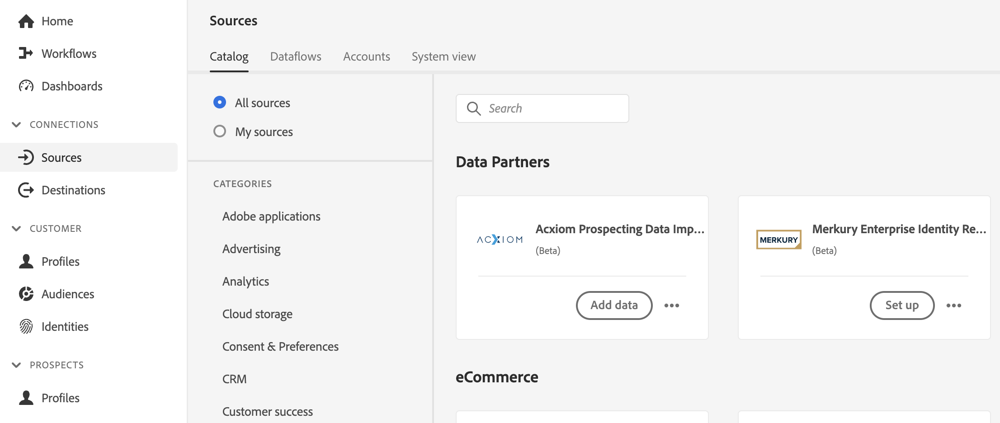
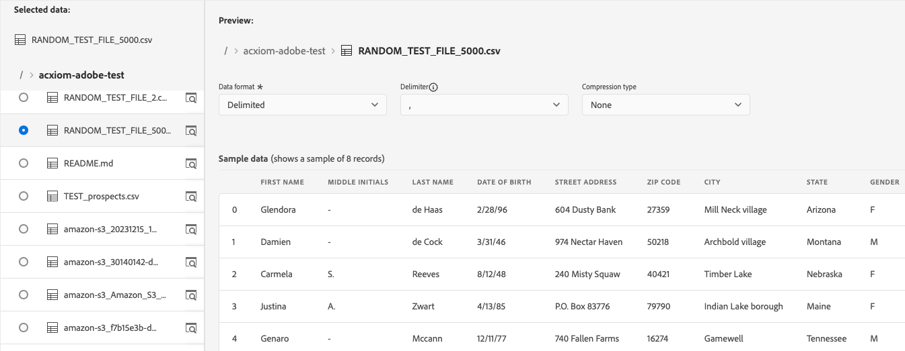
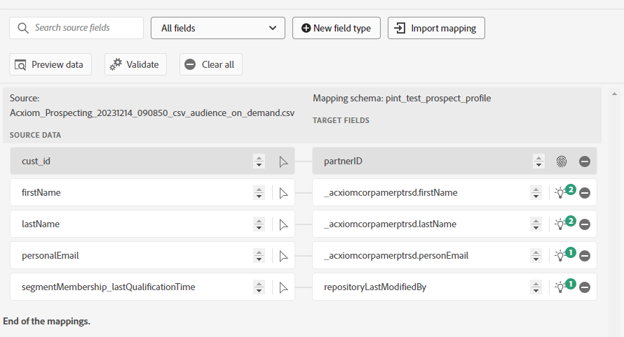

# Creare un [!DNL Acxiom Prospecting Data Import] connessione sorgente e flusso di dati nell’interfaccia utente

>[!NOTE]
>
>Il [!DNL Acxiom Prospecting Data Import] sorgente in versione beta. Leggi le [panoramica sulle origini](../../../../home.md#terms-and-conditions) per ulteriori informazioni sull’utilizzo di fonti etichettate beta.

[!DNL Acxiom]L’importazione di dati di prospezione di per Adobe Real-time Customer Data Platform è un processo per fornire il pubblico di potenziali clienti più produttivo possibile. [!DNL Acxiom] prende i dati di prime parti di Real-Time CDP tramite un’esportazione sicura e li esegue attraverso un sistema pluripremiato di igiene e risoluzione delle identità. Viene generato un file di dati da utilizzare come elenco di soppressione. Questo file di dati viene quindi confrontato con il database globale di Acxiom, che consente di personalizzare gli elenchi dei prospect per l’importazione.

È possibile utilizzare [!DNL Acxiom] origine per recuperare e mappare le risposte da Acxiom prospect service utilizzando Amazon S3 come punto di rilascio.

Leggi questa esercitazione per scoprire come creare un’ [!DNL Acxiom Prospecting Data Import] connessione sorgente e flusso di dati tramite l’interfaccia utente di Adobe Experience Platform.

## Prerequisiti {#prerequisites}

Questo tutorial richiede una buona conoscenza dei seguenti componenti di Experience Platform:

* [[!DNL Experience Data Model (XDM)] Sistema](../../../../../xdm/home.md): framework standardizzato tramite il quale Experienci Platform organizza i dati sull’esperienza del cliente.
   * [Nozioni di base sulla composizione dello schema](../../../../../xdm/schema/composition.md): scopri gli elementi di base degli schemi XDM, compresi i principi chiave e le best practice nella composizione dello schema.
   * [Esercitazione sull’editor di schemi](../../../../../xdm/tutorials/create-schema-ui.md): scopri come creare schemi personalizzati utilizzando l’interfaccia utente dell’Editor di schema.
* [[!DNL Real-Time Customer Profile]](../../../../../profile/home.md): fornisce un profilo consumer unificato e in tempo reale basato su dati aggregati provenienti da più origini.
* [[!DNL Prospect Profile]](../../../../../profile/ui/prospect-profile.md): scopri come creare e utilizzare il profilo potenziale per raccogliere informazioni su clienti sconosciuti utilizzando informazioni di terze parti.

### Raccogli le credenziali richieste

Per accedere al bucket in Experienci Platform, devi fornire valori validi per le seguenti credenziali:

| Credenziali | Descrizione |
| --- | --- |
| [!DNL Acxiom] chiave di autenticazione | Chiave di autenticazione. Puoi recuperare questo valore da [!DNL Acxiom] team. |
| [!DNL Amazon S3] chiave di accesso | ID della chiave di accesso per il bucket. Puoi recuperare questo valore da [!DNL Acxiom] team. |
| [!DNL Amazon S3] chiave segreta | ID della chiave segreta del bucket. Puoi recuperare questo valore da [!DNL Acxiom] team. |
| Nome del bucket | Questo è il bucket in cui verranno condivisi i file. Puoi recuperare questo valore da [!DNL Acxiom] team. |

>[!IMPORTANT]
>
>Devi avere entrambi **[!UICONTROL Visualizza origini]** e **[!UICONTROL Gestisci origini]** autorizzazioni abilitate per il tuo account per connettersi al tuo [!DNL Acxiom] da Experience Platform. Contatta l’amministratore del prodotto per ottenere le autorizzazioni necessarie. Per ulteriori informazioni, leggere [guida all’interfaccia utente per il controllo degli accessi](../../../../../access-control/ui/overview.md).

## Connetti [!DNL Acxiom] account

Nell’interfaccia utente di Platform, seleziona **[!UICONTROL Sorgenti]** dalla barra di navigazione a sinistra per accedere al [!UICONTROL Sorgenti] Workspace. Il [!UICONTROL Catalogo] Nella schermata vengono visualizzate diverse origini per le quali è possibile creare un account con.

Puoi selezionare la categoria appropriata dal catalogo sul lato sinistro dello schermo. In alternativa, è possibile trovare l’origine specifica che si desidera utilizzare utilizzando l’opzione di ricerca.

Sotto **[!UICONTROL Partner dati e identità]** categoria, seleziona **[!UICONTROL Importazione dati di previsione Acxiom]** e quindi seleziona **[!UICONTROL Configurazione]**.

>[!TIP]
>
>Una scheda sorgente che visualizza **[!UICONTROL Aggiungi dati]** significa che l’origine dispone già di un account autenticato. Dall&#39;altro, una scheda sorgente che visualizza **[!UICONTROL Configurazione]** significa che devi fornire le credenziali e creare un nuovo account per utilizzare tale origine.

### Crea un nuovo account

Se si utilizzano nuove credenziali, selezionare **[!UICONTROL Nuovo account]**. Nel modulo di input visualizzato, fornisci un nome, una descrizione facoltativa e il [!DNL Acxiom] credenziali. Al termine, seleziona **[!UICONTROL Connetti all&#39;origine]** e quindi lascia un po’ di tempo per stabilire la nuova connessione.

| Credenziali | Descrizione |
| --- | --- |
| Nome account | Nome dell’account. |
| Descrizione | (Facoltativo) Breve spiegazione dello scopo del conto. |
| [!DNL Acxiom] chiave di autenticazione | Il [!DNL Acxiom]Chiave fornita da per l’approvazione dell’account. Prima di poter stabilire una connessione al database, è necessario che il valore corrisponda a quello corretto.  La chiave deve contenere 24 caratteri e può includere solo: A-Z, a-z e 0-9. |
| Chiave di accesso S3 | La chiave di accesso S3 fa riferimento alla posizione di Amazon S3. Questo viene fornito dall’amministratore quando vengono definite le autorizzazioni del ruolo S3. |
| Chiave segreta S3 | La chiave segreta S3 fa riferimento alla posizione di Amazon S3. Questo viene fornito dall’amministratore quando vengono definite le autorizzazioni del ruolo S3. |
| s3SessionToken | (Facoltativo) Il valore del token di autenticazione durante la connessione a S3. |
| serviceUrl | (Facoltativo) La posizione URL da utilizzare per la connessione a S3 in una posizione non standard. |
| Nome del bucket | (Facoltativo) Nome del bucket S3 impostato su S3 che funge da percorso iniziale nella selezione dei dati. |
| Percorso della cartella | Se vengono utilizzate sottodirectory in un bucket, puoi anche specificare un percorso come percorso iniziale nella selezione dei dati. |

### Usa un account esistente

Per utilizzare un account esistente, seleziona **[!UICONTROL Account esistente]**.

Selezionare un account dall&#39;elenco per visualizzarne i dettagli. Dopo aver selezionato un account, seleziona **[!UICONTROL Successivo]** per procedere.

## Seleziona dati

Seleziona il file da acquisire dal bucket e dalla sottodirectory desiderati. È possibile fornire un’anteprima dei dati una volta definito il delimitatore e il tipo di compressione. Dopo aver selezionato il file, seleziona **[!UICONTROL Successivo]** per procedere.

>[!NOTE]
>
>Sebbene siano elencati i tipi di file JSON e Parquet, non è necessario o previsto che vengano utilizzati durante il [!DNL Acxiom] flusso di lavoro sorgente.

## Fornisci i dettagli del set di dati e del flusso di dati

Quindi, devi fornire informazioni relative al set di dati e al flusso di dati.

### Dettagli del set di dati

>[!BEGINTABS]

>[!TAB Utilizza un nuovo set di dati]

Un set di dati è un costrutto di archiviazione e gestione per una raccolta di dati, in genere una tabella, che contiene uno schema (colonne) e dei campi (righe). I dati acquisiti correttamente in Experienci Platform vengono memorizzati nel data lake come set di dati. Per utilizzare un nuovo set di dati, seleziona **[!UICONTROL Nuovo set di dati]**.

| Dettagli nuovo set di dati | Descrizione |
| --- | --- |
| Nome set di dati di output | Nome del nuovo set di dati. |
| Descrizione | (Facoltativo) Breve spiegazione dello scopo del set di dati. |
| Schema | Elenco a discesa degli schemi esistenti nell’organizzazione. Puoi anche creare uno schema personalizzato prima del processo di configurazione sorgente. Per ulteriori informazioni, consulta la guida su [creazione di uno schema nell’interfaccia utente](../../../../../xdm/tutorials/create-schema-ui.md). |

>[!TAB Usa un set di dati esistente]

Per utilizzare un set di dati esistente, seleziona **[!UICONTROL Set di dati esistente]**.

Puoi selezionare **[!UICONTROL Ricerca avanzata]** per visualizzare una finestra di tutti i set di dati della tua organizzazione, inclusi i rispettivi dettagli, ad esempio se sono abilitati per l’acquisizione in Real-Time Customer Profile.

>[!ENDTABS]

### Dettagli del flusso di dati

Durante questo passaggio, se il set di dati è abilitato per Profilo, puoi selezionare **[!UICONTROL Set di dati profilo]** attiva per abilitare i dati per l’acquisizione del profilo. Puoi anche abilitare [!UICONTROL Diagnostica degli errori] e [!UICONTROL Acquisizione parziale].

* **Diagnostica errori** - Seleziona **Diagnostica degli errori** per indicare all’origine di produrre diagnostica degli errori a cui puoi fare successivamente riferimento utilizzando le API. Per ulteriori informazioni, leggere [panoramica sulla diagnostica degli errori](../../../../../ingestion/quality/error-diagnostics.md)
* **Abilita acquisizione parziale** - L’acquisizione in batch parziale consiste nella capacità di acquisire dati contenenti errori, fino a una determinata soglia. Con questa funzionalità, gli utenti possono inserire correttamente in Adobe Experience Platform tutti i dati corretti, mentre tutti i dati errati vengono raggruppati in batch separatamente, insieme ai dettagli sul motivo per cui non sono validi.  Per ulteriori informazioni, leggere [Panoramica dell’acquisizione parziale](../../../../../ingestion/batch-ingestion/partial.md)

| Configurazioni del flusso di dati | Descrizione |
| --- | --- |
| Nome flusso di dati | Nome del flusso di dati.  Per impostazione predefinita, viene utilizzato il nome del file che si sta importando. |
| Descrizione | (Facoltativo) Breve descrizione del flusso di dati. |
| Avvisi | Experienci Platform può generare avvisi basati su eventi a cui gli utenti possono abbonarsi; queste opzioni rappresentano un flusso di dati in esecuzione per attivarli.  Per ulteriori informazioni, leggere [panoramica degli avvisi](../../alerts.md) <ul><li>**Inizio esecuzione flusso di dati origini**: seleziona questo avviso per ricevere una notifica all’inizio dell’esecuzione del flusso di dati.</li><li>**Esecuzione flusso di dati origini completata**: seleziona questo avviso per ricevere una notifica se il flusso di dati termina senza errori.</li><li>**Errore di esecuzione del flusso di dati origini**: seleziona questo avviso per ricevere una notifica se l’esecuzione del flusso di dati termina con errori.</li></ul> |

## Mappatura

Utilizza l’interfaccia di mappatura per mappare i dati di origine sui campi dello schema appropriati prima di acquisire i dati da Experienci Platform.  Per ulteriori informazioni, leggere [guida alla mappatura nell’interfaccia utente di](../../../../../data-prep/ui/mapping.md)

## Pianificare l’acquisizione del flusso di dati

Utilizza l’interfaccia di pianificazione per definire la pianificazione di acquisizione del flusso di dati.

* **Frequenza**: configura la frequenza per indicare la frequenza con cui deve essere eseguito il flusso di dati. Puoi impostare la frequenza su: una volta, un minuto, un’ora, un giorno o una settimana.
* **Interval**: dopo aver selezionato una frequenza, puoi configurare l’impostazione dell’intervallo per stabilire l’intervallo di tempo tra ogni acquisizione. Ad esempio, se imposti la frequenza su giorno e configuri l’intervallo su 15, il flusso di dati verrà eseguito ogni 15 giorni. L&#39;intervallo non può essere impostato su zero e deve essere impostato su almeno 15.
* **Ora di inizio** - La marca temporale per l’esecuzione prevista, presentata in fuso orario UTC.
* **Backfill** - La retrocompilazione determina quali dati vengono inizialmente acquisiti. Se la retrocompilazione è abilitata, tutti i file correnti nel percorso specificato verranno acquisiti durante la prima acquisizione pianificata. Se la retrocompilazione è disattivata, verranno acquisiti solo i file caricati tra la prima esecuzione dell’acquisizione e l’ora di inizio. I file caricati prima dell’ora di avvio non verranno acquisiti.

## Verifica il flusso di dati

Utilizza la pagina di revisione per un riepilogo del flusso di dati prima dell’acquisizione. I dettagli sono raggruppati nelle seguenti categorie:

* **Connessione** : mostra il tipo di origine, il percorso pertinente del file di origine scelto e la quantità di colonne all’interno di tale file di origine.
* **Assegna set di dati e mappa campi** : mostra in quale set di dati vengono acquisiti i dati di origine, incluso lo schema a cui aderisce il set di dati.
* **Pianificazione** - Mostra il periodo attivo, la frequenza e l’intervallo della pianificazione di acquisizione.
Dopo aver rivisto il flusso di dati, fai clic su Fine e lascia un po’ di tempo per la creazione del flusso di dati.

## Passaggi successivi

Seguendo questa esercitazione, hai creato correttamente un flusso di dati per portare dati batch dal tuo [!DNL Acxiom] da sorgente a Experience Platform. Per ulteriori risorse, consulta la documentazione descritta di seguito.

### Monitorare il flusso di dati

Una volta creato il flusso di dati, puoi monitorare i dati che vengono acquisiti tramite di esso per visualizzare informazioni su tassi di acquisizione, successo ed errori. Per ulteriori informazioni su come monitorare il flusso di dati, consulta l’esercitazione su [monitoraggio di account e flussi di dati nell’interfaccia utente](../../monitor.md).

### Aggiornare il flusso di dati

Per aggiornare le configurazioni per la pianificazione, la mappatura e le informazioni generali dei flussi di dati, visita il tutorial su [aggiornamento dei flussi di dati di origine nell’interfaccia utente](../../update-dataflows.md)

### Eliminare il flusso di dati

Puoi eliminare i flussi di dati non più necessari o creati in modo errato utilizzando **[!UICONTROL Elimina]** funzione disponibile nella **[!UICONTROL Flussi dati]** Workspace. Per ulteriori informazioni su come eliminare i flussi di dati, consulta l’esercitazione su [eliminazione di flussi di dati nell’interfaccia utente](../../delete.md).

## Risorse aggiuntive {#additional-resources}

[!DNL Acxiom] Dati e distribuzione del pubblico: https://www.acxiom.com/customer-data/audience-data-distribution/
