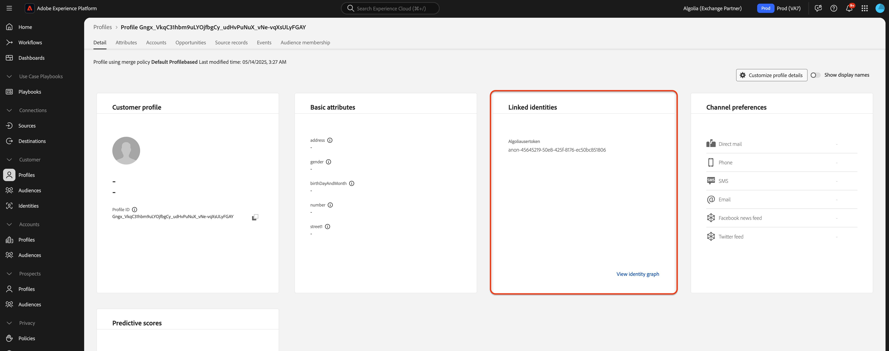

# Acquisire dati [!DNL Algolia User Profiles] in Experience Platform utilizzando l&#39;interfaccia utente

Questa esercitazione ti guida attraverso l&#39;acquisizione di dati dall&#39;account [!DNL Algolia User Profiles] in Adobe Experience Platform tramite l&#39;interfaccia utente.

## Introduzione

>[!IMPORTANT]
>
>Prima di iniziare, assicurati di aver completato i prerequisiti descritti nella [[!DNL Algolia User Profiles] panoramica](../../../../connectors/data-partners/algolia-user-profiles.md#prerequisites).

Questo tutorial presuppone la familiarità con i seguenti componenti di Experience Platform:

* [[!DNL Experience Data Model (XDM)] Sistema](../../../../../xdm/home.md): il framework standardizzato utilizzato da Experience Platform per organizzare i dati sull&#39;esperienza del cliente.

   * [Nozioni di base sulla composizione dello schema](../../../../../xdm/schema/composition.md): informazioni sulla composizione dello schema, inclusi i principi chiave e le best practice.
   * [Esercitazione sull&#39;editor di schemi](../../../../../xdm/tutorials/create-schema-ui.md): scopri come creare schemi personalizzati utilizzando l&#39;interfaccia utente dell&#39;editor di schemi.
* [[!DNL Real-Time Customer Profile]](../../../../../profile/home.md): profilo cliente unificato in tempo reale basato su dati aggregati provenienti da più origini.
* [Origini](../../../../home.md): acquisisci dati da varie origini e utilizza i servizi Experience Platform per strutturare, etichettare e migliorare i dati.

### Raccogli le credenziali richieste

Per connettere [!DNL Algolia] a Adobe Experience Platform, fornisci le seguenti credenziali:

| Credenziali | Descrizione |
| -------------- | ----------------------------------------------------------------------------------------- |
| ID applicazione | L&#39;identificatore univoco assegnato al tuo account [!DNL Algolia]. |
| Chiave API | Credenziali per l&#39;autenticazione e l&#39;autorizzazione delle richieste API ai servizi di [!DNL Algolia]. |

Per ulteriori informazioni, consultare la [!DNL Algolia] [documentazione di autenticazione](https://www.algolia.com/doc/tools/cli/get-started/authentication/).

## Connetti il tuo account [!DNL Algolia]

Nell&#39;interfaccia utente di Experience Platform, seleziona **[!UICONTROL Origini]** dal menu di navigazione a sinistra per aprire l&#39;area di lavoro *[!UICONTROL Origini]*. Utilizza il pannello *[!UICONTROL Categorie]* o la barra di ricerca per trovare l&#39;origine desiderata.

Per connettere [!DNL Algolia], scegli la scheda di origine **[!UICONTROL Algolia]** in *[!UICONTROL Partner dati e identità]* e seleziona **[!UICONTROL Configura]**.

>[!TIP]
>
> Se un&#39;origine non dispone ancora di un account autenticato, verrà visualizzata l&#39;opzione **[!UICONTROL Configura]**. Una volta autenticato, diventa **[!UICONTROL Aggiungi dati]**.

## Autenticazione

### Usa un account esistente

Per utilizzare un account esistente, scegliere **[!UICONTROL Account esistente]** e selezionare l&#39;account [!DNL Algolia User Profiles] che si desidera utilizzare. Quindi seleziona **[!UICONTROL Avanti]**.

### Crea un nuovo account

Per creare un nuovo account, seleziona **[!UICONTROL Nuovo account]**, quindi immetti un nome, una descrizione facoltativa e le credenziali di [!DNL Algolia]. Selezionare **[!UICONTROL Connetti all&#39;origine]** e attendere che la connessione venga stabilita.

## Aggiungi dati

Dopo la creazione dell&#39;account [!DNL Algolia User Profiles], viene visualizzato il passaggio **[!UICONTROL Aggiungi dati]**. Utilizzalo per selezionare e visualizzare in anteprima i dati del profilo utente da acquisire.

* A sinistra, immettere **[!UICONTROL Indici]** e **[!UICONTROL Affinità]** facoltativi.
* A destra, visualizza l’anteprima di un massimo di 100 righe di profili utente.

Al termine, seleziona **[!UICONTROL Avanti]**.

## Fornisci i dettagli del flusso di dati

Se utilizzi un set di dati esistente, scegli uno associato a uno schema che include il gruppo di campi [!DNL Algolia Profile]. Verificare che il campo [!DNL Algolia User Token] utilizzi lo spazio dei nomi dell&#39;identità [!DNL Algolia User Token].  Se [!DNL Algolia User Token] non è attualmente creato o assegnato, le istruzioni sono fornite di seguito.

Se crei un nuovo set di dati, seleziona uno schema utilizzando il gruppo di campi [!DNL Algolia Profile].

### Crea spazio dei nomi identità [!DNL Algolia User Token]

È necessario creare lo spazio dei nomi dell&#39;identità [!DNL Algolia User Token] se non esiste già nell&#39;organizzazione.

Utilizza il menu di navigazione a sinistra e seleziona **[!UICONTROL Identità]** per accedere all&#39;area di lavoro dell&#39;interfaccia utente di [Identity Service](../../../../../identity-service/home.md), quindi seleziona **[!UICONTROL Crea spazio dei nomi identità]**.

Quindi, fornisci un **[!UICONTROL Nome visualizzato]** e un **[!UICONTROL Simbolo identità]** per il tuo spazio dei nomi personalizzato. Durante questo passaggio, devi anche configurare il tipo di spazio dei nomi. Al termine, selezionare **[!UICONTROL Crea]**.

| Configurazione spazio dei nomi personalizzato | Valore |
| --- | --- |
| **[!UICONTROL Nome visualizzato]** | [!DNL Algolia User Token] |
| **[!UICONTROL Simbolo identità]** | [!DNL AlgoliaUserToken] |
| **[!UICONTROL Seleziona un tipo]** | [!DNL Cookie ID] |

Una volta aggiunto, lo spazio dei nomi viene visualizzato nell’elenco. Ora puoi applicarlo nello schema.

### Applicare lo spazio dei nomi allo schema

Utilizza il menu di navigazione a sinistra e seleziona **[!UICONTROL Schemi]** per accedere all&#39;area di lavoro dell&#39;interfaccia utente [Schemi](../../../../../xdm/ui/overview.md). Utilizzare l&#39;area di lavoro schemi per creare o aggiornare uno schema con il gruppo di campi [!DNL Algolia Profile Details]. Quindi, passa al campo **[!UICONTROL Token utente]** e utilizza la barra a destra per selezionare la casella **[!UICONTROL Identità]**. Utilizzare inoltre la casella di input per definire lo spazio dei nomi dell&#39;identità [!DNL Algolia User Token]. Al termine, selezionare **[!UICONTROL Salva]**.

Dopo che al campo **[!UICONTROL Token utente]** è stato assegnato lo spazio dei nomi dell&#39;identità [!DNL Algolia User Token], l&#39;identità viene visualizzata nel profilo utente per qualsiasi profilo.

## Mappare i campi dati su uno schema XDM

Utilizza l’interfaccia di mappatura per mappare i dati di origine sui campi dello schema. Per ulteriori informazioni, consulta la [guida alla mappatura](../../../../../data-prep/ui/mapping.md).

## Pianificazione esecuzioni dell’acquisizione

Quindi, utilizza l’interfaccia di pianificazione per definire la pianificazione dell’acquisizione del flusso di dati.

| Configurazione pianificazione | Descrizione |
| --- | --- |
| Frequenza | Configura la frequenza per indicare la frequenza con cui deve essere eseguito il flusso di dati. Puoi impostare la frequenza su: <ul><li>**Una volta**: imposta la frequenza su `once` per creare un&#39;acquisizione unica. Le configurazioni di intervallo e backfill non sono disponibili quando crei un flusso di dati di acquisizione una tantum. Per impostazione predefinita, la frequenza di pianificazione è impostata su una volta.</li><li>**Minuti**: imposta la frequenza su `minute` per pianificare il flusso di dati in modo da acquisire i dati al minuto.</li><li>**Ora**: imposta la frequenza su `hour` per pianificare il flusso di dati per acquisire i dati su base oraria.</li><li>**Giorno**: imposta la frequenza su `day` per pianificare il flusso di dati in modo da acquisire i dati su base giornaliera.</li><li>**Settimana**: imposta la frequenza su `week` per pianificare il flusso di dati in modo da acquisire i dati su base settimanale.</li></ul> |
| Intervallo | Dopo aver selezionato una frequenza, puoi configurare l’impostazione dell’intervallo per stabilire l’intervallo di tempo tra ogni acquisizione. Ad esempio, se imposti la frequenza su giorno e configuri l’intervallo su 15, il flusso di dati verrà eseguito ogni 15 giorni. Impossibile impostare l&#39;intervallo su zero. Il valore dell&#39;intervallo minimo accettato per ciascuna frequenza è il seguente:<ul><li>**Una volta**: n/d</li><li>**Minuto**: 15</li><li>**Ora**: 1</li><li>**Giorno**: 1</li><li>**Settimana**: 1</li></ul> |
| Ora di inizio | La marca temporale per l’esecuzione prevista, presentata in fuso orario UTC. |
| Retrocompilazione | La retrocompilazione determina quali dati vengono inizialmente acquisiti. Se la retrocompilazione è abilitata, tutti i file correnti nel percorso specificato verranno acquisiti durante la prima acquisizione pianificata. Se la retrocompilazione è disattivata, verranno acquisiti solo i file caricati tra la prima esecuzione dell’acquisizione e l’ora di inizio. I file caricati prima dell’ora di inizio non verranno acquisiti. |

## Verifica il flusso di dati

Utilizza la pagina di revisione per un riepilogo del flusso di dati prima dell’acquisizione. I dettagli sono raggruppati nelle seguenti categorie:

* **Connessione** - Mostra il tipo di origine, il percorso pertinente del file di origine scelto e il numero di colonne all&#39;interno di tale file di origine.
* **Assegna set di dati e mappa campi**: mostra in quale set di dati vengono acquisiti i dati di origine, incluso lo schema a cui il set di dati è conforme.
* **Pianificazione** - Mostra il periodo attivo, la frequenza e l&#39;intervallo della pianificazione di acquisizione.

Dopo aver rivisto il flusso di dati, seleziona **[!UICONTROL Fine]** e attendi che venga creato un po&#39; di tempo.

## Passaggi successivi

Seguendo questa esercitazione, è stato creato un flusso di dati per portare dati intento dall&#39;origine [!DNL Algolia] ad Experience Platform. Per ulteriori risorse, consulta la documentazione descritta di seguito.

### Monitorare il flusso di dati

Una volta creato il flusso di dati, puoi monitorare i dati che vengono acquisiti tramite di esso per visualizzare informazioni su tassi di acquisizione, successo ed errori. Per ulteriori informazioni su come monitorare il flusso di dati, visita l&#39;esercitazione su [account di monitoraggio e flussi di dati nell&#39;interfaccia utente](../../../../../dataflows/ui/monitor-sources.md).

### Aggiornare il flusso di dati

Per aggiornare le configurazioni per la pianificazione, la mappatura e le informazioni generali dei flussi di dati, visita il tutorial su [aggiornamento dei flussi di dati di origine nell&#39;interfaccia utente](../../update-dataflows.md).

### Eliminare il flusso di dati

È possibile eliminare i flussi di dati non più necessari o creati in modo errato utilizzando la funzione **[!UICONTROL Elimina]** disponibile nell&#39;area di lavoro **[!UICONTROL Flussi di dati]**. Per ulteriori informazioni su come eliminare i flussi di dati, consulta l&#39;esercitazione su [eliminazione dei flussi di dati nell&#39;interfaccia utente](../../delete.md).
