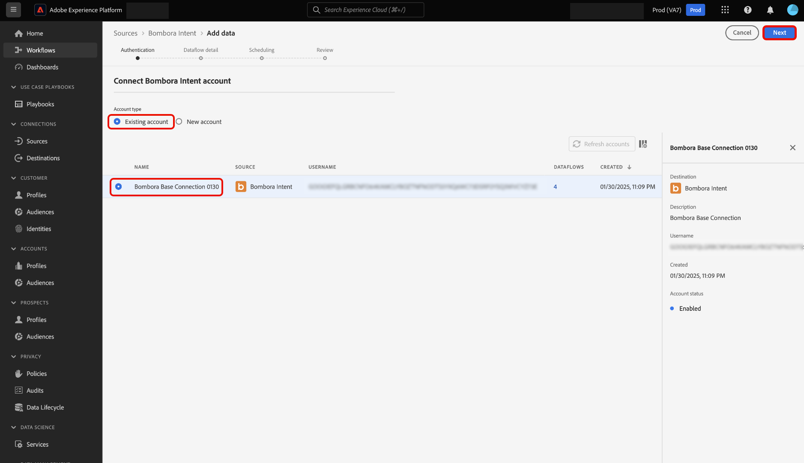
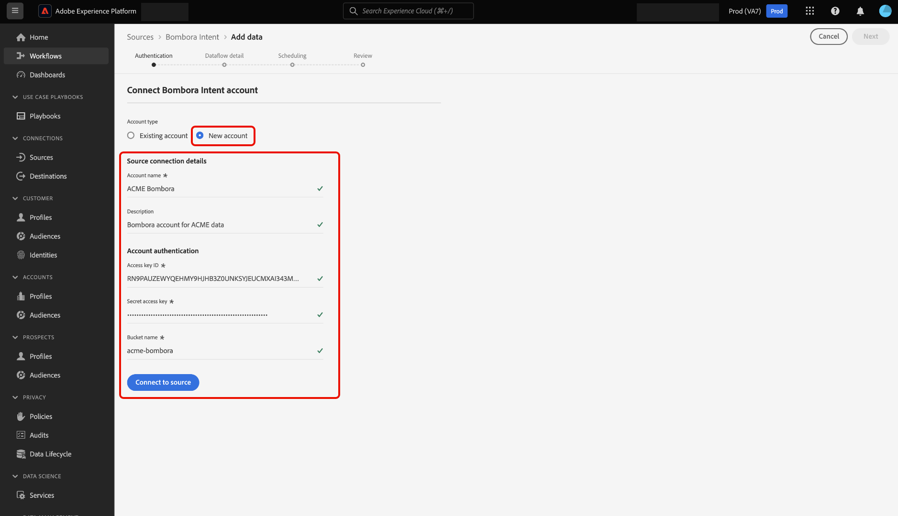

# Connetti [!DNL Bombora Intent] ad Experience Platform tramite l&#39;interfaccia utente

Leggere questa guida per scoprire come collegare l&#39;account [!DNL Bombora Intent] a Adobe Experience Platform utilizzando l&#39;interfaccia utente.

## Introduzione

Questo tutorial richiede una buona conoscenza dei seguenti componenti di Experience Platform:

* [Real-Time CDP B2B edition](../../../../../rtcdp/b2b-overview.md): Real-Time CDP B2B edition è progettato appositamente per gli addetti al marketing che operano in un modello di servizio business-to-business. Raccoglie dati da più origini e li combina in un’unica vista di persone e profili di account. Questi dati unificati consentono ai marketer di rivolgersi con precisione a tipi di pubblico specifici e di coinvolgerli in tutti i canali disponibili.
* [Origini](../../../../home.md): Experience Platform consente di acquisire dati da varie origini e allo stesso tempo di strutturare, etichettare e migliorare i dati in arrivo tramite i servizi Experience Platform.
* [Sandbox](../../../../../sandboxes/home.md): Experience Platform fornisce sandbox virtuali che suddividono una singola istanza Experience Platform in ambienti virtuali separati, utili per le attività di sviluppo e aggiornamento delle applicazioni di esperienza digitale.

### Prerequisiti

Leggi la [[!DNL Bombora Intent] panoramica](../../../../connectors/data-partners/bombora.md) per informazioni su come recuperare le credenziali di autenticazione.

## Navigare nel catalogo delle origini

Nell&#39;interfaccia utente di Experience Platform, selezionare **[!UICONTROL Sources]** dal menu di navigazione a sinistra per accedere all&#39;area di lavoro *[!UICONTROL Sources]*. È possibile selezionare la categoria appropriata nel pannello *[!UICONTROL Categories]*. In alternativa, è possibile utilizzare la barra di ricerca per passare all&#39;origine specifica che si desidera utilizzare.

Per utilizzare [!DNL Bombora], selezionare la scheda di origine **[!UICONTROL Bombora Intent]** in *[!UICONTROL Data & Identity Partners]*, quindi selezionare **[!UICONTROL Add data]**.

>[!TIP]
>
>Le origini nel catalogo origini visualizzano l&#39;opzione **[!UICONTROL Set up]** quando una determinata origine non dispone ancora di un account autenticato. Quando esiste un account autenticato, questa opzione diventa **[!UICONTROL Add data]**.

## Autenticazione {#authentication}

### Usa un account esistente {#existing}

Per utilizzare un account esistente, selezionare **[!UICONTROL Existing account]**, quindi selezionare l&#39;account che si desidera utilizzare dall&#39;elenco degli account nell&#39;interfaccia.

Dopo aver selezionato l&#39;account, selezionare **[!UICONTROL Next]** per procedere al passaggio successivo.

### Crea un nuovo account {#create}

Se non disponi di un account esistente, devi crearne uno nuovo fornendo le credenziali di autenticazione necessarie che corrispondono all’origine.

Per creare un nuovo account, selezionare **[!UICONTROL New account]**, quindi fornire un nome account e, facoltativamente, una descrizione per i dettagli dell&#39;account. Quindi, fornisci i valori di autenticazione appropriati per autenticare l’origine su Experience Platform. Per connettere l&#39;account [!DNL Bombora], è necessario disporre delle credenziali seguenti:

* **ID chiave di accesso**: ID chiave di accesso [!DNL Bombora]. Si tratta di una stringa alfanumerica di 61 caratteri necessaria per autenticare l’account in Experience Platform.
* **Chiave di accesso segreta**: la chiave di accesso segreta [!DNL Bombora]. Si tratta di una stringa con codifica base 64 di 40 caratteri necessaria per autenticare l’account in Experience Platform.
* **Nome bucket**: bucket [!DNL Bombora] da cui verranno estratti i dati.

## Fornisci i dettagli del flusso di dati {#provide-dataflow-details}

Una volta autenticato e connesso l’account, è necessario fornire i seguenti dettagli per il flusso di dati:

* **Nome flusso di dati**: nome del flusso di dati. Puoi utilizzare questo nome per cercare il flusso di dati nell’interfaccia utente, una volta creato ed elaborato.
* **Descrizione**: (facoltativo) una breve spiegazione o informazioni aggiuntive per il flusso di dati.
* **Origine dominio**: il campo del dominio o del sito Web che corrisponde ai record dell&#39;account di origine rispetto agli account Experience Platform. Questo valore può dipendere dalle configurazioni. Se non specificato, il dominio utilizza per impostazione predefinita accountOrganization.website.

## Pianifica flusso di dati {#schedule-dataflow}

Quindi, utilizza l’interfaccia di pianificazione per configurare una pianificazione di acquisizione per il flusso di dati.

* **Frequenza**: configura la frequenza per indicare la frequenza con cui deve essere eseguito il flusso di dati. Puoi pianificare il flusso di dati [!DNL Bombora] per acquisire i dati a una frequenza settimanale.
* **Intervallo**: l&#39;intervallo rappresenta il tempo che intercorre tra ciascun ciclo di acquisizione. L&#39;unico intervallo supportato per un flusso di dati [!DNL Bombora] è 1. Ciò significa che il flusso di dati acquisirà i dati una volta alla settimana, ogni settimana.
* **Ora di inizio**: l&#39;ora di inizio determina quando verrà eseguita la prima iterazione del flusso di dati. [!DNL Bombora] rilascia i dati ad Adobe una volta alla settimana, il lunedì, alle 12:00 PM UTC. Pertanto, devi impostare l’ora di inizio dell’acquisizione dopo le 12:00 PM UTC. Inoltre, è necessario confermare il tempo di acquisizione con [!DNL Bombora] in quanto potrebbero modificare la pianificazione quando si rilasciano file in Adobe.

Dopo aver configurato la pianificazione dell&#39;acquisizione del flusso di dati, seleziona **[!UICONTROL Next]**.

## Verifica flusso di dati {#review-dataflow}

Il passaggio finale nel processo di creazione del flusso di dati consiste nell’esaminare il flusso di dati prima di eseguirlo. Utilizza il passaggio *[!UICONTROL Review]* per rivedere i dettagli del nuovo flusso di dati prima che venga eseguito. I dettagli sono raggruppati nelle seguenti categorie:

* **Connessione**: mostra il tipo di origine, il percorso pertinente del file di origine scelto e il numero di colonne all&#39;interno di tale file di origine.
* **Pianificazione**: mostra il periodo, la frequenza e l&#39;intervallo attivi della pianificazione di acquisizione.

Dopo aver esaminato il flusso di dati, seleziona **[!UICONTROL Finish]**.

## Passaggi successivi

Seguendo questa esercitazione, è stato creato un flusso di dati per portare dati intento dall&#39;origine [!DNL Bombora] ad Experience Platform. Per ulteriori risorse, consulta la documentazione descritta di seguito.

### Monitorare il flusso di dati

Una volta creato il flusso di dati, puoi monitorare i dati che vengono acquisiti tramite di esso per visualizzare informazioni su tassi di acquisizione, successo ed errori. Per ulteriori informazioni su come monitorare il flusso di dati, visita l&#39;esercitazione su [account di monitoraggio e flussi di dati nell&#39;interfaccia utente](../../../../../dataflows/ui/monitor-sources.md).

### Aggiornare il flusso di dati

Per aggiornare le configurazioni per la pianificazione, la mappatura e le informazioni generali dei flussi di dati, visita il tutorial su [aggiornamento dei flussi di dati di origine nell&#39;interfaccia utente](../../update-dataflows.md).

### Eliminare il flusso di dati

È possibile eliminare i flussi di dati non più necessari o creati in modo errato utilizzando la funzione **[!UICONTROL Delete]** disponibile nell&#39;area di lavoro **[!UICONTROL Dataflows]**. Per ulteriori informazioni su come eliminare i flussi di dati, consulta l&#39;esercitazione su [eliminazione dei flussi di dati nell&#39;interfaccia utente](../../delete.md).
