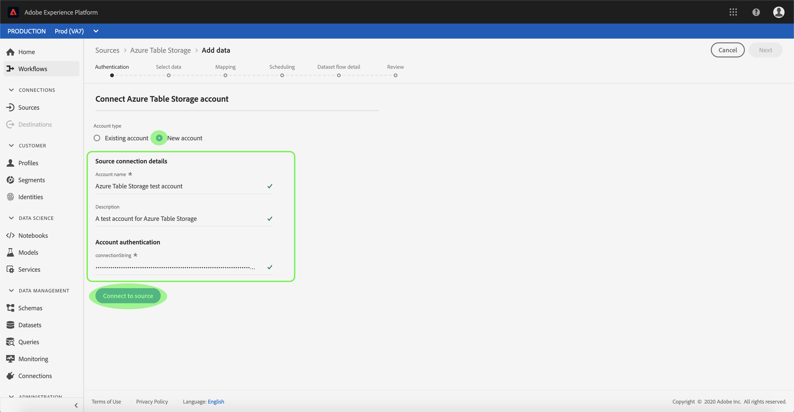

# Crea un [!DNL Azure Table Storage] connessione sorgente nell’interfaccia utente

I connettori sorgente in Adobe Experience Platform consentono di acquisire dati provenienti dall’esterno su base pianificata. Questa esercitazione fornisce i passaggi per la creazione di un [!DNL Azure Table Storage] (in seguito denominato &quot;ATS&quot;) connettore di sorgente che utilizza [!DNL Platform] interfaccia utente.

## Introduzione

Questa esercitazione richiede una buona comprensione dei seguenti componenti di Adobe Experience Platform:

* [[!DNL Experience Data Model (XDM)] Sistema](../../../../../xdm/home.md): Il quadro standardizzato [!DNL Experience Platform] organizza i dati sulla customer experience.
   * [Nozioni di base sulla composizione dello schema](../../../../../xdm/schema/composition.md): Scopri i blocchi di base degli schemi XDM, inclusi i principi chiave e le best practice nella composizione dello schema.
   * [Esercitazione sull’Editor di schema](../../../../../xdm/tutorials/create-schema-ui.md): Scopri come creare schemi personalizzati utilizzando l’interfaccia utente dell’Editor di schema.
* [[!DNL Real-Time Customer Profile]](../../../../../profile/home.md): Fornisce un profilo di consumatore unificato e in tempo reale basato su dati aggregati provenienti da più origini.

Se disponi già di una connessione ATS valida, puoi saltare il resto del documento e procedere all&#39;esercitazione su [configurazione di un flusso di dati](../../dataflow/databases.md).

### Raccogli credenziali richieste

Per accedere al tuo account ATS su [!DNL Platform], è necessario fornire i seguenti valori:

| Credenziali | Descrizione |
| ---------- | ----------- |
| `connectionString` | Una stringa di connessione per connettersi al [!DNL Azure Table Storage] istanza. Stringa di connessione per la connessione all&#39;istanza ATS. Il pattern della stringa di connessione per ATS è `DefaultEndpointsProtocol=https;AccountName={ACCOUNT_NAME};AccountKey={ACCOUNT_KEY}`. |

Per ulteriori informazioni su come iniziare, consulta [questo [!DNL Azure Table Storage] documento](https://docs.microsoft.com/en-us/azure/storage/common/storage-introduction).

## Collega il tuo [!DNL Azure Table Storage] account

Una volta raccolte le credenziali richieste, puoi seguire i passaggi seguenti per collegare il tuo account ATS a [!DNL Platform].

Accedi a [Adobe Experience Platform](https://platform.adobe.com) quindi seleziona **[!UICONTROL Origini]** dalla barra di navigazione a sinistra per accedere al **[!UICONTROL Origini]** workspace. La **[!UICONTROL Catalogo]** in questa schermata vengono visualizzate diverse sorgenti per le quali è possibile creare un account.

Puoi selezionare la categoria appropriata dal catalogo sul lato sinistro dello schermo. In alternativa, è possibile trovare la sorgente specifica con cui si desidera lavorare utilizzando l’opzione di ricerca.

Sotto la **[!UICONTROL Database]** categoria, seleziona **[!UICONTROL Archiviazione tabella di Azure]**. Se questa è la prima volta che utilizzi questo connettore, seleziona **[!UICONTROL Configura]**. In caso contrario, seleziona **[!UICONTROL Aggiungi dati]** per creare un nuovo connettore ATS.

La **[!UICONTROL Connetti all’archiviazione tabella di Azure]** viene visualizzata la pagina . In questa pagina è possibile utilizzare le nuove credenziali o le credenziali esistenti.

### Nuovo account

Se si utilizzano nuove credenziali, selezionare **[!UICONTROL Nuovo account]**. Nel modulo di input visualizzato, fornisci un nome, una descrizione facoltativa e le tue credenziali ATS. Al termine, seleziona **[!UICONTROL Connetti]** e quindi lasciare un po&#39; di tempo per stabilire la nuova connessione.

### Account esistente

Per collegare un account esistente, seleziona l’account ATS con cui desideri connetterti, quindi seleziona **[!UICONTROL Successivo]** per procedere.

## Passaggi successivi

Seguendo questa esercitazione, hai stabilito una connessione al tuo account ATS. Ora puoi passare all’esercitazione successiva e [configurare un flusso di dati per l’immissione di dati in [!DNL Platform]](../../dataflow/databases.md).
