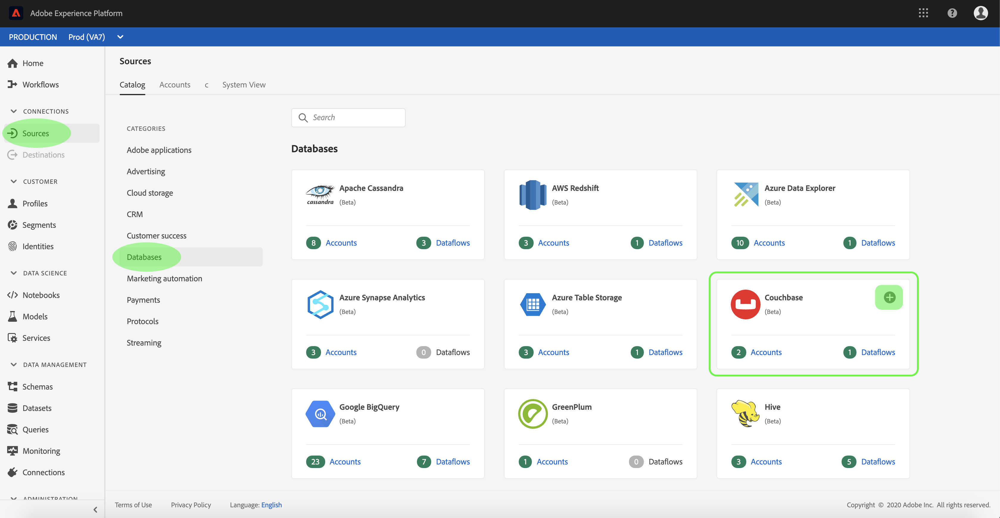

# Crea un [!DNL Couchbase] connessione sorgente nell’interfaccia utente

>[!NOTE]
>
> La [!DNL Couchbase] connettore in versione beta. Consulta la sezione [Panoramica delle origini](../../../../home.md#terms-and-conditions) per ulteriori informazioni sull’utilizzo dei connettori con etichetta beta.

Connettori sorgente in [!DNL Adobe Experience Platform] consente di acquisire dati provenienti dall’esterno su base programmata. Questa esercitazione descrive i passaggi necessari per creare un [!DNL Couchbase] connettore di origine con [!DNL Platform] interfaccia utente.

## Introduzione

Questa esercitazione richiede una buona comprensione dei seguenti componenti di [!DNL Platform]:

* [[!DNL Experience Data Model (XDM)] Sistema](../../../../../xdm/home.md): Il quadro standardizzato [!DNL Experience Platform] organizza i dati sulla customer experience.
   * [Nozioni di base sulla composizione dello schema](../../../../../xdm/schema/composition.md): Scopri i blocchi di base degli schemi XDM, inclusi i principi chiave e le best practice nella composizione dello schema.
   * [Esercitazione sull’Editor di schema](../../../../../xdm/tutorials/create-schema-ui.md): Scopri come creare schemi personalizzati utilizzando l’interfaccia utente dell’Editor di schema.
* [[!DNL Real-Time Customer Profile]](../../../../../profile/home.md): Fornisce un profilo di consumatore unificato e in tempo reale basato su dati aggregati provenienti da più origini.

Se disponi già di una [!DNL Couchbase] è possibile ignorare il resto del documento e passare all&#39;esercitazione su [configurazione di un flusso di dati](../../dataflow/databases.md).

### Raccogli credenziali richieste

Per autenticare il [!DNL Couchbase] connettore di origine, è necessario specificare i valori per la seguente proprietà di connessione:

| Credenziali | Descrizione |
| ---------- | ----------- |
| `connectionString` | Stringa di connessione utilizzata per la connessione al [!DNL Couchbase] istanza. Pattern di stringa di connessione per [!DNL Couchbase] è `Server={SERVER}; Port={PORT};AuthMech=1;CredString=[{\"user\": \"{USER}\", \"pass\":\"{PASS}\"}];`. Per ulteriori informazioni sull’acquisizione di una stringa di connessione, consulta la documentazione su [[!DNL Couchbase] connection](https://docs.Couchbase.com/c-sdk/2.10/client-settings.html#configuring-overview). |

## Collega il tuo [!DNL Couchbase] account

Una volta raccolte le credenziali richieste, puoi seguire i passaggi seguenti per collegare il tuo [!DNL Couchbase] account a [!DNL Platform].

Accedi a [Adobe Experience Platform](https://platform.adobe.com) quindi seleziona **[!UICONTROL Origini]** dalla barra di navigazione a sinistra per accedere al **[!UICONTROL Origini]** workspace. La **[!UICONTROL Catalogo]** in questa schermata vengono visualizzate diverse sorgenti per le quali è possibile creare un account.

Puoi selezionare la categoria appropriata dal catalogo sul lato sinistro dello schermo. In alternativa, è possibile trovare la sorgente specifica con cui si desidera lavorare utilizzando l’opzione di ricerca.

Sotto la **[!UICONTROL Database]** categoria, seleziona **[!UICONTROL Couchbase]**. Se questa è la prima volta che utilizzi questo connettore, seleziona **[!UICONTROL Configura]**. In caso contrario, seleziona **[!UICONTROL Aggiungi dati]** per creare una nuova [!DNL Couchbase] connettore.

La **[!UICONTROL Connetti a Couchbase]** viene visualizzata la pagina . In questa pagina è possibile utilizzare le nuove credenziali o le credenziali esistenti.

### Nuovo account

Se si utilizzano nuove credenziali, selezionare **[!UICONTROL Nuovo account]**. Nel modulo di input visualizzato, specificare un nome, una descrizione facoltativa e il [!DNL Couchbase] credenziali. Al termine, seleziona **[!UICONTROL Connetti alla sorgente]** e quindi lasciare un po&#39; di tempo per stabilire la nuova connessione.

### Account esistente

Per collegare un account esistente, seleziona la [!DNL Couchbase] account con cui desideri connetterti, quindi seleziona **[!UICONTROL Successivo]** nell&#39;angolo in alto a destra per proseguire.

## Passaggi successivi

Seguendo questa esercitazione, hai stabilito una connessione al tuo [!DNL Couchbase] conto. Ora puoi passare all’esercitazione successiva e [configurare un flusso di dati per l’immissione di dati in [!DNL Platform]](../../dataflow/databases.md).
