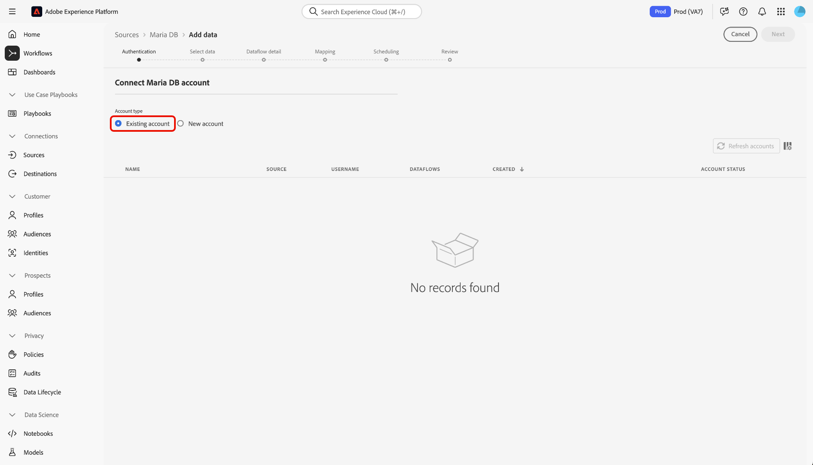

# Creare un [!DNL MariaDB] connessione sorgente nell’interfaccia utente

I connettori di origini in Adobe Experience Platform consentono di acquisire dati di origine esterna in base a una pianificazione. Questa esercitazione descrive i passaggi necessari per creare un connettore di origine Maria DB utilizzando [!DNL Platform] dell&#39;utente.

## Introduzione

Questo tutorial richiede una buona conoscenza dei seguenti componenti di Adobe Experience Platform:

* [[!DNL Experience Data Model (XDM)] Sistema](../../../../../xdm/home.md): il quadro standardizzato mediante il quale [!DNL Experience Platform] organizza i dati sull’esperienza del cliente.
   * [Nozioni di base sulla composizione dello schema](../../../../../xdm/schema/composition.md): scopri gli elementi di base degli schemi XDM, compresi i principi chiave e le best practice nella composizione dello schema.
   * [Esercitazione sull’editor di schemi](../../../../../xdm/tutorials/create-schema-ui.md): scopri come creare schemi personalizzati utilizzando l’interfaccia utente dell’Editor di schema.
* [Profilo cliente in tempo reale](../../../../../profile/home.md): fornisce un profilo consumer unificato e in tempo reale basato su dati aggregati provenienti da più origini.

Se si dispone già di un [!DNL MariaDB] connessione, è possibile saltare il resto del documento e passare all&#39;esercitazione [configurazione di un flusso di dati](../../dataflow/databases.md).

### Raccogli le credenziali richieste

Per accedere al tuo [!DNL MariaDB] account su [!DNL Platform], è necessario fornire il seguente valore:

| Credenziali | Descrizione |
| ---------- | ----------- |
| `connectionString` | Stringa di connessione associata all&#39;autenticazione MariaDB. Il [!DNL MariaDB] modello di stringa di connessione: `Server={HOST};Port={PORT};Database={DATABASE};UID={USERNAME};PWD={PASSWORD}`. |

Per ulteriori informazioni su come iniziare, consulta questa [[!DNL MariaDB] documento](https://mariadb.com/kb/en/about-mariadb-connector-odbc/).

## Connetti [!DNL Maria DB] account

Dopo aver raccolto le credenziali richieste, puoi seguire la procedura riportata di seguito per collegare il tuo [!DNL Maria DB] account a [!DNL Platform].

Accedi a [Adobe Experience Platform](https://platform.adobe.com) e quindi seleziona **[!UICONTROL Sorgenti]** dalla barra di navigazione a sinistra per accedere al **[!UICONTROL Sorgenti]** Workspace. Il **[!UICONTROL Catalogo]** Nella schermata vengono visualizzate diverse origini per le quali è possibile creare un account con.

Sotto **[!UICONTROL Database]** categoria, seleziona **[!UICONTROL Maria DB]**. Se è la prima volta che utilizzi questo connettore, seleziona **[!UICONTROL Configura]**. In caso contrario, seleziona **[!UICONTROL Aggiungi dati]** per creare un nuovo [!DNL Maria DB] connettore.

Il **[!UICONTROL Connetti a Maria DB]** viene visualizzata. In questa pagina è possibile utilizzare nuove credenziali o credenziali esistenti.

### Nuovo account

Se si utilizzano nuove credenziali, selezionare **[!UICONTROL Nuovo account]**. Nel modulo di input visualizzato, fornisci un nome, una descrizione facoltativa e il [!DNL MariaDB] credenziali. Al termine, seleziona **[!UICONTROL Connetti]** e quindi lascia un po’ di tempo per stabilire la nuova connessione.

### Account esistente

Per collegare un account esistente, seleziona la [!DNL MariaDB] account con cui desideri connetterti, quindi seleziona **[!UICONTROL Successivo]** per procedere.

## Passaggi successivi

Seguendo questa esercitazione, hai stabilito una connessione con il tuo [!DNL MariaDB] account. Ora puoi continuare con l’esercitazione successiva e [configurare un flusso di dati per inserire dati in [!DNL Platform]](../../dataflow/databases.md).
