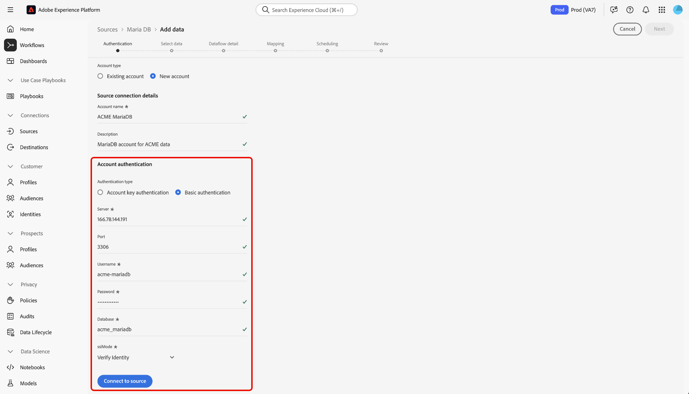

# Connetti [!DNL MariaDB] ad Experience Platform tramite l&#39;interfaccia utente

Leggere questa guida per scoprire come collegare l&#39;account [!DNL MariaDB] a Adobe Experience Platform utilizzando l&#39;area di lavoro origini nell&#39;interfaccia utente di Experience Platform.

## Introduzione

Questo tutorial richiede una buona conoscenza dei seguenti componenti di Experience Platform:

* [[!DNL Experience Data Model (XDM)] Sistema](../../../../../xdm/home.md): framework standardizzato tramite il quale Experience Platform organizza i dati sull&#39;esperienza del cliente.
   * [Nozioni di base sulla composizione dello schema](../../../../../xdm/schema/composition.md): scopri i blocchi predefiniti di base degli schemi XDM, inclusi i principi chiave e le best practice nella composizione dello schema.
   * [Esercitazione sull&#39;editor di schemi](../../../../../xdm/tutorials/create-schema-ui.md): scopri come creare schemi personalizzati utilizzando l&#39;interfaccia utente dell&#39;editor di schemi.
* [Profilo cliente in tempo reale](../../../../../profile/home.md): fornisce un profilo consumatore unificato in tempo reale basato su dati aggregati provenienti da più origini.

Se disponi già di una connessione [!DNL MariaDB], puoi saltare il resto del documento e passare all&#39;esercitazione [configurazione di un flusso di dati](../../dataflow/databases.md).

### Raccogli le credenziali richieste

Per informazioni sull&#39;autenticazione, leggere la [[!DNL MariaDB] panoramica](../../../../connectors/databases/mariadb.md#prerequisites).

## Navigare nel catalogo delle origini

Nell&#39;interfaccia utente di Experience Platform, seleziona **[!UICONTROL Origini]** dal menu di navigazione a sinistra per accedere all&#39;area di lavoro *[!UICONTROL Origini]*. Selezionare la categoria appropriata nel pannello *[!UICONTROL Categorie]* In alternativa, utilizzare la barra di ricerca per passare all&#39;origine specifica che si desidera utilizzare.

Per utilizzare [!DNL MariaDB], selezionare la scheda di origine **[!UICONTROL MariaDB]** in *[!UICONTROL Database]*, quindi selezionare **[!UICONTROL Configurazione]**.

>[!TIP]
>
>Le origini nel catalogo delle origini visualizzano l&#39;opzione **[!UICONTROL Configura]** quando un&#39;origine specificata non dispone ancora di un account autenticato. Una volta creato un account autenticato, questa opzione diventa **[!UICONTROL Aggiungi dati]**.

## Usa un account esistente {#existing}

Per utilizzare un account esistente, selezionare **[!UICONTROL Account esistente]**, quindi selezionare l&#39;account [!DNL MariaDB] che si desidera utilizzare.

## Crea un nuovo account {#create}

Se non disponi di un account esistente, devi crearne uno nuovo fornendo le credenziali di autenticazione necessarie che corrispondono all’origine.

Per creare un nuovo account, seleziona **[!UICONTROL Nuovo account]**, quindi specifica un nome e, facoltativamente, aggiungi una descrizione per l&#39;account.

### Connettersi ad Experience Platform in Azure {#azure}

È possibile connettere l&#39;account [!DNL MariaDB] ad Experience Platform su Azure utilizzando la chiave dell&#39;account o l&#39;autenticazione di base.

>[!BEGINTABS]

>[!TAB Autenticazione chiave account]

Per utilizzare l&#39;autenticazione della chiave dell&#39;account, selezionare **[!UICONTROL Autenticazione della chiave dell&#39;account]**, specificare la [stringa di connessione](../../../../connectors/databases/mariadb.md#azure), quindi selezionare **[!UICONTROL Connetti all&#39;origine]**.

>[!TAB Autenticazione di base]

Per utilizzare l&#39;autenticazione di base, selezionare **[!UICONTROL Autenticazione di base]**, fornire i valori per le [credenziali di autenticazione](../../../../connectors/databases/mariadb.md#azure), quindi selezionare **[!UICONTROL Connetti all&#39;origine]**.

>[!ENDTABS]

### Connettersi ad Experience Platform su Amazon Web Services (AWS) {#aws}

>[!AVAILABILITY]
>
>Questa sezione si applica alle implementazioni di Experience Platform in esecuzione su Amazon Web Services (AWS). Experience Platform in esecuzione su AWS è attualmente disponibile per un numero limitato di clienti. Per ulteriori informazioni sull&#39;infrastruttura Experience Platform supportata, consulta la [Panoramica multi-cloud di Experience Platform](../../../../../landing/multi-cloud.md).

Per creare un nuovo account [!DNL MariaDB] e connettersi ad Experience Platform su AWS, verificare di essere in una sandbox VA6 e quindi fornire le [credenziali necessarie per l&#39;autenticazione](../../../../connectors/databases/mariadb.md#aws).

## Passaggi successivi

Seguendo questa esercitazione, hai stabilito una connessione al tuo account [!DNL MariaDB]. Ora puoi continuare con l&#39;esercitazione successiva e [configurare un flusso di dati per inserire dati in Experience Platform](../../dataflow/databases.md).
