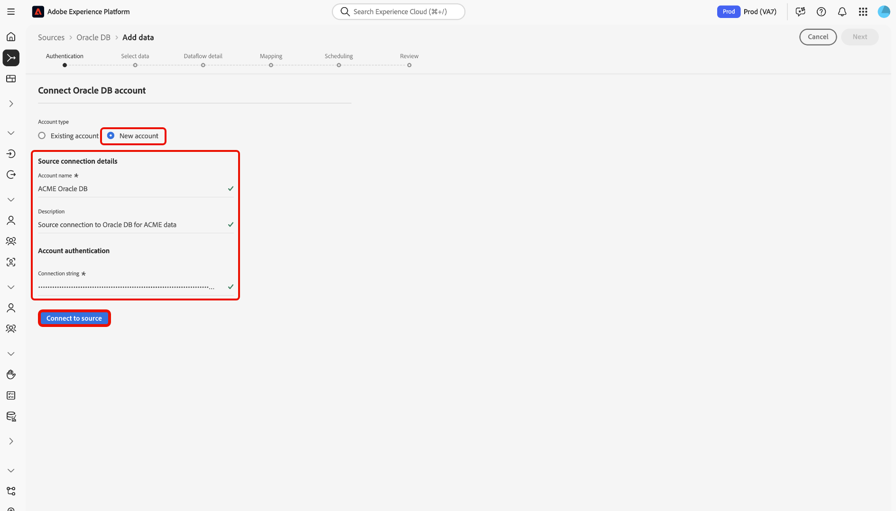

# Connetti [!DNL Oracle DB] ad Experience Platform tramite l&#39;interfaccia utente

Leggere questa guida per scoprire come collegare l&#39;istanza [!DNL Oracle DB] a Adobe Experience Platform utilizzando l&#39;area di lavoro origini nell&#39;interfaccia utente di Experience Platform.

## Introduzione

Questo tutorial richiede una buona conoscenza dei seguenti componenti di Adobe Experience Platform:

* [[!DNL Experience Data Model (XDM)] Sistema](../../../../../xdm/home.md): framework standardizzato tramite il quale Experience Platform organizza i dati sull&#39;esperienza del cliente.
   * [Nozioni di base sulla composizione dello schema](../../../../../xdm/schema/composition.md): scopri i blocchi predefiniti di base degli schemi XDM, inclusi i principi chiave e le best practice nella composizione dello schema.
   * [Esercitazione sull&#39;editor di schemi](../../../../../xdm/tutorials/create-schema-ui.md): scopri come creare schemi personalizzati utilizzando l&#39;interfaccia utente dell&#39;editor di schemi.
* [[!DNL Real-Time Customer Profile]](../../../../../profile/home.md): fornisce un profilo consumer unificato e in tempo reale basato su dati aggregati provenienti da più origini.

Se disponi già di una connessione [!DNL Oracle DB], puoi saltare il resto del documento e passare all&#39;esercitazione [configurazione di un flusso di dati](../../dataflow/databases.md).

### Raccogli le credenziali richieste

Per informazioni sull&#39;autenticazione, leggere la [[!DNL Oracle DB] panoramica](../../../../connectors/databases/oracle.md#prerequisites).

## Navigare nel catalogo delle origini

Nell&#39;interfaccia utente di Experience Platform, seleziona **[!UICONTROL Origini]** dal menu di navigazione a sinistra per accedere all&#39;area di lavoro *[!UICONTROL Origini]*. Scegliere una categoria o utilizzare la barra di ricerca per trovare l&#39;origine.

Per connettersi a [!DNL Oracle DB], passare alla categoria *[!UICONTROL Database]*, selezionare la scheda di origine **[!UICONTROL Oracle DB]**, quindi selezionare **[!UICONTROL Configurazione]**.

>[!TIP]
>
>Le origini mostrano **[!UICONTROL Configurazione]** per nuove connessioni e **[!UICONTROL Aggiunta dati]** se esiste già un account.

## Usa un account esistente {#existing}

Per utilizzare un account esistente, selezionare **[!UICONTROL Account esistente]**, quindi selezionare l&#39;account [!DNL Oracle DB] che si desidera utilizzare.

## Crea un nuovo account {#new}

Per creare un nuovo account, seleziona **[!UICONTROL Nuovo account]**, quindi specifica un nome e, facoltativamente, aggiungi una descrizione per l&#39;account.

### Connettersi ad Experience Platform in Azure {#azure}

È possibile connettere il database [!DNL Oracle DB] ad Experience Platform su Azure utilizzando una stringa di connessione.

Per utilizzare l&#39;autenticazione della stringa di connessione, specificare la [stringa di connessione](../../../../connectors/databases/oracle.md#azure) e selezionare **[!UICONTROL Connetti all&#39;origine]**.

### Connettersi ad Experience Platform su Amazon Web Services (AWS) {#aws}

>[!AVAILABILITY]
>
>Questa sezione si applica alle implementazioni di Experience Platform in esecuzione su Amazon Web Services (AWS). Experience Platform in esecuzione su AWS è attualmente disponibile per un numero limitato di clienti. Per ulteriori informazioni sull&#39;infrastruttura Experience Platform supportata, consulta la [Panoramica multi-cloud di Experience Platform](../../../../../landing/multi-cloud.md).

Per creare un nuovo account [!DNL Oracle DB] e connettersi ad Experience Platform su AWS, verificare di essere in una sandbox VA6 e quindi fornire le [credenziali necessarie per l&#39;autenticazione](../../../../connectors/databases/oracle.md#aws).

## Crea un flusso di dati per [!DNL Oracle DB] dati

Dopo aver connesso correttamente il database [!DNL Oracle DB], è ora possibile [creare un flusso di dati e acquisire dati dal database in Experience Platform](../../dataflow/databases.md).
