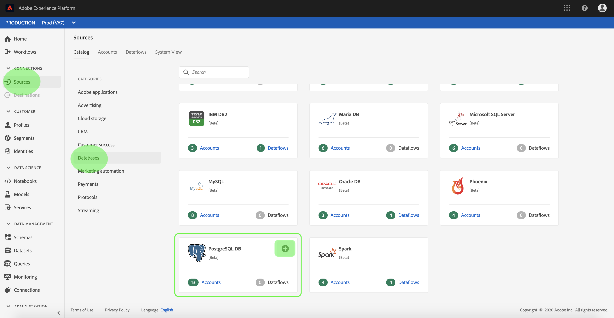

# Creare un connettore [!DNL PostgreSQL] sorgente nell’interfaccia utente

> [!NOTE]
> Il [!DNL PostgreSQL] connettore è in versione beta. Per ulteriori informazioni sull&#39;utilizzo dei connettori con etichetta beta, consulta la panoramica  Origini.

I connettori di origine in  Adobe Experience Platform consentono di trasferire i dati esternamente originati su base programmata. Questa esercitazione fornisce i passaggi necessari per creare un connettore di origine [!DNL PostgreSQL] (in seguito denominato &quot;PSQL&quot;) utilizzando l&#39;interfaccia [!DNL Platform] utente.

## Introduzione

Questa esercitazione richiede una conoscenza approfondita dei seguenti componenti del  Adobe Experience Platform:

* [Sistema](../../../../../xdm/home.md)XDM (Experience Data Model): Il framework standard con cui [!DNL Experience Platform] organizzare i dati relativi all&#39;esperienza del cliente.
   * [Nozioni di base sulla composizione](../../../../../xdm/schema/composition.md)dello schema: Scoprite i componenti di base degli schemi XDM, inclusi i principi chiave e le procedure ottimali nella composizione dello schema.
   * [Esercitazione](../../../../../xdm/tutorials/create-schema-ui.md)sull&#39;Editor di schema: Scoprite come creare schemi personalizzati utilizzando l&#39;interfaccia utente dell&#39;Editor di schema.
* [Profilo](../../../../../profile/home.md)cliente in tempo reale: Fornisce un profilo di consumo unificato e in tempo reale basato su dati aggregati provenienti da più origini.

Se si dispone già di una connessione di base PSQL, è possibile ignorare il resto del documento e procedere all&#39;esercitazione sulla [configurazione di un flusso di dati](../../dataflow/databases.md).

### Raccogli credenziali richieste

Per accedere all&#39;account PSQL su [!DNL Platform], è necessario fornire il seguente valore:

| Credenziali | Descrizione |
| ---------- | ----------- |
| `connectionString` | Stringa di connessione associata all&#39;account PSQL. Il pattern della stringa di connessione PSQL è: `Server={SERVER};Database={DATABASE};Port={PORT};UID={USERNAME};Password={PASSWORD}`. |

Per ulteriori informazioni su come iniziare, consultate questo documento PSQL.

## Collegamento dell&#39;account PSQL

Dopo aver raccolto le credenziali richieste, è possibile seguire i passaggi descritti di seguito per creare una nuova connessione di base in entrata a cui collegare l&#39;account PSQL [!DNL Platform].

Accedete a <a href="https://platform.adobe.com" target="_blank">Adobe Experience Platform</a> , quindi selezionate **[!UICONTROL Sources]** dalla barra di navigazione a sinistra per accedere all&#39; *[!UICONTROL Sources]* area di lavoro. La *[!UICONTROL Catalog]* schermata mostra una serie di origini con cui è possibile creare connessioni di base in entrata e ogni origine mostra il numero di connessioni di base esistenti ad esse associate.

Sotto la *[!UICONTROL Databases]* categoria, selezionate **[!UICONTROL PostgreSQL DB]** per esporre una barra delle informazioni sul lato destro dello schermo. La barra delle informazioni fornisce una breve descrizione della sorgente selezionata e le opzioni per collegarsi alla sorgente o visualizzare la documentazione. Per creare una nuova connessione di base in entrata, selezionare **[!UICONTROL Connect source]**.

Viene *[!UICONTROL Connect to PSQL]* visualizzata la pagina. In questa pagina è possibile utilizzare credenziali nuove o già esistenti.

### Nuovo account

Se si utilizzano nuove credenziali, selezionare **[!UICONTROL New account]**. Nel modulo di input visualizzato, fornite alla connessione di base un nome, una descrizione facoltativa e le credenziali PSQL. Al termine, selezionare **[!UICONTROL Connect]** e quindi concedere un po&#39; di tempo per stabilire la nuova connessione di base.

### Account esistente

Per collegare un account esistente, selezionate l&#39;account PSQL con cui desiderate connettervi, quindi selezionate **[!UICONTROL Next]** per continuare.

## Passaggi successivi

Seguendo questa esercitazione, è stata stabilita una connessione di base all&#39;account PSQL. Ora puoi continuare con l’esercitazione successiva e [configurare un flusso di dati per l’inserimento di dati in Platform](../../dataflow/databases.md).