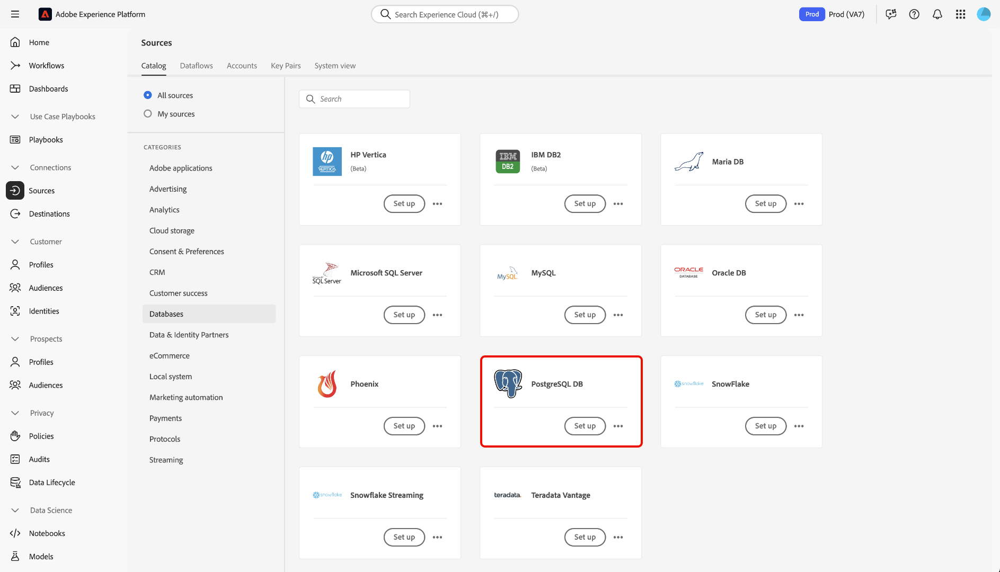

# Crea un [!DNL PostgreSQL] connessione sorgente nell’interfaccia utente

I connettori sorgente in Adobe Experience Platform consentono di acquisire dati provenienti dall’esterno su base pianificata. Questa esercitazione fornisce i passaggi per la creazione di un [!DNL PostgreSQL] connettore di origine con [!DNL Platform] interfaccia utente.

## Introduzione

Questa esercitazione richiede una buona comprensione dei seguenti componenti di Adobe Experience Platform:

* [[!DNL Experience Data Model (XDM)] Sistema](../../../../../xdm/home.md): Il quadro standardizzato [!DNL Experience Platform] organizza i dati sulla customer experience.
   * [Nozioni di base sulla composizione dello schema](../../../../../xdm/schema/composition.md): Scopri i blocchi di base degli schemi XDM, inclusi i principi chiave e le best practice nella composizione dello schema.
   * [Esercitazione sull’Editor di schema](../../../../../xdm/tutorials/create-schema-ui.md): Scopri come creare schemi personalizzati utilizzando l’interfaccia utente dell’Editor di schema.
* [[!DNL Real-Time Customer Profile]](../../../../../profile/home.md): Fornisce un profilo di consumatore unificato e in tempo reale basato su dati aggregati provenienti da più origini.

Se disponi già di una [!DNL PostgreSQL] è possibile ignorare il resto del documento e passare all&#39;esercitazione su [configurazione di un flusso di dati](../../dataflow/databases.md).

### Raccogli credenziali richieste

Per accedere al tuo [!DNL PostgreSQL] conto su [!DNL Platform], devi fornire il seguente valore:

| Credenziali | Descrizione |
| ---------- | ----------- |
| `connectionString` | La stringa di connessione associata alla [!DNL PostgreSQL] conto. La [!DNL PostgreSQL] pattern di stringa di connessione: `Server={SERVER};Database={DATABASE};Port={PORT};UID={USERNAME};Password={PASSWORD}`. |

Per ulteriori informazioni su come iniziare, consulta questo articolo [[!DNL PostgreSQL] documento](https://www.postgresql.org/docs/9.2/app-psql.html).

#### Abilita crittografia SSL per la stringa di connessione

Puoi abilitare la crittografia SSL per il tuo [!DNL PostgreSQL] stringa di connessione aggiungendo la stringa di connessione con le seguenti proprietà:

| Proprietà | Descrizione | Esempio |
| --- | --- | --- |
| `EncryptionMethod` | Consente di abilitare la crittografia SSL nel [!DNL PostgreSQL] dati. | <uL><li>`EncryptionMethod=0`(Disabilitata)</li><li>`EncryptionMethod=1`(Abilitata)</li><li>`EncryptionMethod=6`(RequestSSL)</li></ul> |
| `ValidateServerCertificate` | Convalida il certificato inviato dal tuo [!DNL PostgreSQL] database quando `EncryptionMethod` viene applicata. | <uL><li>`ValidationServerCertificate=0`(Disabilitata)</li><li>`ValidationServerCertificate=1`(Abilitata)</li></ul> |

Di seguito è riportato un esempio di [!DNL PostgreSQL] stringa di connessione aggiunta con crittografia SSL: `Server={SERVER};Database={DATABASE};Port={PORT};UID={USERNAME};Password={PASSWORD};EncryptionMethod=1;ValidateServerCertificate=1`.

## Collega il tuo [!DNL PostgreSQL] account

Una volta raccolte le credenziali richieste, puoi seguire i passaggi seguenti per collegare il tuo [!DNL PostgreSQL] account a [!DNL Platform].

Accedi a [Adobe Experience Platform](https://platform.adobe.com) quindi seleziona **[!UICONTROL Origini]** dalla barra di navigazione a sinistra per accedere al **[!UICONTROL Origini]** workspace. La **[!UICONTROL Catalogo]** in questa schermata vengono visualizzate diverse sorgenti per le quali è possibile creare un account.

Puoi selezionare la categoria appropriata dal catalogo sul lato sinistro dello schermo. In alternativa, è possibile trovare la sorgente specifica con cui si desidera lavorare utilizzando l’opzione di ricerca.

Sotto la **[!UICONTROL Database]** categoria, seleziona **[!UICONTROL DB PostgreSQL]**. Se questa è la prima volta che utilizzi questo connettore, seleziona **[!UICONTROL Configura]**. In caso contrario, seleziona **[!UICONTROL Aggiungi dati]** per creare una nuova [!DNL PostgreSQL] connettore.

La **[!UICONTROL Connetti a[!DNL PostgreSQL]]** viene visualizzata la pagina . In questa pagina è possibile utilizzare le nuove credenziali o le credenziali esistenti.

### Nuovo account

Se si utilizzano nuove credenziali, selezionare **[!UICONTROL Nuovo account]**. Nel modulo di input visualizzato, specificare un nome, una descrizione facoltativa e il [!DNL PostgreSQL] credenziali. Al termine, seleziona **[!UICONTROL Connetti]** e quindi lasciare un po&#39; di tempo per stabilire la nuova connessione.

### Account esistente

Per collegare un account esistente, seleziona la [!DNL PostgreSQL] account con cui desideri connetterti, quindi seleziona **[!UICONTROL Successivo]** per procedere.

## Passaggi successivi

Seguendo questa esercitazione, hai stabilito una connessione al tuo [!DNL PostgreSQL] conto. Ora puoi passare all’esercitazione successiva e [configurare un flusso di dati per l’immissione di dati in [!DNL Platform]](../../dataflow/databases.md).
