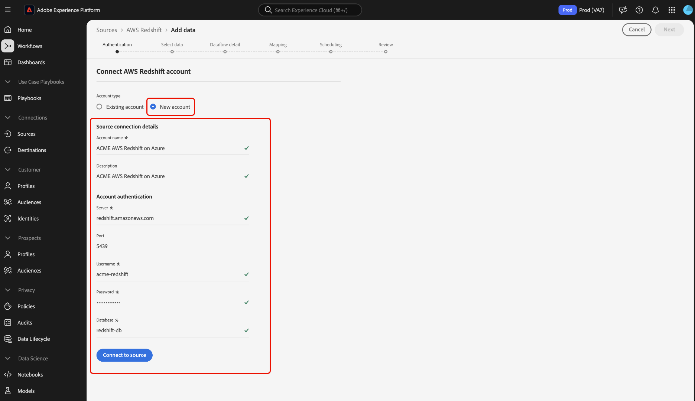

# Connetti l&#39;account [!DNL Amazon Redshift] tramite l&#39;area di lavoro origini

>[!IMPORTANT]
>
>L&#39;origine [!DNL Amazon Redshift] è disponibile nel catalogo delle origini per gli utenti che hanno acquistato Real-time Customer Data Platform Ultimate.

Questo tutorial illustra i passaggi necessari per collegare l&#39;account [!DNL Amazon Redshift] (di seguito denominato &quot;[!DNL Redshift]&quot;) a Adobe Experience Platform tramite l&#39;interfaccia utente.

## Introduzione

Questo tutorial richiede una buona conoscenza dei seguenti componenti di Experience Platform:

- [[!DNL Experience Data Model (XDM)] Sistema](../../../../../xdm/home.md): framework standardizzato in base al quale Experience Platform organizza i dati sull&#39;esperienza del cliente.
   - [Nozioni di base sulla composizione dello schema](../../../../../xdm/schema/composition.md): scopri i blocchi predefiniti di base degli schemi XDM, inclusi i principi chiave e le best practice nella composizione dello schema.
   - [Esercitazione sull&#39;editor di schemi](../../../../../xdm/tutorials/create-schema-ui.md): scopri come creare schemi personalizzati utilizzando l&#39;interfaccia utente dell&#39;editor di schemi.
- [[!DNL Real-Time Customer Profile]](../../../../../profile/home.md): fornisce un profilo consumer unificato e in tempo reale basato su dati aggregati provenienti da più origini.

Se disponi già di una connessione [!DNL Redshift] valida, puoi saltare il resto del documento e passare all&#39;esercitazione [configurazione di un flusso di dati](../../dataflow/databases.md).

### Raccogli le credenziali richieste

Per accedere all&#39;account [!DNL Redshift] su Experience Platform, è necessario fornire i seguenti valori:

| **Credenziali** | **Descrizione** |
| -------------- | --------------- |
| Server | Il server associato al tuo account [!DNL Redshift]. |
| Porta | Porta TCP utilizzata da un server [!DNL Redshift] per l&#39;ascolto delle connessioni client. |
| Nome utente | Il nome utente associato al tuo account [!DNL Redshift]. |
| Password | La password associata al tuo account [!DNL Redshift]. |
| Database | Database [!DNL Redshift] a cui si sta effettuando l&#39;accesso. |

Per ulteriori informazioni su come iniziare, consulta [questo [!DNL Redshift] documento](https://docs.aws.amazon.com/redshift/latest/gsg/getting-started.html).

Dopo aver raccolto le credenziali richieste, puoi seguire i passaggi seguenti per collegare l&#39;account [!DNL Redshift] all&#39;Experience Platform.

## Connetti il tuo account [!DNL Redshift]

>[!NOTE]
>
>Lo standard di codifica predefinito per [!DNL Redshift] è Unicode. Questo non può essere modificato.

Accedi a [Adobe Experience Platform](https://platform.adobe.com), quindi seleziona **[!UICONTROL Origini]** dalla barra di navigazione a sinistra per accedere all&#39;area di lavoro **[!UICONTROL Origini]**. Nella schermata **[!UICONTROL Catalogo]** sono visualizzate diverse origini per le quali è possibile creare un account con.

Puoi selezionare la categoria appropriata dal catalogo sul lato sinistro dello schermo. In alternativa, è possibile trovare l’origine specifica che si desidera utilizzare utilizzando l’opzione di ricerca.

Nella categoria **[!UICONTROL Database]**, selezionare **[!UICONTROL Amazon Redshift]**. Se è la prima volta che usi questo connettore, seleziona **[!UICONTROL Configura]**. In caso contrario, selezionare **[!UICONTROL Aggiungi dati]** per creare un nuovo connettore [!DNL Redshift].

Viene visualizzata la pagina **[!UICONTROL Connetti ad Amazon Redshift]**. In questa pagina è possibile utilizzare nuove credenziali o credenziali esistenti.

### Nuovo account

Se utilizzi nuove credenziali, seleziona **[!UICONTROL Nuovo account]**. Nel modulo di input visualizzato, fornire un nome, una descrizione facoltativa e le credenziali [!DNL Redshift]. Al termine, selezionare **[!UICONTROL Connetti]** e quindi attendere un po&#39; di tempo per stabilire la nuova connessione.

### Account esistente

Per connettere un account esistente, seleziona l&#39;account [!DNL Redshift] con cui desideri connetterti, quindi seleziona **[!UICONTROL Avanti]** per continuare.

## Passaggi successivi

Seguendo questa esercitazione, hai stabilito una connessione al tuo account [!DNL Redshift]. Ora puoi continuare con l&#39;esercitazione successiva e [configurare un flusso di dati per inserire dati in Experience Platform](../../dataflow/databases.md).
