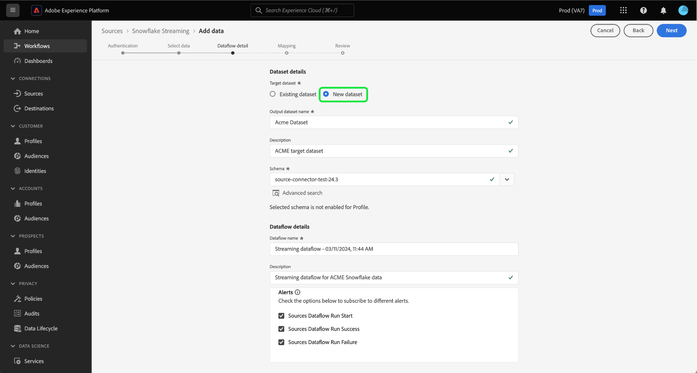

# Trasmetti dati dal database [!DNL Snowflake] all&#39;Experience Platform utilizzando l&#39;interfaccia utente

Scopri come utilizzare l&#39;interfaccia utente per inviare dati dal database [!DNL Snowflake] a Adobe Experience Platform seguendo questa guida.

## Introduzione

Questo tutorial richiede una buona conoscenza dei seguenti componenti di Experience Platform:

* [[!DNL Experience Data Model (XDM)] Sistema](../../../../../xdm/home.md): framework standardizzato tramite il quale [!DNL Experience Platform] organizza i dati sull&#39;esperienza del cliente.
   * [Nozioni di base sulla composizione dello schema](../../../../../xdm/schema/composition.md): scopri i blocchi predefiniti di base degli schemi XDM, inclusi i principi chiave e le best practice nella composizione dello schema.
   * [Esercitazione sull&#39;editor di schemi](../../../../../xdm/tutorials/create-schema-ui.md): scopri come creare schemi personalizzati utilizzando l&#39;interfaccia utente dell&#39;editor di schemi.
* [[!DNL Real-Time Customer Profile]](../../../../../profile/home.md): fornisce un profilo consumer unificato e in tempo reale basato su dati aggregati provenienti da più origini.

### Autenticazione

Leggi la guida sulla [configurazione dei prerequisiti per [!DNL Snowflake] dati in streaming](../../../../connectors/databases/snowflake-streaming.md) per informazioni sui passaggi da completare prima di acquisire i dati in streaming da [!DNL Snowflake] a Experience Platform.

## Utilizza l&#39;origine [!DNL Snowflake Streaming] per eseguire lo streaming dei dati di [!DNL Snowflake] per l&#39;Experience Platform

Nell&#39;interfaccia utente di Platform, seleziona **[!UICONTROL Origini]** dal menu di navigazione a sinistra per accedere all&#39;area di lavoro [!UICONTROL Origini]. Puoi selezionare la categoria appropriata dal catalogo sul lato sinistro dello schermo. In alternativa, è possibile trovare l’origine specifica che si desidera utilizzare utilizzando l’opzione di ricerca.

Nella categoria *Database* selezionare **[!DNL Snowflake Streaming]**, quindi **[!UICONTROL Aggiungi dati]**.

>[!TIP]
>
>Le origini che non dispongono di un account autenticato nel catalogo delle origini visualizzano l&#39;opzione **[!UICONTROL Configura]**. Quando esiste un account autenticato, questa opzione diventa **[!UICONTROL Aggiungi dati]**.

Viene visualizzata la pagina **[!UICONTROL Connetti account Streaming di Snowflake]**. In questa pagina è possibile utilizzare credenziali nuove o esistenti.

>[!BEGINTABS]

>[!TAB Crea un nuovo account]

Per creare un nuovo account, selezionare **[!UICONTROL Nuovo account]** e fornire un nome, una descrizione facoltativa e le credenziali.

Al termine, selezionare **[!UICONTROL Connetti all&#39;origine]** e quindi attendere un po&#39; di tempo per stabilire la nuova connessione.

| Credenziali | Descrizione |
| --- | --- |
| Account | Il nome dell&#39;account [!DNL Snowflake]. Per le convenzioni sui nomi degli account, leggere la [[!DNL Snowflake Streaming] guida all&#39;autenticazione](../../../../connectors/databases/snowflake-streaming.md#gather-required-credentials). |
| Data warehouse | Nome del data warehouse [!DNL Snowflake]. I warehouse gestiscono l&#39;esecuzione delle query in [!DNL Snowflake]. Ogni data warehouse [!DNL Snowflake] è indipendente l&#39;uno dall&#39;altro e deve essere accessibile singolarmente per portare i dati all&#39;Experience Platform. |
| Database | Nome del database [!DNL Snowflake]. Il database contiene i dati da portare all&#39;Experience Platform. |
| Schema | (Facoltativo) Lo schema di database associato al tuo account [!DNL Snowflake]. |
| Nome utente | Il nome utente dell&#39;account [!DNL Snowflake]. |
| Password | La password per il tuo account [!DNL Snowflake]. |
| Ruolo | (Facoltativo) Ruolo personalizzato che può essere fornito a un utente per una determinata connessione. Se non specificato, il valore predefinito è `public`. |

Per ulteriori informazioni sulla creazione dell&#39;account, leggere la sezione sulla [configurazione delle impostazioni dei ruoli](../../../../connectors/databases/snowflake-streaming.md#configure-role-settings) nella panoramica di [!DNL Snowflake Streaming].

>[!TAB Usa un account esistente]

Per utilizzare un account esistente, selezionare **[!UICONTROL Account esistente]**, quindi selezionare l&#39;account desiderato dal catalogo degli account esistente.

Seleziona **[!UICONTROL Avanti]** per procedere.

>[!ENDTABS]

## Selezionare i dati {#select-data}

>[!IMPORTANT]
>
>* Per poter creare un flusso di dati in streaming, nella tabella sorgente deve esistere una colonna di marca temporale. La marca temporale è necessaria ad Experience Platform per sapere quando verranno acquisiti i dati e quando verranno inviati in streaming i dati incrementali. Puoi aggiungere retroattivamente una colonna timestamp per una connessione esistente e creare un nuovo flusso di dati.
>
>* Verificare che il caso dei campi dati nel file di dati di origine di esempio sia conforme alle indicazioni di [!DNL Snowflake] sulla risoluzione dei casi per gli identificatori. Per ulteriori informazioni, leggere il documento [[!DNL Snowflake] sul case dell&#39;identificatore](https://docs.snowflake.com/en/sql-reference/identifiers-syntax#label-identifier-casing).

Viene visualizzato il passaggio [!UICONTROL Seleziona dati]. In questo passaggio, devi selezionare i dati da importare in Experience Platform, configurare marche temporali e fusi orari e fornire un file di dati sorgente di esempio per l’acquisizione di dati non elaborati.

Utilizzare la directory del database a sinistra dello schermo e selezionare la tabella che si desidera importare in Experience Platform.

Quindi, seleziona il tipo di colonna timestamp della tabella. È possibile selezionare due tipi di colonne di marca temporale: `TIMESTAMP_NTZ` o `TIMESTAMP_LTZ`. Se si seleziona un tipo di colonna `TIMESTAMP_NTZ`, è necessario specificare anche un fuso orario. Le colonne devono avere un vincolo non null. Per ulteriori informazioni, leggere la sezione sulle [limitazioni e domande frequenti]

In questo passaggio puoi anche configurare le impostazioni di retrocompilazione. La retrocompilazione determina quali dati vengono inizialmente acquisiti. Se la retrocompilazione è abilitata, tutti i file correnti nel percorso specificato verranno acquisiti durante la prima acquisizione pianificata. In caso contrario, verranno acquisiti solo i file caricati tra la prima esecuzione dell’acquisizione e l’ora di inizio. I file caricati prima dell’ora di inizio non verranno acquisiti.

Seleziona l&#39;interruttore **[!UICONTROL Backfill]** per abilitare la retrocompilazione.

Infine, seleziona **[!UICONTROL Scegli il file]** per caricare un esempio di dati di origine per creare il set di mappatura, che verrà utilizzato in un passaggio successivo per mappare i dati originali su Experience Data Model (XDM).

Al termine, selezionare **[!UICONTROL Avanti]** per continuare.

## Fornisci i dettagli del set di dati e del flusso di dati {#provide-dataset-and-dataflow-details}

Quindi, devi fornire informazioni sul set di dati e sul flusso di dati.

### Dettagli del set di dati {#dataset-details}

Un set di dati è un costrutto di archiviazione e gestione per una raccolta di dati, in genere una tabella, che contiene uno schema (colonne) e dei campi (righe). I dati acquisiti correttamente in Experience Platform vengono memorizzati nel data lake come set di dati. Durante questo passaggio, puoi creare un nuovo set di dati o utilizzare un set di dati esistente.

>[!BEGINTABS]

>[!TAB Utilizza un nuovo set di dati]

Per utilizzare un nuovo set di dati, seleziona **[!UICONTROL Nuovo set di dati]**, quindi fornisci un nome e una descrizione facoltativa per il set di dati. Devi anche selezionare uno schema Experience Data Model (XDM) a cui aderisce il set di dati.

| Dettagli nuovo set di dati | Descrizione |
| --- | --- |
| Nome set di dati di output | Nome del nuovo set di dati. |
| Descrizione | (Facoltativo) Breve panoramica del nuovo set di dati. |
| Schema | Elenco a discesa degli schemi esistenti nell’organizzazione. Puoi anche creare uno schema personalizzato prima del processo di configurazione sorgente. Per ulteriori informazioni, consulta la guida su [creazione di uno schema XDM nell&#39;interfaccia utente](../../../../../xdm/tutorials/create-schema-ui.md). |

>[!TAB Utilizza un set di dati esistente]

Se disponi già di un set di dati, seleziona **[!UICONTROL Set di dati esistente]** e quindi utilizza l&#39;opzione **[!UICONTROL Ricerca avanzata]** per visualizzare una finestra di tutti i set di dati dell&#39;organizzazione, inclusi i rispettivi dettagli, ad esempio se sono abilitati per l&#39;acquisizione in Real-Time Customer Profile.

>[!ENDTABS]

+++Seleziona per i passaggi per abilitare l’acquisizione del profilo, la diagnostica degli errori e l’acquisizione parziale.

Se il set di dati è abilitato per Real-Time Customer Profile, durante questo passaggio puoi attivare/disattivare **[!UICONTROL il set di dati profilo]** per abilitare i dati per l&#39;acquisizione del profilo. È inoltre possibile utilizzare questo passaggio per abilitare **[!UICONTROL Diagnostica errori]** e **[!UICONTROL Acquisizione parziale]**.

* **[!UICONTROL Diagnostica errori]**: selezionare **[!UICONTROL Diagnostica errori]** per indicare all&#39;origine di produrre diagnostica errori a cui fare successivamente riferimento durante il monitoraggio dell&#39;attività del set di dati e dello stato del flusso di dati.
* **[!UICONTROL Acquisizione parziale]**: l&#39;acquisizione parziale in batch consente di acquisire dati contenenti errori, fino a una determinata soglia configurabile. Questa funzione consente di acquisire correttamente in Experience Platform tutti i dati accurati, mentre tutti i dati errati vengono raggruppati separatamente con informazioni sul motivo della validità.

+++

### Dettagli del flusso di dati {#dataflow-details}

Una volta configurato il set di dati, devi quindi fornire dettagli sul flusso di dati, tra cui un nome, una descrizione facoltativa e le configurazioni degli avvisi.

| Configurazioni del flusso di dati | Descrizione |
| --- | --- |
| Nome flusso di dati | Nome del flusso di dati.  Per impostazione predefinita, viene utilizzato il nome del file che si sta importando. |
| Descrizione | (Facoltativo) Breve descrizione del flusso di dati. |
| Avvisi | Experience Platform può generare avvisi basati su eventi a cui gli utenti possono abbonarsi. Queste opzioni richiedono un flusso di dati in esecuzione per attivarle. Per ulteriori informazioni, leggere la [panoramica degli avvisi](../../alerts.md) <ul><li>**Inizio esecuzione flusso di dati origini**: selezionare questo avviso per ricevere una notifica all&#39;inizio dell&#39;esecuzione del flusso di dati.</li><li>**Esecuzione del flusso di dati origini completata**: selezionare questo avviso per ricevere una notifica se il flusso di dati termina senza errori.</li><li>**Errore di esecuzione del flusso di dati di origini**: selezionare questo avviso per ricevere una notifica se l&#39;esecuzione del flusso di dati termina con errori.</li></ul> |

Al termine, selezionare **[!UICONTROL Avanti]** per continuare.

## Mappare i campi su uno schema XDM {#mapping}

Viene visualizzato il passaggio [!UICONTROL Mapping]. Utilizza l&#39;interfaccia di mappatura per mappare i dati di origine ai campi dello schema appropriati prima di acquisire tali dati in Experience Platform, quindi seleziona **[!UICONTROL Avanti]**. Per una guida dettagliata sull&#39;utilizzo dell&#39;interfaccia di mappatura, leggere la [Guida dell&#39;interfaccia utente della preparazione dati](../../../../../data-prep/ui/mapping.md) per ulteriori informazioni.

## Verifica il flusso di dati {#review}

Il passaggio finale nel processo di creazione del flusso di dati consiste nell’esaminare il flusso di dati prima di eseguirlo. Utilizza il passaggio **[!UICONTROL Rivedi]** per rivedere i dettagli del nuovo flusso di dati prima che venga eseguito. I dettagli sono raggruppati nelle seguenti categorie:

* **Connessione**: mostra il tipo di origine, il percorso pertinente del file di origine scelto e il numero di colonne all&#39;interno di tale file di origine.
* **Assegna set di dati e mappa i campi**: mostra in quale set di dati vengono acquisiti i dati di origine, incluso lo schema a cui il set di dati aderisce.

Dopo aver rivisto il flusso di dati, seleziona **[!UICONTROL Fine]** e attendi che venga creato un po&#39; di tempo.

## Passaggi successivi

Seguendo questa esercitazione, hai creato un flusso di dati in streaming per [!DNL Snowflake] dati. Per ulteriori risorse, consulta la documentazione di seguito.

### Monitorare il flusso di dati

Una volta creato il flusso di dati, puoi monitorare i dati che vengono acquisiti tramite di esso per visualizzare informazioni su tassi di acquisizione, successo ed errori. Per ulteriori informazioni su come monitorare i flussi di dati in streaming, consulta l&#39;esercitazione sul [monitoraggio dei flussi di dati in streaming nell&#39;interfaccia utente](../../monitor-streaming.md).

### Aggiornare il flusso di dati

Per aggiornare le configurazioni per la pianificazione, la mappatura e le informazioni generali dei flussi di dati, visita il tutorial su [aggiornamento dei flussi di dati di origine nell&#39;interfaccia utente](../../update-dataflows.md).

### Eliminare il flusso di dati

È possibile eliminare i flussi di dati non più necessari o creati in modo errato utilizzando la funzione **[!UICONTROL Elimina]** disponibile nell&#39;area di lavoro **[!UICONTROL Flussi di dati]**. Per ulteriori informazioni su come eliminare i flussi di dati, consulta l&#39;esercitazione su [eliminazione dei flussi di dati nell&#39;interfaccia utente](../../delete.md).
