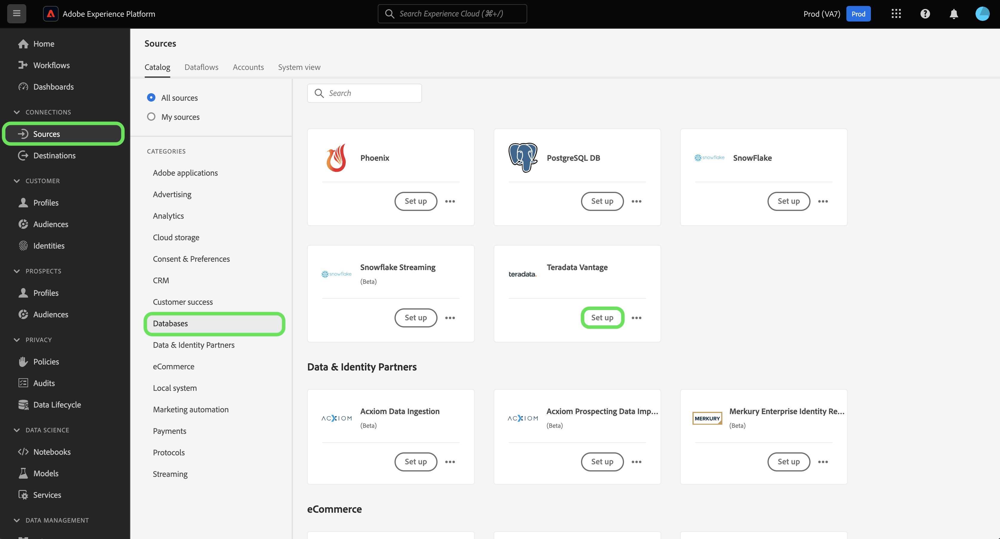
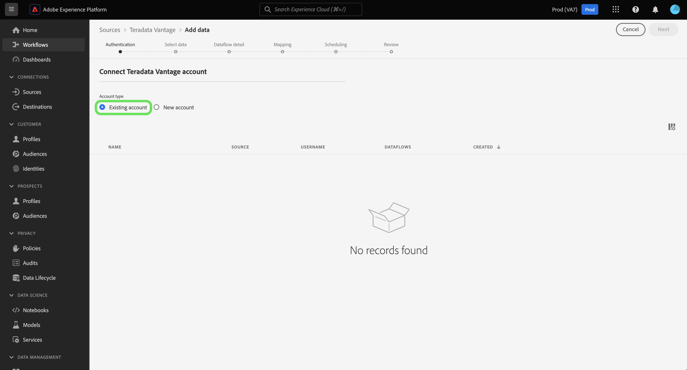
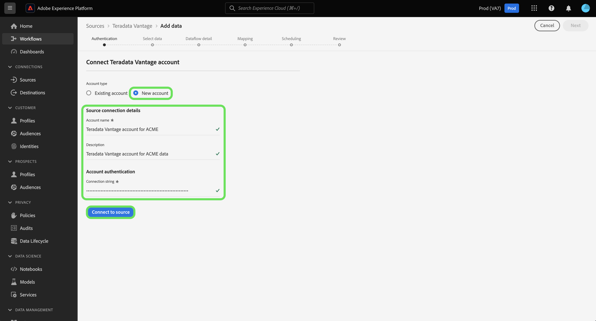

# Crea una connessione sorgente [!DNL Teradata Vantage] nell&#39;interfaccia utente

Questo tutorial illustra i passaggi per la creazione di un connettore di origine [!DNL Teradata Vantage] tramite l&#39;interfaccia utente di Adobe Experience Platform.

## Introduzione

Questo tutorial richiede una buona conoscenza dei seguenti componenti di Experience Platform:

* [Origini](../../../../home.md): Experience Platform consente di acquisire dati da varie origini e allo stesso tempo di strutturare, etichettare e migliorare i dati in arrivo tramite i servizi Experience Platform.
* [Sandbox](../../../../../sandboxes/home.md): Experience Platform fornisce sandbox virtuali che suddividono una singola istanza Experience Platform in ambienti virtuali separati, utili per le attività di sviluppo e aggiornamento delle applicazioni di esperienza digitale.

### Raccogli le credenziali richieste

Per accedere al tuo account [!DNL Teradata Vantage] su Experience Platform, devi fornire il seguente valore di autenticazione:

| Credenziali | Descrizione |
| ---------- | ----------- |
| Stringa di connessione | Una stringa di connessione è una stringa che fornisce informazioni su un&#39;origine dati e su come è possibile connettersi a essa. Il modello di stringa di connessione per [!DNL Teradata Vantage] è `DBCName={SERVER};Uid={USERNAME};Pwd={PASSWORD}`. |

Per ulteriori informazioni su come iniziare, consulta questo [[!DNL Teradata Vantage] documento](https://docs.teradata.com/r/Teradata-VantageTM-Advanced-SQL-Engine-Security-Administration/July-2021/Setting-Up-the-Administrative-Infrastructure/Controlling-Access-to-the-Operating-System/Working-with-OS-Level-Security-Options).

## Connetti il tuo account [!DNL Teradata Vantage]

Nell&#39;interfaccia utente di Experience Platform, selezionare **[!UICONTROL Sources]** dal menu di navigazione a sinistra per accedere all&#39;area di lavoro [!UICONTROL Sources]. Puoi selezionare la categoria appropriata dal catalogo sul lato sinistro dello schermo. In alternativa, è possibile trovare l’origine specifica che si desidera utilizzare utilizzando l’opzione di ricerca.

Nella categoria [!UICONTROL Databases], selezionare **[!UICONTROL Teradata Vantage]**, quindi **[!UICONTROL Set up]**.

>[!TIP]
>
>Le origini nel catalogo origini visualizzano l&#39;opzione **[!UICONTROL Set up]** quando una determinata origine non dispone ancora di un account autenticato. Quando esiste un account autenticato, questa opzione diventa **[!UICONTROL Add data]**.

Viene visualizzata la pagina **[!UICONTROL Connect to Teradata Vantage]**. In questa pagina è possibile utilizzare nuove credenziali o credenziali esistenti.

### Account esistente

Per connettere un account esistente, selezionare l&#39;account [!DNL Teradata Vantage] con cui si desidera connettersi, quindi selezionare **[!UICONTROL Next]** per continuare.

### Nuovo account

Se si utilizzano nuove credenziali, selezionare **[!UICONTROL New account]**. Nel modulo di input visualizzato, fornire un nome, una descrizione facoltativa e le credenziali [!DNL Teradata Vantage]. Al termine, selezionare **[!UICONTROL Connect]** e quindi attendere un po&#39; di tempo per stabilire la nuova connessione.

## Passaggi successivi

Seguendo questa esercitazione, hai stabilito una connessione con il tuo account Teradata Vantage. Ora puoi continuare con l&#39;esercitazione successiva e [configurare un flusso di dati per inserire dati in Experience Platform](../../dataflow/databases.md).
