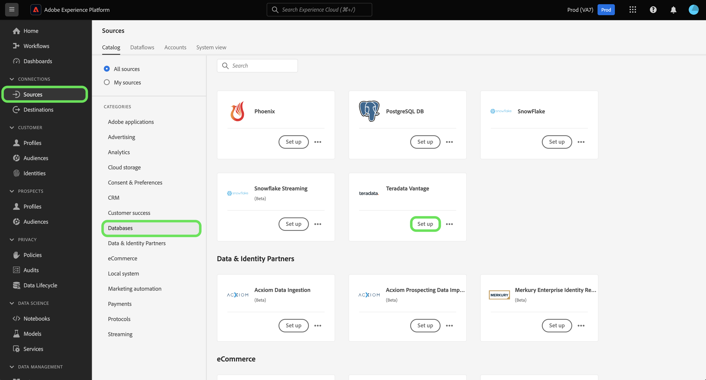

# (Beta) Crea un [!DNL Teradata Vantage] connessione sorgente nell’interfaccia utente

>[!NOTE]
>
> La [!DNL Teradata Vantage] la sorgente è in versione beta. Consulta la sezione [Panoramica delle origini](../../../../home.md#terms-and-conditions) per ulteriori informazioni sull’utilizzo di origini con etichetta beta.

Questa esercitazione fornisce i passaggi per la creazione di un [!DNL Teradata Vantage] connettore di origine tramite l’interfaccia utente di Adobe Experience Platform.

## Introduzione

Questa esercitazione richiede una buona comprensione dei seguenti componenti di Platform:

* [Origini](../../../../home.md): L’Experience Platform consente l’acquisizione di dati da varie sorgenti, fornendo al contempo la possibilità di strutturare, etichettare e migliorare i dati in arrivo tramite i servizi Experience Platform.
* [Sandbox](../../../../../sandboxes/home.md): Experience Platform fornisce sandbox virtuali che suddividono una singola istanza di Platform in ambienti virtuali separati per sviluppare e sviluppare applicazioni di esperienza digitale.

### Raccogli credenziali richieste

Per accedere al tuo [!DNL Teradata Vantage] su Platform, devi fornire il seguente valore di autenticazione:

| Credenziali | Descrizione |
| ---------- | ----------- |
| Stringa di connessione | Una stringa di connessione è una stringa che fornisce informazioni su un&#39;origine dati e su come connettersi ad essa. Pattern di stringa di connessione per [!DNL Teradata Vantage] è `DBCName={SERVER};Uid={USERNAME};Pwd={PASSWORD}`. |

Per ulteriori informazioni su come iniziare, consulta questo articolo [[!DNL Teradata Vantage] documento](https://docs.teradata.com/r/Teradata-VantageTM-Advanced-SQL-Engine-Security-Administration/July-2021/Setting-Up-the-Administrative-Infrastructure/Controlling-Access-to-the-Operating-System/Working-with-OS-Level-Security-Options).

## Collega il tuo [!DNL Teradata Vantage] account

Nell’interfaccia utente di Platform, seleziona **[!UICONTROL Origini]** dalla navigazione a sinistra per accedere al [!UICONTROL Origini] workspace. La [!UICONTROL Catalogo] in questa schermata vengono visualizzate diverse sorgenti con cui è possibile creare un account.

Puoi selezionare la categoria appropriata dal catalogo sul lato sinistro dello schermo. In alternativa, è possibile trovare la sorgente specifica con cui si desidera lavorare utilizzando la barra di ricerca.

Sotto la [!UICONTROL Database] categoria, seleziona **[!UICONTROL Vantaggio teradata]** quindi seleziona **[!UICONTROL Aggiungi dati]**.

La **[!UICONTROL Connessione a Vantage Teradata]** viene visualizzata la pagina . In questa pagina è possibile utilizzare le nuove credenziali o le credenziali esistenti.

### Account esistente

Per collegare un account esistente, seleziona la [!DNL Teradata Vantage] account con cui desideri connetterti, quindi seleziona **[!UICONTROL Successivo]** per procedere.

### Nuovo account

Se si utilizzano nuove credenziali, selezionare **[!UICONTROL Nuovo account]**. Nel modulo di input visualizzato, specificare un nome, una descrizione facoltativa e il [!DNL Teradata Vantage] credenziali. Al termine, seleziona **[!UICONTROL Connetti]** e quindi lasciare un po&#39; di tempo per stabilire la nuova connessione.

## Passaggi successivi

Seguendo questa esercitazione, hai stabilito una connessione al tuo account Teradata Vantage. Ora puoi passare all’esercitazione successiva e [configurare un flusso di dati per l’importazione di dati in Platform](../../dataflow/databases.md).
