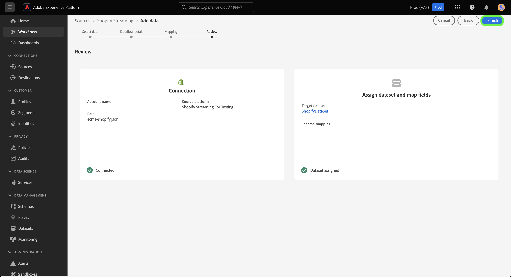

# Creare una connessione di origine e un flusso di dati per [!DNL Shopify Streaming] dati tramite l’interfaccia utente

Questo tutorial descrive i passaggi necessari per creare [!DNL Shopify Streaming] connessione di origine e flusso di dati tramite l’interfaccia utente di Platform.

## Introduzione {#getting-started}

Questo tutorial richiede una buona conoscenza dei seguenti componenti di Experience Platform:

* [[!DNL Experience Data Model (XDM)] Sistema](../../../../../xdm/home.md): il quadro standardizzato mediante il quale [!DNL Experience Platform] organizza i dati sull’esperienza del cliente.
   * [Nozioni di base sulla composizione dello schema](../../../../../xdm/schema/composition.md): scopri gli elementi di base degli schemi XDM, compresi i principi chiave e le best practice nella composizione dello schema.
   * [Esercitazione sull’editor di schemi](../../../../../xdm/tutorials/create-schema-ui.md): scopri come creare schemi personalizzati utilizzando l’interfaccia utente dell’Editor di schema.
* [[!DNL Real-Time Customer Profile]](../../../../../profile/home.md): fornisce un profilo consumer unificato e in tempo reale basato su dati aggregati provenienti da più origini.

>[!IMPORTANT]
>
>Questo tutorial richiede di aver completato la configurazione dei prerequisiti per [!DNL Shopify Streaming] account. Per i passaggi relativi alla configurazione dell’account, consulta [[!DNL Shopify Streaming] panoramica](../../../../connectors/ecommerce/shopify-streaming.md).

## Connetti [!DNL Shopify Streaming] account

Nell’interfaccia utente di Platform, seleziona **[!UICONTROL Sorgenti]** dalla barra di navigazione a sinistra per accedere al [!UICONTROL Sorgenti] Workspace. Il [!UICONTROL Catalogo] Nella schermata vengono visualizzate diverse origini con cui è possibile creare un account.

Puoi selezionare la categoria appropriata dal catalogo sul lato sinistro dello schermo. In alternativa, è possibile trovare l’origine specifica che si desidera utilizzare utilizzando l’opzione di ricerca.

Sotto **eCommerce** categoria, seleziona [!DNL Shopify Streaming], quindi selezionare **[!UICONTROL Aggiungi dati]**.

## Selezionare i dati

Il **[!UICONTROL Seleziona dati]** viene visualizzata un’interfaccia che consente di selezionare i dati da inserire in Platform.

* La parte sinistra dell’interfaccia è un browser che ti consente di visualizzare i flussi di dati disponibili all’interno del tuo account;
* La parte destra dell’interfaccia consente di visualizzare in anteprima fino a 100 righe di dati da un file JSON.

Seleziona **[!UICONTROL Carica file]** per caricare un file JSON dal sistema locale. In alternativa, puoi trascinare e rilasciare il file JSON da caricare nella [!UICONTROL Trascinare i file] pannello.

Una volta caricato il file, l’interfaccia di anteprima si aggiorna e mostra un’anteprima dello schema caricato. L’interfaccia di anteprima consente di esaminare il contenuto e la struttura di un file. È inoltre possibile utilizzare [!UICONTROL Campo di ricerca] per accedere a elementi specifici dallo schema.

Al termine, seleziona **[!UICONTROL Successivo]**.

## Dettaglio del flusso di dati

Il **Dettagli del flusso di dati** Questo passaggio ti fornisce le opzioni per utilizzare un set di dati esistente o stabilirne uno nuovo per il flusso di dati, nonché l’opportunità di fornire un nome e una descrizione per il flusso di dati. Durante questo passaggio, puoi anche configurare le impostazioni per l’acquisizione del profilo, la diagnostica degli errori, l’acquisizione parziale e gli avvisi.

Al termine, seleziona **[!UICONTROL Successivo]**.

## Mappatura

Il [!UICONTROL Mappatura] viene visualizzato un passaggio che fornisce un’interfaccia per mappare i campi sorgente dallo schema sorgente ai campi XDM di destinazione appropriati nello schema di destinazione.

Platform fornisce consigli intelligenti per campi mappati automaticamente in base allo schema o al set di dati di destinazione selezionato. Puoi regolare manualmente le regole di mappatura in base ai tuoi casi d’uso. In base alle tue esigenze, puoi scegliere di mappare i campi direttamente o utilizzare le funzioni di preparazione dati per trasformare i dati sorgente in modo da derivare valori calcolati o calcolati. Per i passaggi completi sull’utilizzo dell’interfaccia mapper e dei campi calcolati, vedi la [Guida dell’interfaccia utente per la preparazione dati](https://experienceleague.adobe.com/docs/experience-platform/data-prep/ui/mapping.html).

Una volta mappati correttamente i dati di origine, seleziona **[!UICONTROL Successivo]**.

## Revisione

Il **[!UICONTROL Revisione]** viene visualizzato un passaggio che consente di rivedere il nuovo flusso di dati prima di crearlo. I dettagli sono raggruppati nelle seguenti categorie:

* **[!UICONTROL Connessione]**: mostra il tipo di origine, il percorso pertinente del file di origine scelto e il numero di colonne all’interno di tale file di origine.
* **[!UICONTROL Assegna set di dati e mappa campi]**: mostra in quale set di dati vengono acquisiti i dati di origine, incluso lo schema a cui aderisce il set di dati.

Dopo aver rivisto il flusso di dati, seleziona **[!UICONTROL Fine]** e lascia un po’ di tempo per creare il flusso di dati.

## Ottieni l’URL dell’endpoint di streaming

Una volta creato il flusso di dati di streaming, ora puoi recuperare l’URL dell’endpoint di streaming. Questo endpoint verrà utilizzato per abbonarsi al webhook, consentendo alla tua origine di streaming di comunicare con Experience Platform.

Per recuperare l’endpoint di streaming, vai al [!UICONTROL Attività flusso di dati] pagina del flusso di dati appena creato e copia l’endpoint dalla parte inferiore della sezione [!UICONTROL Proprietà] pannello.

## Passaggi successivi

Seguendo questa esercitazione, hai stabilito una connessione di origine e un flusso di dati per il tuo [!DNL Shopify Streaming] account. Per istruzioni su come collegare [!DNL Shopify Streaming] tramite l’API, leggi l’esercitazione su [creazione di una connessione sorgente e di un flusso di dati da inviare [!DNL Shopify] dati utilizzando l’API del servizio Flusso](../../../api/create/ecommerce/shopify-streaming.md).
