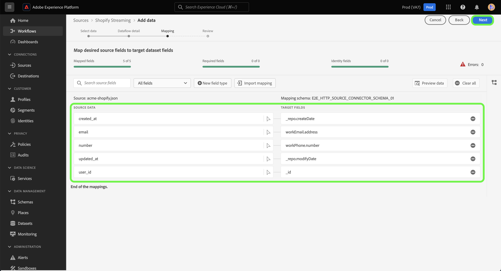

# Crea una connessione di origine e un flusso di dati per i dati [!DNL Shopify Streaming] tramite l&#39;interfaccia utente

Questo tutorial descrive i passaggi per creare una connessione di origine [!DNL Shopify Streaming] e un flusso di dati utilizzando l&#39;interfaccia utente di Platform.

## Introduzione {#getting-started}

Questo tutorial richiede una buona conoscenza dei seguenti componenti di Experience Platform:

* [[!DNL Experience Data Model (XDM)] Sistema](../../../../../xdm/home.md): framework standardizzato tramite il quale [!DNL Experience Platform] organizza i dati sull&#39;esperienza del cliente.
   * [Nozioni di base sulla composizione dello schema](../../../../../xdm/schema/composition.md): scopri i blocchi predefiniti di base degli schemi XDM, inclusi i principi chiave e le best practice nella composizione dello schema.
   * [Esercitazione sull&#39;editor di schemi](../../../../../xdm/tutorials/create-schema-ui.md): scopri come creare schemi personalizzati utilizzando l&#39;interfaccia utente dell&#39;editor di schemi.
* [[!DNL Real-Time Customer Profile]](../../../../../profile/home.md): fornisce un profilo consumer unificato e in tempo reale basato su dati aggregati provenienti da più origini.

>[!IMPORTANT]
>
>Questo tutorial richiede il completamento della configurazione dei prerequisiti per l&#39;account [!DNL Shopify Streaming]. Per informazioni sulla configurazione dell&#39;account, leggere la [[!DNL Shopify Streaming] panoramica](../../../../connectors/ecommerce/shopify-streaming.md).

## Connetti il tuo account [!DNL Shopify Streaming]

Nell&#39;interfaccia utente di Platform, seleziona **[!UICONTROL Origini]** dalla barra di navigazione a sinistra per accedere all&#39;area di lavoro [!UICONTROL Origini]. Nella schermata [!UICONTROL Catalogo] sono visualizzate diverse origini con cui è possibile creare un account.

Puoi selezionare la categoria appropriata dal catalogo sul lato sinistro dello schermo. In alternativa, è possibile trovare l’origine specifica che si desidera utilizzare utilizzando l’opzione di ricerca.

Nella categoria **eCommerce**, selezionare [!DNL Shopify Streaming], quindi **[!UICONTROL Aggiungi dati]**.

## Selezionare i dati

Viene visualizzato il passaggio **[!UICONTROL Seleziona dati]**, che fornisce un&#39;interfaccia per la selezione dei dati da inserire in Platform.

* La parte sinistra dell’interfaccia è un browser che ti consente di visualizzare i flussi di dati disponibili all’interno del tuo account;
* La parte destra dell’interfaccia consente di visualizzare in anteprima fino a 100 righe di dati da un file JSON.

Seleziona **[!UICONTROL Carica file]** per caricare un file JSON dal sistema locale. In alternativa, puoi trascinare e rilasciare il file JSON da caricare nel pannello [!UICONTROL Trascina i file].

Una volta caricato il file, l’interfaccia di anteprima si aggiorna e mostra un’anteprima dello schema caricato. L’interfaccia di anteprima consente di esaminare il contenuto e la struttura di un file. È inoltre possibile utilizzare l&#39;utilità [!UICONTROL Cerca campo] per accedere a elementi specifici dallo schema.

Al termine, selezionare **[!UICONTROL Avanti]**.

## Dettaglio del flusso di dati

Viene visualizzato il passaggio **Dettagli flusso di dati** che fornisce le opzioni per utilizzare un set di dati esistente o stabilirne uno nuovo per il flusso di dati, nonché l&#39;opportunità di fornire un nome e una descrizione per il flusso di dati. Durante questo passaggio, puoi anche configurare le impostazioni per l’acquisizione del profilo, la diagnostica degli errori, l’acquisizione parziale e gli avvisi.

Al termine, selezionare **[!UICONTROL Avanti]**.

## Mappatura

Viene visualizzato il passaggio [!UICONTROL Mappatura] che fornisce un&#39;interfaccia per mappare i campi sorgente dallo schema sorgente ai campi XDM di destinazione appropriati nello schema di destinazione.

Platform fornisce consigli intelligenti per campi mappati automaticamente in base allo schema o al set di dati di destinazione selezionato. Puoi regolare manualmente le regole di mappatura in base ai tuoi casi d’uso. In base alle tue esigenze, puoi scegliere di mappare i campi direttamente o utilizzare le funzioni di preparazione dati per trasformare i dati sorgente in modo da derivare valori calcolati o calcolati. Per i passaggi completi sull&#39;utilizzo dell&#39;interfaccia mapper e dei campi calcolati, consulta la [guida dell&#39;interfaccia utente della preparazione dati](https://experienceleague.adobe.com/docs/experience-platform/data-prep/ui/mapping.html).

Una volta mappati correttamente i dati di origine, seleziona **[!UICONTROL Avanti]**.

## Controlla

Viene visualizzato il passaggio **[!UICONTROL Rivedi]**, che consente di rivedere il nuovo flusso di dati prima che venga creato. I dettagli sono raggruppati nelle seguenti categorie:

* **[!UICONTROL Connessione]**: mostra il tipo di origine, il percorso pertinente del file di origine scelto e il numero di colonne all&#39;interno di tale file di origine.
* **[!UICONTROL Assegna set di dati e mappa i campi]**: mostra in quale set di dati vengono acquisiti i dati di origine, incluso lo schema a cui il set di dati aderisce.

Dopo aver rivisto il flusso di dati, seleziona **[!UICONTROL Fine]** e attendi che venga creato un po&#39; di tempo.

## Ottieni l’URL dell’endpoint di streaming

Una volta creato il flusso di dati di streaming, ora puoi recuperare l’URL dell’endpoint di streaming. Questo endpoint verrà utilizzato per abbonarsi al webhook, consentendo alla tua origine di streaming di comunicare con Experience Platform.

Per recuperare l&#39;endpoint di streaming, vai alla pagina [!UICONTROL Attività flusso di dati] del flusso di dati appena creato e copia l&#39;endpoint dalla parte inferiore del pannello [!UICONTROL Proprietà].

## Passaggi successivi

Seguendo questa esercitazione, hai stabilito una connessione di origine e un flusso di dati per il tuo account [!DNL Shopify Streaming]. Per istruzioni su come connettere l&#39;account [!DNL Shopify Streaming] utilizzando l&#39;API, leggere l&#39;esercitazione relativa alla [creazione di una connessione di origine e di un flusso di dati per lo streaming [!DNL Shopify] dei dati tramite l&#39;API del servizio Flusso](../../../api/create/ecommerce/shopify-streaming.md).
