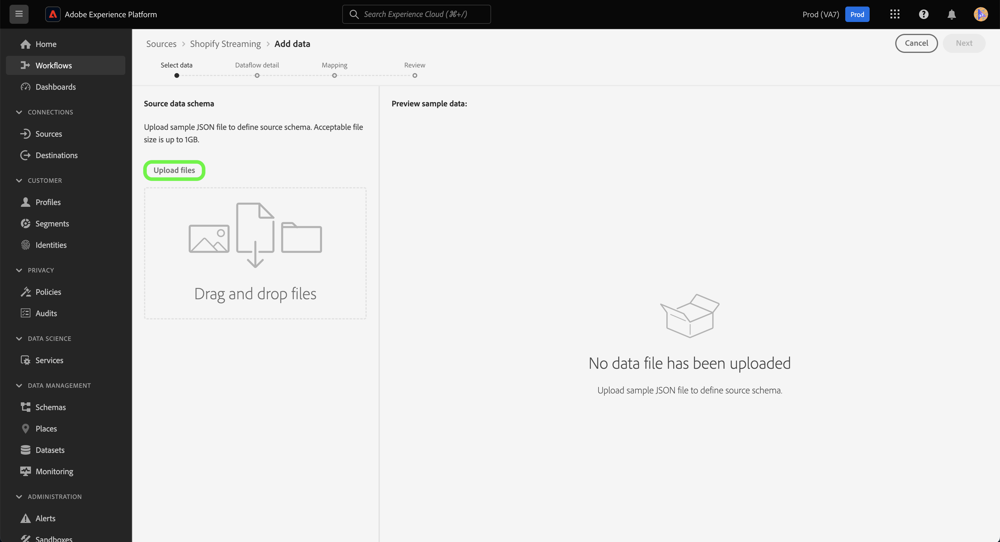

# Creare una connessione sorgente e un flusso di dati per [!DNL Shopify Streaming] dati utilizzando l’interfaccia utente

Questa esercitazione fornisce i passaggi per la creazione di un [!DNL Shopify Streaming] connessione sorgente e flusso di dati tramite l’interfaccia utente di Platform.

## Introduzione {#getting-started}

Questa esercitazione richiede una comprensione approfondita dei seguenti componenti dell&#39;Experience Platform:

* [[!DNL Experience Data Model (XDM)] Sistema](../../../../../xdm/home.md): Il quadro standardizzato [!DNL Experience Platform] organizza i dati sulla customer experience.
   * [Nozioni di base sulla composizione dello schema](../../../../../xdm/schema/composition.md): Scopri i blocchi di base degli schemi XDM, inclusi i principi chiave e le best practice nella composizione dello schema.
   * [Esercitazione sull’Editor di schema](../../../../../xdm/tutorials/create-schema-ui.md): Scopri come creare schemi personalizzati utilizzando l’interfaccia utente dell’Editor di schema.
* [[!DNL Real-Time Customer Profile]](../../../../../profile/home.md): Fornisce un profilo di consumatore unificato e in tempo reale basato su dati aggregati provenienti da più origini.

>[!IMPORTANT]
>
>Questa esercitazione richiede di aver completato la configurazione dei prerequisiti per la [!DNL Shopify Streaming] conto. Per i passaggi sulla configurazione dell’account, leggi la sezione [[!DNL Shopify Streaming] panoramica](../../../../connectors/ecommerce/shopify-streaming.md).

## Collega il tuo [!DNL Shopify Streaming] account

Nell’interfaccia utente di Platform, seleziona **[!UICONTROL Origini]** dalla barra di navigazione a sinistra per accedere al [!UICONTROL Origini] workspace. La [!UICONTROL Catalogo] in viene visualizzata una varietà di sorgenti con cui è possibile creare un account.

Puoi selezionare la categoria appropriata dal catalogo sul lato sinistro dello schermo. In alternativa, è possibile trovare la sorgente specifica con cui si desidera lavorare utilizzando l’opzione di ricerca.

Sotto la **eCommerce** categoria, seleziona [!DNL Shopify Streaming], quindi seleziona **[!UICONTROL Aggiungi dati]**.

## Selezionare i dati

La **[!UICONTROL Seleziona dati]** viene visualizzato un passaggio che fornisce un’interfaccia per selezionare i dati inviati a Platform.

* La parte sinistra dell’interfaccia è un browser che ti consente di visualizzare i flussi di dati disponibili all’interno del tuo account;
* La parte destra dell’interfaccia ti consente di visualizzare in anteprima fino a 100 righe di dati da un file JSON.

Seleziona **[!UICONTROL Caricare file]** per caricare un file JSON dal tuo sistema locale. In alternativa, puoi trascinare e rilasciare il file JSON da caricare nel [!UICONTROL Trascinamento di file] pannello.

Una volta caricato il file, l&#39;interfaccia di anteprima si aggiorna per visualizzare un&#39;anteprima dello schema caricato. L’interfaccia di anteprima ti consente di esaminare il contenuto e la struttura di un file. È inoltre possibile utilizzare [!UICONTROL Campo di ricerca] utilità per accedere a elementi specifici dallo schema.

Al termine, seleziona **[!UICONTROL Successivo]**.

## Dettaglio del flusso di dati

La **Dettaglio flusso di dati** viene visualizzato un passaggio che fornisce le opzioni per utilizzare un set di dati esistente o per stabilire un nuovo set di dati per il flusso di dati, nonché l’opportunità di fornire un nome e una descrizione per il flusso di dati. Durante questo passaggio, puoi anche configurare le impostazioni per l’acquisizione di profili, la diagnostica degli errori, l’acquisizione parziale e gli avvisi.

Al termine, seleziona **[!UICONTROL Successivo]**.

## Mappatura

La [!UICONTROL Mappatura] viene visualizzato un passaggio che fornisce un&#39;interfaccia per mappare i campi di origine dallo schema di origine ai campi XDM di destinazione appropriati nello schema di destinazione.

Platform fornisce consigli intelligenti per i campi mappati automaticamente in base allo schema o al set di dati di destinazione selezionato. Puoi regolare manualmente le regole di mappatura in base ai tuoi casi d’uso. In base alle tue esigenze, puoi scegliere di mappare direttamente i campi oppure utilizzare le funzioni di preparazione dei dati per trasformare i dati di origine in valori calcolati o calcolati. Per i passaggi completi sull’utilizzo dell’interfaccia di mappatura e dei campi calcolati, consulta la sezione [Guida all’interfaccia utente della preparazione dei dati](https://experienceleague.adobe.com/docs/experience-platform/data-prep/ui/mapping.html).

Una volta mappati correttamente i dati di origine, seleziona **[!UICONTROL Successivo]**.

## Revisione

La **[!UICONTROL Revisione]** viene visualizzato un passaggio che consente di rivedere il nuovo flusso di dati prima della creazione. I dettagli sono raggruppati nelle seguenti categorie:

* **[!UICONTROL Connessione]**: Mostra il tipo di origine, il percorso pertinente del file di origine scelto e il numero di colonne all&#39;interno del file di origine.
* **[!UICONTROL Assegna set di dati e campi mappa]**: Mostra il set di dati in cui vengono acquisiti i dati di origine, incluso lo schema a cui il set di dati aderisce.

Dopo aver esaminato il flusso di dati, seleziona **[!UICONTROL Fine]** e lascia un certo tempo per la creazione del flusso di dati.

## Ottieni l&#39;URL dell&#39;endpoint di streaming

Con il flusso di dati in streaming creato, ora puoi recuperare l’URL dell’endpoint in streaming. Questo endpoint verrà utilizzato per abbonarsi al tuo webhook, consentendo alla tua sorgente di streaming di comunicare con Experience Platform.

Per recuperare l’endpoint di streaming, vai a [!UICONTROL Attività del flusso di dati] della pagina del flusso di dati appena creato e copia l’endpoint dalla parte inferiore della sezione [!UICONTROL Proprietà] pannello.

## Passaggi successivi

Seguendo questa esercitazione, hai stabilito una connessione sorgente e un flusso di dati per il tuo [!DNL Shopify Streaming] conto. Per istruzioni su come collegare le [!DNL Shopify Streaming] utilizzando l&#39;API, leggi l&#39;esercitazione su [creazione di una connessione sorgente e di un flusso di dati per lo streaming [!DNL Shopify] dati utilizzando l’API del servizio di flusso](../../../api/create/ecommerce/shopify-streaming.md).
